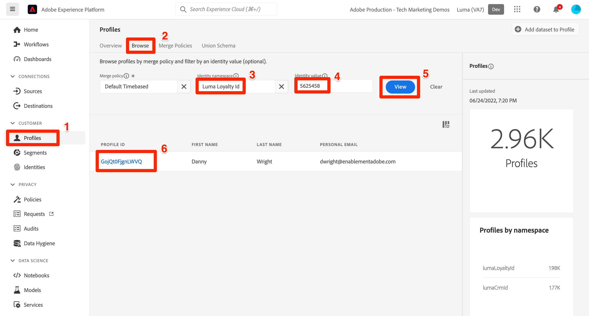

# Importación de datos de ejemplo en Adobe Experience Platform

Aprenda a configurar un entorno de zona protegida de Experience Platform con datos de ejemplo. Con una colección de Postman puede crear grupos de campos, esquemas, conjuntos de datos y luego importar datos de ejemplo a Experience Platform.

## Caso de uso de datos de ejemplo

Los usuarios empresariales de Experience Platform suelen tener que pasar por una serie de pasos que incluyen la identificación de grupos de campos, la creación de esquemas, la preparación de datos, la creación de conjuntos de datos y la ingesta de datos antes de poder explorar las capacidades de marketing que ofrece Experience Platform. Este tutorial automatiza algunos de los pasos para que pueda obtener datos en un entorno limitado de Platform lo antes posible.

Este tutorial se centra en una marca comercial ficticia llamada Luma. Invierten en Adobe Experience Platform para combinar lealtad, CRM, catálogo de productos y datos de compras sin conexión en perfiles de clientes en tiempo real y activar estos perfiles para llevar su marketing al siguiente nivel. Hemos generado datos de muestra para Luma y, en el resto de este tutorial, importará estos datos en uno de los entornos de zona protegida de Experience Platform.

>[!NOTE]
>
>El resultado final de este tutorial es una zona protegida que contiene datos similares al tutorial [Introducción a Adobe Experience Platform para arquitectos e ingenieros de datos](https://experienceleague.adobe.com/docs/platform-learn/getting-started-for-data-architects-and-data-engineers/overview.html?lang=es). Se actualizó en abril de 2023 para admitir los [desafíos de Journey Optimizer](https://experienceleague.adobe.com/docs/journey-optimizer-learn/challenges/introduction-and-prerequisites.html?lang=es). Se actualizó en junio de 2023 para cambiar el método de autenticación a OAuth.

## Requisitos previos

* Tiene acceso a las API de Experience Platform y sabe cómo autenticarse. Si no, revise este [tutorial](https://experienceleague.adobe.com/docs/platform-learn/tutorials/platform-api-authentication.html?lang=es).
* Tiene acceso a una zona protegida de desarrollo de Experience Platform.
* Conoce su ID de inquilino de Experience Platform. Puede obtenerla realizando una [solicitud de API](https://experienceleague.adobe.com/docs/experience-platform/xdm/api/getting-started.html?lang=es#know-your-tenant_id) autenticada
o extrayéndolo de la dirección URL cuando inicie sesión en su cuenta de Platform. Por ejemplo, en la siguiente URL, el inquilino es &quot;`techmarketingdemos`&quot; `https://experience.adobe.com/#/@techmarketingdemos/sname:prod/platform/home`.

## Usando [!DNL Postman] {#postman}

### Configuración de variables de entorno

Antes de seguir los pasos, asegúrese de haber descargado la aplicación [Postman](https://www.postman.com/downloads/). ¡Empecemos!

1. Descargue el archivo [platform-utils-main.zip](../assets/data-generator/platform-utils-main.zip), que contiene todos los archivos necesarios para este tutorial.

   >[!NOTE]
   >
   >Los datos de usuario que contiene el archivo [platform-utils-main.zip](../assets/data-generator/platform-utils-main.zip) son ficticios y solo se pueden usar con fines de demostración.

1. Desde la carpeta de descargas, mueva el archivo `platform-utils-main.zip` a la ubicación deseada en el equipo y descomprímalo.
1. En la carpeta `luma-data`, abra todos los archivos de `json` en un editor de texto y reemplace todas las instancias de `_yourTenantId` con su propio id. de inquilino, precedido por un guion bajo.
1. Abra `luma-offline-purchases.json`, `luma-inventory-events.json` y `luma-web-events.json` en un editor de texto y actualice todas las marcas de tiempo para que los eventos se produzcan en el último mes (por ejemplo, busque `"timestamp":"2022-11` y reemplace el año y el mes)
1. Tenga en cuenta la ubicación de la carpeta descomprimida, ya que la necesitará más adelante al configurar la variable de entorno `FILE_PATH` [!DNL Postman]:

   >[!NOTE]
   > Para obtener la ruta de archivo en su Mac, navegue hasta la carpeta `platform-utils-main`, haga clic con el botón derecho en la carpeta y seleccione la opción **Obtener información**.
   >
   > 

   >[!NOTE]
   > Para obtener la ruta de acceso del archivo en las ventanas, haga clic en para abrir la ubicación de la carpeta deseada y, a continuación, haga clic con el botón secundario del mouse (ratón) a la derecha de la ruta de acceso en la barra de direcciones. Copie la dirección para obtener la ruta del archivo.
   > 
   > 

1. Abra [!DNL Postman] y cree un área de trabajo desde el menú desplegable **Espacios de trabajo**:\
   
1. Escriba un **Nombre** y un **Resumen** opcionales para su área de trabajo y haga clic en **Crear Workspace**. [!DNL Postman] cambiará a su nuevo área de trabajo cuando lo cree.
   
1. Ahora, ajuste algunas configuraciones para ejecutar las colecciones [!DNL Postman] en esta área de trabajo. En el encabezado de [!DNL Postman], haga clic en el icono de engranaje y seleccione **Configuración** para abrir el modal de configuración. También puede utilizar el método abreviado de teclado (CMD/CTRL + ,) para abrir el modal.
1. En la ficha `General`, actualice el tiempo de espera de la solicitud en ms a `5000 ms` y habilite `allow reading file outside this directory`
   

   >[!NOTE]
   > Si los archivos se cargan desde el directorio de trabajo, se ejecutarán sin problemas entre dispositivos si los mismos archivos se almacenan en los demás dispositivos. Sin embargo, si desea ejecutar archivos desde fuera del directorio de trabajo, debe activar un ajuste para indicar la misma intención. Si su `FILE_PATH` no es la misma que la ruta del directorio de trabajo de [!DNL Postman], esta opción debería estar habilitada.

1. Cierre el panel **Configuración**.
1. Seleccione los **Entornos** y luego seleccione **Importar**:
   
1. Importar el archivo de entorno json descargado, `DataInExperiencePlatform.postman_environment`
1. En Postman, seleccione su entorno en la lista desplegable superior derecha y haga clic en el icono del ojo para ver las variables de entorno:
   

1. Asegúrese de que se rellenan las siguientes variables de entorno. Para obtener información sobre cómo obtener el valor de las variables de entorno, consulte el tutorial [Autenticar en las API de Experience Platform](/help/platform/authentication/platform-api-authentication.md) para obtener instrucciones paso a paso.

   * `CLIENT_SECRET`
   * `API_KEY`—`Client ID` en Adobe Developer Console
   * `SCOPES`
   * `TECHNICAL_ACCOUNT_ID`
   * `IMS`
   * `IMS_ORG`—`Organization ID` en Adobe Developer Console
   * `SANDBOX_NAME`
   * `TENANT_ID`: asegúrese de que comienza con un guion bajo, por ejemplo `_techmarketingdemos`
   * `CONTAINER_ID`
   * `platform_end_point`
   * `FILE_PATH`: utilice la ruta de la carpeta local en la que ha descomprimido el archivo `platform-utils-main.zip`. Asegúrese de que incluye el nombre de la carpeta, por ejemplo `/Users/dwright/Desktop/platform-utils-main`

1. **Guardar** el entorno actualizado

### Importar colecciones de Postman

A continuación, debe importar las colecciones en Postman.

1. Seleccione **Colecciones** y luego elija la opción de importación:

   

1. Importe las siguientes colecciones:

   * `0-Authentication.postman_collection.json`
   * `1-Luma-Loyalty-Data.postman_collection.json`
   * `2-Luma-CRM-Data.postman_collection.json`
   * `3-Luma-Product-Catalog.postman_collection.json`
   * `4-Luma-Offline-Purchase-Events.postman_collection.json`
   * `5-Luma-Product-Inventory-Events.postman_collection.json`
   * `6-Luma-Test-Profiles.postman_collection.json`
   * `7-Luma-Web-Events.postman_collection.json`

   

### Autenticar

A continuación, debe autenticarse y generar un token de usuario. Tenga en cuenta que los métodos de generación de tokens utilizados en este tutorial solo son adecuados para el uso que no sea de producción. La firma local carga una biblioteca de JavaScript desde un host de terceros y la firma remota envía la clave privada a un servicio web de Adobe. Aunque la Adobe de no almacena esta clave privada, las claves de producción nunca deben compartirse con nadie.

1. Abra la colección `0-Authentication`, seleccione la solicitud `OAuth: Request Access Token` y haga clic en `SEND` para autenticar y obtener el token de acceso.

   

1. Revise las variables de entorno y observe que `ACCESS_TOKEN` se ha rellenado.

### Importación de datos

Ahora puede preparar e importar los datos en su zona protegida de Platform. Las colecciones de Postman que importó harán todo el trabajo pesado.

1. Abra la colección `1-Luma-Loyalty-Data` y haga clic en **Ejecutar** en la ficha Información general para iniciar un ejecutor de colecciones.

   

1. En la ventana del ejecutor de recopilación, asegúrese de seleccionar el entorno del menú desplegable, actualizar **Delay** a `4000ms`, comprobar la opción **Guardar respuestas** y asegurarse de que el orden de ejecución sea correcto. Haga clic en el botón **Ejecutar datos de fidelización de Luma**

   

   >[!NOTE]
   >
   >**1-Luma-Loyalty-Data** crea un esquema para los datos de fidelidad de clientes. El esquema se basa en la clase de perfil individual de XDM, el grupo de campos estándar y un grupo de campos y tipo de datos personalizados. La colección crea un conjunto de datos mediante el esquema y carga datos de fidelidad de cliente de muestra en Adobe Experience Platform.

   >[!NOTE]
   >
   >Si alguna solicitud de colección falla durante el ejecutor de la colección de Postman, detenga la ejecución y ejecute las solicitudes de colección una por una.

1. Si todo va bien, se pasarán todas las solicitudes de la colección `Luma-Loyalty-Data`.

   

1. Ahora vamos a iniciar sesión en la [interfaz de Adobe Experience Platform](https://platform.adobe.com/) y navegar a los conjuntos de datos.
1. Abra el conjunto de datos `Luma Loyalty Dataset` y en la ventana de actividad del conjunto de datos podrá ver una ejecución por lotes correcta que ha introducido 1000 registros. También puede hacer clic en la opción del conjunto de datos de vista previa para verificar los registros ingeridos. Es posible que tenga que esperar varios minutos para confirmar que se crearon 1000 [!UICONTROL nuevos fragmentos de perfil].
   
1. Repita los pasos del 1 al 3 para ejecutar las demás colecciones:
   * `2-Luma-CRM-Data.postman_collection.json` crea un esquema y rellena un conjunto de datos para los datos CRM de los clientes. El esquema se basa en la clase de perfil individual XDM que incluye detalles demográficos, detalles de contacto personal, detalles de preferencia y un grupo de campos de identidad personalizado.
   * `3-Luma-Product-Catalog.postman_collection.json` crea un esquema y un conjunto de datos rellenado para la información del catálogo de productos. El esquema se basa en una clase de catálogo de productos personalizada y utiliza un grupo de campos de catálogo de productos personalizado.
   * `4-Luma-Offline-Purchase-Events.postman_collection.json` crea un esquema y rellena un conjunto de datos para los datos de evento de compra sin conexión de los clientes. El esquema se basa en la clase XDM ExperienceEvent y consta de una identidad personalizada y grupos de campos Detalles de Commerce.
   * `5-Luma-Product-Inventory-Events.postman_collection.json` crea un esquema y rellena un conjunto de datos para los eventos relacionados con los productos que entran y salen del stock. El esquema se basa en una clase de evento empresarial personalizada y un grupo de campos personalizados.
   * `6-Luma-Test-Profiles.postman_collection.json` crea un esquema y rellena un conjunto de datos con perfiles de prueba para usar en Adobe Journey Optimizer
   * `7-Luma-Web-Events.postman_collection.json` crea un esquema y rellena un conjunto de datos con datos web históricos simples.

## Validación

Los datos de ejemplo se han diseñado para que, cuando se hayan ejecutado las colecciones, se creen perfiles de clientes en tiempo real que combinen datos de varios sistemas. Un buen ejemplo de esto es el primer registro de los conjuntos de datos de lealtad, CRM y compra sin conexión. Busque ese perfil para confirmar que se han introducido los datos. En la [interfaz de Adobe Experience Platform](https://experience.adobe.com/platform/):

1. Ir a **[!UICONTROL Perfiles]** > **[!UICONTROL Examinar]**
1. Seleccione `Luma Loyalty Id` como **[!UICONTROL área de nombres de identidad]**
1. Busque `5625458` como **[!UICONTROL valor de identidad]**
1. Abrir el perfil `Daniel Wright`

>[!TIP]
>
>Si no ve el perfil, consulte la página [!UICONTROL Conjuntos de datos] para confirmar que todos los conjuntos de datos se hayan creado e ingerido correctamente. Si esto parece correcto, espere 15 minutos y vea si el perfil está disponible en el visor.  Si hubo problemas con la ingesta de datos, compruebe los mensajes de error para intentar localizar el problema. También puede intentar habilitar diagnósticos de error en la página [!UICONTROL Conjuntos de datos] y arrastrar y soltar el archivo de datos json para volver a ingerir los datos.

Si explora los datos de las fichas **[!UICONTROL Atributos]** y **[!UICONTROL Eventos]**, verá que el perfil contiene datos de los distintos archivos de datos:

## Pasos siguientes

Si desea obtener más información sobre Adobe Journey Optimizer, esta zona protegida contiene todo lo necesario para superar los [desafíos de Journey Optimizer](https://experienceleague.adobe.com/docs/journey-optimizer-learn/challenges/introduction-and-prerequisites.html?lang=es)

Si desea obtener información sobre las políticas de combinación, el control de datos, el servicio de consultas y el generador de segmentos, pase a la [lección 11 del tutorial Introducción a los arquitectos de datos y a los ingenieros de datos](https://experienceleague.adobe.com/docs/platform-learn/getting-started-for-data-architects-and-data-engineers/create-merge-policies.html?lang=es). Las lecciones anteriores de este otro tutorial le han permitido crear manualmente todo lo que acaba de completar con estas colecciones de Postman: ¡disfrute del principio!

Si desea crear una implementación de SDK web de ejemplo para vincularla a esta zona protegida, visite el
[Implementar Adobe Experience Cloud con tutorial de SDK web](https://experienceleague.adobe.com/docs/platform-learn/implement-web-sdk/overview.html?lang=es). Después de configurar las lecciones &quot;Configuración inicial&quot;, &quot;Configuración de etiquetas&quot; y &quot;Configuración de Experience Platform&quot; del tutorial del SDK web, inicie sesión en el sitio web de Luma con las diez primeras direcciones de correo electrónico del archivo `luma-crm.json` con la contraseña `test` para ver cómo los fragmentos de perfil se combinan con los datos cargados en este tutorial.

Si desea crear una implementación de SDK móvil de ejemplo para vincularla a este simulador de pruebas, consulte el
[Implementar Adobe Experience Cloud en el tutorial de aplicaciones móviles](https://experienceleague.adobe.com/docs/platform-learn/implement-mobile-sdk/overview.html?lang=es). Después de configurar las lecciones &quot;Configuración inicial&quot;, &quot;Implementación de aplicación&quot; y &quot;Experience Platform&quot; del tutorial del SDK web, inicie sesión en el sitio web de Luma con las primeras direcciones de correo electrónico del archivo `luma-crm.json` para ver cómo se combina un fragmento de perfil con los datos cargados en este tutorial.

## Restablecer entorno de espacio aislado {#reset-sandbox}

Al restablecer una zona protegida que no sea de producción, se eliminarán todos los recursos asociados a ella (esquemas, conjuntos de datos, etc.), pero se conservarán el nombre y los permisos asociados a la zona protegida. Esta zona protegida &quot;limpia&quot; sigue estando disponible con el mismo nombre para los usuarios que tienen acceso a ella.

Siga los pasos [aquí](https://experienceleague.adobe.com/docs/experience-platform/sandbox/ui/user-guide.html?lang=es#reset-a-sandbox) para restablecer un entorno de espacio aislado.
