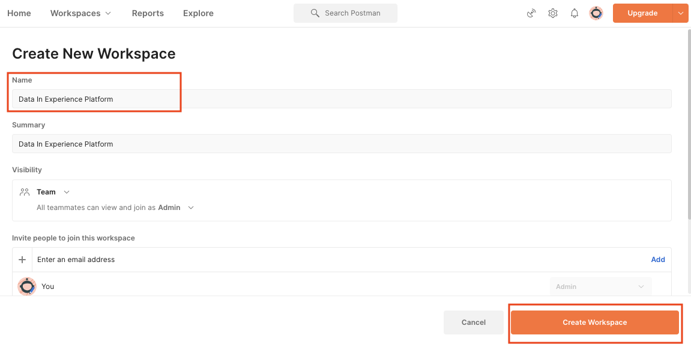

# Importación de datos de muestra en Adobe Experience Platform

Aprenda a configurar un entorno de zona protegida de Experience Platform con datos de ejemplo. Con una colección de Postman puede crear grupos de campos, esquemas, conjuntos de datos y luego importar datos de ejemplo a Experience Platform.

## Ejemplo de uso de datos

Los usuarios empresariales Experience Platform a menudo tienen que seguir una serie de pasos que incluyen la identificación de grupos de campos, la creación de esquemas, la preparación de datos, la creación de conjuntos de datos y, a continuación, la ingesta de datos para poder explorar las funcionalidades de marketing que ofrece el Experience Platform. Este tutorial automatiza algunos de los pasos para que pueda obtener datos en un entorno limitado de Platform lo antes posible.

Este tutorial se centra en una marca comercial ficticia llamada Luma. Invierten en Adobe Experience Platform para combinar lealtad, CRM, catálogo de productos y datos de compras sin conexión en perfiles de clientes en tiempo real y activan estos perfiles para llevar su marketing al siguiente nivel. Hemos generado datos de ejemplo para Luma y, en el resto de este tutorial, importará estos datos en uno de los entornos de entorno limitado del Experience Platform.

>[!NOTE]
>
>El resultado final de este tutorial es un simulador de pruebas que contiene los mismos datos de ejemplo que el [Tutorial Introducción a Adobe Experience Platform para arquitectos de datos e ingenieros de datos](https://experienceleague.adobe.com/docs/platform-learn/getting-started-for-data-architects-and-data-engineers/overview.html).

## Requisitos previos

* Tiene acceso a las API de Experience Platform y sabe cómo autenticarse. Si no es así, revise esta [tutorial](https://experienceleague.adobe.com/docs/platform-learn/tutorials/platform-api-authentication.html?lang=es).
* Tiene acceso a un simulador para pruebas de desarrollo de Experience Platform.
* Conoce su ID de inquilino de Experience Platform. Puede obtenerla realizando una autenticación [Solicitud de API](https://experienceleague.adobe.com/docs/experience-platform/xdm/api/getting-started.html?lang=en#know-your-tenant_id)
o extrayéndolo de la dirección URL cuando inicia sesión en la cuenta de Platform. Por ejemplo, en la siguiente URL, el inquilino es &quot;
`techmarketingdemos`&quot; `https://experience.adobe.com/#/@techmarketingdemos/sname:prod/platform/home`.

## Uso de Postman {#postman}

### Configuración de variables de entorno

Antes de seguir los pasos, asegúrese de haber descargado el [Postman](https://www.postman.com/downloads/) aplicación.  ¡Empecemos!

1. Descargue el [platform-utils-main.zip](../assets/data-generator/platform-utils-main.zip) , que contiene todos los archivos necesarios para este tutorial.

   >[!NOTE]
   >
   >Los datos de usuario contenidos en la variable [platform-utils-main.zip](../assets/data-generator/platform-utils-main.zip) es ficticio y debe utilizarse únicamente con fines de demostración.

1. Desde la carpeta de descargas, mueva la variable `platform-utils-main.zip` en la ubicación deseada del equipo y descomprima el archivo.
1. En el `luma-data` carpeta, abra todas las `json` archivos en un editor de texto y reemplazar todas las instancias de `_techmarketingdemos` con su propio id de inquilino, precedido por un guion bajo.
1. Apertura `luma-offline-purchases.json` en un editor de texto y actualice todas las marcas de tiempo para que los eventos se produzcan en el último mes (por ejemplo, busque `"timestamp":"2022-06` y reemplace el año y el mes)
1. Tenga en cuenta la ubicación de la carpeta descomprimida, ya que la necesita más adelante al configurar la variable `FILE_PATH` Variable de entorno de Postman:

   >[!NOTE]
   > Para obtener la ruta de archivo en el Mac, vaya a la `platform-utils-main` carpeta, haga clic con el botón derecho en la carpeta y seleccione **Obtener información** .
   >
   > 

   >[!NOTE]
   > Para obtener la ruta de archivo en las ventanas, haga clic en para abrir la ubicación de la carpeta deseada y, a continuación, haga clic con el botón secundario del mouse (ratón) a la derecha de la ruta en la barra de direcciones. Copie la dirección para obtener la ruta del archivo.
   > 
   > 

1. Abra Postman y cree un nuevo espacio de trabajo desde la **Espacios de trabajo** menú desplegable:\
   
1. Escriba un **Nombre** y opcional **Resumen** para el espacio de trabajo y haga clic en **Crear espacio de trabajo**. Postman cambiará a su nuevo espacio de trabajo cuando lo cree.
   
1. Ahora, ajuste algunos ajustes para ejecutar las colecciones de Postman en este espacio de trabajo. En el encabezado de Postman, haga clic en el icono de engranaje y seleccione **Configuración** para abrir el modal de configuración. También puede utilizar el atajo de teclado (CMD/CTRL + ,) para abrir el modal.
1. En el `General` , actualice el tiempo de espera de la solicitud en ms a `5000 ms` y habilitar `allow reading file outside this directory`
   

   >[!NOTE]
   > Si los archivos se cargan desde el directorio de trabajo, se ejecutarán sin problemas entre dispositivos si los mismos archivos se almacenan en los demás dispositivos. Sin embargo, si desea ejecutar archivos desde fuera del directorio de trabajo, debe activarse una configuración para indicar la misma intención. Si su `FILE_PATH` no es la misma que la ruta del directorio de trabajo de Postman, entonces esta opción debe estar habilitada.

1. Cierre las **Configuración** panel.
1. Seleccione el **Entornos** y, a continuación, seleccione **Importar**:
   
1. Importe el archivo de entorno json descargado, `DataInExperiencePlatform.postman_environment`
1. En Postman, seleccione su entorno en el menú desplegable superior derecho y haga clic en el icono de ojo para ver las variables de entorno:
   

1. Asegúrese de que las siguientes variables de entorno estén rellenadas. Para obtener información sobre cómo obtener el valor de las variables de entorno, consulte la [Autenticar con las API de Experience Platform](/help/platform/authentication/platform-api-authentication.md) tutorial para obtener instrucciones paso a paso.

   * `CLIENT_SECRET`
   * `API_KEY`—`Client ID` en la consola de Adobe Developer
   * `TECHNICAL_ACCOUNT_ID`
   * `META_SCOPE`
   * `IMS`
   * `IMS_ORG`—`Organization ID` en la consola de Adobe Developer
   * `PRIVATE_KEY`
   * `SANDBOX_NAME`
   * `CONTAINER_ID`
   * `TENANT_ID`: asegúrese de incluir un guion bajo, por ejemplo `_techmarketingdemos`
   * `platform_end_point`
   * `FILE_PATH`: utilice la ruta de la carpeta local en la que ha descomprimido la variable `platform-utils-main.zip` archivo. Asegúrese de que incluye el nombre de la carpeta, por ejemplo `/Users/dwright/Desktop/platform-utils-main`

1. **Guardar** el entorno actualizado

### Importar colecciones de Postman

A continuación, debe importar las colecciones en Postman.

1. Select **Colecciones** y, a continuación, elija la opción de importación:

   

1. Importe las siguientes colecciones:

   * `0-Authentication.postman_collection.json`
   * `1-Luma-Loyalty-Data.postman_collection.json`
   * `2-Luma-CRM-Data.postman_collection.json`
   * `3-Luma-Product-Catalog.postman_collection.json`
   * `4-Luma-Offline-Purchase-Events.postman_collection.json`

   

### Autenticar

A continuación, debe autenticarse y generar un token de usuario. Tenga en cuenta que los métodos de generación de tokens utilizados en este tutorial solo son adecuados para usos que no sean de producción. La firma local carga una biblioteca JavaScript desde un host de terceros, y la firma remota envía la clave privada a un servicio web administrado por un Adobe. Aunque Adobe no almacena esta clave privada, las claves de producción nunca deben compartirse con nadie.

1. Abra el `Authentication` colección, seleccione `IMS: JWT Generate + Auth via User Token` solicitud del POST y haga clic en `SEND` para autenticarse y obtener el token de acceso.

   

1. Revise las variables de entorno y observe que la variable `JWT_TOKEN` y `ACCESS_TOKEN` ahora se rellenan.

### Importación de datos

Ahora puede preparar e importar los datos en el simulador para pruebas de Platform. Las colecciones de Postman que importaste harán todo el trabajo pesado!

1. Abra el `1-Luma-Loyalty-Data` colección y haga clic en **Ejecutar** en la ficha información general para iniciar un ejecutor de colecciones.

   

1. En la ventana del runner de la colección, asegúrese de seleccionar el entorno en la lista desplegable y actualizar el **Retraso** a `4000ms`, marque la casilla **Guardar respuestas** y asegúrese de que el orden de ejecución es correcto. Haga clic en el **Ejecutar datos de fidelidad de Luma** botón

   

   >[!NOTE]
   >
   >**1-Luma-Loyalty-Data** crea un esquema para los datos de lealtad del cliente. El esquema se basa en la clase de perfil individual XDM, el grupo de campos estándar y un grupo de campos y un tipo de datos personalizados. La colección crea un conjunto de datos con el esquema y carga datos de lealtad de clientes de muestra en Adobe Experience Platform.

   >[!NOTE]
   >
   >Si se produce un error en alguna solicitud de recopilación durante el ejecutor de la recopilación de Postman, detenga la ejecución y ejecute las solicitudes de recopilación de una en una.

1. Si todo va bien, todas las solicitudes de la variable `Luma-Loyalty-Data` la colección debe pasar.

   

1. Ahora vamos a iniciar sesión en [Interfaz de Adobe Experience Platform](https://platform.adobe.com/) y navegar a conjuntos de datos.
1. Abra el `Luma Loyalty Dataset` conjunto de datos, y en la ventana de actividad de conjunto de datos, puede ver una ejecución por lotes exitosa que ingería 1000 registros. También puede hacer clic en la opción de vista previa del conjunto de datos para verificar los registros ingestados. Es posible que tenga que esperar varios minutos para confirmar que 1000 [!UICONTROL Nuevos fragmentos de perfil] se han creado.
   
1. Repita los pasos del 1 al 3 para ejecutar las otras colecciones:
   * `2-Luma-CRM-Data.postman_collection.json` crea un esquema y un conjunto de datos rellenado para los datos CRM de los clientes. El esquema se basa en la clase de Perfil individual XDM que incluye Detalles demográficos, Detalles de contacto personal, Detalles de preferencia y un grupo de campos de identidad personalizado.
   * `3-Luma-Product-Catalog.postman_collection.json` crea un esquema y un conjunto de datos rellenado para la información del catálogo de productos. El esquema se basa en una clase de catálogo de productos personalizada y utiliza un grupo de campos de catálogo de productos personalizado.
   * `4-Luma-Offline-Purchase-Events.postman_collection.json` crea un esquema y rellena un conjunto de datos para los datos de evento de compra sin conexión de los clientes. El esquema se basa en la clase XDM ExperienceEvent y consta de una identidad personalizada y de grupos de campos de Detalles comerciales .

## Validación

Los datos de ejemplo se han diseñado para que, cuando se hayan ejecutado las colecciones, se creen perfiles de cliente en tiempo real que combinen datos de varios sistemas. Un buen ejemplo de esto es el primer registro de los conjuntos de datos de compra sin conexión, CRM y de fidelidad. Busque ese perfil para confirmar que se han introducido los datos. En el [Interfaz de Adobe Experience Platform](https://platform.adobe.com/):

1. Vaya a **[!UICONTROL Perfiles]** > **[!UICONTROL Examinar]**
1. Select `Luma Loyalty Id` como el **[!UICONTROL Área de nombres de identidad]**
1. Buscar `5625458` como el **[!UICONTROL Valor de identidad]**
1. Abra el `Danny Wright` perfil

Explorando los datos del **[!UICONTROL Atributos]** y **[!UICONTROL Eventos]** , debería ver que el perfil contiene datos de los distintos archivos de datos:

## Pasos siguientes

Si desea obtener información sobre las políticas de combinación, el control de datos, el servicio de consultas y el generador de segmentos, vaya a [lección 11 del tutorial Introducción a los arquitectos de datos y a los ingenieros de datos](https://experienceleague.adobe.com/docs/platform-learn/getting-started-for-data-architects-and-data-engineers/create-merge-policies.html?lang=en). Las lecciones anteriores de este otro tutorial le permiten crear manualmente todo lo que acaba de completar estas colecciones de Postman: ¡disfrute del inicio inicial!

Si desea crear una implementación de SDK web de muestra para vincularla a este entorno limitado, consulte
[Tutorial de implementación de Adobe Experience Cloud con SDK web](https://experienceleague.adobe.com/docs/platform-learn/implement-web-sdk/overview.html?lang=es). Después de configurar las lecciones de &quot;Configuración inicial&quot;, &quot;Configuración de etiquetas&quot; y &quot;Configurar Experience Platform&quot; del tutorial del SDK web, inicie sesión en el sitio web de Luma con las diez primeras direcciones de correo electrónico de la `luma-crm.json` archivo con la contraseña `test` para ver cómo se combinan los fragmentos de perfil con los datos cargados en este tutorial.

Si desea crear una implementación de SDK móvil de ejemplo para vincular a este entorno limitado, consulte
[Tutorial sobre implementación de Adobe Experience Cloud en aplicaciones móviles](https://experienceleague.adobe.com/docs/platform-learn/implement-mobile-sdk/overview.html?lang=es). Después de configurar las lecciones de &quot;Configuración inicial&quot;, &quot;Implementación de aplicación&quot; y &quot;Experience Platform&quot; del tutorial del SDK web, inicie sesión en el sitio web de Luma con las primeras direcciones de correo electrónico de la `luma-crm.json` para ver una combinación de fragmentos de perfil con datos cargados en este tutorial.

## Restablecer entorno de espacio aislado {#reset-sandbox}

Al restablecer un simulador para pruebas que no sean de producción, se eliminan todos los recursos asociados a ese simulador para pruebas (esquemas, conjuntos de datos, etc.), al tiempo que se mantienen el nombre del simulador para pruebas y los permisos asociados. Este simulador de pruebas &quot;limpio&quot; sigue estando disponible con el mismo nombre para los usuarios que tienen acceso a él.

Siga los pasos [here](https://experienceleague.adobe.com/docs/experience-platform/sandbox/ui/user-guide.html?lang=en#reset-a-sandbox) para restablecer un entorno de entorno limitado.
