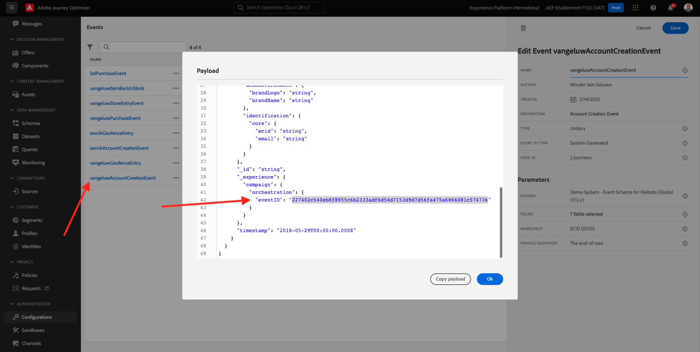
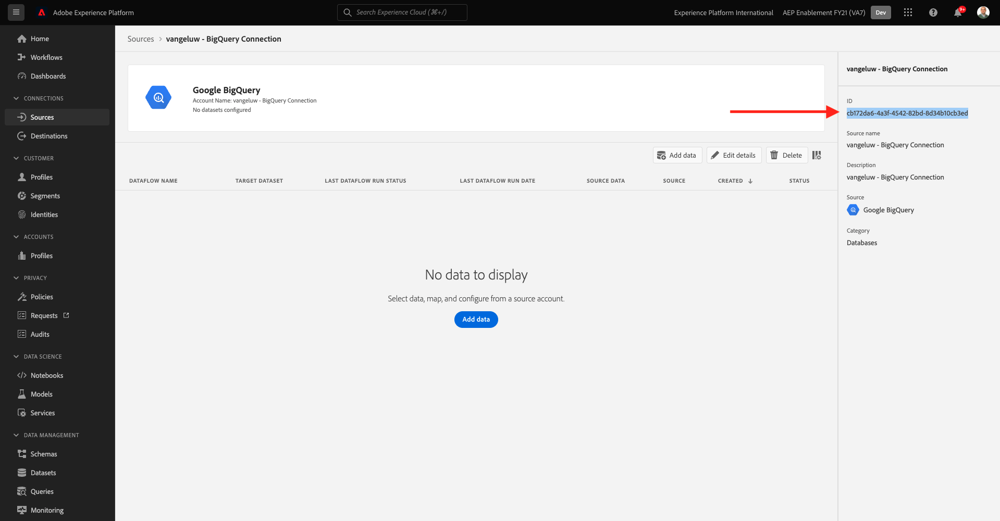
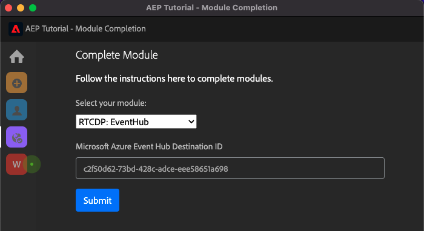

# Tutorial técnico completo para Adobe Experience Platform: ¿Cómo se mide la finalización?

Puede actualizar la finalización del tutorial técnico completo para Adobe Experience Platform con la extensión de Chrome creada.

Después de seguir las instrucciones del módulo 0, ingresó al informe de su organización **ID de configuración** en la extensión de Chrome y ha iniciado sesión. La extensión de Chrome debería tener este aspecto. Haga clic en el icono morado para enviar la finalización de un módulo.

Verá esto:

Al abrir el menú desplegable, puede seleccionar el módulo que desea completar:

Para completar un módulo, se espera que proporcione una prueba de finalización.

A continuación se muestran las pruebas esperadas de finalización para cada módulo.

## Primeros pasos

La prueba de finalización prevista para el módulo **Introducción** es el ID del proyecto de sistema de demostración para la web que ha creado.

El ID del proyecto Sistema de demostración para el formato web tiene este aspecto: `--demoProfileLdap-- - OCUC`.

Select **Introducción** en el menú desplegable, introduzca su **ID del proyecto del sistema de demostración** y haga clic en el botón **Submit** - .

## Recopilación de datos y SDK web

La prueba de finalización prevista para el módulo **Recopilación de datos y SDK web** es el nombre de la propiedad Recopilación de datos para la web.

El nombre de la propiedad Recopilación de datos para el formato web tiene este aspecto: `--demoProfileLdap-- - Demo System (05/02/2022) (enablement) 1644046719474`.

Select **Recopilación de datos y SDK web** en el menú desplegable, introduzca su **Nombre de la propiedad de recopilación de datos para la web** y haga clic en el botón **Submit** - .

## Ingesta de datos

La prueba de finalización prevista para el módulo **Ingesta de datos** es el ID del conjunto de datos para los 2 conjuntos de datos que ha creado.

El formato del ID del conjunto de datos es el siguiente: **5f069724723ef41916a8b5d2**.

`--demoProfileLdap-- - Demo System - Event Dataset for Website`

`--demoProfileLdap-- - Demo System - Profile Dataset for Website`

Select **Ingesta de datos** en el menú desplegable, introduzca su **ID de conjunto de datos** para ambos conjuntos de datos en los campos de entrada y haga clic en el botón **Submit** - .

## Perfil del cliente en tiempo real

La prueba de finalización prevista para el módulo **Perfil del cliente en tiempo real** es la variable **ID de segmento** del segmento que ha creado a través de la interfaz de usuario, `--demoProfileLdap-- - Male customers with interest in Montana Wind Jacket`.

El formato de ID de segmento tiene este aspecto: **8cb7034d-d4ae-4d26-a61f-a76559c12457**.

Select **Perfil del cliente en tiempo real** en el menú desplegable, introduzca su **ID de segmento** en el campo de entrada y haga clic en el botón **Submit** - .

## Servicio de consultas

La prueba de finalización prevista para el módulo **Servicio de consultas** es el ID del conjunto de datos para su `--demoProfileLdap--_callcenter_interaction_analysis` : conjunto de datos que obtiene después de completar el módulo.

El formato tiene este aspecto: **62076f68f14a9d194995d4e2**.

Select **Servicio de consultas** en el menú desplegable, introduzca su **ID de conjunto de datos** en el campo de entrada y haga clic en el botón **Submit** - .

## Servicios inteligentes

La prueba de finalización prevista para el módulo **Servicios inteligentes** es el ID para su **Servicio de AI del cliente de propensión de compra de producto**.

El formato tiene este aspecto: **12729** y puede recuperarlo de la dirección URL cuando haya abierto el servicio.

Select **Servicios inteligentes** en el menú desplegable, introduzca su **ID del servicio de Customer AI** en el campo de entrada y haga clic en el botón **Submit** - .

## Real-Time CDP

La prueba de finalización prevista para el módulo **Real-Time CDP** es el ID de su **Actividad de Adobe Target**.

El formato tiene este aspecto: **111804**.

Select **Real-Time CDP** en el menú desplegable, introduzca su **ID de actividad de Adobe Target** en el campo de entrada y haga clic en el botón **Submit** - .

## AJO: Organización

La prueba de finalización prevista para el módulo **AJO: Organización** es el eventID para su `--demoProfileLdap--AccountCreationEvent`.

El formato tiene este aspecto: **227402c540eb8f8855c6b2333adf6d54d7153d9d7d56fa475a6866081c57473 6**.

Select **AJO: Organización** en el menú desplegable , introduzca su ** eventID** en el campo de entrada y haga clic en el **Submit** - .

## AJO: Acciones personalizadas

La prueba de finalización prevista para el módulo **AJO: Acciones personalizadas** es el eventID para su evento `--demoProfileLdap--GeofenceEntry`.

El formato tiene este aspecto: **fa42ab7982ba55f039eacec24c1e32e5c51b310c67f0fa559ab49b89b63f4934**.

Select **AJO: Acciones personalizadas** en el menú desplegable, introduzca su **eventID** en el campo de entrada y haga clic en el botón **Submit** - .

## AJO: Ofertas

La prueba de finalización prevista para el módulo **AJO: Ofertas** es el ID de la variable **Decisión de oferta** que ha creado.

Puede encontrar la variable **ID de decisión de oferta**, que tiene este aspecto **xcore:offer-activity:1122fcc4603ea499**, aquí:

Select **AJO: Ofertas** en el menú desplegable, introduzca su **ID de decisión de oferta** en el campo de entrada y haga clic en el botón **Submit** - .

## AJO: Eventos

La prueba de finalización prevista para el módulo **AJO: Eventos** es el eventID para su `--demoProfileLdap--StoreEntryEvent`.

El formato tiene este aspecto: **e3a8f0bdc0b609667cd96a72a6b1e5aafa0daf6ccf121c574e6a2030860a633**.

Select **AJO: Eventos** en el menú desplegable, introduzca su **eventID** en el campo de entrada y haga clic en el botón **Submit** - .

## CJA

La prueba de finalización prevista para el módulo **CJA** es el ID del proyecto `--demoProfileLdap-- - Omnichannel Analysis`.

El formato tiene este aspecto: **6217344f6249ac70c726db60**, puede encontrarlo en la dirección URL cuando haya abierto el proyecto.

Select **CJA** en el menú desplegable, introduzca su **ID del proyecto** en el campo de entrada y haga clic en el botón **Submit** - .

## CJA: BigQuery

La prueba de finalización prevista para el módulo **CJA: BigQuery** es el ID de su **BigQuery**-connection.

Puede encontrar la variable **ID de conexión BigQuery**, que tiene este aspecto **85a2394d-8b94-410c-a239-4d8b94b10c38**, aquí:

Select **CJA: BigQuery** en el menú desplegable, introduzca su **ID de conexión BigQuery** en el campo de entrada y haga clic en el botón **Submit** - .

## RTCDP: EventHub

La prueba de finalización prevista para el módulo **RTCDP: EventHub** es el ID de su **Centro de eventos de Microsoft Azure** destino en Adobe Experience Platform.

Puede encontrar la variable **ID de destino de Microsoft Azure Event Hub**, que tiene este aspecto **fa3f7ce5-86fd-4096-bf7c-e586fdc096ba**, aquí:

Select **RTCDP: EventHub** en el menú desplegable, introduzca su **ID de destino de Microsoft Azure Event Hub** en el campo de entrada y haga clic en el botón **Submit** - .

## Conexiones RTCDP

La prueba de finalización prevista para el módulo **Conexiones RTCDP** es su **ID de propiedad de reenvío de eventos**.

Puede encontrar la variable **ID de propiedad de reenvío de eventos**, que tiene este aspecto **PR40f44184c888472e9c19d8d602aab0de**, aquí:

Select **Conexiones RTCDP** en el menú desplegable, introduzca su **ID de propiedad de reenvío de eventos** en el campo de entrada y haga clic en el botón **Submit** - .

## Apache Kafka

La prueba de finalización prevista para el módulo **Apache Kafka** es el ID del conector de origen `--demoProfileLdap-- - Kafka`.

El ID tiene este aspecto **f843d50a-ee30-4ca8-a766-0e4f3d29a2f7** y puede encontrarlo aquí:

Select **Apache Kafka** en el menú desplegable, introduzca su **ID de flujo** en el campo de entrada y haga clic en el botón **Submit** - .

[Volver a todos los módulos](./overview.md)
