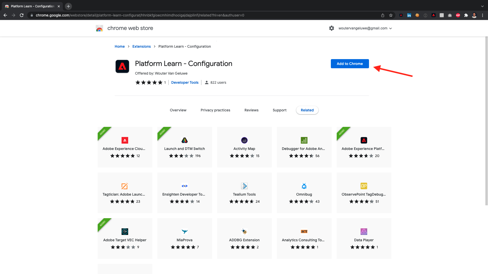
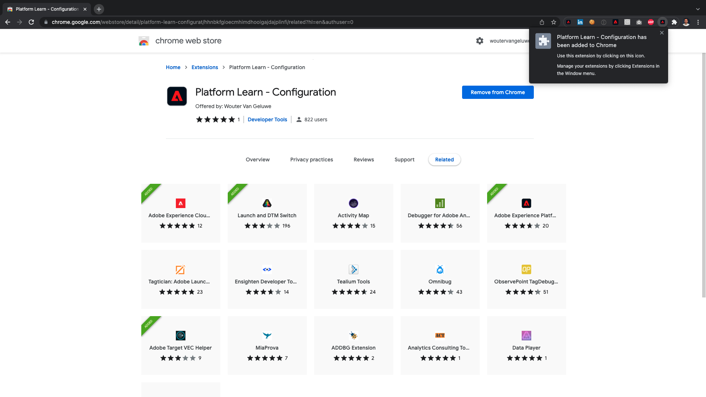
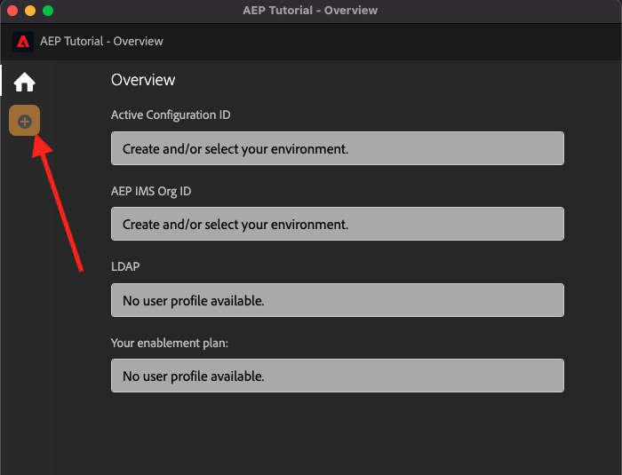

# 0.1 Instalar la extensión de Chrome para la documentación del Experience League

## 0.1.1 ¿Por qué hemos creado una extensión de Chrome?

La documentación se ha convertido en genérica para que cualquier persona pueda reutilizarla fácilmente con cualquier instancia de Adobe Experience Platform.
Al hacer que la documentación sea reutilizable, **Variables de entorno** se han introducido en la documentación, lo que significa que encontrará lo siguiente **keys** en la documentación. Cada clave es una variable específica para un entorno específico, y la extensión de Chrome la cambiará por usted y, como tal, le facilita copiar código y texto de las páginas del tutorial y pegarlo en las distintas interfaces de usuario que utilizará como parte del tutorial.

A continuación se encuentra un ejemplo de estos valores. Actualmente, estos valores aún no se pueden usar, pero en cuanto instale y active la extensión de Chrome, verá que estas variables cambian a texto &quot;normal&quot; que puede copiar y reutilizar.

| Nombre | Clave |
|:-------------:| :---------------:|
| ID de organización de IMS de AEP | `--aepImsOrgId--` |
| ID de inquilino de AEP | `--aepTenantId--` |
| ID de entrada DCS | `--dcsInletId--` |
| Perfil de demostración LDAP | `--demoProfileLdap--` |

Por ejemplo, en la captura de pantalla siguiente puede ver una referencia a `--aepTenantId--`.

Una vez instalada la extensión, el mismo texto se cambiará automáticamente para reflejar los valores específicos de la instancia.

La extensión también le permite:

- Regístrese para unirse al tutorial
- Realice un seguimiento del progreso enviando la finalización de cada módulo como se indica en [¿Cómo se mide la finalización?](../../completion.md)

## 0.1.2 Instalar la extensión de Chrome

Para instalar la extensión de Chrome, abra el navegador Chrome y vaya a: [https://chrome.google.com/webstore/detail/platform-learn-configurat/hhnbkfgioecmhimdhooigajdajplinfi/related?hl=en&amp;authuser=0](https://chrome.google.com/webstore/detail/platform-learn-configurat/hhnbkfgioecmhimdhooigajdajplinfi/related?hl=en&amp;authuser=0). Entonces verás esto.

Haga clic en **Añadir a Chrome**.

Entonces verás esto. Haga clic en **Añadir extensión**.

A continuación, se instalará la extensión y verá una notificación similar.

En el **extensiones** , haga clic en **pieza de puzzle** y fije el **Aprendizaje de plataforma: configuración** extensión al menú de extensión.

## 0.1.2 Configuración de la extensión de Chrome

Vaya a [https://experienceleague.adobe.com/docs/platform-learn/comprehensive-technical-tutorial-v22/overview.html?lang=en](https://experienceleague.adobe.com/docs/platform-learn/comprehensive-technical-tutorial-v22/overview.html?lang=en) y, a continuación, haga clic en el icono de extensión para abrirlo.

Verá esta ventana emergente. Haga clic en el **+** icono.

Introduzca su nombre y el ID de configuración que se creó para su entorno de Adobe Experience Platform. Haga clic en **Crear nuevo**.

>[!IMPORTANT]
>
>Si es empleado de Adobe: puede encontrar el ID de configuración que se utiliza en el repositorio interno de Github (https://git.corp.adobe.com/vangeluw/platformenablement).
>
>Si es un socio de soluciones de Adobe, póngase en contacto con su contacto de socio de soluciones o envíe un correo electrónico **spphelp@adobe.com**.

En el menú de la izquierda de la extensión, ahora verá un icono con sus iniciales. Haga clic en él. A continuación, verá la asignación entre la variable **Variables de entorno** y los valores específicos de las instancias de Adobe Experience Platform. Haga clic en **Activar configuración**.

Después de activar la configuración, verá un punto verde junto a las iniciales. Esto significa que el ID de configuración ya está activo. También verá que aparecen varias opciones de menú adicionales.

Ahora tiene dos opciones:

- Si ya es usuario de la habilitación con una configuración existente, vaya a **0.1.3 Usuario existente: inicio de sesión**
- Si es un usuario completamente nuevo que inicia este tutorial por primera vez, vaya a **0.1.4 Firma** y omita **0.1.3 Usuario existente: inicio de sesión**

## 0.1.3 Usuario existente: inicio de sesión

>[!IMPORTANT]
>
>Ejercicio **0.1.3 Usuario existente: inicio de sesión** solo funcionará si ya es un usuario que ya ha iniciado sesión anteriormente en este tutorial.

Si ya es un usuario que está configurando esta extensión de Chrome por primera vez, haga clic en el icono morado del menú de la izquierda. Entonces verás esto.

Complete los valores según sea necesario.

>[!IMPORTANT]
>
>La variable **LDAP** es el campo más importante: debe utilizar el mismo LDAP que utilizó al registrarse por primera vez en el tutorial. Esto garantizará que el progreso se cargue correctamente. Si no está seguro de cuál es su LDAP, consulte su dirección de correo electrónico. Use el texto antes del símbolo @ en su dirección de correo electrónico como LDAP. Si su dirección de correo electrónico es **vangeluw@adobe.com**, el LDAP que introduzca aquí debería ser **vangeluw**).

Haga clic en **Aceptar**.

Después de 30 segundos-1 minuto, la pantalla cambiará y volverá a **Página principal**, donde verá esto:

La extensión de Chrome ya está configurada y ahora puede verificar si todo funciona correctamente.

## 0.1.4 Nuevo usuario: suscripción

>[!IMPORTANT]
>
>Ejercicio **0.1.4 Nuevo usuario: suscripción** está diseñado para usuarios nuevos que inician este tutorial por primera vez.

Si es un usuario nuevo que se va a registrar en este tutorial por primera vez, haga clic en el icono amarillo del menú. Entonces verás esto.

Rellene los campos como sea necesario. Haga clic en **Guardar**.

>[!IMPORTANT]
>
>La variable **LDAP** es el campo más importante. Si no está seguro de cuál es su LDAP, consulte su dirección de correo electrónico. Use el texto antes del símbolo @ en su dirección de correo electrónico como LDAP. Si su dirección de correo electrónico es **vangeluw@adobe.com**, el LDAP que introduzca aquí debería ser **vangeluw**).

Después de 30 segundos-1 minuto, la pantalla cambiará y volverá a **Página principal**, donde verá esto:

La extensión de Chrome ya está configurada y ahora puede verificar si todo funciona correctamente.

## 0.1.5 Verificar el contenido del tutorial

Como prueba, vaya a [esta página](https://experienceleague.adobe.com/docs/platform-learn/comprehensive-technical-tutorial-v22/module4/ex3.html?lang=es).

Ahora debería ver todo **Variables de entorno** se han reemplazado por sus valores verdaderos, según el ID de configuración de la extensión de chrome.

Ahora debería tener una vista similar a la siguiente, donde las variables de entorno `--aepTenantId--` ha sido reemplazado por su ID de inquilino real, que en este caso es **_experienceplatform**.

Paso siguiente: [0.2 Usar el sistema de demostración siguiente para configurar la propiedad de cliente de recopilación de datos de Adobe Experience Platform](./ex2.md)

[Volver al módulo 0](./getting-started.md)

[Volver a todos los módulos](./../../overview.md)
