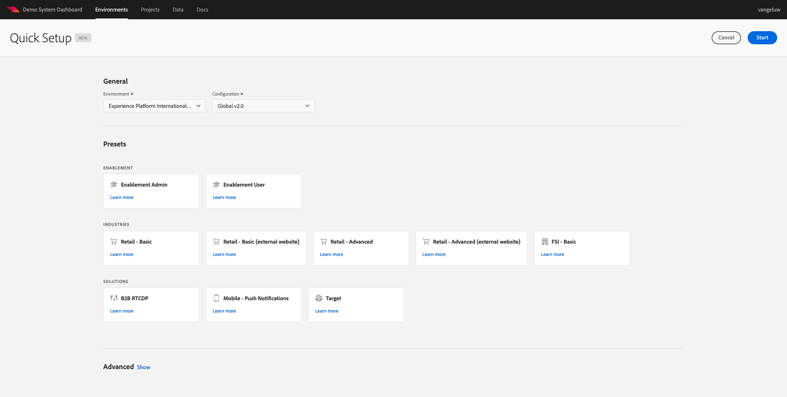

# 0.2 Usar el sistema de demostración siguiente para configurar la propiedad de cliente de recopilación de datos de Adobe Experience Platform

Después de registrarse en el Tutorial técnico completo de Adobe Experience Platform, hay un proceso automatizado que le proporcionará acceso a Demo System, para que pueda acceder y ejecutar la configuración siguiente.

Una vez que tenga acceso al sistema de demostración, siga los siguientes pasos.

Vaya a [https://dashboard.adobedemo.com/](https://dashboard.adobedemo.com/). Seleccione el entorno limitado y haga clic en **Configuración rápida**.

Verá esto:

En **General** - **Entorno**, seleccione la instancia de Adobe Experience Platform y el entorno limitado, en este caso:

- **Experience Platform Internacional**
- **apenablementfy22**
- Configuración: seleccione **Global v2.0**

A continuación, seleccione el ajuste preestablecido **Habilitación del usuario** y haga clic en **Inicio**.

En la ventana emergente, introduzca un nombre para la propiedad Recopilación de datos . Utilice esta convención de nombres: **Sistema de demostración (DD/MM/AAAA)**. I.F.: su LDAP se añadirá automáticamente, no necesita agregarlo usted mismo.

Haga clic en **Start**.

A continuación, verá esta ventana emergente, que muestra el progreso mientras crea sus proyectos de sitio web y aplicaciones móviles, así como sus propiedades de recopilación de datos.

Una vez completado el proceso de configuración rápida, tendrá:

- 1 proyecto de comercio minorista web, que permite utilizar un sitio web de demostración con la marca de demostración de Luma
- 1 proyecto de Mobile Retail, que permite utilizar una aplicación móvil de demostración con la marca de demostración de Luma
- 1 proyecto CX App Retail, que permite utilizar un centro de llamadas y una aplicación de clientela con la marca Luma demo
- 1 Propiedad de recopilación de datos para la web, que se utilizará para recopilar datos del sitio web.
- 1 Propiedad de recopilación de datos para dispositivos móviles, que se utiliza para recopilar datos de la aplicación móvil.

Mantenga esta pantalla abierta, ya que la necesitará en los pasos siguientes.

Paso siguiente: [0.3 Crear el almacén de datos](./ex3.md)

[Volver al módulo 0](./getting-started.md)

[Volver a todos los módulos](./../../overview.md)
