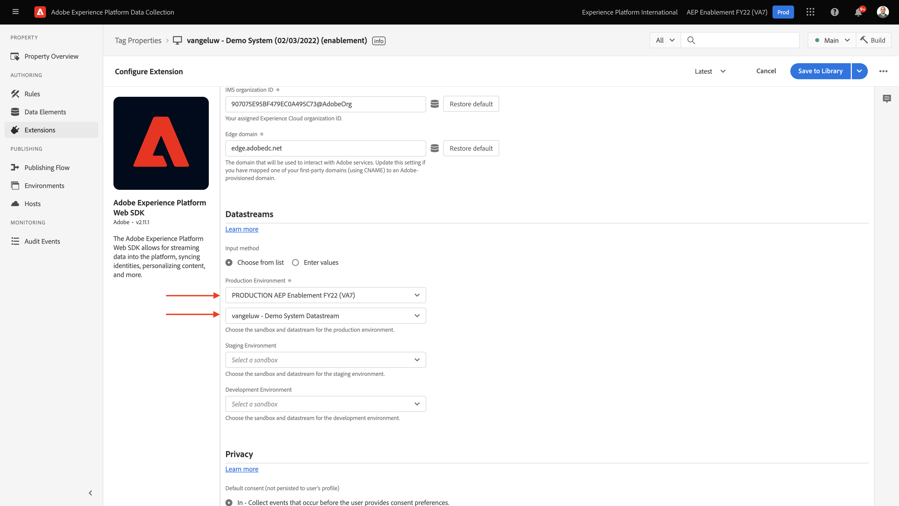
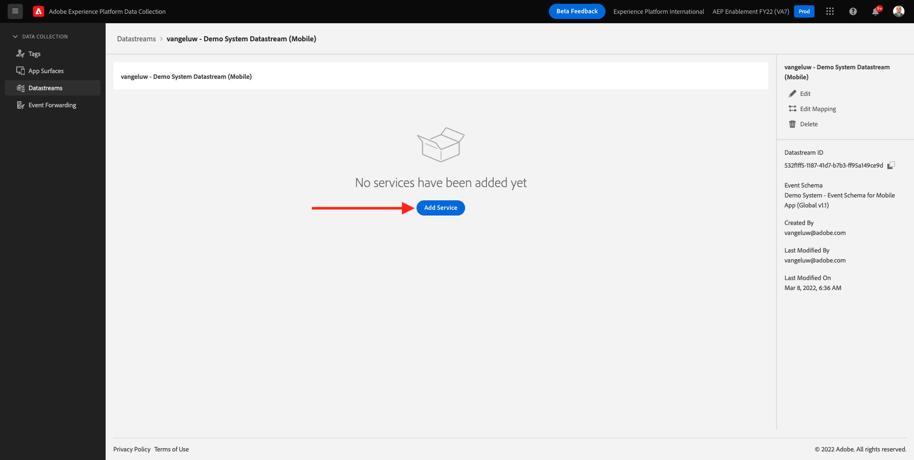
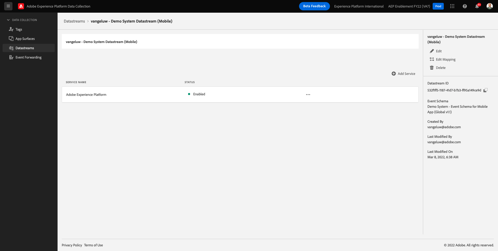

# 0.3 Crear el almacén de datos

Vaya a [https://experience.adobe.com/#/data-collection/](https://experience.adobe.com/#/data-collection/). Después del ejercicio anterior, ahora tiene dos propiedades de recopilación de datos: una para la web y otra para móviles.

Estas propiedades están casi listas para utilizarse, pero antes de empezar a recopilar datos mediante estas propiedades debe configurar un conjunto de datos. Obtendrá más información sobre el concepto de lo que es un conjunto de datos y lo que significa en el ejercicio 1.2.

Por ahora, siga estos pasos.

## 0.3.1 Crear el conjunto de datos para Web

Haga clic en **[!UICONTROL Datastreams]** o **[!UICONTROL Datastreams (Beta)]**.

En la esquina superior derecha de la pantalla, seleccione el nombre del simulador de pruebas, que debería ser `--aepSandboxId--`.

Haga clic en **[!UICONTROL Nuevo conjunto de datos]**.

Para la variable **[!UICONTROL Nombre reconocible]** y, para la descripción opcional, introduzca `--demoProfileLdap-- - Demo System Datastream`. Para Esquema de eventos, seleccione **Sistema de demostración: Esquema de eventos para sitio web (Global v1.1)**. Haga clic en **Guardar**.

Entonces verás esto. Haga clic en **Añadir servicio**.

Seleccione el servicio **[!UICONTROL Adobe Experience Platform]**, que muestra campos adicionales. Entonces verás esto.

Para el conjunto de datos de evento, seleccione **Sistema de demostración: conjunto de datos de evento para sitio web (Global v1.1)** y, para el conjunto de datos de perfil, seleccione **Sistema de demostración: conjunto de datos de perfil para sitio web (Global v1.1)**. Haga clic en **Guardar**.

Ahora verás esto.

Eso es todo por ahora. En [Módulo 1](./../module1/data-ingestion-launch-web-sdk.md) obtendrá más información sobre el SDK web y cómo configurar todas sus funciones.

En el menú de la izquierda, haga clic en **[!UICONTROL Etiquetas]**.

Filtre los resultados de la búsqueda para ver sus dos propiedades de recopilación de datos. Abra la propiedad para **Web** haciendo clic en él.

Entonces verás esto. Haga clic en **Extensiones**.

En la extensión del SDK web de Adobe Experience Platform, haga clic en **Configurar**.

Entonces verás esto. Para **Datastreams**, verá un valor ficticio establecido en 1. Ahora necesita hacer clic en el **Elegir de la lista** botón de opción. En la lista desplegable, seleccione el Datastream que creó anteriormente.

Asegúrese de haber seleccionado su **Datastream**. SUGERENCIA: Puede filtrar fácilmente los resultados en la lista desplegable escribiendo su `--demoProfileLdap--`.

Desplácese hacia abajo hasta que vea **Recopilación de datos**. Asegúrese de que la casilla de verificación de **Habilitar la recopilación de datos de clic** no está habilitado. Haga clic en **Guardar** para guardar los cambios.

Vaya a **Flujo de publicación**.

Haga clic en el **...** para **Principal** y haga clic en **Editar**.

Haga clic en **Agregar todos los recursos modificados** y haga clic en **Guardar y generar para desarrollo**.

Los cambios se están publicando y estarán listos en un par de minutos.

## 0.3.2 Crear el conjunto de datos para dispositivos móviles

Vaya a [https://experience.adobe.com/#/data-collection/](https://experience.adobe.com/#/data-collection/).

Haga clic en **[!UICONTROL Datastreams]** o **[!UICONTROL Datastreams (Beta)]**.

En la esquina superior derecha de la pantalla, seleccione el nombre del simulador de pruebas, que debería ser `--aepSandboxId--`.

Haga clic en **[!UICONTROL Nuevo conjunto de datos]**.

Para la variable **[!UICONTROL Nombre reconocible]** y, para la descripción opcional, introduzca `--demoProfileLdap-- - Demo System Datastream (Mobile)`. Para Esquema de eventos, seleccione **Sistema de demostración: Esquema de eventos para aplicaciones móviles (Global v1.1)**. Haga clic en **Guardar**.

Haga clic en **[!UICONTROL Guardar]**.

Entonces verás esto. Haga clic en **Añadir servicio**.

Seleccione el servicio **[!UICONTROL Adobe Experience Platform]**, que muestra campos adicionales. Entonces verás esto.

Para el conjunto de datos de evento, seleccione **Sistema de demostración: conjunto de datos de evento para aplicaciones móviles (Global v1.1)** y, para el conjunto de datos de perfil, seleccione **Sistema de demostración: conjunto de datos de perfil para aplicaciones móviles (Global v1.1)**. Haga clic en **Guardar**.

Entonces verás esto.

El almacén de datos ya está listo para utilizarse en la propiedad del cliente de recopilación de datos de Adobe Experience Platform para dispositivos móviles.

Vaya a **Etiquetas** y filtre los resultados de búsqueda para ver sus dos propiedades de recopilación de datos. Abra la propiedad para **Móvil** haciendo clic en él.

Entonces verás esto. Haga clic en **Extensiones**.

En el **Adobe Experience Platform Edge Network** extensión, haga clic en **Configurar**.

Entonces verás esto. Ahora debe seleccionar el entorno limitado y el conjunto de datos correctos que acaba de configurar. El simulador de pruebas que se va a usar es `--aepSandboxId--` y se llama datastream `--demoProfileLdap-- - Demo System Datastream (Mobile)`.

Para la variable **Dominio de red perimetral**, utilice el dominio predeterminado que es **edge.adobedc.net**.

Haga clic en **Guardar** para guardar los cambios.

Vaya a **Flujo de publicación**.

Haga clic en el **...** junto a **Principal** y haga clic en **Editar**.

Haga clic en **Agregar todos los recursos modificados** y haga clic en **Guardar y generar para desarrollo**.

Los cambios se están publicando y estarán listos en un par de minutos.

Paso siguiente: [0.4 Usar el sitio web](./ex4.md)

[Volver al módulo 0](./getting-started.md)

[Volver a todos los módulos](./../../overview.md)