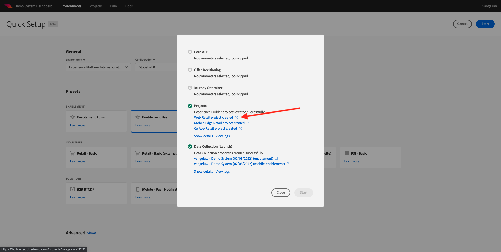

# 0.4 Usar el sitio web

## 0.4.1 Opción 1: Continuar desde ejercicio anterior

>[!NOTE]
>
>Si ya no tiene la pantalla siguiente abierta, vaya al ejercicio 0.4.2 en su lugar.

Después del ejercicio 0.1, tuvo este resultado. Haga clic en para abrir el **Proyecto comercial web** que se creó para usted.

Entonces verás esto. Haga clic en **Integraciones**.

En el **Integraciones** , debe seleccionar la propiedad Recopilación de datos que se creó en el ejercicio 0.1.

Verá que su sitio web de demostración se abre. Seleccione la dirección URL y cópiela en el portapapeles.

Abra una nueva ventana del explorador incógnito.

Pegue la dirección URL del sitio web de la demostración, que copió en el paso anterior. A continuación, se le pedirá que inicie sesión con su Adobe ID.

Seleccione su tipo de cuenta y complete el proceso de inicio de sesión.

Verá su sitio web cargado en una ventana del navegador incógnito. Para cada demostración, tendrá que usar una ventana nueva del explorador incógnito para cargar la URL de su sitio web de demostración.

## 0.4.2 Opción 2: Comience con una nueva ventana del navegador incógnito

En caso de que haya cerrado accidentalmente la ventana del explorador o de que se hayan celebrado sesiones de demostración o habilitación futuras, también puede acceder al proyecto del sitio web yendo a [https://builder.adobedemo.com/projects](https://builder.adobedemo.com/projects). Después de iniciar sesión en Adobe ID, verá esto. Haga clic en el proyecto del sitio web para abrirlo.

Ahora puede seguir el flujo siguiente para acceder al sitio web. Haga clic en **Integraciones**.

En el **Integraciones** , debe seleccionar la propiedad Recopilación de datos que se creó en el ejercicio 0.1.

Verá que su sitio web de demostración se abre. Seleccione la dirección URL y cópiela en el portapapeles.

Abra una nueva ventana del explorador incógnito.

Pegue la dirección URL del sitio web de la demostración, que copió en el paso anterior. A continuación, se le pedirá que inicie sesión con su Adobe ID.

Seleccione su tipo de cuenta y complete el proceso de inicio de sesión.

Verá su sitio web cargado en una ventana del navegador incógnito. Para cada demostración, tendrá que usar una ventana nueva del explorador incógnito para cargar la URL de su sitio web de demostración.

Paso siguiente: [0.5 Usar la aplicación móvil](./ex5.md)

[Volver al módulo 0](./getting-started.md)

[Volver a todos los módulos](./../../overview.md)
