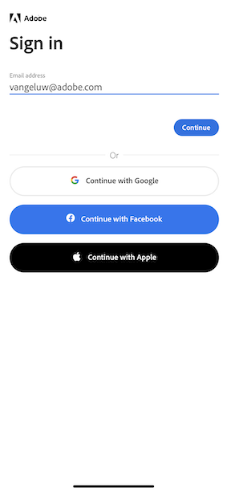

# 0.5 Usar la aplicación móvil

## 0.5.1 Descargar la aplicación

Vaya a [https://bit.ly/dx-demo-app](https://bit.ly/dx-demo-app) en el equipo. Entonces verás esto.

Utilice la variable **Cámara** en su smartphone para instalar la aplicación móvil para el sistema operativo de su dispositivo. Para esta activación, debe instalar la variable **Versión 2.x** que utiliza los SDK de Adobe Experience Platform Mobile.

>[!NOTE]
>
>Después de instalar la aplicación por primera vez en un dispositivo iOS, es posible que aparezca un mensaje de error al intentar abrir la aplicación que diga: **Desarrollador empresarial desconfiado**. Para corregir esto, debe ir a **Configuración > General > Administración de dispositivos > Adobe Systems Inc.** y haga clic en **Trust Adobe Systems Inc.**.

Una vez que la aplicación esté instalada, la encontrará en la pantalla de inicio del dispositivo. Haga clic en el icono para abrir la aplicación.

Cuando utilice la aplicación por primera vez, se le solicitará que inicie sesión con su Adobe ID. Complete el proceso de inicio de sesión.

Después de iniciar sesión, verá una notificación en la que se solicita su permiso para enviar notificaciones. Enviaremos notificaciones como parte del tutorial, por lo que haga clic en **Permitir**.

A continuación, verá la página de inicio de la aplicación. Vaya a **Configuración**.

En la configuración, verá que actualmente es un **Proyecto público** se carga en la aplicación. Haga clic en **Proyecto personalizado**.

Ahora puede cargar un proyecto personalizado. Haga clic en el código QR para cargar fácilmente el proyecto.

Después del ejercicio 0.1, tuvo este resultado. Haga clic en para abrir el **Proyecto comercial móvil** que se creó para usted.

En caso de que haya cerrado accidentalmente la ventana del explorador o de que se hayan celebrado sesiones de demostración o habilitación futuras, también puede acceder al proyecto del sitio web yendo a [https://builder.adobedemo.com/projects](https://builder.adobedemo.com/projects). Después de iniciar sesión en Adobe ID, verá esto. Haga clic en su proyecto de aplicación móvil para abrirlo.

Entonces verás esto. Haga clic en **Integraciones**.

Debe seleccionar la propiedad Recopilación de datos para móviles creada en el ejercicio 0.1. A continuación, haga clic en **Ejecutar**.

Verá esta ventana emergente, que contiene un código QR. Analice este código QR desde la aplicación móvil.

A continuación, verá su ID de proyecto en la aplicación, tras lo cual puede hacer clic en **Guardar**.

Ahora, vuelva a **Página principal** en la aplicación. La aplicación ya está lista para utilizarse.

Ya ha completado el módulo 0.

[Volver al módulo 0](./getting-started.md)

[Volver a todos los módulos](./../../overview.md)
