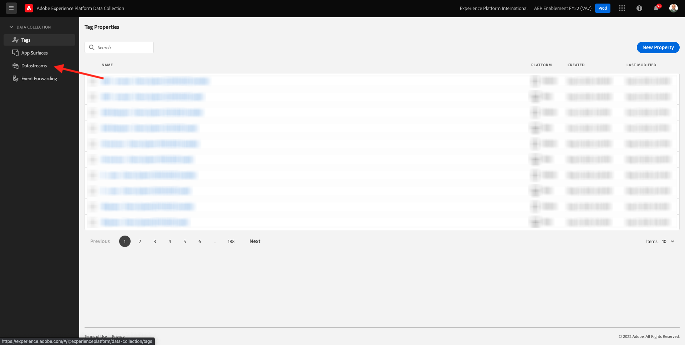
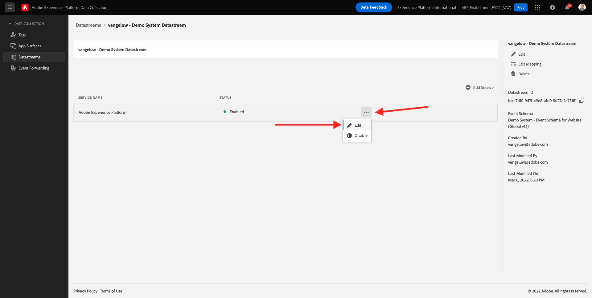

# 1.2 Recopilación de datos del servidor, conjuntos de datos y redes perimetrales

## Contexto

En este ejercicio creará un **Datastream**. A **Datastream** indica a los servidores de Adobe Edge dónde enviar los datos después de que el SDK web los haya recopilado. Por ejemplo, ¿desea enviar los datos a Adobe Experience Platform? Adobe Analytics? Adobe Audience Manager? Adobe Target?

Los conjuntos de datos siempre se administran en la interfaz de usuario de recopilación de datos de Adobe Experience Platform y son esenciales para la recopilación de datos de Adobe Experience Platform con el SDK web. Aunque implemente el SDK web con una solución de administración de etiquetas que no sea de Adobe, deberá crear el conjunto de datos en la interfaz de usuario de recopilación de datos de Adobe Experience Platform.

Implementará el SDK web en el explorador en el próximo ejercicio. A continuación, le resultará más claro cómo se ven los datos que se están recopilando. Por ahora, solo le estamos diciendo al Datastream dónde reenviar los datos.

## Crear un conjunto de datos

En [Ejercicio 0.2](./../module0/ex2.md) ya creó un Datastream, pero no discutimos el fondo ni el motivo de ser del Datastream.

Un Datastream indica a los servidores de Adobe Edge dónde enviar los datos después de que el SDK web los haya recopilado. Por ejemplo, ¿desea enviar los datos a Adobe Experience Platform? ¿Adobe Analytics? ¿Adobe Audience Manager? Adobe Target? Los conjuntos de datos se administran en la interfaz de usuario de recopilación de datos de Adobe Experience Platform y son esenciales para la recopilación de datos de Platform con el SDK web, independientemente de si va a implementar o no el SDK web a través de la recopilación de datos de Adobe Experience Platform.

Revisemos su **[!UICONTROL Datastream]**:

Vaya a [https://experience.adobe.com/launch/](https://experience.adobe.com/launch/).

Haga clic en **[!UICONTROL Datastreams]** o **[!UICONTROL Datastreams (Beta)]** en el menú de la izquierda.

Busque su conjunto de datos, que se denomina `--demoProfileLdap-- - Demo System Datastream`.

A continuación, verá los detalles de su Datastream.

Haga clic en **...** junto a **Adobe Experience Platform** y haga clic en **Editar**.

Entonces verás esto. En este momento, solo ha habilitado Adobe Experience Platform. Su configuración será similar a la siguiente. (En función del entorno y de la instancia de Adobe Experience Platform, el nombre del espacio aislado puede ser diferente)

Debe interpretar los campos siguientes de esta manera:

Para este conjunto de datos...

- Todos los datos recopilados se almacenan en la variable `--aepSandboxId--` simulador de pruebas en Adobe Experience Platform
- Todos los datos de Evento de experiencia se recopilan de forma predeterminada en el conjunto de datos **Sistema de demostración: conjunto de datos de evento para sitio web (Global v1.1)**
- Todos los datos de perfil se recopilarán de forma predeterminada en el conjunto de datos **Sistema de demostración: conjunto de datos de perfil para sitio web (Global v1.1)** (el SDK web todavía no admite la ingesta nativa de datos de perfil con el SDK web, y estará disponible en una fase posterior)
- Si desea usar la variable **offer decisioning** servicio de aplicación para este Datastream, debe marcar la casilla de Offer decisioning. (Esto formará parte de [Módulo 9](./../module9/offer-decisioning.md))
- Si desea usar la variable **Segmentación de Edge**, debe marcar la casilla Segmentación de Edge .
- Si desea usar la variable **Destinos de personalización**, debe marcar la casilla de Destinos de personalización .

Por ahora, no se necesita ninguna otra configuración para el Datastream.

Paso siguiente: [1.3 Introducción a la recopilación de datos de Adobe Experience Platform](./ex3.md)

[Volver al módulo 1](./data-ingestion-launch-web-sdk.md)

[Volver a todos los módulos](./../../overview.md)
