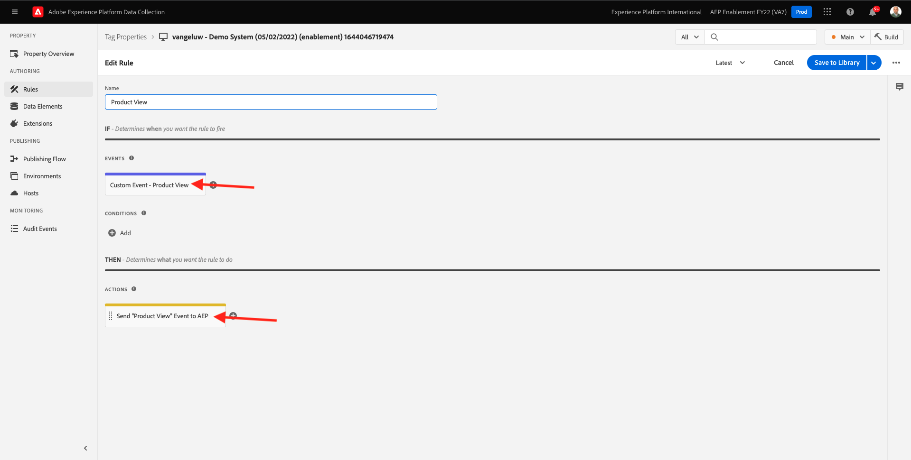

# 1.3: Introducción a la recopilación de datos de Adobe Experience Platform

## Contexto

Ahora analicemos más a fondo los componentes básicos de la recopilación de datos de Adobe Experience Platform para comprender qué se instala en el sitio web de demostración. Observará más detenidamente la extensión del SDK web de Adobe Experience Platform, configurará un elemento de datos y una regla y aprenderá a publicar una biblioteca.

## 1.3.1 - Extensión del SDK web de Adobe Experience Platform

Una extensión es un conjunto de código empaquetado que amplía la interfaz de recopilación de datos de Adobe Experience Platform y la funcionalidad de la biblioteca. La recopilación de datos de Adobe Experience Platform es la plataforma y las extensiones son como aplicaciones que se ejecutan en la plataforma. Todas las extensiones utilizadas en el tutorial se crean y administran mediante Adobe, pero terceros pueden crear sus propias extensiones para limitar la cantidad de código personalizado que deben administrar los usuarios de recopilación de datos de Adobe Experience Platform.

Vaya a [Recopilación de datos de Adobe Experience Platform](https://experience.adobe.com/launch/) y seleccione **Etiquetas**.

Esta es la página Propiedades de la recopilación de datos de Adobe Experience Platform que vio anteriormente.

En el módulo 0, Sistema de demostración creó dos propiedades de cliente para usted: uno para el sitio web y otro para la aplicación móvil. Para encontrarlos, busque `--demoProfileLdap--` en el **[!UICONTROL Buscar]** en la ventana

Abra el **Web** propiedad.

A continuación, verá la página Información general de la propiedad . Haga clic en **[!UICONTROL Extensiones]** en el carril izquierdo. Haga clic en el **[!UICONTROL Configurar]** en Adobe Experience Platform Web SDK Extension.

Le damos la bienvenida al SDK web de Adobe Experience Platform. Aquí puede configurar la extensión con el Datastream que ha creado en [Ejercicio 0.2](./../module0/ex2.md) así como una configuración más avanzada. Solo va a configurar dos opciones para este ejercicio.

El dominio perimetral predeterminado siempre es **edge.adobedc.net**. Si ha implementado una configuración CNAME en su entorno de Adobe Experience Cloud o Adobe Experience Platform, deberá actualizar el **[!UICONTROL Dominio de Edge]**. La instancia de Adobe Experience Platform está utilizando este dominio perimetral: `--webSdkEdgeDomain--`.

Si el dominio perimetral de su instancia es diferente del predeterminado, actualice el dominio perimetral. Un dominio perimetral permite configurar un servidor de seguimiento propio, que a su vez utiliza una configuración CNAME en el servidor para garantizar que los datos se recopilan en el Adobe.

Ahora, asegúrese de que la variable **[!UICONTROL Elegir de la lista]** el botón de opción está seleccionado en la sección **[!UICONTROL Datastreams]** y seleccione su conjunto de datos con el nombre: `--demoProfileLdap-- - Demo System Datastream`, de la lista de la **[!UICONTROL Datastream]** en la ventana

Haga clic en **[!UICONTROL Guardar]** para volver a la vista Extensiones.

## 1.3.2 Elementos de datos

Los Data Elements son los componentes básicos del diccionario de datos (o mapa de datos). Utilice Data Elements para recopilar, organizar y entregar datos a través de la tecnología de marketing y publicidad.

Un solo elemento de datos es una variable cuyo valor puede asignarse a cadenas de consulta, URL, valores de cookies, variables JavaScript, etc. Puede hacer referencia a este valor por su nombre de variable en toda la recopilación de datos de Adobe Experience Platform. Esta colección de Data Elements se convierte en el diccionario de los datos definidos que puede utilizar para crear reglas (eventos, condiciones y acciones). Este diccionario de datos se comparte en toda la recopilación de datos de Adobe Experience Platform para utilizarlo con cualquier extensión agregada a su propiedad.

Ahora va a editar un elemento de datos ya existente en un formato compatible con el SDK web.

Haga clic en Elementos de datos en el carril izquierdo para llevarlos a la página Elementos de datos .

>[!NOTE]
>
>Solo está editando un elemento de datos en este ejercicio, pero puede ver la variable **[!UICONTROL Añadir elemento de datos]** en esta página, que se utilizaría para agregar una variable nueva al diccionario de datos. Esto se podría utilizar en toda la recopilación de datos de Adobe Experience Platform. Siéntase libre de ver algunos de los otros elementos de datos ya existentes, principalmente el almacenamiento local como fuente de datos.

En la barra de búsqueda, escriba **XDM: vista de producto** y haga clic en el elemento de datos que devuelve.

Esta pantalla muestra el objeto XDM que va a editar. El Experience Data Model (XDM) es un concepto que se explorará mucho más a lo largo de este tutorial técnico, pero por ahora basta con entenderlo como el formato que requiere el SDK web de Adobe Experience Platform. Añadirá un poco más de información a los datos recopilados en las páginas de artículo del sitio web de demostración.

Haga clic en el botón más situado junto a **web** en la parte inferior del árbol.

Haga clic en el botón más situado junto a **webPageDetails**.

Haga clic en **siteSection**. Ahora ve que **siteSection** aún no está vinculado a ningún elemento de datos. Cambiemos eso.

Desplácese hacia arriba e introduzca el texto `%Product Category%`. Haga clic en **[!UICONTROL Guardar]**.

En este punto, se instala la extensión del SDK web de Adobe Experience Platform y ha actualizado un elemento de datos para recopilar datos con una estructura XDM. A continuación, vamos a comprobar las reglas que enviarán datos en el momento correcto.

## 1.3.3 Reglas

La recopilación de datos de Adobe Experience Platform es un sistema basado en reglas. Busca la interacción de usuarios y datos asociados. Cuando se cumplen los criterios descritos en las reglas, la regla activa la extensión, script o el código del lado del cliente identificados.

Genere reglas para integrar los datos y las funciones de marketing y tecnología publicitaria que unifique productos dispares en una única solución.

Desglosemos la regla que envía datos en las páginas de artículos.

Haga clic en **[!UICONTROL Reglas]** en el carril izquierdo.

**[!UICONTROL Buscar]** para `Product View`.

Haga clic en la regla que se devuelve.

Veamos los elementos individuales que componen esta regla. Para todas las reglas Si se ha especificado una **[!UICONTROL Evento]** se produce, la variable **[!UICONTROL Condiciones]** se evalúan y luego se especifica **[!UICONTROL Acciones]** si es necesario.

Haga clic en el evento **Evento personalizado: vista de producto**. Esta es la vista que se carga.

Haga clic en el **Tipo de evento** desplegable .

En esta lista se enumeran algunas de las interacciones estándar que puede utilizar para indicar a la recopilación de datos de Adobe Experience Platform que ejecute las acciones en caso de que las condiciones sean verdaderas.

Haga clic en **[!UICONTROL Cancelar]** para volver a la regla.

Haga clic en la acción **Envío del evento &quot;Vista de producto&quot; a AEP**.

Aquí puede ver los datos que el SDK web de Adobe Experience Platform está enviando a Adobe Edge. Más específicamente, se usa la variable **alloy** **[!UICONTROL Instancia]** del SDK web. Configuración de otra **[!UICONTROL Instancia]** permitiría utilizar distintos conjuntos de datos, entre otras cosas. Ha especificado el evento **[!UICONTROL Tipo]** como **commerce.productViews** y los datos XDM que envía son **XDM: vista de producto** elemento de datos que haya cambiado anteriormente.

Ahora que ha visto la regla, puede publicar todos los cambios en la recopilación de datos de Adobe Experience Platform.

## 1.3.4 Publicar en una biblioteca

Finalmente, para validar la regla y el elemento de datos que acaba de actualizar, debe publicar una biblioteca que contenga los elementos editados en nuestra propiedad. Hay algunos pasos rápidos que debe seguir en la **[!UICONTROL Publicación]** de la recopilación de datos de Adobe Experience Platform.

Haga clic en **[!UICONTROL Flujo de publicación]** en la navegación izquierda

Haga clic en la biblioteca existente, llamada **Principal**.

Haga clic en el **Agregar todos los recursos modificados** botón.

Desplácese hacia abajo para ver que la mayoría de los recursos permanecerán como **Revisión 1 (última)**, pero los dos que hemos cambiado - **Elemento de datos: ruleArticlePages** y **Extensión: SDK web de Adobe Experience Platform** se marcará con solo **Última**.

Haga clic en el **Guardar y generar para desarrollo** botón.

La biblioteca puede tardar unos minutos en crearse y, cuando se complete, mostrará un punto verde a la izquierda del nombre de la biblioteca.

Como puede ver en la pantalla Flujo de publicación , hay mucho más en el proceso de publicación de la recopilación de datos de Adobe Experience Platform que está fuera del ámbito de este tutorial. Vamos a usar una sola biblioteca en nuestro entorno de desarrollo.

Paso siguiente: [1.4 Recopilación de datos web del lado del cliente](./ex4.md)

[Volver al módulo 1](./data-ingestion-launch-web-sdk.md)

[Volver a todos los módulos](./../../overview.md)
