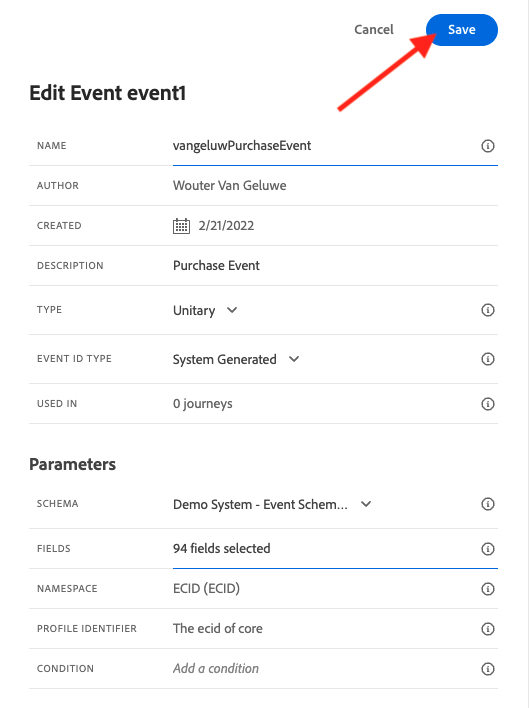
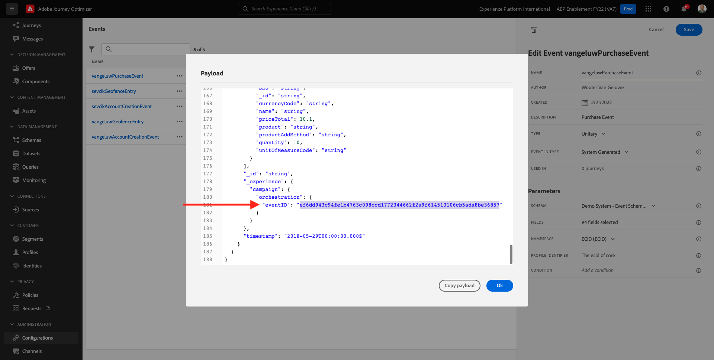
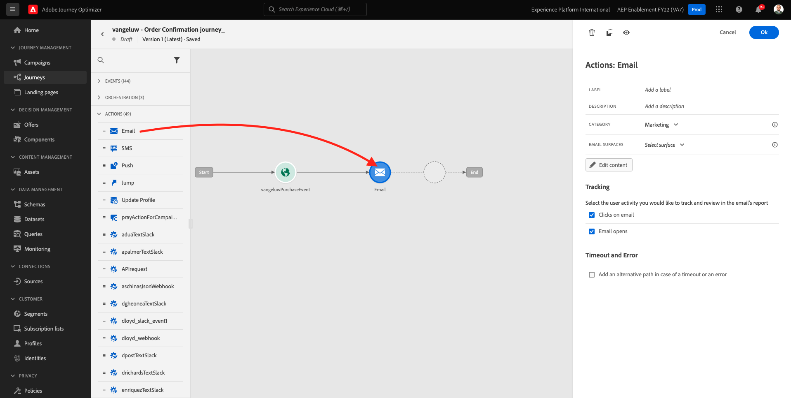
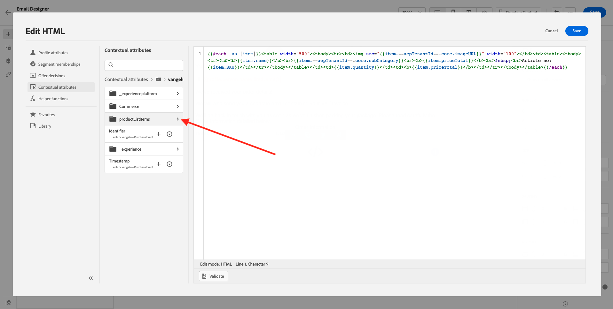
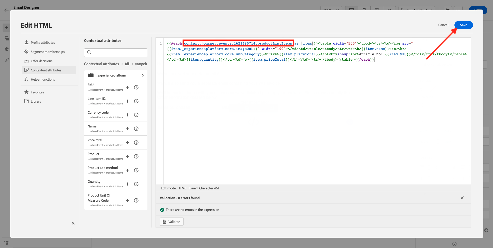
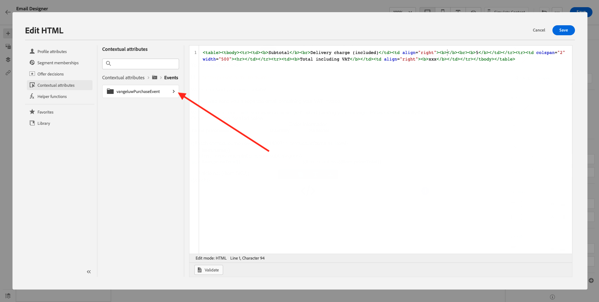
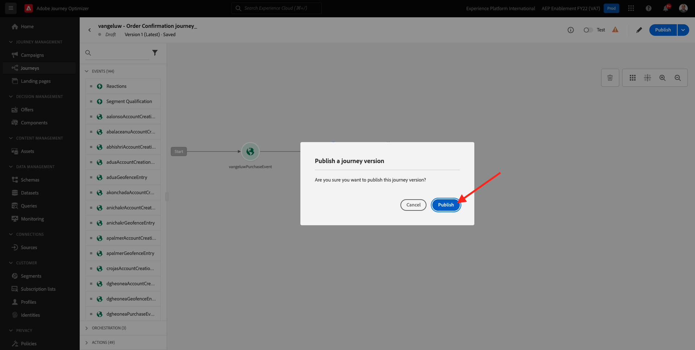
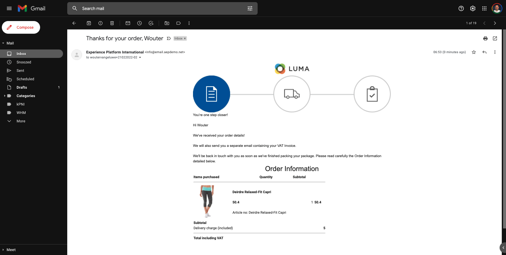

# 10.1 Configuración de un recorrido basado en déclencheur: confirmación de pedido

Inicie sesión en Adobe Journey Optimizer desde [Adobe Experience Cloud](https://experience.adobe.com). Haga clic en **Journey Optimizer**.


Se le redirigirá al **Página principal**  en Journey Optimizer. En primer lugar, asegúrese de que está utilizando el simulador para pruebas correcto. El entorno limitado que se va a usar se denomina `--aepSandboxId--`. Para cambiar de un simulador de pruebas a otro, haga clic en **PRODUCCIÓN (VA7)** y seleccione el simulador de pruebas de la lista. En este ejemplo, el simulador de pruebas recibe el nombre **Habilitación de AEP para el año fiscal 22**. Entonces estará en el **Página principal** vista del entorno limitado `--aepSandboxId--`.


## 10.1.1 Crear el evento

En el menú , vaya a **Configuraciones** y haga clic en **Administrar** under **Eventos**.


En el **Eventos** , verá una vista similar a esta. Haga clic en **Crear evento**.


A continuación, verá una configuración de evento vacía.


En primer lugar, asigne un nombre al evento de esta manera: `--demoProfileLdap--PurchaseEvent`y añada una descripción como esta: `Purchase Event`.


A continuación, se muestra la variable **Tipo de evento** selección. Select **Unitario**.


A continuación, se muestra la variable **Tipo de ID de evento** selección. Select **Sistema generado**


A continuación, se muestra la selección de Esquema. Se preparó un esquema para este ejercicio. Utilice el esquema `Demo System - Event Schema for Website (Global v1.1) v.1`.


Después de seleccionar el esquema, verá una serie de campos seleccionados en el **Carga útil** para obtener más información. Haga clic en el **Editar/Lápiz** para añadir campos adicionales a este evento.


Verá esta ventana emergente. Ahora debe marcar casillas de verificación adicionales para acceder a datos adicionales cuando se active este evento.


En primer lugar, marque la casilla de la línea . `--aepTenantId--`.


A continuación, desplácese hacia abajo y marque la casilla de verificación en la línea `productListItems`.


A continuación, desplácese hacia abajo y marque la casilla de verificación en la línea `commerce`.


A continuación, haga clic en **Ok**.

A continuación, verá que se han añadido campos adicionales al evento. Haga clic en **Guardar**.



El nuevo evento se comparte y el evento se ve en la lista de eventos disponibles ahora.

Haga clic en el evento de nuevo para abrir el **Editar evento** de nuevo.
Pase el ratón sobre la **Carga útil** para volver a ver los 3 iconos. Haga clic en el **Ver carga útil** icono.


Ahora verá un ejemplo de la carga útil esperada. Su evento tiene un eventID de orquestación único que puede encontrar desplazándose hacia abajo en esa carga hasta que vea `_experience.campaign.orchestration.eventID`.



El ID de evento es lo que se debe enviar a Adobe Journey Optimizer para almacenar en déclencheur el recorrido que se creará en el siguiente paso. Escriba este eventID, ya que lo necesitará en uno de los pasos siguientes.
`"eventID": "ef6dd943c94fe1b4763c098ccd1772344662f2a9f614513106cb5ada8be36857"`

Haga clic en **Ok**, seguido de **Cancelar**.

El evento está configurado y listo para utilizarse.

## 10.1.2 Crear su recorrido

En el menú , vaya a **Recorridos** y haga clic en **Crear Recorrido**.


Entonces verás esto. Póngale un nombre a tu recorrido. En su lugar, utilice `--demoProfileLdap-- - Order Confirmation journey`. Haga clic en **Aceptar**.


En primer lugar, debe añadir el evento como punto de partida del recorrido. Busque su evento `--demoProfileLdap--PurchaseEvent` y arrástrelo y suéltelo en el lienzo. Haga clic en **Aceptar**.


A continuación, en **Acciones**, busque la variable **Correo electrónico** y añádalo al lienzo.



Configure las variables **Categoría** a **Marketing** y seleccione una superficie de correo electrónico que le permita enviar correos electrónicos. En este caso, la superficie de correo electrónico que se va a seleccionar es **Correo electrónico**. Asegúrese de que las casillas de verificación de **Clics en correos electrónicos** y **aperturas por correo electrónico** están activadas.


El siguiente paso es crear el mensaje. Para ello, haga clic en **Editar contenido**.


Ahora ven esto. Haga clic en el **Línea de asunto** campo de texto.


En el área de texto empiece a escribir **Gracias por tu pedido,**


La línea de asunto aún no ha finalizado. A continuación, debe introducir el token de personalización para el campo **Nombre** que se almacenan en `profile.person.name.firstName`. En el menú de la izquierda, desplácese hacia abajo para encontrar la variable **Persona** > **Nombre completo** >  **Nombre** y haga clic en el botón **+** para añadir el token de personalización a la línea de asunto. Haga clic en **Guardar**.


Volverás aquí. Haga clic en **Diseñador de correo electrónico** para crear el contenido del correo electrónico.


En la siguiente pantalla, haga clic en **Diseño desde cero**.


En el menú de la izquierda, encontrará los componentes de estructura que puede utilizar para definir la estructura del correo electrónico (filas y columnas).

Arrastre y suelte 8 veces al **Columna 1:1** en el lienzo, que debería darle lo siguiente:


Vaya a **Componentes de contenido**.


Arrastre y suelte una **Imagen** en la primera fila. Haga clic en **Examinar**.


Vaya a la carpeta **enablement-assets**, seleccione el archivo **luma-logo.png** y haga clic en **Select**.


Ahora estás aquí de vuelta. Haga clic en la imagen para seleccionarla y, a continuación, utilice la variable **Tamaño** control deslizante para que la imagen del logotipo sea un poco más pequeña.


Vaya a **Componentes de contenido** y arrastre y suelte una **Imagen** en la segunda fila. Seleccione el **Componente de imagen** pero NO haga clic en Examinar.


Pegar esta URL de imagen en el campo **Fuente**: `https://parsefiles.back4app.com/hgJBdVOS2eff03JCn6qXXOxT5jJFzialLAHJixD9/29043bedcde632a9cbe8a02a164189c9_preparing.png`. Esta imagen está alojada fuera del Adobe.


Al cambiar el ámbito a otro campo, se representa la imagen y verá esto:


A continuación, vaya a **Componentes de contenido** y arrastre y suelte un **Texto** en la tercera fila.


Seleccionar el texto predeterminado de ese componente **Escriba el texto aquí.** y sustitúyalo por el texto siguiente:

```javascript
You’re one step closer!

Hi 

We've received your order details!

We will also send you a separate email containing your VAT Invoice.

We'll be back in touch with you as soon as we've finished packing your package. Please read carefully the Order Information detailed below.
```


Coloque el cursor junto al texto **Hi** y haga clic en **Añadir personalización**.


Vaya a la **Persona** > **Nombre completo** > **Nombre** y haga clic en el botón **+** para añadir el token de personalización a la línea de asunto. Haga clic en **Guardar**.


Verá esto:


A continuación, vaya a **Componentes de contenido** y arrastre y suelte un **Texto** en la cuarta fila.


Seleccionar el texto predeterminado de ese componente **Escriba el texto aquí.** y sustitúyalo por el texto siguiente:

`Order Information`

Cambie el tamaño de fuente a **26px** y centrar el texto en esta celda. Entonces tendrá esto:


A continuación, vaya a **Componentes de contenido** y arrastre y suelte una **HTML** en la quinta fila. Haga clic en el componente HTML y, a continuación, haga clic en **Mostrar el código fuente**.


En el **Editar HTML** , pegue este HTML:

```<table><tbody><tr><td><b>Items purchased</b></td><td></td><td><b>Quantity</b></td><td><b>Subtotal</b></td></tr><tr><td colspan="4" width="500"><hr></td></tr></tbody></table>```

Haga clic en **Guardar**.


Entonces tendrás esto. Haga clic en **Guardar** para guardar el progreso.


Vaya a **Componentes de contenido** y arrastre y suelte una **HTML** en la sexta fila. Haga clic en el componente HTML y, a continuación, haga clic en **Mostrar el código fuente**.


En el **Editar HTML** , pegue este HTML:

```{{#each xxx as |item|}}<table width="500"><tbody><tr><td></td><td><table><tbody><tr><td><b>{{item.name}}</b><br>{{item.--aepTenantId--.core.subCategory}}<br><b>{{item.priceTotal}}</b><br>&nbsp;<br>Article no: {{item.SKU}}</td></tr></tbody></table></td><td>{{item.quantity}}</td><td><b>{{item.priceTotal}}</b></td></tr></tbody></table>{{/each}}```

Entonces tendrá esto:


Ahora tiene que reemplazar **xxx** por referencia al objeto productListItems que forma parte del suceso que déclencheur el recorrido.


Primero, elimine **xxx** en su código de HTML primero.


En el menú de la izquierda, haga clic en **Atributos contextuales**. Este contexto se pasa al mensaje desde el recorrido.


Entonces verás esto. Haga clic en la flecha situada junto a **Journey Orchestration** para profundizar.


Haga clic en la flecha situada junto a **Eventos** para profundizar.


Haga clic en la flecha situada junto a `--demoProfileLdap--PurchaseEvent` para profundizar.


Haga clic en la flecha situada junto a **productListItems** para profundizar.



Haga clic en el **+** junto a **Nombre** para agregarlo al lienzo. Entonces tendrás esto. Ahora debe seleccionar  **.name** como se indica en la captura de pantalla siguiente, y luego debe eliminar **.name**.


Entonces tendrás esto. Haga clic en **Guardar**.



Volverá al Diseñador de correo electrónico ahora. Haga clic en **Guardar** para guardar el progreso.


A continuación, vaya a **Componentes de contenido** y arrastre y suelte una **HTML** en la séptima fila. Haga clic en el componente HTML y, a continuación, haga clic en **Mostrar el código fuente**.


En el **Editar HTML** , pegue este HTML:

```<table><tbody><tr><td><b>Subtotal</b><br>Delivery charge (included)</td><td align="right"><b>xxx</b><br><b>5</b></td></tr><tr><td colspan="2" width="500"><hr></td></tr><tr><td><b>Total including VAT</b></td><td align="right"><b>xxx</b></td></tr></tbody></table>```

Hay 2 referencias de **xxx** en este código de HTML. Ahora tiene que reemplazar cada **xxx** por referencia al objeto productListItems que forma parte del suceso que déclencheur el recorrido.


En primer lugar, elimine la primera **xxx** en su código de HTML.


En el menú de la izquierda, haga clic en **Atributos contextuales**.


Haga clic en la flecha situada junto a **Journey Orchestration** para profundizar.


Haga clic en la flecha situada junto a **Eventos** para profundizar.


Haga clic en la flecha situada junto a `--demoProfileLdap--PurchaseEvent` para profundizar.



Haga clic en la flecha situada junto a **Comercio** para profundizar.


Haga clic en la flecha situada junto a **Pedido** para profundizar.


Haga clic en el **+** junto a **Precio total** para agregarlo al lienzo.


Entonces tendrás esto. Ahora elimine el segundo **xxx** en su código de HTML.


Haga clic en el **+** junto a **Precio total** para agregarlo al lienzo.


También puede añadir el campo **Moneda** desde el **Pedido** en el lienzo, como puede ver aquí.
Cuando haya terminado, haga clic en **Guardar** para guardar los cambios.


A continuación, volverá al Diseñador de correo electrónico. Haga clic en **Guardar** de nuevo.


Vuelva al panel de mensajes haciendo clic en el **flecha** junto al texto de la línea de asunto en la esquina superior izquierda.


Haga clic en la flecha situada en la esquina superior izquierda para volver al recorrido.


Haga clic en **Ok** para cerrar la acción del correo electrónico.


Haga clic en **Publicación** para publicar el recorrido.


Haga clic en **Publicación** de nuevo.



El recorrido ya está publicado.


## 10.1.5 Actualizar la propiedad del cliente de recopilación de datos de Adobe Experience Platform

Vaya a [Recopilación de datos de Adobe Experience Platform](https://experience.adobe.com/launch/) y seleccione **Etiquetas**.

Esta es la página Propiedades de la recopilación de datos de Adobe Experience Platform que vio anteriormente.


En el módulo 0, Sistema de demostración creó dos propiedades de cliente para usted: uno para el sitio web y otro para la aplicación móvil. Para encontrarlos, busque `--demoProfileLdap--` en el **[!UICONTROL Buscar]** en la ventana Haga clic en para abrir el **Web** propiedad.


Vaya a **Elementos de datos**. Buscar y abrir el elemento de datos **XDM - Compra**.


Entonces verás esto. Navegar al campo **_experience.campaign.orchestration.eventID** y complete su eventID aquí. El eventID que se debe rellenar aquí es el eventID que creó como parte del ejercicio 10.1.2. Haga clic en **Guardar** o **Guardar en biblioteca**.


Guarde los cambios en la propiedad Client y, a continuación, publique los cambios actualizando la biblioteca de desarrollo.


Los cambios ya están implementados y se pueden probar.

## 10.1.6 Pruebe el correo electrónico de confirmación de pedido mediante el sitio web de demostración

Probemos el recorrido actualizado comprando un producto en el sitio web de demostración.

Vaya a [https://builder.adobedemo.com/projects](https://builder.adobedemo.com/projects). Después de iniciar sesión en Adobe ID, verá esto. Haga clic en el proyecto del sitio web para abrirlo.


En el **Pantallas** página, haga clic en **Ejecutar**.


Verá que su sitio web de demostración se abre. Seleccione la dirección URL y cópiela en el portapapeles.


Abra una nueva ventana del explorador incógnito.


Pegue la dirección URL del sitio web de la demostración, que copió en el paso anterior. A continuación, se le pedirá que inicie sesión con su Adobe ID.


Seleccione su tipo de cuenta y complete el proceso de inicio de sesión.


Verá su sitio web cargado en una ventana del navegador incógnito. Para cada demostración, tendrá que usar una ventana nueva del explorador incógnito para cargar la URL de su sitio web de demostración.


Haga clic en el icono del logotipo de Adobe en la esquina superior izquierda de la pantalla para abrir el Visor de perfiles.


Consulte el panel Visualizador de perfiles y el perfil del cliente en tiempo real con el **ID de Experience Cloud** como identificador principal para este cliente actualmente desconocido.


Vaya a la página Registro/Inicio de sesión . Haga clic en **CREAR UNA CUENTA**.


Complete los detalles y haga clic en **Registro** después de lo cual, se le redirigirá a la página anterior.


Agregue cualquier producto al carro de compras y vaya a la sección **Carro de compras** página. Haga clic en **Continúe con el cierre de compra**.


A continuación, compruebe los campos en la página de cierre de compra y haga clic en **Cierre de compra**.


A continuación, recibirá su correo electrónico de confirmación de pedido en cuestión de segundos.



Ha terminado este ejercicio.

Paso siguiente: [10.2 Configuración de un recorrido de newsletter basado en lotes](./ex2.md)

[Volver al módulo 10](./journeyoptimizer.md)

[Volver a todos los módulos](../../overview.md)
