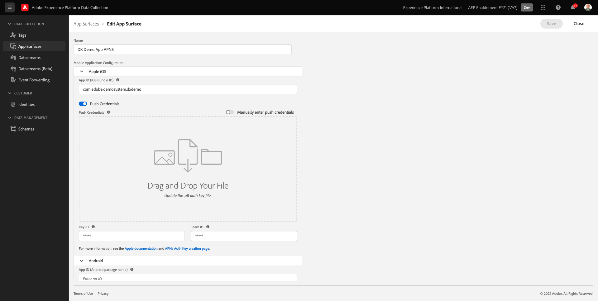
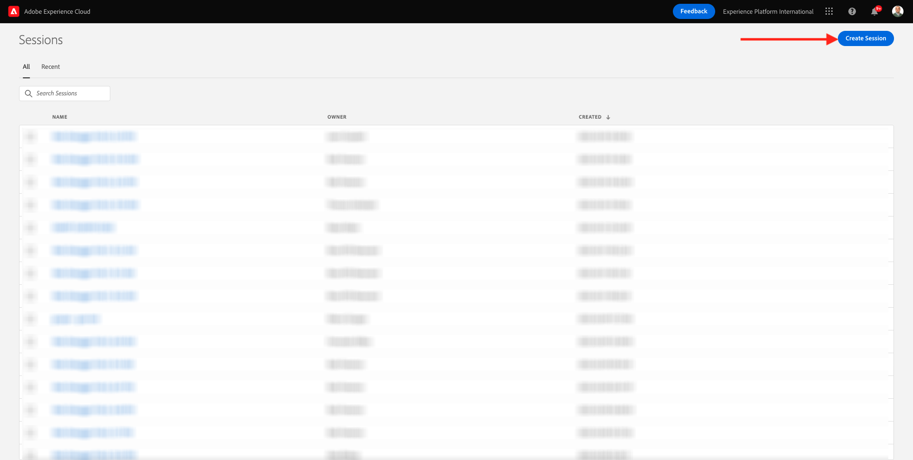
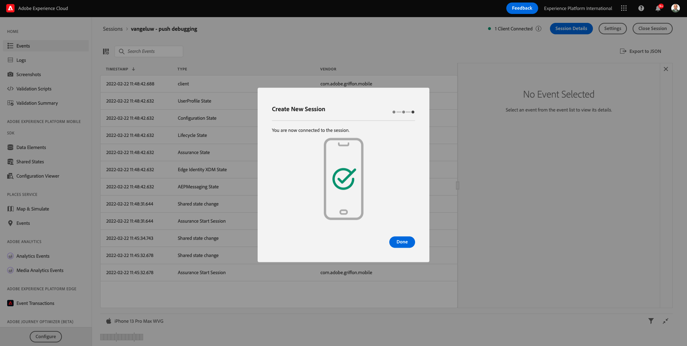
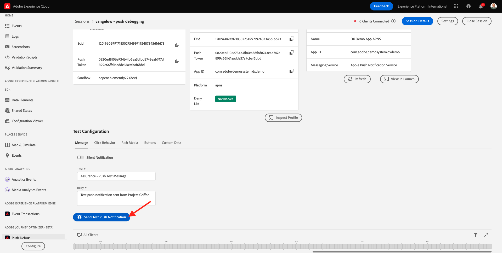
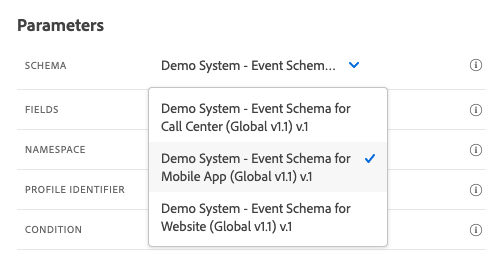
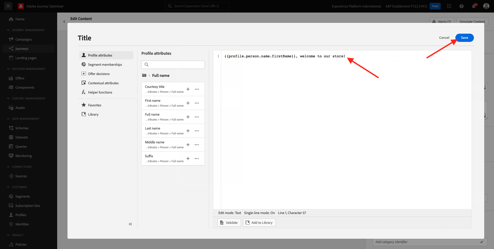

# 10.4 Configuración y uso de notificaciones push para iOS

Para utilizar las notificaciones push con Adobe Journey Optimizer, hay una serie de configuraciones que comprobar y conocer.

A continuación se muestran todos los ajustes para comprobar:

- Conjuntos de datos y esquemas en Adobe Experience Platform
- Datastream para móvil
- Propiedad de recopilación de datos para dispositivos móviles
- Superficie de la aplicación para certificados push
- Pruebe la configuración de push con AEP Assurance

Revisemos uno por uno.

Inicie sesión en Adobe Journey Optimizer desde [Adobe Experience Cloud](https://experience.adobe.com). Haga clic en **Journey Optimizer**.

Se le redirigirá al **Página principal**  en Journey Optimizer. En primer lugar, asegúrese de que está utilizando el simulador para pruebas correcto. El entorno limitado que se va a usar se denomina `--aepSandboxId--`. Para cambiar de un simulador de pruebas a otro, haga clic en **PRODUCCIÓN (VA7)** y seleccione el simulador de pruebas de la lista. En este ejemplo, el simulador de pruebas recibe el nombre **Habilitación de AEP para el año fiscal 22**. Entonces estará en el **Página principal** vista del entorno limitado `--aepSandboxId--`.

## 10.4.1 Conjuntos de datos push

Adobe Journey Optimizer utiliza conjuntos de datos para almacenar elementos como los tokens push procedentes de dispositivos móviles o interacciones con mensajes push (como: mensaje enviado, mensaje abierto, etc.) en un conjunto de datos en Adobe Journey Optimizer.

Para encontrar estos conjuntos de datos, vaya a **[!UICONTROL Conjuntos de datos]** en el menú de la izquierda de la pantalla. Para mostrar conjuntos de datos del sistema, haga clic en el icono de filtro.

Habilitar la opción **Mostrar conjuntos de datos del sistema** y busque **AJO**. A continuación, verá los conjuntos de datos utilizados para las notificaciones push.

## 10.4.2 Datastream para dispositivos móviles

Vaya a [https://experience.adobe.com/#/data-collection/](https://experience.adobe.com/#/data-collection/).

En el menú de la izquierda, vaya a **[!UICONTROL Datastream]** y busque el conjunto de datos creado en [Ejercicio 0.2](./../module0/ex2.md), cuyo nombre es `--demoProfileLdap-- - Demo System Datastream (Mobile)`. Haga clic en para abrirlo.

Haga clic en **Editar** en el **Adobe Experience Platform** servicio.

A continuación, verá la configuración del conjunto de datos que se definió y en qué eventos de conjuntos de datos y atributos de perfil se almacenarán.

No es necesario realizar cambios, el conjunto de datos ya está listo para utilizarse en la propiedad Cliente de recopilación de datos para dispositivos móviles.

## 10.4.3 Revise su propiedad de recopilación de datos para dispositivos móviles

Vaya a [https://experience.adobe.com/#/data-collection/](https://experience.adobe.com/#/data-collection/). Como parte de [Ejercicio 0.1](./../module0/ex1.md), se crearon 2 propiedades de recopilación de datos.
Ya ha estado utilizando estas propiedades de cliente de recopilación de datos como parte de módulos anteriores.

Haga clic en para abrir la propiedad Recopilación de datos para dispositivos móviles.

En la propiedad de recopilación de datos, vaya a **Extensiones**. A continuación, verá las distintas extensiones necesarias para la aplicación móvil. Haga clic en para abrir la extensión **Adobe Experience Platform Edge Network**.

Verá que el conjunto de datos para móviles está vinculado aquí. A continuación, haga clic en **Cancelar** para volver a la descripción general de las extensiones.

Volverás aquí. Verá la extensión para **AEP Assurance**. AEP Assurance le ayuda a inspeccionar, probar, simular y validar cómo recopila datos o sirve experiencias en su aplicación móvil. Puede leer más sobre AEP Assurance y Project Griffon aquí [https://aep-sdks.gitbook.io/docs/beta/project-griffon](https://aep-sdks.gitbook.io/docs/beta/project-griffon).

A continuación, haga clic en **Configurar** para abrir la extensión **Adobe Journey Optimizer**.

A continuación, verá que aquí es donde se vincula el conjunto de datos para el seguimiento de eventos push.

No es necesario realizar ningún cambio en la propiedad Recopilación de datos.

## 10.4.4 Revise la configuración de su superficie de aplicación

Vaya a [https://experience.adobe.com/#/data-collection/](https://experience.adobe.com/#/data-collection/). En el menú de la izquierda, vaya a **Superficies de la aplicación** y abra, la superficie de la aplicación para **APNS de aplicación de demostración DX**.

A continuación, verá la superficie de aplicación configurada para iOS y Android.

## 10.4.5 Probar la configuración de notificaciones push con AEP Assurance.

Una vez que la aplicación esté instalada, la encontrará en la pantalla de inicio del dispositivo. Haga clic en el icono para abrir la aplicación.

Cuando utilice la aplicación por primera vez, se le solicitará que inicie sesión con su Adobe ID. Complete el proceso de inicio de sesión.

Después de iniciar sesión, verá una notificación en la que se solicita su permiso para enviar notificaciones. Enviaremos notificaciones como parte del tutorial, por lo que haga clic en **Permitir**.

A continuación, verá la página de inicio de la aplicación. Vaya a **Configuración**.

En la configuración, verá que actualmente es un **Proyecto público** se carga en la aplicación. Haga clic en **Proyecto personalizado**.

Ahora puede cargar un proyecto personalizado. Haga clic en el código QR para cargar fácilmente el proyecto.

Después del ejercicio 0.1, tuvo este resultado. Haga clic en para abrir el **Proyecto comercial móvil** que se creó para usted.

En caso de que haya cerrado accidentalmente la ventana del explorador o de que se hayan celebrado sesiones de demostración o habilitación futuras, también puede acceder al proyecto del sitio web yendo a [https://builder.adobedemo.com/projects](https://builder.adobedemo.com/projects). Después de iniciar sesión en Adobe ID, verá esto. Haga clic en su proyecto de aplicación móvil para abrirlo.

Entonces verás esto. Haga clic en **Integraciones**.

Debe seleccionar la propiedad Recopilación de datos para móviles creada en el ejercicio 0.1. A continuación, haga clic en **Ejecutar**.

Verá esta ventana emergente, que contiene un código QR. Analice este código QR desde la aplicación móvil.

A continuación, verá su ID de proyecto en la aplicación, tras lo cual puede hacer clic en **Guardar**.

Ahora, vuelva a **Página principal** en la aplicación. La aplicación ya está lista para utilizarse.

Ahora necesita analizar un código QR para conectar su dispositivo móvil a la sesión de AEP Assurance.

Para iniciar una sesión de AEP Assurance, vaya a [https://experience.adobe.com/#/@experienceplatform/griffon](https://experience.adobe.com/#/@experienceplatform/griffon). Haga clic en **Crear sesión**.

Haga clic en **Start**.

Complete los valores:

- Nombre de la sesión: use `--demoProfileLdap-- - push debugging` y reemplace ldap por su ldap
- Dirección URL base: use **dxdemo://default**

Haga clic en **Siguiente**.

A continuación, verá un código QR en la pantalla, que deberá analizar con el dispositivo iOS.

En su dispositivo móvil, abra la aplicación de cámara y analice el código QR que muestra AEP Assurance.

A continuación, verá una pantalla emergente en la que se le pedirá que introduzca el código PIN. Copie el código PIN de su pantalla AEP Assurance y haga clic en **Connect**.

Entonces verás esto.

En AEP Assurance, ahora verá que un dispositivo está en la sesión de AEP Assurance.

Vaya a **Depuración push**. Verás algo como esto.

Alguna explicación:

- La primera columna, **Cliente**, muestra los identificadores disponibles en el dispositivo iOS. Verá un ECID y un token push.
- La segunda columna muestra **Perfil** información, con información adicional sobre la plataforma en la que reside el token push (APNS o APNSSandbox). Si hace clic en el botón **Perfil de Inspect** , se le dirigirá a Adobe Experience Platform y verá el Perfil del cliente en tiempo real completo.
- La tercera columna muestra la variable **Configuración de la aplicación**, que se creó como parte del ejercicio **10.5.4 Crear configuración de aplicación en Launch**

Para probar la configuración de Push, haga clic en el botón **Enviar notificación push** botón.

Debe asegurarse de que la variable **Demostración DX** La aplicación no está abierta al hacer clic en el botón **Enviar notificación push** botón. Si la aplicación está abierta, es posible que la notificación push se reciba en segundo plano y no sea visible.

A continuación, verá una notificación push como esta en su dispositivo móvil.

Si ha recibido la notificación push, significa que la configuración es correcta y funciona bien.

## 10.4.6 Crear un nuevo evento

En el menú , vaya a **Administración de recorridos** y haga clic en **Administrar** under **Eventos**.

En el **Eventos** , verá una vista similar a esta. Haga clic en **Crear evento**.

A continuación, verá una configuración de evento vacía.

En primer lugar, asigne un nombre al evento de esta manera: `--demoProfileLdap--StoreEntryEvent` y establezca la descripción en `Store Entry Event`.

A continuación, se muestra la variable **Tipo de evento** selección. Select **Unitario**.

A continuación, se muestra la variable **Tipo de ID de evento** selección. Select **Sistema generado**

A continuación, se muestra la selección de Esquema. Se preparó un esquema para este ejercicio. Utilice el esquema `Demo System - Event Schema for Mobile App (Global v1.1) v.1`.

Después de seleccionar el esquema, verá una serie de campos seleccionados en el **Carga útil** para obtener más información. El evento ya está completamente configurado.

Debería ver esto. Haga clic en **Guardar**.

El evento ya está configurado y guardado. Haga clic en el evento de nuevo para abrir el **Editar evento** de nuevo.

Pase el ratón sobre la **Carga útil** y haga clic en el botón **Ver carga útil** icono.

Ahora verá un ejemplo de la carga útil esperada.

Su evento tiene un eventID de orquestación único que puede encontrar desplazándose hacia abajo en esa carga hasta que vea `_experience.campaign.orchestration.eventID`.

El ID de evento es lo que se debe enviar a Adobe Experience Platform para almacenar en déclencheur el Recorrido que se creará en el siguiente paso. Escriba este eventID, ya que lo necesitará en el siguiente paso.
`"eventID": "e3a8f0bdc0b609667cd96a72a6b1e5aafa0ddaf6ccf121c574e6a2030860a633"`

Haga clic en **Ok**, seguido de **Cancelar**.

## 10.4.7 Crear un recorrido

En el menú , vaya a **Recorridos** y haga clic en **Crear Recorrido**.

Entonces verás esto. Póngale un nombre a tu recorrido. En su lugar, utilice `--demoProfileLdap-- - Store Entry journey`. Haga clic en **Aceptar**.

En primer lugar, debe añadir el evento como punto de partida del recorrido. Busque su evento `--demoProfileLdap--StoreEntryEvent` y arrástrelo y suéltelo en el lienzo. Haga clic en **Aceptar**.

A continuación, en **Acciones**, busque la variable **Push** acción.
Arrastre y suelte la **Push** en el lienzo.

Configure las variables **Categoría** a **Marketing** y seleccione una superficie push que le permita enviar notificaciones push. En este caso, la superficie de correo electrónico que se va a seleccionar es **Push-iOS-Android**.

El siguiente paso es crear el mensaje. Para ello, haga clic en **Editar contenido**.

Entonces verás esto. Haga clic en el **personalización** para **Título** campo .

Entonces verás esto. Ahora puede seleccionar cualquier atributo de perfil directamente en el Perfil del cliente en tiempo real.

Buscar el campo **Nombre** y, a continuación, haga clic en el botón **+** junto al campo **Nombre**. A continuación, verá que se agrega el token de personalización para el nombre: **{{profile.person.name.firstName}}**.

A continuación, añada el texto **, bienvenido a nuestra tienda!** back **{{profile.person.name.firstName}}**.

Haga clic en **Guardar**.

Ahora tienes esto. Haga clic en el **personalización** para **Cuerpo** campo .

Escriba este texto **Haga clic aquí para obtener un descuento del 10% cuando compre hoy!** y haga clic en **Guardar**.

Entonces tendrás esto. Haga clic en la flecha situada en la esquina superior izquierda para volver al recorrido.

Haga clic en **OK** para cerrar la acción push.

Haga clic en **Publicación**.

Haga clic en **Publicación** de nuevo.

El recorrido ya está publicado.

## 10.4.8 Pruebe el recorrido y el mensaje push

En la aplicación móvil DX Demo 2.0, vaya a la **Configuración** en el Navegador. Haga clic en el **Entrada de tienda** botón.

>[!NOTE]
>
>La variable **Entrada de tienda** se está implementando. Todavía no lo encontrarás en la aplicación.

Asegúrese de cerrar la aplicación inmediatamente después de hacer clic en el botón **Entrada de tienda** de lo contrario, el mensaje push no se mostrará.

Después de un par de segundos, verá aparecer el mensaje.

Ha terminado este ejercicio.

Paso siguiente: [10.5 Crear un recorrido de evento empresarial](./ex5.md)

[Volver al módulo 10](./journeyoptimizer.md)

[Volver a todos los módulos](../../overview.md)
