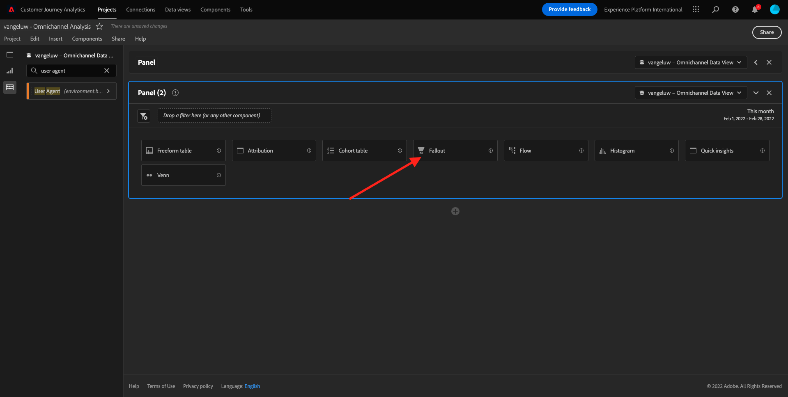
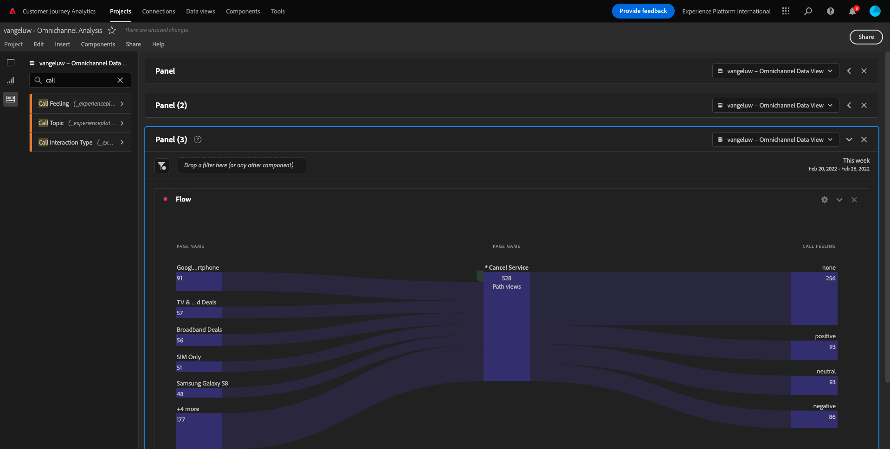
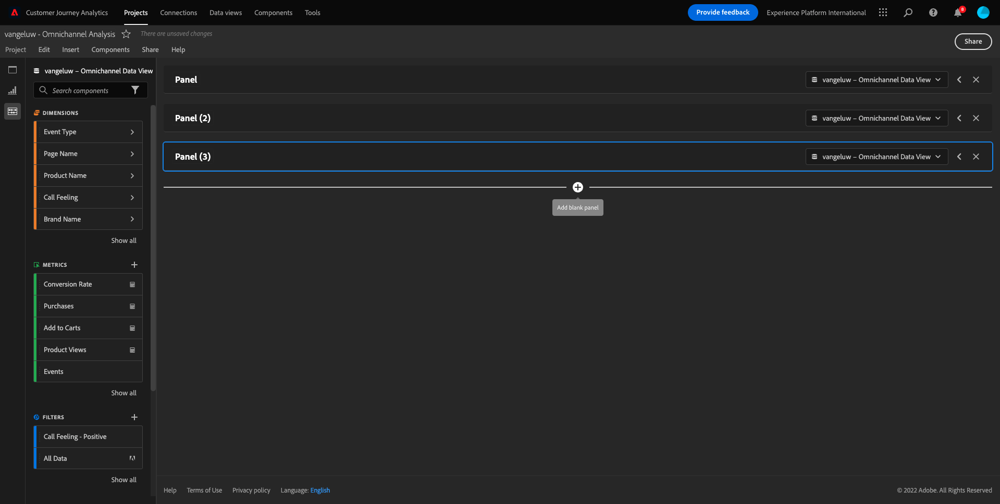

# 11.5 Visualización mediante Customer Journey Analytics

## Objetivos

- Explicación de la interfaz de usuario de Analysis Workspace
- Aprenda algunas funciones que hacen que Analysis Workspace sea tan diferente.
- Aprenda a analizar en CJA usando Analysis Workspace

## Contexto

En estos ejercicios, utilizará Analysis Workspace dentro de CJA para analizar las vistas de productos, los canales de productos, la reproducción, etc.

Cubriremos algunas de las consultas realizadas en el Módulo 7 - Servicio de Consulta para que pueda ver lo fácil que es ejecutar las mismas consultas y más, pero sin usar SQL y confiando únicamente en la filosofía de arrastrar y soltar de Analysis Workspace.

Usemos el proyecto que ha creado en [11.4 Preparación de datos en Analysis Workspace](./ex4.md), así que vaya a [https://analytics.adobe.com](https://analytics.adobe.com).

Abra el proyecto `--demoProfileLdap-- - Omnichannel Analysis`.

Con el proyecto abierto y la vista de datos `--demoProfileLdap-- - Omnichannel Analysis` seleccionado, está listo para empezar a crear sus primeras visualizaciones.

## Cuántas vistas de productos tenemos a diario

En primer lugar, es necesario seleccionar las fechas adecuadas para analizar los datos. Vaya al menú desplegable del calendario en el lado derecho del lienzo. Haga clic en él y seleccione el intervalo de fechas correspondiente.

En el menú de la izquierda (área de componentes), busque Métrica calculada . **Vistas del producto**. Selecciónela y arrástrela y suéltela en el lienzo, en la parte superior derecha de la tabla de forma libre.

Automáticamente, la dimensión **Día** se agregará para crear la primera tabla. Ahora puedes ver tu pregunta respondida sobre la marcha.

A continuación, haga clic con el botón derecho en el resumen de la métrica.

Haga clic en **Visualizar** y, a continuación, seleccione **Línea** como visualización.

Verá las vistas de sus productos por día.

Puede cambiar el intervalo de tiempo al día haciendo clic en **Configuración** en la visualización.

Haga clic en el punto junto a **Línea** a **Administrar la fuente de datos**.

A continuación, haga clic en **Bloquear selección** y seleccione **Elementos seleccionados** para bloquear esta visualización de modo que siempre muestre una cronología de Vistas del producto.

## Principales 5 productos vistos

¿Cuáles son los cinco productos principales vistos?

Recuerde guardar el proyecto de vez en cuando.

| SO | Cortocircuito |
| ----------------- |-------------| 
| Windows | Control + S |
| Mac | Comando + S |

Empecemos a encontrar los 5 productos más vistos. En el menú de la izquierda, busque la **Nombre del producto** - Dimension.

A continuación, arrastre y suelte **Nombre del producto** para reemplazar la variable **Día** dimensión:

Este será el resultado

A continuación, intente desglosar uno de los productos por nombre de marca. Buscar **brandName** y arrástrela bajo el nombre del producto.

A continuación, realice un desglose utilizando el agente de usuario. Buscar **Agente de usuario** y arrástrela bajo el nombre de la marca.

Verá esto:

Por último, puede añadir más visualizaciones. En el lado izquierdo, en visualizaciones, busque `Donut`. Tome `Donut`, arrástrela y suéltela en el lienzo debajo del **Línea** visualización.

A continuación, en Tabla, seleccione las primeras 5 **Agente de usuario**  filas del desglose que hicimos en **Smartphone negro Google Pixel XL de 32 GB** > **Señal Citi**. Mientras selecciona las 3 filas, mantenga presionada la variable **CTRL** (en Windows) o **Comando** (en Mac).

Verá cambiar el gráfico circular:

Incluso puede adaptar el diseño para que sea más legible, haciendo que tanto la variable **Línea** y **Anillo** un gráfico un poco más pequeño para que se puedan ajustar entre sí:

Haga clic en el punto junto a **Anillo** a **Administrar la fuente de datos**.
A continuación, haga clic en **Bloquear selección** para bloquear esta visualización de modo que siempre muestre una cronología de Vistas del producto.

Obtenga más información sobre las visualizaciones con Analysis Workspace aquí:

- [https://experienceleague.adobe.com/docs/analytics/analyze/analysis-workspace/visualizations/freeform-analysis-visualizations.html?lang=es](https://experienceleague.adobe.com/docs/analytics/analyze/analysis-workspace/visualizations/freeform-analysis-visualizations.html?lang=es)
- [https://experienceleague.adobe.com/docs/analytics/analyze/analysis-workspace/visualizations/t-sync-visualization.html](https://experienceleague.adobe.com/docs/analytics/analyze/analysis-workspace/visualizations/t-sync-visualization.html)

## Canal de interacción del producto, desde la visualización hasta la compra

Hay muchas maneras de resolver esta pregunta. Una de ellas es utilizar el tipo de interacción del producto y utilizarlo en una tabla improvisada. Otra forma es usar un **Visualización de abandonos**. Usemos el último como queremos visualizar y analizar al mismo tiempo.

Para cerrar el panel actual que tenemos, haga clic aquí:

Ahora agregue un nuevo panel en blanco haciendo clic en **+ Agregar panel en blanco**.

Haga clic en la visualización **Visita en el orden previsto**.

Seleccione el mismo intervalo de fechas que en el ejercicio anterior.

Entonces verás esto.

Buscar la dimensión **Tipo de evento** debajo de los componentes en el lado izquierdo:

Haga clic en la flecha para abrir la dimensión:

Verá todos los tipos de eventos disponibles.

Seleccionar el elemento **commerce.productViews** y arrástrela y suéltela sobre la **Agregar Touchpoint** dentro del **Visualización de abandonos**.

Haga lo mismo con **commerce.productListAdd** y **commerce.purchases** y suéltelos en el **Agregar Touchpoint** dentro del **Visualización de abandonos**. La visualización ahora tendrá este aspecto:

Puedes hacer muchas cosas aquí. Algunos ejemplos: comparar con el paso del tiempo, comparar cada paso por dispositivo o comparar por lealtad. Sin embargo, si queremos analizar cosas interesantes como por qué los clientes no compran después de agregar un artículo al carro, podemos usar la mejor herramienta en CJA: haga clic con el botón derecho.

Haga clic con el botón derecho en el punto de contacto **commerce.productListAdd**. A continuación, haga clic en **Desglose de visitas en el orden previsto en este punto de contacto**.

Se creará una nueva tabla improvisada para analizar lo que las personas hicieron si no compraron.

Cambie el **Tipo de evento** por **Nombre de la página**, en la nueva tabla improvisada, para ver a qué páginas se dirigen en lugar de la página de confirmación de compra.

## ¿Qué hacen las personas en el sitio antes de llegar a la página Cancelar servicio?

De nuevo, hay muchas formas de realizar este análisis. Usemos el análisis de flujo para iniciar la parte de detección.

Cierre el panel actual haciendo clic aquí:

Ahora agregue un nuevo panel en blanco haciendo clic en **+ Agregar panel en blanco**.

Haga clic en la visualización **Flujo**.

Verá esto:

Seleccione el mismo intervalo de fechas que en el ejercicio anterior.

Buscar la dimensión **Nombre de la página** debajo de los componentes en el lado izquierdo:

Haga clic en la flecha para abrir la dimensión:

Encontrará todas las páginas vistas. Busque el nombre de la página: **Cancelar servicio**.
Arrastrar y soltar **Cancelar servicio** en el campo Visualización de flujo en el centro :

Verá esto:

Analicemos ahora si los clientes que visitaron la página **Cancelar servicio** en el sitio web también se denomina centro de llamadas y cuál fue el resultado.

Debajo de las dimensiones, vuelva atrás y, a continuación, busque **Tipo de interacción de llamada**.
Arrastrar y soltar **Tipo de interacción de llamada** para reemplazar la primera interacción a la derecha dentro del **Visualización de flujo**.

Ahora está viendo el ticket de asistencia de los clientes que llamaron al centro de llamadas después de visitar el **Cancelar servicio** página.

A continuación, en las dimensiones, busque **Sensación de llamada**.  Arrástrela y colóquela para reemplazar la primera interacción a la derecha dentro del **Visualización de flujo**.

Verá esto:

Como puede ver, se ha ejecutado un análisis de canal múltiple mediante la visualización de flujo. Gracias a esto hemos encontrado que algunos clientes que estaban pensando en cancelar su servicio, tuvieron una sensación positiva después de llamar al centro de llamadas. ¿Tal vez hemos cambiado de opinión con un ascenso?

## ¿Cómo se comportan los clientes con un contacto de centro de llamadas positivo con respecto a los KPI principales?

Segmentemos primero los datos para obtener solo los usuarios con **positive** llamadas a . En CJA, los segmentos se denominan Filtros. Vaya a filtros dentro del área de componentes (en el lado izquierdo) y haga clic en **+**.

Dentro del Generador de filtros, asigne un nombre al filtro

| Nombre | Descripción |
| ----------------- |-------------| 
| Sentimiento de llamada - Positivo | Sentimiento de llamada - Positivo |

En los componentes (dentro del Generador de filtros), busque **Sensación de llamada** y arrástrela y suéltela en la definición del Generador de filtros.

Ahora seleccione **positive** como valor para el filtro.

Cambiar el ámbito a **Persona** nivel.

Para finalizar, simplemente haga clic en **Guardar**.

Volverás aquí. Si aún no lo ha hecho, cierre el panel anterior.

Ahora agregue un nuevo panel en blanco haciendo clic en **+ Agregar panel en blanco**.

Seleccione el mismo intervalo de fechas que en el ejercicio anterior.

Haga clic en **Tabla improvisada**.

A continuación, arrastre y suelte el filtro que acaba de crear.

Tiempo para agregar algunas métricas. Comience por **Vistas del producto**. Arrastre y suelte en la tabla de forma libre. También puede eliminar la variable **Eventos** métrica.

Haga lo mismo con **People**,  **Agregar al carro** y **Compras**. Terminarás con una mesa como esta.

Gracias al primer análisis de flujo, vino a la mente una nueva pregunta. Así que decidimos crear esta tabla y comprobar algunos KPI con un segmento para responder a esa pregunta. Como puede ver, el tiempo para obtener información es mucho más rápido que usar SQL o usar otras soluciones de BI.

## Resumen de Customer Journey Analytics y Analysis Workspace

Como ha aprendido en este laboratorio, Analysis Workspace vincula los datos de todos los canales para analizar el recorrido total del cliente. Además, recuerde que puede traer datos al mismo espacio de trabajo que no está vinculado al recorrido.
Puede resultar muy útil introducir datos desconectados en el análisis para dar contexto al recorrido. Algunos ejemplos incluyen datos de NPS, encuestas, eventos de Facebook Ads o interacciones sin conexión (no identificadas).

Paso siguiente: [Resumen y beneficios](./summary.md)

[Volver al módulo 11](./customer-journey-analytics-build-a-dashboard.md)

[Volver a todos los módulos](./../../overview.md)
