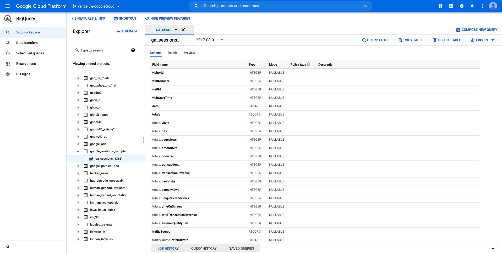

# 12.1 Cree su cuenta de Google Cloud Platform

## Objetivos

- Cree su cuenta de Google Cloud Platform
- Familiarícese con Google Cloud Platform Console
- Cree y prepare su proyecto BigQuery

## 12.1.1 ¿Por qué conectar Google BigQuery a Adobe Experience Platform para obtener los datos de los Google Analytics?

Google Cloud Platform (GCP) es un conjunto de servicios públicos de computación en la nube que ofrece Google. Google Cloud Platform incluye una serie de servicios alojados para el desarrollo de aplicaciones, almacenamiento y computación que se ejecutan en el hardware de Google.

BigQuery es uno de estos servicios y siempre se incluye con Google Analytics 360. Los datos de Google Analytics se muestrean con frecuencia cuando intentamos obtener datos directamente desde él (API, por ejemplo). Por eso Google incluye BigQuery para obtener datos sin muestrear, de modo que las marcas puedan realizar análisis avanzados utilizando SQL y beneficiarse del poder de GCP.

Los datos de Google Analytics se cargan diariamente en BigQuery mediante un mecanismo por lotes. Como tal, no tiene sentido utilizar esta integración GCP/BigQuery para casos de uso de activación y personalización en tiempo real.

Si una marca desea ofrecer casos de uso de personalización en tiempo real basados en datos de Google Analytics, puede recopilar esos datos en el sitio web con Google Tag Manager y luego transmitirlos a Adobe Experience Platform en tiempo real.

El conector de origen GCP/BigQuery debe usarse para...

- realice un seguimiento de todo el comportamiento de los clientes en el sitio web y cargue esos datos en Adobe Experience Platform para su análisis, ciencia de datos y casos de uso de personalización que no requieran activación en tiempo real.
- cargar datos históricos de Google Analytics en Adobe Experience Platform, de nuevo para casos de uso de análisis y ciencia de datos

## 12.1.2 Crear su cuenta de Google

Para obtener una cuenta de Google Cloud Platform, necesita una cuenta de Google.

## 12.1.3 Activar su cuenta de Google Cloud Platform

Ahora que tiene su cuenta de Google, puede crear un entorno de Google Cloud Platform. Para ello, vaya a [https://console.cloud.google.com/](https://console.cloud.google.com/).

En la página siguiente, acepte los Términos y condiciones.

A continuación, haga clic en **Seleccionar un proyecto**.

Haga clic en **NUEVO PROYECTO**.

Asigne un nombre al proyecto siguiendo esta convención de nomenclatura:

| Convención | Ejemplo |
| ----------------- |-------------| 
| `--demoProfileLdap---googlecloud` | delaigle-googlecloud |

Haga clic en **Crear**.

Espere hasta que la notificación en la parte superior derecha de la pantalla le indique que la creación ha finalizado. A continuación, haga clic en **Ver proyecto**.

A continuación, vaya a la barra de búsqueda en la parte superior de la pantalla y escriba **BigQuery**. Seleccione el primer resultado.

A continuación, se le redirigirá a la consola BigQuery y verá un mensaje emergente.

**Haga clic en Finalizado**.

El objetivo de este módulo es obtener los datos de los Google Analytics en Adobe Experience Platform. Para ello, necesitamos datos ficticios en un conjunto de datos de Google Analytics para empezar.

Haga clic en **Agregar datos** en el menú de la izquierda, seguido de hacer clic en **Explorar conjuntos de datos públicos**.

A continuación, verá esta ventana:

Escriba el término de búsqueda **Ejemplo de Google Analytics** en la barra de búsqueda y seleccione el primer resultado.

Verá la siguiente pantalla con una descripción del conjunto de datos. Haga clic en **VER CONJUNTO DE DATOS**.

A continuación, se le redirigirá a BigQuery, donde verá esto **bigquery-public-data** conjunto de datos en **Explorer**.

En **Explorer**, debería ver una serie de tablas. Siéntase libre de explorarlas. Vaya a `google_analytics_sample`.

Haga clic en para abrir la tabla `ga_sessions`.

Antes de continuar con el siguiente ejercicio, anote las siguientes cosas en un archivo de texto independiente en su equipo:

| Credencial | Nombre | Ejemplo |
| ----------------- |-------------| -------------|
| Proyecto Nombre | `--demoProfileLdap---googlecloud` | vangeluw-googlecloud |
| ID del proyecto | random | compuesta-task-306413 |

Puede encontrar el nombre del proyecto y el ID del proyecto haciendo clic en su **Nombre del proyecto** en la barra de menús superior:

A continuación, verá su ID de proyecto en el lado derecho:

Ahora puede pasar al Ejercicio 12.2, donde se ensuciarán las manos consultando los datos de los Google Analytics.

Paso siguiente: [12.2 Crear la primera consulta en BigQuery](./ex2.md)

[Volver al módulo 12](./customer-journey-analytics-bigquery-gcp.md)

[Volver a todos los módulos](./../../overview.md)
