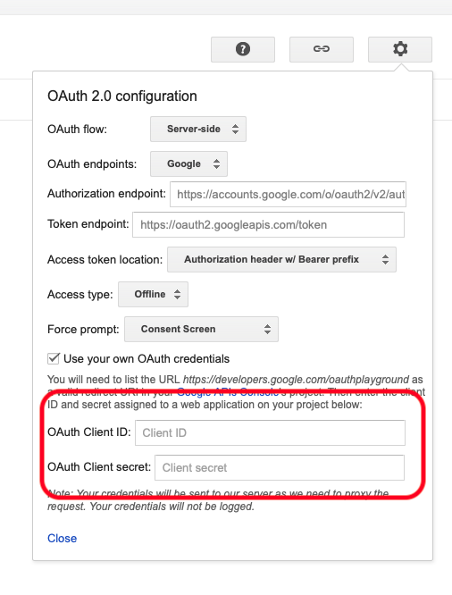

# 12.3 Conectar GCP y BigQuery a Adobe Experience Platform

## Objetivos

- Explorar la API y los servicios en Google Cloud Platform
- Familiarícese con OAuth Playground para probar las API de Google
- Cree su primera conexión BigQuery en Adobe Experience Platform

## Contexto

Adobe Experience Platform proporciona un conector dentro de **Fuentes** esto le ayudará a incorporar conjuntos de datos de BigQuery a Adobe Experience Platform. Este conector de datos se basa en la API BigQuery de Google. Por lo tanto, es importante preparar correctamente la plataforma de Google Cloud y el entorno BigQuery para recibir llamadas API de Adobe Experience Platform.

Para configurar el conector de origen BigQuery en Adobe Experience Platform, necesitará estos 4 valores:

- proyecto
- clientId
- clientSecret
- refreshToken

Hasta ahora solo tienes la primera, la **ID del proyecto**. Esta **ID del proyecto** es un ID aleatorio que Google generó cuando creó el proyecto BigQuery durante el ejercicio 12.1.

Copie el ID del proyecto en un archivo de texto separado.

| Credencial | Nombre | Ejemplo |
| ----------------- |-------------| -------------|
| ID del proyecto | random | compuesta-task-306413 |

Puede comprobar el ID del proyecto en cualquier momento haciendo clic en su **Nombre del proyecto** en la barra de menús superior:

Verá el ID del proyecto a la derecha:

En este ejercicio, aprenderá a obtener los otros 3 campos obligatorios:

- clientId
- clientSecret
- refreshToken

## API y servicios de Google Cloud 12.3.1

Para empezar, vuelva a la página de inicio de Google Cloud Platform. Para ello, simplemente haga clic en el logotipo en la esquina superior izquierda de la pantalla.

Una vez que esté en la página principal, vaya al menú de la izquierda y haga clic en **API y servicios** y haga clic en **Panel**.

Ahora verá el **API y servicios** página principal.

En esta página, puede ver el uso de las distintas conexiones de API de Google. Para configurar una conexión de API de modo que Adobe Experience Platform pueda leer desde BigQuery, debe seguir estos pasos:

- En primer lugar, debe crear una pantalla de consentimiento de OAuth para habilitar futuras autenticaciones. Las razones de seguridad de Google también requieren que un ser humano realice la primera autenticación antes de permitir el acceso mediante programación.
- En segundo lugar, necesita credenciales de API (clientId y clientSecret) que se utilizarán para la autenticación de API y el acceso a su conector BigQuery.

## Pantalla de consentimiento de OAuth 12.3.2

Empecemos por crear la pantalla de consentimiento de OAuth. En el menú de la izquierda, en la **API y servicios** página principal, haga clic en **Pantalla de consentimiento de OAuth**.

Verá esto:

Seleccione el tipo de usuario: **Externo**. A continuación, haga clic en **CREAR**.

Entonces estarás en el **Configuración de la pantalla de consentimiento de OAuth** ventana.

Lo único que hay que hacer aquí es introducir el nombre de la pantalla de consentimiento en la **Nombre de la aplicación** y seleccione **Correo electrónico de asistencia al usuario**. Para el nombre de la aplicación, utilice esta convención de nomenclatura:

| Nombre | Ejemplo |
| ----------------- |-------------| 
| `--demoProfileLdap-- - AEP BigQuery Connector` | vangeluw - Conector BigQuery de AEP |

A continuación, desplácese hacia abajo hasta que vea **Información de contacto del desarrollador** y rellene una dirección de correo electrónico.

Haga clic en **GUARDAR Y CONTINUAR**.

Entonces verás esto. Haga clic en **GUARDAR Y CONTINUAR**.

Entonces verás esto. Haga clic en **GUARDAR Y CONTINUAR**.

Entonces verás esto. Haga clic en **VOLVER AL TABLERO**.

Entonces verás esto. Haga clic en **APLICACIÓN DE PUBLICACIÓN**.

Haga clic en **CONFIRMAR**.

Entonces verás esto.

En el siguiente paso, finalizará la configuración de la API y obtendrá sus credenciales de API.

## Credenciales de la API de Google 12.3.3: Secreto del cliente e ID de cliente

En el menú de la izquierda, haga clic en **Credenciales**. Verá esto:

Haga clic en el **+ CREAR CREDENCIALES** botón.

Verá 3 opciones. Haga clic en el **ID de cliente de OAuth**:

En la siguiente pantalla, seleccione **aplicación web**.

Aparecerán varios campos nuevos. Ahora debe introducir la variable **Nombre** del ID de cliente de OAuth e introduzca también la variable **URI de redireccionamiento autorizado**.

Siga esta convención de nombres:

| Campo | Valor | Ejemplo |
| ----------------- |-------------| -------------| 
| Nombre | ldap: Conector BigQuery de AEP | vangeluw: conector Platform BigQuery |
| URI de redireccionamiento autorizado | https://developers.google.com/oauthplayground | https://developers.google.com/oauthplayground |

La variable **URI de redireccionamiento autorizado** es un campo muy importante porque lo necesitará más adelante para obtener el RefreshToken que necesita para finalizar la configuración del conector de origen BigQuery en Adobe Experience Platform.

Antes de continuar, debe empujar físicamente la variable **Entrar** después de introducir la URL para almacenar el valor en la variable **URI de redireccionamiento autorizado** campo . Si no hace clic en el botón **Entrar** , se encontrará con problemas en una fase posterior, en la **Reproducción de OAuth 2.0**.

A continuación, haga clic en **Crear**:

Ahora verá su ID de cliente y su Secreto de cliente.

Copie estos dos campos y péguelos en un archivo de texto en el escritorio. Siempre puede acceder a estas credenciales en una etapa posterior, pero es más fácil guardarlas en un archivo de texto junto al ID del proyecto BigQuery.

Como resumen de la configuración del conector de origen BigQuery en Adobe Experience Platform, ahora tiene estos valores disponibles:

| Credenciales del conector BigQuery | Valor |
| ----------------- |-------------| 
| ID del proyecto | su propio ID de proyecto (por ejemplo,: compuesta-task-306413) |
| clientid | yourclientid |
| cilentsecret | yourclientsecret |

Todavía te falta el **refreshToken**. El elemento refreshToken es un requisito por motivos de seguridad. En el mundo de las API, los tokens suelen caducar cada 24 horas. Así que **refreshToken** es necesario para actualizar el token de seguridad cada 24 horas, de modo que la configuración del conector de origen pueda seguir conectándose a Google Cloud Platform y BigQuery.

## 12.3.4 La API BigQuery y refreshToken

Existen muchas formas de obtener un refreshToken para acceder a las API de Google Cloud Platform. Una de estas opciones es, por ejemplo, el uso de Postman.
Sin embargo, Google ha creado algo más fácil de probar y reproducir con sus API, una herramienta llamada **Reproducción de OAuth 2.0**.

Para acceder a **Reproducción de OAuth 2.0**, vaya a [https://developers.google.com/oauthplayground](https://developers.google.com/oauthplayground).

Verá el **Reproducción de OAuth 2.0** página principal.

Haga clic en el **engranaje** en la parte superior derecha de la pantalla:

Asegúrese de que la configuración sea la misma que la que puede ver en la imagen anterior.

Compruebe que la configuración esté 100% segura.

Una vez que haya terminado, marque la casilla de **Usar sus propias credenciales de OAuth**

Deben aparecer dos campos y debe tener el valor para ellos.

Rellene los campos siguientes:

| Configuración de la API de Playground | Sus credenciales de API de Google |
| ----------------- |-------------| 
| ID de cliente de OAuth | su propio ID de cliente (en el archivo de texto de su escritorio) |
| Secreto de cliente de OAuth | su propio secreto de cliente (en el archivo de texto de su escritorio) |

Copie el **ID de cliente** y **Secreto del cliente** del archivo de texto creado en el escritorio.

Una vez que haya rellenado las credenciales, haga clic en **Cerrar**

En el menú de la izquierda, puede ver todas las API de Google disponibles. Buscar **API BigQuery v2**.

A continuación, seleccione el ámbito como se indica en la imagen siguiente:

Una vez que los haya seleccionado, debería ver un botón azul que dice **Autorizar API**. Haga clic en ella.

Seleccione la cuenta de Google que utilizó para configurar GCP y BigQuery.

Podría ver una gran advertencia: **Esta aplicación no está verificada**. Esto sucede porque el conector BigQuery de Platform aún no se ha revisado formalmente, por lo que Google no sabe si es una aplicación auténtica o no. Debe ignorar esta notificación.

Haga clic en **Avanzadas**.

A continuación, haga clic en **Vaya a ldap - Conector BigQuery de AEP (inseguro)**.

Se le redirigirá a la pantalla de consentimiento de OAuth que ha creado.

Si utiliza Two-Factor Authentication (2FA), introduzca el código de verificación enviado.

Google ahora le mostrará ocho **Permiso** mensajes. Haga clic en **Permitir** para las ocho solicitudes de permiso. (Se trata de un procedimiento que debe ser seguido y confirmado una vez por un ser humano real, antes de que la API permita las solicitudes programáticas)

De nuevo, **ocho ventanas emergentes diferentes** no se mostrará, debe hacer clic en **Permitir** para todos ellos.

Después de las ocho solicitudes de permiso, verá esta descripción general. Haga clic en **Permitir** para finalizar el proceso.

Después del último **Permitir**-click, se le enviará de vuelta al área de reproducción de OAuth 2.0 y verá esto:

Haga clic en **Código de autorización de Exchange para tokens**.

Después de un par de segundos, la variable **Paso 2: Intercambiar código de autorización para tokens** la vista se cerrará automáticamente y verá **Paso 3: Configuración de la solicitud en API**.

Tiene que volver a **Paso 2 Código de autorización de Exchange para tokens**, por lo que haga clic en **Paso 2 Código de autorización de Exchange para tokens** para visualizar la variable **Actualizar token**.

Ahora verá el **Actualizar token**.

Copie el **Actualizar token** y péguelo en el archivo de texto en su escritorio junto con las otras Credenciales del conector de origen BigQuery:

| Credenciales del conector de origen BigQuery | Valor |
| ----------------- |-------------| 
| ID del proyecto | su propio ID de proyecto aleatorio (por ejemplo,: apt-verano-273608) |
| clientid | yourclientid |
| cilentsecret | yourclientsecret |
| token de actualización | yourrefresh token |

A continuación, vamos a configurar el conector de origen en Adobe Experience Platform.

## Ejercicio 12.3.5: Conectar Platform con su propia tabla BigQuery

Inicie sesión en Adobe Experience Platform accediendo a esta URL: [https://experience.adobe.com/platform](https://experience.adobe.com/platform).

Después de iniciar sesión, llegará a la página principal de Adobe Experience Platform.

Antes de continuar, debe seleccionar un **entorno limitado**. El nombre del simulador de pruebas que se va a seleccionar es ``--aepSandboxId--``. Para ello, haga clic en el texto **[!UICONTROL Producción]** en la línea azul de la parte superior de la pantalla. Después de seleccionar el simulador para pruebas apropiado, verá el cambio de pantalla y ahora estará en su simulador para pruebas dedicado.

En el menú de la izquierda, vaya a Fuentes. Verá el **Fuentes** página principal. En el **Fuentes** , haga clic en **Bases de datos**. Haga clic en el **Google BigQuery** tarjeta. A continuación, haga clic en **Configuración** o **+ Configurar**.

Ahora debe crear una nueva conexión.

Haga clic en **Nueva cuenta**. Ahora necesita rellenar todos los campos siguientes, en función de la configuración que hizo en GCP y BigQuery.

Empecemos por nombrar la conexión:

Utilice esta convención de nombres:

| Credenciales del conector BigQuery | Valor | Ejemplo |
| ----------------- |-------------| -------------| 
| Nombre de la cuenta | `--demoProfileLdap-- - BigQuery Connection` | vangeluw - Conexión BigQuery |
| Descripción | `--demoProfileLdap-- - BigQuery Connection` | vangeluw - Conexión BigQuery |

Lo que debería darle algo así:

A continuación, rellene la API GCP y BigQuery **Autenticación de la cuenta**-detalles que ha almacenado en un archivo de texto en su escritorio:

| Credenciales del conector BigQuery | Valor |
| ----------------- |-------------| 
| ID del proyecto | su propio ID de proyecto aleatorio (por ejemplo,: apt-verano-273608) |
| clientId | ... |
| clientSecret | ... |
| refreshToken | ... |

Su **Autenticación de la cuenta**-details debería tener este aspecto:

Después de rellenar todos estos campos, haga clic en **Conectar a origen**.

Si su **Autenticación de la cuenta** Los detalles se completaron correctamente, ahora debería ver una confirmación visual de que la conexión funciona correctamente, viendo la **Conectado** confirmación.

Ahora que ha creado la conexión, haga clic en **Siguiente**:

Ahora verá el conjunto de datos BigQuery que creó durante el ejercicio 12.2.

¡Bien hecho! En el siguiente ejercicio, cargará datos de esa tabla y los asignará a un esquema y conjunto de datos en Adobe Experience Platform.

Paso siguiente: [12.4 Cargar datos de BigQuery en Adobe Experience Platform](./ex4.md)

[Volver al módulo 12](./customer-journey-analytics-bigquery-gcp.md)

[Volver a todos los módulos](./../../overview.md)
