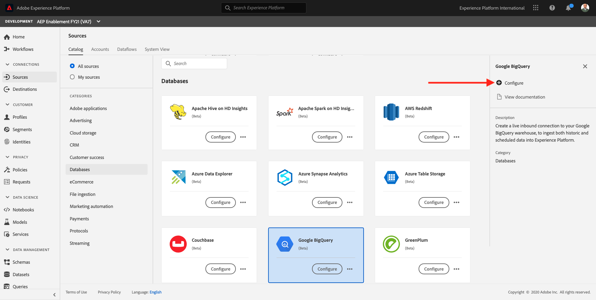

# 12.4 Cargar datos de BigQuery en Adobe Experience Platform

## Objetivos

- Asignación de datos BigQuery a un esquema XDM
- Carga de datos BigQuery en Adobe Experience Platform
- Familiarícese con la interfaz de usuario del conector de origen BigQuery

## Antes de comenzar

Después del ejercicio 12.3, debe tener esta página abierta en Adobe Experience Platform:

**Si lo tiene abierto, continúe con el ejercicio 12.4.1.**

**Si no lo tiene abierto, vaya a [Adobe Experience Platform](https://experience.adobe.com/platform/home).**

En el menú de la izquierda, vaya a Fuentes. Verá el **Fuentes** página principal. En el **Fuentes** , haga clic en **Bases de datos**.

Seleccione el **Google BigQuery** Conector de origen y haga clic en **+ Configurar**.

A continuación, verá la pantalla de selección de cuenta de Google BigQuery.

Seleccione la cuenta y haga clic en **Siguiente**.

Verá el **Añadir datos** vista.

## Selección de tabla BigQuery 12.4.1

En el **Añadir datos** seleccione el conjunto de datos BigQuery.

Ahora puede ver una vista previa de datos de ejemplo de los datos de Google Analytics en BigQuery.

Haga clic en **Siguiente**.

## 12.4.2 Asignación XDM

Ahora verá esto:

Ahora debe crear un nuevo conjunto de datos o seleccionar un conjunto de datos existente en el que cargar los datos de los Google Analytics. Para este ejercicio, ya se ha creado un conjunto de datos y un esquema. No es necesario crear un nuevo esquema o conjunto de datos.

Select **Conjunto de datos existente**. Abra el menú desplegable para seleccionar un conjunto de datos. Buscar el conjunto de datos denominado `Demo System - Event Dataset for BigQuery (Global v1.1)` y selecciónelo. Haga clic en **Siguiente**.

Desplácese hacia abajo. Ahora necesita asignar cada **Campo de origen** de Google Analytics/BigQuery a un XDM **Campo de destino**, campo por campo.

Utilice la siguiente tabla de asignación para este ejercicio.

| Campo de origen | Campo de destino |
| ----------------- |-------------| 
| **_id** | _id |
| **_id** | channel._id |
| timeStamp | timestamp |
| GA_ID | ``--aepTenantId--``.identification.core.gaid |
| customerID | ``--aepTenantId--``.identification.core.loyaltyId |
| Página | web.webPageDetails.name |
| Device | device.type |
| Explorador | environment.browserDetails.vendor |
| Canal de marketing | marketing.trackingCode |
| TrafficSource | channel.typeAtSource |
| TrafficMedium | channel.mediaType |
| TransactionID | commerce.order.payments.transactionID |
| Ecommerce_Action_Type | eventType |
| Vistas de página | web.webPageDetails.pageViews.value |
| Unique_Purchases | commerce.purchases.value |
| Product_Detail_Views | commerce.productViews.value |
| Add_To_Cart | commerce.productListAdds.value |
| Product_Removes_From_Cart | commerce.productListRemovals.value |
| Product_Checkouts | commerce.checkouts.value |

Después de copiar y pegar la asignación anterior en la interfaz de usuario de Adobe Experience Platform, compruebe si no ve ningún error debido a errores tipográficos o espacios al principio o al final.

Ahora tiene un **Asignación** como este:

Los campos de origen **GA_ID** y **customerID** se asignan a un identificador en este esquema XDM. Esto le permitirá enriquecer los datos de Google Analytics (datos de comportamiento web/aplicación) con otros conjuntos de datos, como Lealtad o Datos del centro de llamadas.

Haga clic en **Siguiente**.

## 12.4.3 Programación de la conexión y la ingesta de datos

Ahora verá el **Programación** pestaña:

En el **Programación** , puede definir una frecuencia para el proceso de ingesta de datos para esta **Asignación** y .

Como está utilizando datos de demostración en Google BigQuery que no se actualizarán, no hay necesidad real de configurar una programación en este ejercicio. Tiene que seleccionar algo y, para evitar demasiados procesos de ingesta de datos inútiles, debe establecer la frecuencia de esta manera:

- Frecuencia: **Semana**
- Intervalo: **200**

**Importante**: asegúrese de activar el **Relleno** .

Por último, pero no por ello menos importante, debe definir una **delta** campo .

La variable **delta** se utiliza para programar la conexión y cargar solo las filas nuevas que llegan al conjunto de datos BigQuery. Un campo delta suele ser siempre una columna de marca de tiempo. Por lo tanto, para futuras incorporaciones de datos programadas, solo se incorporarán las filas con una marca de tiempo nueva y más reciente.

Select **timeStamp** como campo delta.

Ahora tienes esto.

Haga clic en **Siguiente**.

## 12.4.4 Conexión de revisión e inicio

En el **Detalles de flujo de conjunto de datos** vista. debe asignar un nombre a la conexión, lo que le ayudará a encontrarla más adelante.

Utilice esta convención de nombres:

| Campo | Nombre | Ejemplo |
| ----------------- |-------------| -------------|
| Nombre de flujo de conjunto de datos | DataFlow - ldap - Interacción con sitios Web BigQuery | DataFlow - vangeluw - Interacción con sitios Web BigQuery |
| Descripción | DataFlow - ldap - Interacción con sitios Web BigQuery | DataFlow - vangeluw - Interacción con sitios Web BigQuery |

Haga clic en **Siguiente**.

Ahora puede ver una descripción detallada de su conexión. Asegúrese de que todo sea correcto antes de continuar, ya que algunos ajustes ya no se pueden cambiar posteriormente, como por ejemplo la asignación XDM.

Haga clic en **Finalizar**.

La configuración de la conexión puede tardar algún tiempo, por lo que no debe preocuparse si ve esto:

Una vez creada la conexión, verá lo siguiente:

Ya está listo para continuar con el siguiente ejercicio, en el que utilizará Customer Journey Analytics para crear visualizaciones potentes sobre los datos de Google Analytics.

Paso siguiente: [12.5 Analizar los datos de los Google Analytics mediante el Customer Journey Analytics](./ex5.md)

[Volver al módulo 12](./customer-journey-analytics-bigquery-gcp.md)

[Volver a todos los módulos](./../../overview.md)
