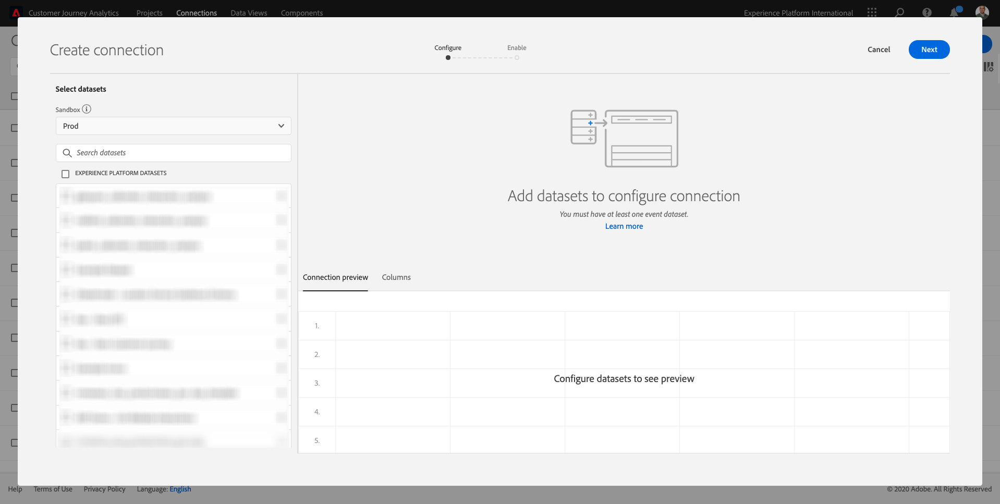
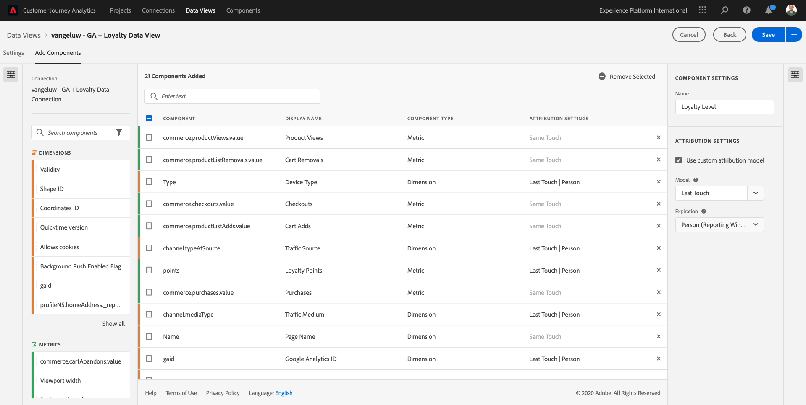
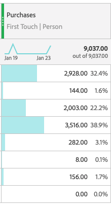
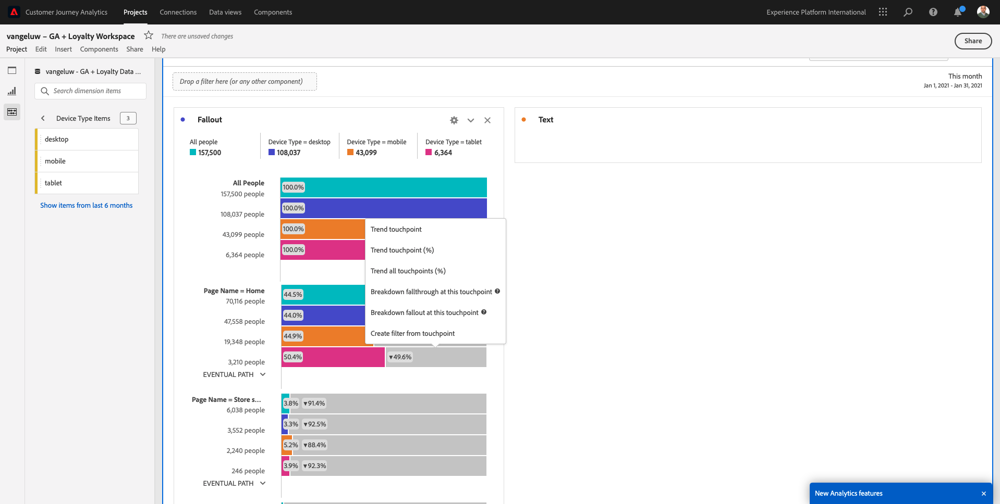
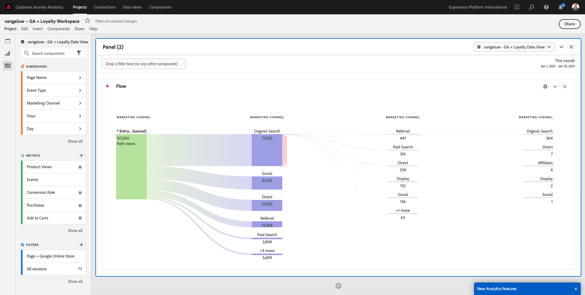

# 12.5 Analizar los datos de los Google Analytics mediante el Customer Journey Analytics

## Objetivos

- Conecte nuestro conjunto de datos BigQuery al Customer Journey Analytics (CJA)
- Conecte y únase a los Google Analytics con datos de fidelidad.
- Familiarícese con la interfaz de usuario de CJA

## 12.5.1 Crear una conexión

Vaya a [analytics.adobe.com](https://analytics.adobe.com) para acceder al Customer Journey Analytics.

En la página de inicio del Customer Journey Analytics, vaya a **Conexiones**.

Aquí puede ver las diferentes conexiones hechas entre CJA y Platform. Estas conexiones tienen el mismo objetivo que los grupos de informes de Adobe Analytics. Sin embargo, la recopilación de los datos es totalmente diferente. Todos los datos proceden de conjuntos de datos de Adobe Experience Platform.

Haga clic en **Crear nueva conexión**.

Verá el **Crear conexión** IU.

En primer lugar, debe seleccionar el simulador de pruebas correcto para utilizarlo. En el menú del simulador de pruebas, seleccione el simulador de pruebas, que debería `--aepSandboxId--`. En este ejemplo, el simulador de pruebas que se va a usar es **Habilitación de AEP para el año fiscal 21**.

Después de seleccionar el simulador para pruebas, se actualizarán los conjuntos de datos disponibles.

En el menú de la izquierda, puede ver todos los conjuntos de datos de Adobe Experience Platform disponibles. Buscar el conjunto de datos `Demo System - Event Dataset for BigQuery (Global v1.1)`. Haga clic en **+** para agregar el conjunto de datos a esta conexión.

Después de agregarlo, verá el conjunto de datos dentro de la conexión.

Ahora tiene que seleccionar la variable **ID de persona**. Asegúrese de que la variable **loyaltyId** se selecciona como ID de persona.

Ahora enriquecerá los datos de interacción del sitio web de Google Analytics con otro conjunto de datos de Adobe Experience Platform.

Buscar el conjunto de datos `Demo System - Profile Dataset for Loyalty (Global v1.1)` conjunto de datos y agréguelo a esta conexión.

Verá esto:

Para combinar ambos conjuntos de datos, debe seleccionar un **ID de persona** que contiene el mismo tipo de ID. El conjunto de datos `Demo System - Profile Dataset for Loyalty (Global v1.1)` utiliza la variable **loyaltyId** como ID de persona, que contiene el mismo tipo de ID que el `Demo System - Event Dataset for BigQuery (Global v1.1)`, que también utiliza la variable **loyaltyId** como ID de persona.

Haga clic en **Siguiente**.

Verá esto:

Aquí debe asignar un nombre a la conexión.

Utilice esta convención de nombres: `ldap - GA + Loyalty Data Connection`.

Ejemplo: `vangeluw - GA + Loyalty Data Connection`

Antes de finalizar, active también **Importe automáticamente todos los datos nuevos para todos los conjuntos de datos de esta conexión, a partir de hoy.** como en la imagen de abajo.

Esto iniciará un flujo de datos desde Adobe Experience Platform a CJA cada 60 minutos, aunque con grandes volúmenes de datos puede tardar hasta 24 horas.

También es necesario rellenar los datos históricos, por lo que debe marcar la casilla de verificación para **Importar todos los datos existentes** y seleccione **menos de 1 millón** under **Cantidad promedio de eventos diarios**.

Después de crear el **Conexión** puede tardar unas horas en que los datos estén disponibles en CJA.

Haga clic en **Guardar** y vaya al siguiente ejercicio.

A continuación, verá la conexión en la lista de conexiones disponibles.

## 12.5.2 Crear una vista de datos

Una vez finalizada la conexión, ahora puede progresar para influir en la visualización. Una diferencia entre Adobe Analytics y CJA es que CJA necesita una vista de datos para limpiar y preparar los datos antes de la visualización.

Una vista de datos es similar al concepto de grupos de informes virtuales en Adobe Analytics, donde se definen las definiciones de visitas según el contexto, el filtrado y también cómo se llaman los componentes.

Necesitará un mínimo de una vista de datos por conexión. Sin embargo, en algunos casos de uso, es bueno tener varias vistas de datos para la misma conexión, con el objetivo de proporcionar diferentes perspectivas a diferentes equipos.

Si desea que su empresa se oriente por los datos, debe adaptar la forma en que se ven los datos en cada equipo. Algunos ejemplos:

- Métricas de experiencia de usuario solo para el equipo Diseño de experiencia de usuario
- Utilice los mismos nombres para KPI y métricas para Google Analytics que para Customer Journey Analytics, de modo que el equipo de análisis digital solo hable un idioma.
- vista de datos filtrada para mostrar, por ejemplo, datos para 1 solo mercado, 1 marca o solo para dispositivos móviles.

En el **Conexiones** , marque la casilla de verificación situada delante de la conexión que acaba de crear.

Ahora haga clic en **Crear vista de datos**.

Se le redirigirá al **Crear vista de datos** flujo de trabajo.

Ahora puede configurar las definiciones básicas de la vista de datos. Elementos como Zona horaria, Tiempo de espera de sesión o el filtrado de la vista de datos (la parte de segmentación similar a Grupos de informes virtuales en Adobe Analytics).

La variable **Conexión** el que creó en el ejercicio anterior ya está seleccionado. El nombre de la conexión `ldap - GA + Loyalty Data Connection`.

A continuación, asigne un nombre a la vista de datos siguiendo esta convención de nomenclatura: `ldap - GA + Loyalty Data View`.

Introduzca el mismo valor para la descripción: `ldap - GA + Loyalty Data View`.

Antes de realizar cualquier análisis o visualización, debemos crear una vista de datos con todos los campos, dimensiones y métricas y su configuración de atribución.

| Campo | Convención de nomenclatura | Ejemplo |
| ----------------- |-------------|-------------|  
| Asignar nombre a una conexión | ldap: GA + Vista de datos de fidelidad | vangeluw: GA + Vista de datos de fidelidad |
| Descripción | ldap: GA + Vista de datos de fidelidad | vangeluw: GA + Vista de datos de fidelidad |

Haga clic en **Guardar y continuar**.

Ahora puede añadir componentes a la vista de datos. Como puede ver, algunas métricas y dimensiones se añaden automáticamente.

Agregue los siguientes componentes a la vista de datos:

| Nombre del componente | Tipo de componente | Ruta de acceso del componente |
| -----------------|-----------------|-----------------|
| nivel | Dimensión | _experienceplatform.loyaltyDetails.level |
| points | Métrica | _experienceplatform.loyaltyDetails.points |
| commerce.checkouts.value | Métrica | commerce.checkouts.value |
| commerce.productListRemovals.value | Métrica | commerce.productListRemovals.value |
| commerce.productListAdds | Métrica | commerce.productListAdds |
| commerce.productViews.value | Métrica | commerce.productViews.value |
| commerce.purchases.value | Métrica | commerce.purchases.value |
| web.webPageDetails.pageViews | Métrica | web.webPageDetails.pageViews |
| El ID de transacción | Dimensión | commerce.order.payments.transactionID |
| channel.mediaType | Dimensión | channel.mediaType |
| channel.typeAtSource | Dimensión | channel.typeAtSource |
| Código de seguimiento | Dimensión | marketing.trackingCode |
| gaid | Dimensión | _experienceplatform.identification.core.gaid |
| web.webPageDetails.name | Dimensión | web.webPageDetails.name |
| Tipo de evento | Dimensión | eventType |
| Proveedor | Dimensión | environment.browserDetails.vendor |
| Identificador | Dimensión | _id |
| Marca de tiempo | Dimensión | timestamp |
| Tipo | Dimensión | device.type |
| loyaltyId | Dimensión | _experienceplatform.identification.core.loyaltyId |

Entonces tendrá esto:

A continuación, debe cambiar el nombre descriptivo de algunas de las métricas y dimensiones anteriores para que pueda utilizarlo fácilmente al crear el análisis. Para ello, seleccione la métrica o la dimensión y actualice la variable **Nombre** como se indica en la imagen siguiente.

| Nombre original del componente | Nombre para mostrar |
| -----------------|-----------------|
| nivel | Nivel de fidelidad |
| points | Puntos de fidelidad |
| commerce.checkouts.value | Cierres de compra |
| commerce.productListRemovals.value | Eliminaciones del carro de compras |
| commerce.productListAdds | Adiciones al carro de compras |
| commerce.productViews.value | Vistas del producto |
| commerce.purchases.value | Compras |
| web.webPageDetails.pageViews | Page Views |
| channel.mediaType | Medio de tráfico |
| channel.typeAtSource | Traffic Source |
| Código de seguimiento | Canal de marketing |
| gaid | ID de Google Analytics |
| Nombre | Título de página |
| Proveedor | Explorador |
| Tipo | Device Type |
| loyaltyId | ID de fidelidad |

Entonces tendrá algo así:

A continuación, debe realizar algunos cambios en el contexto de persona y sesión de algunos de estos componentes cambiando el **Configuración de atribución**.

Cambie el **Configuración de atribución** para los componentes siguientes:

| Componente |
| -----------------|
| Fuente de tráfico |
| Canal de marketing |
| Explorador |
| Medio de tráfico |
| Tipo de dispositivo |
| ID de Google Analytics |
| ID de fidelidad |
| Nivel de fidelidad |
| Puntos de fidelidad |

Para ello, seleccione el componente, haga clic en **Uso del modelo de atribución personalizado** y establezca la variable **Modelo** a **Último toque** y **Caducidad** a **Persona (ventana del Sistema de informes)**. Repita este proceso para todos los componentes mencionados anteriormente.

Después de realizar los cambios en la configuración de atribución para todos los componentes mencionados anteriormente, debe tener esta vista:

La vista de datos ya está configurada. Haga clic en **Guardar**.

Ya está listo para analizar los datos de los Google Analytics en Adobe Analytics Analysis Workspace. Pasemos al siguiente ejercicio.

## 12.5.3 Crear su proyecto

En el Customer Journey Analytics, vaya a **Proyectos**.

Verá esto:

Crear un proyecto haciendo clic en **Crear nuevo proyecto**.

Ahora tiene un proyecto en blanco:

Primero, guarde el proyecto y asígnele un nombre. Puede utilizar el siguiente comando para guardar:

| SO | Cortocircuito |
| ----------------- |-------------| 
| Windows | Control + S |
| Mac | Comando + S |

Verá esta ventana emergente:

Utilice esta convención de nombres:

| Nombre | Descripción |
| ----------------- |-------------| 
| ldap - GA + espacio de trabajo de fidelidad | ldap - GA + espacio de trabajo de fidelidad |

A continuación, haga clic en **Guardar proyecto**.

A continuación, asegúrese de seleccionar la vista de datos correcta en la esquina superior derecha de la pantalla. Esta es la vista de datos que creó en el ejercicio anterior, con la convención de nombres `ldap - GA + Loyalty Data View`. En este ejemplo, la vista de datos que se va a seleccionar es `ldap - GA + Loyalty Data View`.

### 12.5.3.1 Tablas improvisadas

Las tablas improvisadas funcionan, más o menos, como tablas dinámicas dentro de Excel. Elija algo de la barra izquierda, arrástrelo y suéltelo en la forma libre y obtendrá un informe de tabla.

Las tablas improvisadas son casi ilimitadas. Puede hacer (casi) cualquier cosa y esto aporta tanto valor en comparación con los Google Analytics (ya que esta herramienta tiene algunas limitaciones de análisis). Esta es una de las razones para cargar los datos de los Google Analytics en otra herramienta de análisis.

Veamos dos ejemplos en los que necesita usar SQL, BigQuery y algo de tiempo para responder preguntas simples que no son posibles dentro de la interfaz de usuario de Google Analytics o Google Data Studio:

- ¿Cuántas personas llegan al cierre de compra desde el explorador Safari dividido por canal de marketing? Compruebe que el navegador Safari está filtrando la métrica de cierre de compra. Simplemente arrastramos y soltamos la variable Explorador = Safari en la parte superior de la columna de cierre de compra.

- Como analista, puedo ver que el Canal de marketing social tiene bajas conversiones. Estoy usando la atribución de último toque como predeterminada, pero ¿qué hay de Primer toque? Si pasa el ratón sobre cualquier métrica, se muestra la configuración de la métrica. Aquí puedo seleccionar el modelo de atribución que quiero. Puede realizar Attribution en GA (no en el estudio de datos) como actividad independiente, pero no puede tener otras métricas o dimensiones no relacionadas con el análisis de atribución dentro de la misma tabla.

Respondamos a estas preguntas y algunas más con Analysis Workspace en CJA.

En primer lugar, seleccione el intervalo de fechas correcto (**Últimas 53 semanas completas**) en el lado derecho del panel.

A continuación, haga clic en **Aplicar** para aplicar el intervalo de fechas. Recuerde este paso para los ejercicios siguientes.

>[!NOTE]
>
>Si acaba de crear la variable **Conexión de datos** y **Vista de datos** es posible que tenga que esperar un par de horas. CJA necesita algo de tiempo para rellenar los datos históricos cuando hay una gran cantidad de registros de datos.

Arrastre y suelte algunas dimensiones y métricas para analizar los canales de marketing. Utilice primero la dimensión **Canal de marketing** y arrástrelo y suéltelo en el lienzo de la **Tabla improvisada**. (Haga clic en **Mostrar todo** en caso de que no vea la métrica inmediatamente en el menú Métricas)

Verá esto:

A continuación, debe agregar la métrica a la tabla improvisada. Debe agregar estas métricas: **People**, **Sesiones**, **Vistas del producto**, **Cierres de compra**, **Compras**, **Tasa de conversión** (Métrica calculada).

Para poder hacerlo, debe crear la Métrica calculada **Tasa de conversión**. Para ello, haga clic en el botón **+** junto a Métricas:

Como nombre de la métrica calculada, utilice **Tasa de conversión**. A continuación, arrastre las métricas **purchase** y **Sesiones** en el lienzo. Establezca **Formato** a **Porcentaje** y **Lugares decimales** a **2**. Finalmente, haga clic en **Guardar**.

A continuación, para utilizar todas estas métricas en la variable **Tabla improvisada**, arrástrelos y suéltelos uno a uno en la **Tabla improvisada**. Consulte el ejemplo siguiente.

Terminarás con una tabla como esta:

Como se ha mencionado anteriormente, **Tablas improvisadas** le da la libertad que necesita para realizar análisis de buceo profundo. Por ejemplo, puede elegir cualquier otro Dimension para desglosar una métrica específica dentro de la tabla.

Por ejemplo, vaya a dimensiones y busque y seleccione la **Navegador** variable.

A continuación, verá una descripción general de los valores disponibles para este Dimension.

Elija el Dimension **Safari** y arrástrela y suéltela sobre una métrica, por ejemplo **Cierres de compra**. Verá esto:

Haciendo esto, acabas de responder a una pregunta potencial que tenías: ¿Cuántas personas llegan a la página de cierre de compra utilizando Safari, dividido por Canal de marketing?

Respondamos ahora a la pregunta de atribución.

Busque la **Compra** en la tabla.

Pase el ratón sobre la métrica y pase un ratón por encima de una **Configuración** se mostrará. Haga clic en él.

Aparecerá un menú contextual. Marque la casilla de verificación para **modelo de atribución no predeterminado**.

En la ventana emergente que verá, puede cambiar fácilmente los modelos de atribución y la ventana retrospectiva (que es bastante compleja de lograr con SQL).

Select **Primer toque** como modelo de atribución.

Choose **Persona** para la ventana de búsqueda.

Ahora haga clic en **Aplicar**.

Ahora puede ver que el modelo de atribución para esa métrica en particular es ahora Primer toque.

Puede realizar el máximo desglose posible, sin límites de tipos de variables, segmentos, dimensiones o intervalos de fechas.

Algo aún más especial es la capacidad de unirse a cualquier conjunto de datos de Adobe Experience Platform para enriquecer los datos de comportamiento digital de los Google Analytics. Por ejemplo, sin conexión, centro de llamadas, lealtad o datos CRM.

Para mostrar esa funcionalidad, configuremos su primer desglose que combine datos sin conexión con datos en línea. Seleccionar la dimensión **Nivel de fidelidad** y arrástrelo y suéltelo en cualquier **Canal de marketing**, por ejemplo, **Búsqueda orgánica**:

A continuación, analicemos cuál **Tipo de dispositivo** lo utilizan los clientes que llegaron al sitio mediante **Búsqueda orgánica** con un **Nivel de fidelidad** que es **Bronce**. Tome el Dimension **Tipo de dispositivo** y arrástrela y suéltela sobre **Bronce**. Verá esto:

Puede ver que para el primer desglose, se utiliza el Nivel de lealtad. Esta dimensión proviene de un conjunto de datos y un esquema diferente al que utilizó para el conector BigQuery. ID de persona **loyaltyID** (Sistema de demostración - Esquema de eventos para BigQuery (Global v1.1)) y **loyaltyID** (Sistema de demostración - Esquema de perfil para lealtad (Global v1.1)) coincide entre sí. Por lo tanto, puede combinar los eventos de experiencia de los Google Analytics con los datos de perfil del esquema de lealtad.

Podemos seguir dividiendo las filas con segmentos o intervalos de fechas específicos (quizá para reflejar campañas de TV particulares) para hacer preguntas al Customer Journey Analytics y obtener las respuestas sobre la marcha.

Lograr el mismo resultado final con SQL y luego una herramienta de visualización de terceros es un gran desafío. Especialmente cuando estás haciendo preguntas y tratando de obtener las respuestas sobre la marcha. Customer Journey Analytics no tiene este desafío y permite a los analistas de datos consultar los datos de forma flexible y en tiempo real.

## 12.5.3.2 Análisis de canales o visitas en el orden previsto

Los embudos son un mecanismo bueno para comprender los pasos principales de un recorrido de cliente. Estos pasos también pueden proceder de interacciones sin conexión (por ejemplo, desde el centro de llamadas) y, a continuación, combinarlas con puntos de contacto digitales en el mismo canal.

Customer Journey Analytics le permite hacer eso y mucho más. Si recuerda el Módulo 13, podemos hacer clic con el botón derecho y hacer cosas como:

- Analizar a dónde se dirigen los usuarios después de un paso de abandonos
- Crear un segmento desde cualquier punto del canal
- Consulte Tendencia en cualquier etapa de una visualización de gráfico de líneas

Veamos otra cosa que puedes hacer: ¿Cómo se compara mi canal de Recorrido de clientes de este mes con el mes anterior? ¿Qué sucede con los dispositivos móviles y de escritorio?

A continuación, creará dos paneles:

- Análisis de canal (enero)
- Análisis de canal (febrero)

Verá que comparamos un canal en diferentes periodos de tiempo (enero y febrero) divididos por tipo de dispositivo.

Este tipo de análisis no es posible dentro de la interfaz de usuario de Google Analytics o es muy limitado. Por lo tanto, CJA agrega de nuevo mucho valor a los datos capturados por los Google Analytics.

Para crear la primera visualización de abandonos. Cierre el panel actual para empezar con uno nuevo.

Observe el lado derecho del panel y haga clic en la flecha para cerrarlo.

A continuación, haga clic en **+** para crear un panel nuevo.

Ahora, seleccione la opción **Visita en el orden previsto** Visualización.

Como analista, imagine que desea comprender lo que está pasando con su embudo de comercio electrónico principal: Inicio > Búsqueda interna > Detalles del producto > Cierre de compra > Compra.

Empecemos agregando algunos pasos nuevos al canal. Para ello, abra el **Nombre de la página** dimensión.

A continuación, verá todas las páginas disponibles que se han visitado.

Arrastrar y soltar **Página principal** al primer paso.

Como segundo paso, utilice el **Almacenar resultados de búsqueda**

Ahora debe agregar algunas acciones de comercio electrónico. En los Dimension, busque el Dimension **Tipo de evento** dimensión. Haga clic en para abrir la dimensión .

Select **Product_Detail_Views** y arrástrela y suéltela en el paso siguiente.

Select **Product_Checkouts** y arrástrela y suéltela en el paso siguiente.

Cambie el tamaño de la visualización de abandonos.

La visualización de abandonos ya está lista.

Para empezar a analizar y documentar las perspectivas, siempre es una buena idea **Texto** visualización. Para agregar un **Texto** visualización, haga clic en el **Gráfico** en el menú de la izquierda para ver todas las visualizaciones disponibles. A continuación, arrastre y suelte la variable **Texto** en el lienzo. Cambie el tamaño y muévalo para que parezca la imagen de abajo.

Y, de nuevo, cambie el tamaño para que se ajuste al tablero:

Las visualizaciones de visitas en el orden previsto también permiten desgloses. Utilice la variable **Tipo de dispositivo** abriéndola y arrastrando y soltando algunos de los valores uno por uno en la visualización:

Al final, tendrá una visualización más avanzada:

Customer Journey Analytics le permite hacer eso y mucho más. Al hacer clic con el botón derecho en cualquier lugar de la visita en el orden previsto, puede...

- Analizar hacia dónde se dirigen los usuarios desde un paso de abandonos
- Crear un segmento desde cualquier punto del canal
- Realizar la tendencia de cualquier paso en una visualización de Línea
- Compare cualquier canal con diferentes periodos de tiempo de forma visual.

Por ejemplo, haga clic con el botón derecho en cualquier paso de la visita en el orden previsto para ver algunas de estas opciones de análisis.

## 12.5.3.3 Análisis y visualización de flujo

Si desea realizar análisis de flujo avanzados mediante Google Analytics, debe utilizar SQL para extraer los datos y, a continuación, utilizar una solución de terceros para la parte de visualización. Customer Journey Analytics ayudará con eso.

En este paso, debe configurar un análisis de flujo para responder a esta pregunta: ¿Cuáles son los principales canales de contribución antes de una página de aterrizaje específica?  Con dos arrastrar y soltar y un clic, como analista, puede descubrir el flujo del usuario hacia la página de aterrizaje con los dos últimos toques de canales de marketing.

Otras preguntas que el Customer Journey Analytics puede ayudarle a responder:

- ¿Cuál es la combinación principal de canales antes de una página de aterrizaje específica?
- ¿Qué hace que un usuario salga de la sesión cuando llega al Product_Checkout? ¿Dónde están los pasos anteriores?

Comencemos de nuevo con un panel en blanco para responder a estas preguntas. Cierre el panel actual y haga clic en **+**.

Ahora, seleccione la opción **Flujo** visualización.

Ahora vamos a configurar un análisis de flujo de canal de marketing de varias rutas. Arrastre y suelte la **Canal de marketing** en la dimensión **Dimension de entrada** .

Ahora puede ver las primeras rutas de entrada:

Haga clic en la primera ruta para explorar en profundidad.

Ahora puede ver la siguiente ruta (Canal de marketing).

Hagamos un tercer desglose. Haga clic en la primera opción dentro de la nueva ruta, **Referencia**.

Ahora debería ver la visualización de la siguiente manera:

Complicemos las cosas. Imagine que desea analizar la página de aterrizaje después de dos rutas de marketing? Para ello, puede utilizar una dimensión secundaria para cambiar la última ruta. Busque la **Nombre de la página** y arrástrela y suéltela de esta manera:

Ahora verá esto:

Hagamos otro análisis de flujo. Esta vez analizará qué ha pasado después de un punto de salida específico. Otras soluciones de Analytics requieren el uso de SQL/ETL y, de nuevo, de una herramienta de visualización de terceros para lograr lo mismo.

Traer un nuevo **Visualización de flujo** al panel.

Entonces tendrá esto:

Buscar el Dimension **Tipo de evento** y arrástrela a la **Dimensión de salida** .

Ahora puede ver cuál **Tipo de evento**-paths llevó a los clientes a la salida.

Investiguemos qué ocurrió antes de la salida de la acción de cierre de compra. Haga clic en el **Product_Checkouts** ruta:

Aparecerá una nueva ruta de acción con algunos datos que no son reveladores.

¡Analicemos más! Buscar en el Dimension **Nombre de la página** y arrástrela a la nueva ruta generada.

Ahora ha realizado un análisis de flujo avanzado en minutos. Puede hacer clic en las diferentes rutas para ver cómo se conectan desde la salida a los pasos anteriores.

Ahora dispone de un potente kit para analizar canales y explorar rutas de comportamiento de los clientes en distintos puntos de contacto digitales, pero también sin conexión.

No olvide guardar los cambios.

## 12.5.4 Compartir el proyecto

>[!IMPORTANT]
>
>El siguiente contenido está diseñado como para su información personal: **NOT** tiene que compartir el proyecto con cualquier otra persona.

FYI - Puede compartir este proyecto con compañeros para colaborar o analizar preguntas comerciales juntos.

Paso siguiente: [Resumen y beneficios](./summary.md)

[Volver al módulo 12](./customer-journey-analytics-bigquery-gcp.md)

[Volver a todos los módulos](./../../overview.md)
