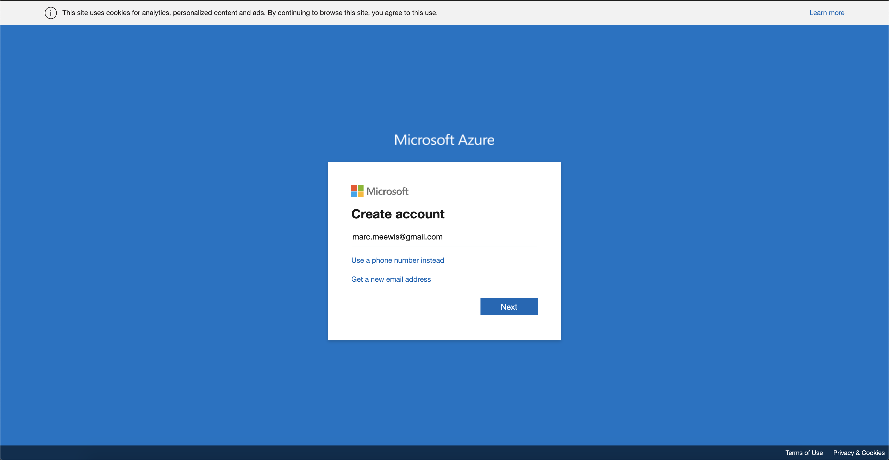

# 13.0 Configurar su entorno

## 13.0.1 Crear una suscripción de Azure

>[!NOTE]
>
>Si ya tiene una suscripción de Azure, puede omitir este paso. Por favor, continúe con el ejercicio 13.0.2 en ese caso.

Vaya a [https://portal.azure.com](https://portal.azure.com) e inicie sesión con su cuenta de Azure. Si no tiene uno, use su dirección de correo electrónico personal para crear su cuenta de Azure.



Tras iniciar sesión correctamente, verá la siguiente pantalla:


Haga clic en el menú de la izquierda y seleccione **Todos los recursos**, aparecerá la pantalla de suscripción de Azure si aún no está suscrito. En ese caso, seleccione **Comience con una prueba gratuita de Azure**.


Rellene el formulario de suscripción de Azure, proporcione su teléfono móvil y tarjeta de crédito para la activación (tendrá un nivel gratuito durante 30 días y no se le cobrará, a menos que actualice):


Cuando haya terminado el proceso de suscripción, ya estará listo:


## 13.0.2 Instalar Visual Code Studio

Utilizará Microsoft Visual Code Studio para administrar su proyecto de Azure. Puede descargarlo a través de [este vínculo](https://code.visualstudio.com/download). Siga las instrucciones de instalación de su sistema operativo específico en ese mismo sitio web.

## 13.0.3 Instalar extensiones de código visual

Instalación de las funciones de Azure para el código de Visual Studio desde [https://marketplace.visualstudio.com/items?itemName=ms-azuretools.vscode-azurefunctions](https://marketplace.visualstudio.com/items?itemName=ms-azuretools.vscode-azurefunctions). Haga clic en el botón de instalación:


Instalación de la cuenta y el inicio de sesión de Azure para el código de Visual Studio desde [https://marketplace.visualstudio.com/items?itemName=ms-vscode.azure-account](https://marketplace.visualstudio.com/items?itemName=ms-vscode.azure-account). Haga clic en el botón de instalación:


## 13.0.4 Instalar node.js

>[!NOTE]
>
>Si ya tiene instalado node.js, puede omitir este paso. Por favor, continúe con el ejercicio 13.0.5 en ese caso.

### macOS

Asegúrese de que [Homebrew](https://brew.sh/) instalado primero. Siga las instrucciones [here](https://brew.sh/).


Una vez que haya instalado Homebrew, ejecute este comando:

```javascript
brew install node
```

### Windows

Descargue el [Windows Installer](https://nodejs.org/en/#home-downloadhead) directamente desde el [nodejs.org](https://nodejs.org/en/) sitio web.

## 13.0.5 Verificar la versión de node.js

Para este módulo, debe tener instalada la versión 12 de node.js . Cualquier otra versión de node.js puede causar problemas con el ejercicio 13.5.

Antes de continuar, compruebe su versión de node.js ahora.

Ejecute este comando para verificar su versión de node.js:

```javascript
node -v
```

Si su versión es inferior o superior a 12, debe actualizar o actualizar.

### Actualización/actualización de la versión de node.js en macOS

Asegúrese de que tiene el paquete **n** instalado.

Para instalar el paquete **n**, ejecute este comando:

```javascript
sudo npm install -g n
```

Si su versión es anterior o anterior a la versión 12, ejecute este comando para actualizar o bajar de categoría:

```javascript
sudo n 12.6.0
```

### Actualizar/Desactualizar la versión de node.js en Windows

Desinstale node.js de Windows > Panel de control de Campaign > Agregar o quitar programas.

Instalación de la versión requerida desde el [nodejs.org](https://nodejs.org/en/) sitio web.

## 13.0.6 Instale el paquete NPM: solicitud

Debe instalar el paquete **solicitud** como parte de la configuración de node.js.

Para instalar el paquete **solicitud**, ejecute este comando:

```javascript
npm install request
```


Paso siguiente: [13.1 Configurar el entorno de Microsoft Azure EventHub](./ex1.md)

[Volver al módulo 13](./segment-activation-microsoft-azure-eventhub.md)

[Volver a todos los módulos](./../../overview.md)
