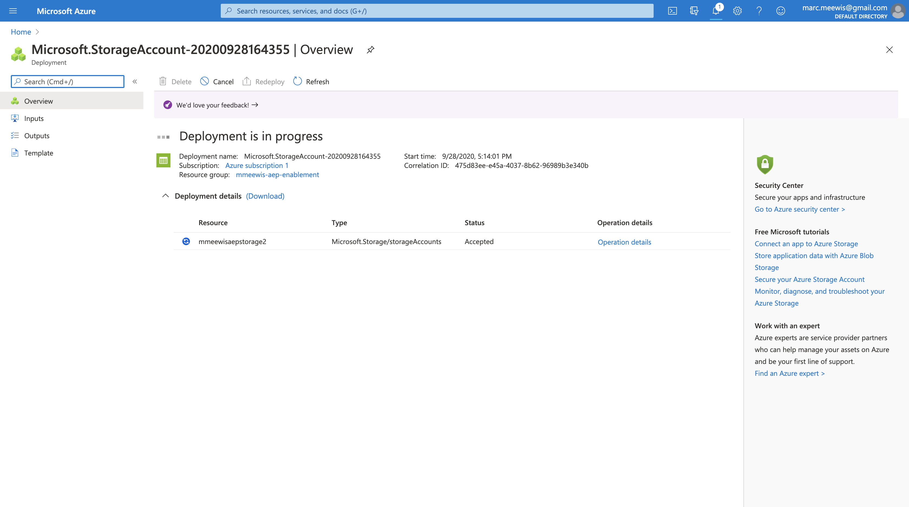

# 13.1 Configurar el entorno de Microsoft Azure EventHub

Azure Event Hubs es un servicio de suscripción de publicación altamente escalable que puede ingerir millones de eventos por segundo y transmitirlos a varias aplicaciones. Esto le permite procesar y analizar las cantidades masivas de datos que producen sus aplicaciones y dispositivos conectados.

## 13.1.1 ¿Qué son los centros de eventos de Azure?

Los centros de eventos de Azure son una plataforma de transmisión de datos y un servicio de ingesta de eventos. Puede recibir y procesar millones de eventos por segundo. Los datos enviados a un centro de eventos se pueden transformar y almacenar utilizando cualquier proveedor de análisis en tiempo real o adaptadores de almacenamiento/lotes.

Los centros de eventos representan la variable **puerta delantera** para una canalización de eventos, denominada a menudo ingestor de eventos en arquitecturas de soluciones. Un ingestor de eventos es un componente o servicio que se encuentra entre editores de eventos (como Adobe Experience Platform RTCDP) y consumidores de eventos para desvincular la producción de un flujo de eventos del consumo de esos eventos. Los centros de eventos proporcionan una plataforma de transmisión unificada con búfer de retención de tiempo, lo que desvincula a los productores de eventos de los consumidores de eventos.

## 13.1.2 Crear un espacio de nombres de Hubs de eventos

Vaya a [https://portal.azure.com/#home](https://portal.azure.com/#home) y seleccione **Crear un recurso**.

En la pantalla del recurso, introduzca **Evento** en la barra de búsqueda y seleccione **Centros de eventos** en el menú desplegable:

Haga clic en **Crear**:

Si es la primera vez que crea un recurso en Azure, deberá crear un nuevo **Grupo de recursos**. Si ya tiene un grupo de recursos, puede seleccionarlo (o crear uno nuevo).

Select **Crear nuevo**, asigne un nombre al grupo `--demoProfileLdap---aep-enablement`.

Complete la prueba de los campos como se indica:

- Espacio de nombres : Defina su área de nombres, debe ser única, utilice el siguiente patrón `--demoProfileLdap---aep-enablement`
- Ubicación: **Europa Occidental** hace referencia al centro de datos de Azure en Ámsterdam
- Nivel de precios: **Básico**
- Unidades de rendimiento: **1**

Haga clic en **Revisar + crear**.

Haga clic en **Crear**.

La implementación de su grupo de recursos puede tardar entre 1 y 2 minutos, cuando se realice correctamente, verá la siguiente pantalla:

## 13.1.3 Configurar el centro de eventos en Azure

Vaya a [https://portal.azure.com/#home](https://portal.azure.com/#home) y seleccione **Todos los recursos**.

En la lista de recursos, seleccione su `--demoProfileLdap---aep-enablement` namespace:

En `--demoProfileLdap---aep-enablement` pantalla de detalles, seleccione **Centros de eventos**:

Haga clic en **+ Centro de eventos**.

Uso `--demoProfileLdap---aep-enablement-event-hub` como nombre y haga clic en **Crear**.

Haga clic en **Centros de eventos** en el espacio de nombres del centro de eventos. Ahora debería ver su **Centro de eventos** en la lista. Si ese es el caso, puede pasar al siguiente ejercicio.

## 13.1.4 Configurar su cuenta de almacenamiento de Azure

Para depurar la función de Azure Event Hub en ejercicios posteriores, debe proporcionar una cuenta de almacenamiento de Azure como parte de la configuración del proyecto de código de Visual Studio. Ahora creará esa cuenta de almacenamiento de Azure.

Vaya a [https://portal.azure.com/#home](https://portal.azure.com/#home) y seleccione **Crear un recurso**.

Entrar **almacenamiento** en la búsqueda y seleccione **Cuenta de almacenamiento** de la lista.

Seleccione **Crear**.

Especifique la **Grupo de recursos** (creado al principio de este ejercicio), utilice `--demoProfileLdap--aepstorage` como nombre de cuenta de almacenamiento y seleccione **Almacenamiento redundante local (LRS)** y haga clic en **Revisar + crear**.

Haga clic en **Crear**.

La creación de su cuenta de almacenamiento tardará un par de segundos:

Cuando termine, la pantalla mostrará la variable **Ir al recurso** botón.

Haga clic en **Microsoft Azure**.

Su cuenta de almacenamiento ahora está visible en **Recursos recientes**.

Paso siguiente: [13.2 Configurar el destino del centro de eventos de Azure en Adobe Experience Platform](./ex2.md)

[Volver al módulo 13](./segment-activation-microsoft-azure-eventhub.md)

[Volver a todos los módulos](./../../overview.md)
