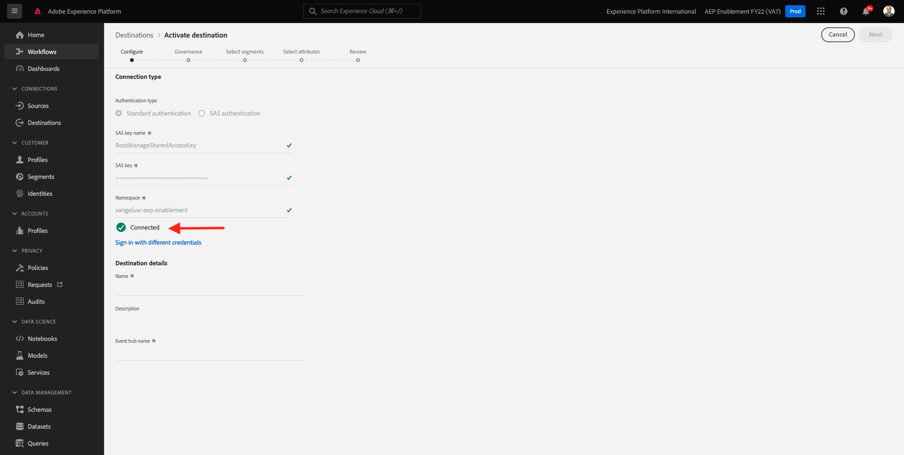

# 13.2 Configurar el destino del centro de eventos de Azure en Adobe Experience Platform

## 13.2.1 Identificar los parámetros de conexión de Azure necesarios

Para definir un destino de centro de eventos en Adobe Experience Platform, necesita su:

- Área de nombres de los centros de eventos
- Centro de eventos
- Nombre de clave de Azure SAS
- Clave de Azure SAS

El centro de eventos y el espacio de nombres de EventHub se han definido en el ejercicio anterior: [Ejercicio 1: Centro de eventos de configuración en Azure](./ex1.md)

### Espacio de nombres de los centros de eventos

Para buscar la información anterior en Azure Portal, vaya a [https://portal.azure.com/#home](https://portal.azure.com/#home). Asegúrese de que está utilizando la cuenta de Azure correcta.

Select **Todos los recursos** en Azure Portal:

### Centro de eventos

Buscar un recurso con tipo de recurso **Espacio de nombres de los centros de eventos**, si ha seguido las convenciones de nomenclatura utilizadas en el ejercicio anterior, el área de nombres de los centros de eventos será `--demoProfileLdap---aep-enablement`. Tomen nota de ello, lo necesitarán en el próximo ejercicio.

Haga clic en el nombre del área de nombres de los centros de eventos para obtener los detalles:

Select **Centros de eventos** para obtener una lista de centros de eventos definidos en el espacio de nombres de centros de eventos , si sigue las convenciones de nomenclatura utilizadas en el ejercicio anterior, encontrará un centro de eventos denominado `--demoProfileLdap---aep-enablement-event-hub`. Tomen nota de ello, lo necesitarán en el próximo ejercicio.

### Nombre de clave SAS

Select **Políticas de acceso compartido** para su **Espacio de nombres de los centros de eventos**

Verá una lista de directivas de acceso compartido. La clave SAS que estamos buscando es **RootManageSharedAccessKey**. Este es el nombre de la clave SAS. Anote.

### Valor clave de SAS

Haga clic en el **RootManageSharedAccessKey** para obtener el valor de clave SAS. Y presione la tecla **Copiar al portapapeles** para copiar el **Clave principal**:

### Resumen de valores de destino

En este punto, debería haber identificado todos los valores necesarios para definir el destino de Azure Event Hub en Adobe Experience Platform Real-time CDP.

| Nombre de atributo de destino | Valor de atributo de destino | Valor de ejemplo |
|---|---|---|
| sasKeyName | Nombre de clave SAS | RootManageSharedAccessKey |
| sasKey | Valor clave de SAS | srREx9ShJG1Rv7f/... |
| namespace | Espacio de nombres de los centros de eventos | `--demoProfileLdap---aep-enablement` |
| eventHubName | Centro de eventos | `--demoProfileLdap---aep-enablement-event-hub` |

## 13.2.2 Crear destino de centro de eventos de Azure en Adobe Experience Platform

Inicie sesión en Adobe Experience Platform accediendo a esta URL: [https://experience.adobe.com/platform](https://experience.adobe.com/platform).

Después de iniciar sesión, llegará a la página principal de Adobe Experience Platform.

Antes de continuar, debe seleccionar un **entorno limitado**. El nombre del simulador de pruebas que se va a seleccionar es ``--aepSandboxId--``. Para ello, haga clic en el texto **[!UICONTROL Producción]** en la línea azul de la parte superior de la pantalla. Después de seleccionar el simulador para pruebas apropiado, verá el cambio de pantalla y ahora estará en su simulador para pruebas dedicado.

Vaya a **Destinos** y vaya a **Catálogo**.

Select **Almacenamiento en la nube** y vaya a **Centros de eventos de Azure** y haga clic en **Configuración** o **Configurar**:

Complete los valores de destino que ha recopilado en el ejercicio anterior. A continuación, haga clic en **Conectarse al destino**.

Si sus credenciales eran correctas, verá una confirmación: **Conectado**.

Ahora debe introducir el nombre y la descripción en el formato . `--demoProfileLdap---aep-enablement`. Introduzca la variable **eventHubName** (consulte ejercicio anterior, tiene este aspecto: `--demoProfileLdap---aep-enablement-event-hub`) y haga clic en **Siguiente**.

Haga clic en **Guardar y salir**.

El destino se ha creado y está disponible en Adobe Experience Platform.

Paso siguiente: [13.3 Crear un segmento](./ex3.md)

[Volver al módulo 13](./segment-activation-microsoft-azure-eventhub.md)

[Volver a todos los módulos](./../../overview.md)
