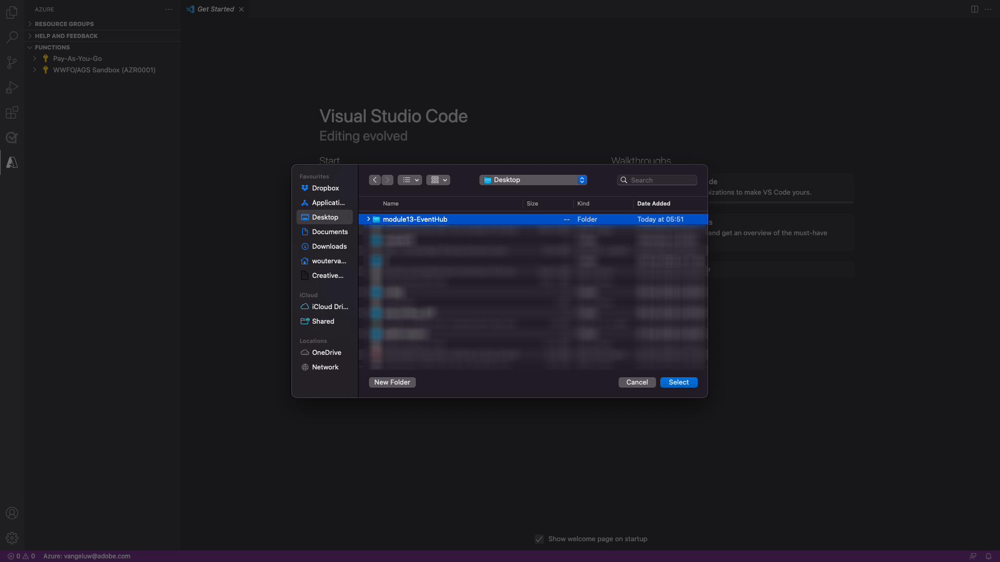
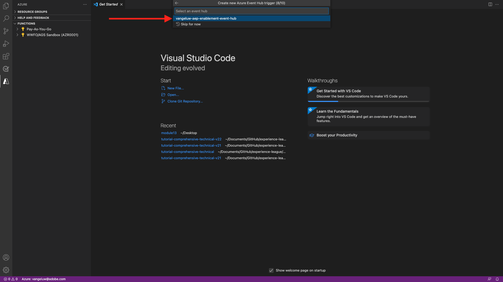

# 13.5 Crear su proyecto de Microsoft Azure

## 13.5.1 Familiarizarse con las funciones de Azure Event Hub

Funciones de Azure le permite ejecutar pequeños fragmentos de código (llamados **funciones**) sin preocuparse por la infraestructura de las aplicaciones. Con las funciones de Azure, la infraestructura de nube proporciona todos los servidores actualizados que necesita para mantener su aplicación en funcionamiento a escala.

Una función es **activado** por un tipo específico de evento. Los déclencheur admitidos incluyen responder a cambios en los datos, responder a mensajes (por ejemplo, centros de eventos), ejecutar una programación o como resultado de una solicitud HTTP.

Funciones de Azure es un servicio de computación sin servidor que le permite ejecutar código activado por evento sin tener que aprovisionar o administrar explícitamente infraestructura.

Azure Event Hubs se integra con las funciones de Azure para una arquitectura sin servidor.

## 13.5.2 Abrir código de Visual Studio e iniciar sesión en Azure

Visual Studio Code facilita...

- definir y enlazar funciones de Azure a centros de eventos
- probar localmente
- implementar en Azure
- ejecución de la función de registro remoto

### Abrir código de Visual Studio

Para abrir el código de Visual Studio, escriba **visual** en la búsqueda de su sistema operativo (Spotlight search on OSX, Search in Window&#39;s Taskbar). Si no lo encuentra, debe repetir los pasos descritos en [Ejercicio 0: requisitos previos](./ex0.md).


### Iniciar sesión en Azure

Al iniciar sesión con su cuenta de Azure que utilizó para registrarse en [Ejercicio 0: requisitos previos](./ex0.md), el código de Visual Studio le permitirá encontrar y enlazar todos los recursos de Event Hub.

Haga clic en el **Azure** en el código de Visual Studio. Si no tiene esa opción, es posible que algo haya salido mal con la instalación de las extensiones requeridas.

Siguiente seleccione **Iniciar sesión en Azure**:


Se le redirigirá al navegador para que inicie sesión. Recuerde seleccionar la cuenta de Azure que utilizó para registrarse.


Cuando ve la siguiente pantalla en el explorador, ha iniciado sesión con Visual Code Studio:


Vuelva a Visual Code Studio (verá el nombre de su suscripción de Azure, por ejemplo **suscripción de Azure 1**):


## 13.5.3 Crear un proyecto de Azure

Cuando pasa el ratón por encima **suscripción de Azure 1**, aparece un menú encima de la sección , seleccione **Crear nuevo proyecto...**:


Seleccione una carpeta local de su elección para guardar el proyecto y haga clic en **Select**:



A continuación, entrará en el asistente para la creación del proyecto. Select **Javascript** como idioma del proyecto:


Select **Déclencheur de Azure Event Hub** como la primera plantilla de función del proyecto:


Escriba un nombre para la función, use el siguiente formato `--demoProfileLdap---aep-event-hub-trigger` y pulse Intro:


Select **Crear nueva configuración de aplicación local**:


Seleccione un área de nombres de centro de eventos, debería ver el centro de eventos definido en **Ejercicio 2**. En este ejemplo, el espacio de nombres de Event Hub es **vangeluw-aep-enablement**:


Seleccione el centro de eventos, debería ver el centro de eventos definido en **Ejercicio 2**. En mi caso, es **vangeluw-aep-enablement-event-hub**:



Select **RootManageSharedAccessKey** como política de Event Hub:


Escriba para usar **$Default**:


Select **Agregar al espacio de trabajo** sobre cómo abrir el proyecto:


Una vez creado el proyecto, haga clic en **index.js** para que el archivo se abra en el editor:


La carga útil que envía Adobe Experience Platform a su centro de eventos incluirá los ID de segmento:

```json
[{
"segmentMembership": {
"ups": {
"ca114007-4122-4ef6-a730-4d98e56dce45": {
"lastQualificationTime": "2020-08-31T10:59:43Z",
"status": "realized"
},
"be2df7e3-a6e3-4eb4-ab12-943a4be90837": {
"lastQualificationTime": "2020-08-31T10:59:56Z",
"status": "realized"
},
"39f0feef-a8f2-48c6-8ebe-3293bc49aaef": {
"lastQualificationTime": "2020-08-31T10:59:56Z",
"status": "realized"
}
}
},
"identityMap": {
"ecid": [{
"id": "08130494355355215032117568021714632048"
}]
}
}]
```

Reemplace el código en index.js de su código de Visual Studio por el código siguiente. Este código se ejecutará cada vez que CDP en tiempo real envíe cualificaciones de segmento a su destino de centro de eventos. En nuestro ejemplo, el código trata simplemente de mostrar y mejorar la carga útil recibida. Pero puede imaginar cualquier tipo de función para procesar las clasificaciones de segmentos en tiempo real.

```javascript
// Marc Meewis - Solution Consultant Adobe - 2020
// Adobe Experience Platform Enablement - Module 13

// Main function
// -------------
// This azure function is fired for each segment activated to the Adobe Exeperience Platform Real-time CDP Azure 
// Eventhub destination
// This function enriched the received segment payload with the name fo the segment. 
// You can replace this function with any logic that is require to process and deliver
// Adobe Experience Platform segments in real-time to any application or platform that 
// would need to act upon an AEP segment qualiification.
// 

module.exports = async function (context, eventHubMessages) {

    return new Promise (function (resolve, reject) {

        context.log('Message : ' + JSON.stringify(eventHubMessages, null, 2));

        resolve();

    });    

};
```

El resultado debería ser así:


## 13.5.4 Ejecutar proyecto de Azure

Ahora es el momento de ejecutar el proyecto. En este momento no implementaremos el proyecto en Azure. Lo ejecutaremos localmente en modo de depuración. Seleccione el icono Ejecutar y haga clic en la flecha verde.


La primera vez que ejecute el proyecto en modo de depuración, deberá adjuntar una cuenta de almacenamiento de Azure y hacer clic en **Seleccionar cuenta de almacenamiento**.


En la lista de cuentas de almacenamiento, seleccione la que ha creado como parte de [13.1.4 Configurar su cuenta de almacenamiento de Azure](./ex1.md). El nombre de su cuenta de almacenamiento es `--demoProfileLdap--aepstorage`, por ejemplo: **mmeewisaepstorage**.


El proyecto ya está en marcha y en ejecución, y está listado para eventos en el Centro de eventos. En el próximo ejercicio, demostrará el comportamiento en el sitio web de demostración de Luma que le calificará para esos segmentos. Como resultado, recibirá una carga útil de calificación de segmentos en la terminal de la función de déclencheur de Event Hub:


## 13.5.5 Detener proyecto de Azure

Para detener el proyecto, seleccione la opción **Terminal** , haga clic en la ventana de terminal y pulse **CMD-C** en OSX o **CTRL-C** en Windows:


Paso siguiente: [13.6 Situación de extremo a extremo](./ex6.md)

[Volver al módulo 13](./segment-activation-microsoft-azure-eventhub.md)

[Volver a todos los módulos](./../../overview.md)
