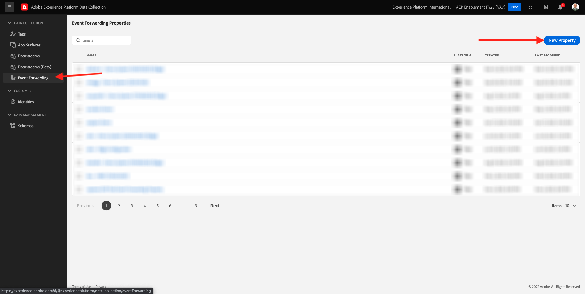
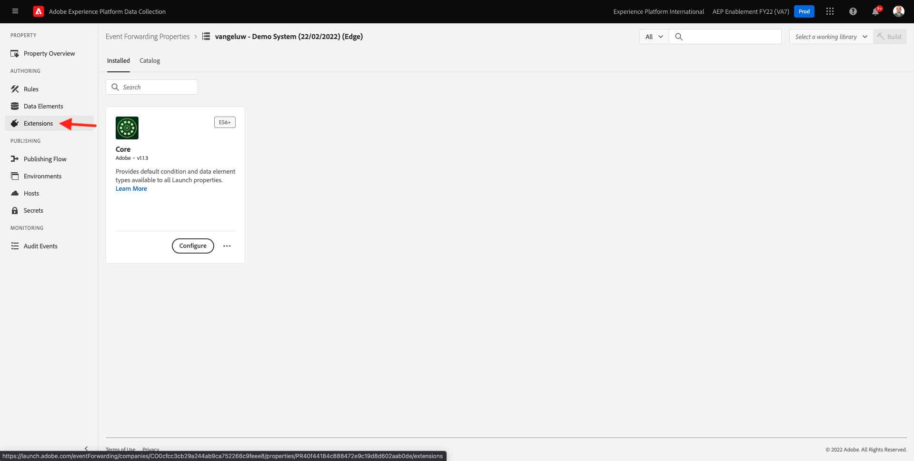

# 14.1 Crear una propiedad de reenvío de eventos de recopilación de datos de Adobe Experience Platform

>[!NOTE]
>
>La extensión móvil de Adobe Experience Platform Edge está actualmente en BETA. El uso de esta extensión solo se realiza por invitación. Póngase en contacto con el administrador de éxito de los clientes de Adobe para obtener más información y obtener acceso a los materiales de este tutorial.

## 14.1.1 ¿Qué es una propiedad de reenvío de eventos de recopilación de datos de Adobe Experience Platform?

Normalmente, cuando los datos se recopilan mediante la recopilación de datos de Adobe Experience Platform, se recopilan en el **Lado del cliente**. La variable **Lado del cliente** es un entorno como un sitio web o una aplicación móvil. En el módulo 0 y el módulo 1, la configuración de una propiedad de cliente de recopilación de datos de Adobe Experience Platform se analizó en detalle y se implementó esa propiedad de cliente de recopilación de datos de Adobe Experience Platform en el sitio web y la aplicación móvil, de modo que los datos se pudieran recopilar cuando un cliente interactuaba con el sitio web y la aplicación móvil.

Cuando la propiedad del cliente de recopilación de datos de Adobe Experience Platform recopila esos datos de interacción, el sitio web o la aplicación móvil envían una solicitud a Adobe Edge. Edge es el entorno de recopilación de datos del Adobe y es el punto de entrada para los datos del flujo de navegación en el ecosistema de Adobe. Desde Edge, los datos recopilados se envían a aplicaciones como Adobe Experience Platform, Adobe Analytics, Adobe Audience Manager o Adobe Target.

Con la adición de una propiedad de Adobe Experience Platform Data Collection Event Forwarding, ahora es posible configurar una propiedad de recopilación de datos de Adobe Experience Platform que escuche los datos entrantes en Edge. Cuando la propiedad Adobe Experience Platform Data Collection Event Forwarding que se ejecuta en Edge ve los datos entrantes, puede utilizar esos datos y reenviarlos a otro lugar. Ese otro lugar puede ser también un enlace web externo que no sea de Adobe, lo que permite enviar esos datos a, por ejemplo, el lago de datos que elija, una aplicación de decisión o cualquier otra aplicación que tenga la capacidad de abrir un enlace web.

La configuración de una propiedad de Adobe Experience Platform Data Collection Event Forwarding le resulta familiar a una propiedad de cliente, con la capacidad de configurar elementos de datos y reglas como en el pasado con las propiedades de cliente de recopilación de datos de Adobe Experience Platform. Sin embargo, la forma en que se accederá a los datos y se utilizarán será ligeramente diferente, según el caso de uso.

Empecemos por crear la propiedad Adobe Experience Platform Data Collection Event Forwarding .

## 14.1.2 Crear una propiedad de reenvío de eventos de recopilación de datos de Adobe Experience Platform

Vaya a [https://experience.adobe.com/#/data-collection/](https://experience.adobe.com/#/data-collection/). En el menú de la izquierda, haga clic en **Reenvío de eventos**. A continuación, verá una descripción general de todas las propiedades de reenvío de eventos de recopilación de datos de Adobe Experience Platform disponibles. Haga clic en el botón **Nueva propiedad.**

Ahora debe introducir un nombre para la propiedad de reenvío de eventos de recopilación de datos de Adobe Experience Platform. Como convención de nomenclatura, utilice `--demoProfileLdap-- - Demo System (DD/MM/YYYY) (Edge)`. Por ejemplo, en este ejemplo, el nombre es **vangeluw - Sistema de demostración (22/02/2022) (Edge)**. Haga clic en **Guardar**.

A continuación, volverá a la lista de propiedades de reenvío de eventos de recopilación de datos de Adobe Experience Platform . Haga clic en para abrir la propiedad que acaba de crear.

## 14.1.2 Configurar la extensión del conector de Adobe Cloud

En el menú de la izquierda, vaya a **Extensiones**. Verá que el **Principal** ya está configurada.

Vaya a **Catálogo**. Verá el **Conector de Adobe Cloud** extensión. Haga clic en **Instalar** para instalarlo.

A continuación, se añade la extensión . No hay ninguna configuración que hacer en este paso. Se le devolverá a la descripción general de las extensiones instaladas.

## 14.1.3 Implementar la propiedad de reenvío de eventos de recopilación de datos de Adobe Experience Platform

En el menú de la izquierda, vaya a **Flujo de publicación**. Haga clic en **Agregar biblioteca**.

Escriba el nombre **Principal**, seleccione el entorno **Desarrollo (desarrollo)** y haga clic en **+ Agregar todos los recursos modificados**.

Entonces verás esto. Haga clic en **Guardar y generar para desarrollo**.

A continuación, se creará la biblioteca, que puede tardar entre 1 y 2 minutos.

Por último, la biblioteca se creará y estará lista.

Paso siguiente: [14.2 Actualice el almacén de datos para que los datos estén disponibles en la propiedad Reenvío de eventos de recopilación de datos](./ex2.md)

[Volver al módulo 14](./aep-data-collection-ssf.md)

[Volver a todos los módulos](./../../overview.md)
