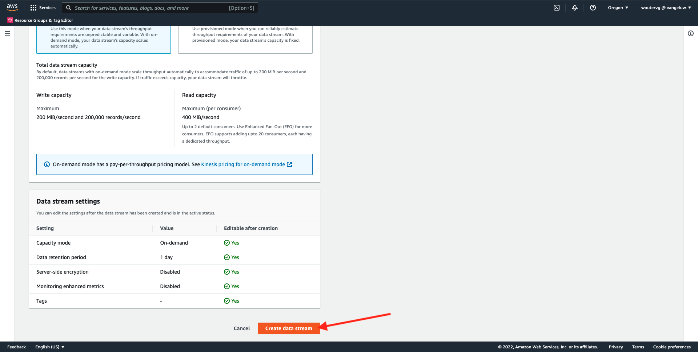
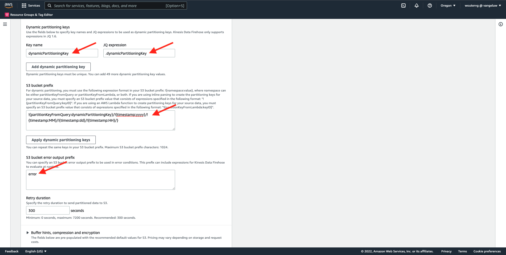
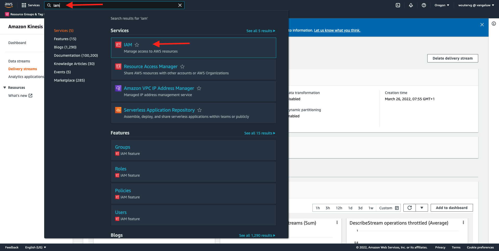
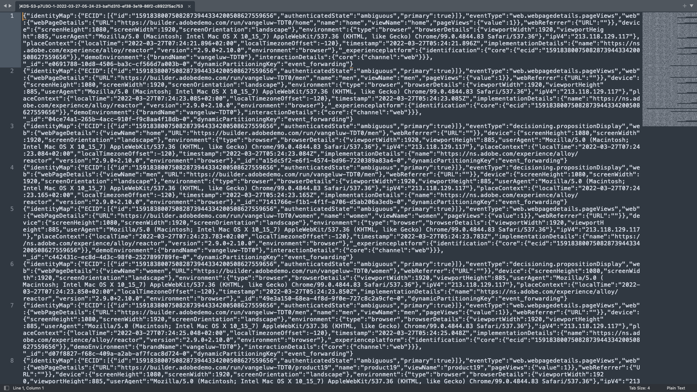

# 14.5 Avanzar hacia el ecosistema de AWS

>[!IMPORTANT]
>
>La finalización de este ejercicio es opcional y conlleva un coste utilizar AWS Kinesis. Aunque AWS proporciona una cuenta de nivel gratuito que le permite probar y configurar muchos servicios sin coste, AWS Kinesis no forma parte de esa cuenta de nivel libre. Por lo tanto, para implementar y probar este ejercicio, habrá que pagar un coste por utilizar AWS Kinesis.

## Bien sabido

Adobe Experience Platform admite varios servicios de Amazon como destino.
Kinesis y S3 son [destinos de exportación de perfiles](https://experienceleague.adobe.com/docs/experience-platform/destinations/destination-types.html?lang=en) y se pueden usar como parte de Real-Time CDP de Adobe Experience Platform.
Puede incorporar fácilmente eventos de segmento de alto valor y atributos de perfil asociados a sus sistemas de elección.

En esta nota, aprenderá a configurar su propio flujo de Kinesis de Amazon para transmitir datos de eventos procedentes del ecosistema de Adobe Experience Platform Edge a un destino de almacenamiento en la nube, como Amazon S3. Esto resulta útil en caso de que desee recopilar eventos de experiencia de propiedades web y móviles y insertarlos en el mapa de datos para su análisis y sistema de informes operativo. Por lo general, los álbumes de datos introducen datos por lotes con grandes importaciones diarias de archivos, no exponen el extremo http público que podría utilizarse junto con el reenvío de eventos.

La compatibilidad con los casos de uso anteriores implica que los datos transmitidos deben almacenarse en búfer o colocarse en cola antes de escribirse en un archivo. Se debe tener cuidado de no abrir archivos para el acceso de escritura en varios procesos. Delegar esta tarea en un sistema dedicado es ideal para escalar con cuidado mientras se asegura un bueno nivel de servicio, aquí es donde Kinesis acude al rescate.

Amazon Kinesis Data Streams se centra en la ingesta y almacenamiento de flujos de datos. Kinesis Data Firefox se centra en el envío de flujos de datos a destinos seleccionados, como bloques S3.

Como parte de este ejercicio, usted...

- Realizar una configuración básica de un flujo de datos de Kinesis
- Crear un flujo de entrega Fireeves y usar el compartimento S3 como destino
- Configure la puerta de enlace de la API de Amazon como punto final de la api de rest para recibir los datos de evento
- Reenviar datos de eventos sin procesar de Adobe Edge a su flujo de Kinesis

## 14.5.1 Configurar el espacio de AWS S3

Vaya a [https://console.aws.amazon.com](https://console.aws.amazon.com) e inicie sesión con la cuenta de Amazon que creó anteriormente.


Después de iniciar sesión, se le redirigirá al **Consola de administración de AWS**.


En el **Buscar servicios** menú, buscar **s3**. Haga clic en el primer resultado de búsqueda: **S3: Almacenamiento escalable en la nube**.


Verá el **Amazon S3** página principal. Haga clic en **Crear depósito**.


En el **Crear depósito** , debe configurar dos opciones:

- Nombre: use el nombre `eventforwarding---demoProfileLdap--`. Por ejemplo, en este ejercicio, el nombre del bloque es **aepmoduertcdpvangeluw**
- Región: usar la región **EU (Frankfurt) eu-central-1**


Mantenga el resto de la configuración predeterminada tal cual. Desplácese hacia abajo y haga clic en **Crear cubo**.


A continuación, verá que se está creando su espacio y se redirigirá a la página de inicio de Amazon S3.


## 14.5.2 Configurar el flujo de datos de AWS Kinesis

En el **Buscar servicios** menú, buscar **kinesis**. Haga clic en el primer resultado de búsqueda: **Kinesis: Trabajar con datos de flujo en tiempo real**.


Select **Flujos de datos de Kinesis**. Haga clic en **Crear flujo de datos**.


Para la variable **Nombre del flujo de datos**, use `--demoProfileLdap---datastream`.


No es necesario cambiar ninguna de las otras configuraciones. Desplácese hacia abajo y haga clic en **Crear flujo de datos**.



Entonces verás esto. Una vez que el flujo de datos se haya creado correctamente, puede pasar al siguiente ejercicio.


## 14.5.3 Configurar el flujo de envío de Firefox de AWS

En el **Buscar servicios** menú, buscar **kinesis**. Haga clic en **Fuego de datos de Kinesis**.


Haga clic en **Crear flujo de entrega**.


Para **Fuente**, seleccione **Flujos de datos de Amazon Kinesis**. Para **Destino**, seleccione **Amazon S3**. Haga clic en **Examinar** para seleccionar el flujo de datos.


Seleccione el flujo de datos. Haga clic en **Choose**.


Entonces verás esto. Recuerde **Nombre del flujo de entrega** como lo necesitarás más tarde.


Desplácese hacia abajo hasta que vea **Configuración de destino**. Haga clic en **Examinar** para seleccionar su compartimento S3.


Seleccione el compartimento de S3 y haga clic en **Choose**.


Entonces verás algo como esto. Actualice la siguiente configuración:

- Partición dinámica: configure como **Habilitado**
- Desagregación de varios registros: configure como **Desactivado**
- Nuevo delimitador de línea: configure como **Habilitado**
- Análisis en línea para JSON: configure como **Habilitado**


Desplácese hacia abajo un poco, verá esto. Actualice la siguiente configuración:

- Claves de partición dinámica
   - Nombre de la clave: **dynamicPartitioningKey**
   - Expresión JQ: **.dynamicPartitioningKey**
- Prefijo del contenedor S3: añada el siguiente código:

```bash
!{partitionKeyFromQuery:dynamicPartitioningKey}/!{timestamp:yyyy}/!{timestamp:MM}/!{timestamp:dd}/!{timestamp:HH}/}
```

- Prefijo de salida de error de compartimento S3: configure como **error**



Finalmente, desplácese hacia abajo un poco más y haga clic en **Crear flujo de entrega**


Después de un par de minutos, se creará el flujo de envío y **Activo**.


## 14.5.4 Configurar su función de AWS IAM

En el **Buscar servicios** menú, buscar **iam**. Haga clic en **Puerta de enlace de API**.



Haga clic en **Funciones**.


Busque su **KinesisFiremanguito** función. Haga clic en él para abrirlo.


Haga clic en el nombre de la directiva de permisos para abrirla.


En la nueva pantalla que se abre, haga clic en **Editar directiva**.


En **Kinesis** - **Acciones**, asegúrese de que **Escritura** permisos para **PutRecord** está activada. Haga clic en **Revisar directiva**.


Haga clic en **Guardar cambios**.


Volverás aquí. Haga clic en **Funciones**.


Busque su **KinesisFiremanguito** función. Haga clic en él para abrirlo.


Vaya a **Relaciones de confianza** y haga clic en **Editar directiva de confianza**.


Sobrescriba la directiva de confianza actual pegando este código para reemplazar el código existente:

```json
{
	"Version": "2012-10-17",
	"Statement": [
		{
			"Effect": "Allow",
			"Principal": {
				"Service": [
                    "firehose.amazonaws.com",
                    "kinesis.amazonaws.com",
                    "apigateway.amazonaws.com"
                ]
			},
			"Action": "sts:AssumeRole"
		}
	]
}
```

Haga clic en **Actualizar directiva**


Entonces verás esto. Debe especificar la variable **ARN** para esta función en el paso siguiente.


## 14.5.5 Configurar la puerta de enlace de la API de AWS

Amazon API Gateway es un servicio de AWS que se utiliza para crear, publicar, mantener, supervisar y proteger las API de REST, HTTP y WebSocket a cualquier escala. Los desarrolladores de API pueden crear API que accedan a AWS u otros servicios web, así como datos almacenados en AWS Cloud.

Ahora expondrá el flujo de datos de Kinesis a Internet a través de un extremo HTTPS que luego puede consumir directamente los servicios de Adobe, como el reenvío de eventos.

En el **Buscar servicios** menú, buscar **puerta de enlace de api**. Haga clic en **Puerta de enlace de API**.


Entonces verás algo como esto. Haga clic en **Crear API**.


Haga clic en **Generar** en el **API de REST** tarjeta.


Entonces verás esto. Complete la configuración de esta manera:

- Elija el protocolo : select **REST**
- Crear nueva API: select **Nueva API**
- Configuración:
   - Nombre de la API: use `--demoProfileLdap---eventforwarding`
   - Tipo de extremo: select **Regional**

Haga clic en **Crear API**.


Entonces verás esto. Haga clic en **Acciones** y haga clic en **Crear recurso**.


Entonces verás esto. Establezca **Nombre del recurso** a **flujo**. Haga clic en **Crear recurso**.


Entonces verás esto. Haga clic en **Acciones** y haga clic en **Crear método**.


En la lista desplegable , seleccione **POST** y haga clic en el botón **v** botón.


Entonces verás esto. Complete la configuración de esta manera:

- Tipo de integración: **Servicio de AWS**
- Región de AWS: seleccione la región que utiliza el flujo de datos de Kinesis, en este caso: **us-west-2**
- Servicio de AWS: select **Kinesis**
- Subdominio de AWS: dejar vacío
- Método HTTP: select **POST**
- Tipo de acción: select **Usar nombre de acción**
- Acción: enter **PutRecord**
- Función de ejecución: pegue el **ARN** de la función de ejecución que utiliza el Firefox de datos de Kinesis, tal como se indica en el ejercicio anterior.
- Gestión de contenido: select **Pasaje**
- Usar tiempo de espera predeterminado: activar la casilla de verificación

Haga clic en **Guardar**.


Entonces verás esto. Haga clic en **Solicitud de integración**.


Haga clic en **Encabezados HTTP**.


Desplácese hacia abajo un poco y haga clic en **Agregar encabezado**.


Establezca **Nombre** a **Content-Type**, conjunto **Asignado desde** a `'application/x-amz-json-1.1'`. Haga clic en el **v** para guardar los cambios.


Entonces verás esto. Para **Solicitud de paso del cuerpo**, seleccione **Cuando no hay plantillas definidas (recomendado)**. A continuación, haga clic en **Agregar plantilla de asignación**.


En **Content-Type**, introduzca **application/json**. Haga clic en el **v** para guardar los cambios.


Desplácese hacia abajo para encontrar una ventana del editor de código. Pegue el siguiente código allí:

```json
{
  "StreamName": "$input.path('StreamName')",
  "Data": "$util.base64Encode($input.json('$.Data'))",
  "PartitionKey": "$input.path('$.PartitionKey')"
}
```

Haga clic en **Guardar**.


A continuación, desplácese hacia arriba y haga clic en **&lt;- Ejecución de métodos** para volver.


Haga clic en **PRUEBA**.


Desplácese hacia abajo y pegue este código en **Cuerpo de la solicitud**. Haga clic en **Prueba**.

```json
{
  "Data": {
    "message": "Hello World",
    "dynamicPartitioningKey": "v2"
  },
  "PartitionKey": "1",
  "StreamName": "--demoProfileLdap---datastream"
}
```


A continuación, verá un resultado similar:


Entonces verás esto. Haga clic en **Acciones** y haga clic en **Implementación de API**.


Para **Fase de implementación**, seleccione **Nueva etapa**. Como **Nombre del escenario**, introduzca **prod**. Haga clic en **Implementación**.


Entonces verás esto. Haga clic en **Guardar cambios**. I.F.: la dirección URL de la imagen es la dirección URL que se utiliza para enviar datos a (en este ejemplo: https://vv1i5vwg2k.execute-api.us-west-2.amazonaws.com/prod).


Puede probar la configuración usando la siguiente solicitud cURL, todo lo que debe hacer es reemplazar la siguiente URL por la suya. `https://vv1i5vwg2k.execute-api.us-west-2.amazonaws.com/prod` en este ejemplo, y agregue `/stream` al final de la dirección URL.

```json
curl --location --request POST 'https://vv1i5vwg2k.execute-api.us-west-2.amazonaws.com/prod/stream' \
--header 'Content-Type: application/json' \
--data-raw '{
    "Data": {
        "userid": "--demoProfileLdap--@adobe.com",
        "firstName":"--demoProfileLdap--",
        "offerName":"10% off on outdoor gears",
        "offerCode": "10OFF-SPRING",
        "dynamicPartitioningKey": "campaign"
    },
    "PartitionKey": "1",
    "StreamName": "--demoProfileLdap---datastream"
}'
```

Pegue el código actualizado anterior en una ventana Terminal y pulse Intro. A continuación, verá esta respuesta, similar a la respuesta que podría ver al realizar la prueba anterior.


## 14.5.6 Actualizar la propiedad Event Forwarding

Ahora puede activarse en el flujo de datos de AWS Kinesis a través de AWS API Gateway, de modo que ahora puede enviar los eventos de experiencia sin procesar al ecosistema de AWS. Ahora, al usar las conexiones de Real-Time CDP y el reenvío de eventos, puede habilitar fácilmente el reenvío de eventos en el punto final de la puerta de enlace de la API de AWS recién creada.

### 14.5.6.1 Actualice la propiedad Event Forwarding : Crear un elemento de datos

Vaya a [https://experience.adobe.com/#/data-collection/](https://experience.adobe.com/#/data-collection/) y vaya a **Reenvío de eventos**. Busque la propiedad Event Forwarding y haga clic en ella para abrirla.


En el menú de la izquierda, vaya a **Elementos de datos**. Haga clic en **Añadir elemento de datos**.


A continuación, verá un nuevo elemento de datos para configurar.


Realice la siguiente selección:

- Como **Nombre**, introduzca **awsDataObject**.
- Como **Extensión**, seleccione **Principal**.
- Como **Tipo de elemento de datos**, seleccione **Código personalizado**.

Ahora tendrás esto. Haga clic en **&lt;/> Abrir editor**.


En el Editor, pegue el siguiente código en la línea 3. Haga clic en **Guardar**.

```javascript
const newObj = {...arc.event.xdm, dynamicPartitioningKey: "event_forwarding"}
return JSON.stringify(newObj);
```


>[!NOTE]
>
>En la ruta anterior, se hace referencia a **arc**. **arc** representa Contexto de Recursos de Adobe y **arc** representa siempre el objeto más alto disponible que está disponible en el contexto del servidor. Los enriquecimientos y transformaciones pueden añadirse a los **arc** mediante las funciones del servidor de recopilación de datos de Adobe Experience Platform.
>
>En la ruta anterior, se hace referencia a **evento**. **evento** significa un evento único y Adobe Experience Platform Data Collection Server siempre evaluará cada evento individualmente. A veces, es posible que vea una referencia a **events** en la carga útil que envía el cliente del SDK web, pero en el reenvío de eventos de recopilación de datos de Adobe Experience Platform, cada evento se evalúa individualmente.

Volverás aquí. Haga clic en **Guardar** o **Guardar en biblioteca**.


### 14.5.6.2 Actualice la propiedad Servidor de recopilación de datos de Adobe Experience Platform: Actualizar la regla

En el menú de la izquierda, vaya a **Reglas**. Haga clic en para abrir la regla **Todas las páginas** que ha creado en uno de los ejercicios anteriores.


Entonces verás esto. Haga clic en el **+** para agregar una nueva acción.


Entonces verás esto. Realice la siguiente selección:

- Seleccione el **Extensión**: **Conector de Adobe Cloud**.
- Seleccione el **Tipo de acción**: **Llamada de recuperación**.

Eso debería darte esto **Nombre**: **Conector de Adobe Cloud: Realizar llamada de recuperación**. Ahora debería ver esto:


A continuación, configure lo siguiente:

- Cambiar el método de solicitud de GET a **POST**
- Introduzca la dirección URL del extremo de la puerta de enlace de la API de AWS que ha creado en uno de los pasos anteriores, que tiene este aspecto: `https://vv1i5vwg2k.execute-api.us-west-2.amazonaws.com/prod/stream`

Ahora deberías tener esto. A continuación, vaya a **Encabezados**.


En los encabezados, añada un nuevo encabezado con clave **Content-Type** y valor **application/json**. A continuación, vaya a **Cuerpo**.


Entonces verás esto. Pegue el siguiente código en el campo **Cuerpo (sin procesar)**. Haga clic en **Mantener cambios**.

```json
{
    "Data":{{awsDataObject}},
    "PartitionKey": "1",
    "StreamName": "--demoProfileLdap---datastream"
}
```


Verás que vuelves aquí. Haga clic en **Guardar** o **Guardar en biblioteca**.


Ahora ha configurado la primera regla en una propiedad Event Forwarding . Vaya a **Flujo de publicación** para publicar los cambios.
Abra la biblioteca de desarrollo haciendo clic en **Principal**.


Haga clic en el **Agregar todos los recursos modificados** , después de lo cual verá que sus cambios de Regla y Elemento de datos aparecen en esta biblioteca. A continuación, haga clic en **Guardar y generar para desarrollo**. Los cambios se están implementando.


Después de un par de minutos, verá que la implementación ha finalizado y está lista para probarse.


## 14.5.7 Probar la configuración

Vaya a [https://builder.adobedemo.com/projects](https://builder.adobedemo.com/projects). Después de iniciar sesión en Adobe ID, verá esto. Haga clic en el proyecto del sitio web para abrirlo.


Ahora puede seguir el flujo siguiente para acceder al sitio web. Haga clic en **Integraciones**.


En el **Integraciones** , debe seleccionar la propiedad Recopilación de datos que se creó en el ejercicio 0.1.


Verá que su sitio web de demostración se abre. Seleccione la dirección URL y cópiela en el portapapeles.


Abra una nueva ventana del explorador incógnito.


Pegue la dirección URL del sitio web de la demostración, que copió en el paso anterior. A continuación, se le pedirá que inicie sesión con su Adobe ID.


Seleccione su tipo de cuenta y complete el proceso de inicio de sesión.


Verá su sitio web cargado en una ventana del navegador incógnito. Para cada demostración, tendrá que usar una ventana nueva del explorador incógnito para cargar la URL de su sitio web de demostración.


Cuando abra la vista del desarrollador del explorador, podrá inspeccionar las solicitudes de red como se indica a continuación. Al utilizar el filtro **interactuar**, verá las solicitudes de red que envía el cliente de recopilación de datos de Adobe Experience Platform a Adobe Edge.


Si selecciona la carga útil sin procesar, vaya a [https://jsonformatter.org/json-pretty-print](https://jsonformatter.org/json-pretty-print) y pegue la carga útil. Haga clic en **Convertir en bonita**. A continuación, verá la carga útil JSON, la variable **events** y **xdm** objeto. En uno de los pasos anteriores, cuando definió el elemento de datos, utilizó la referencia **arc.event.xdm**, lo que le resultará en el análisis de la variable **xdm** de esta carga útil.


Cambie la vista a **AWS**. Al abrir el flujo de datos y entrar en el **Monitorización** , ahora verá el tráfico entrante.


A continuación, abra el flujo de envío y vaya a la **Monitorización** , también verá el tráfico entrante.


Por último, cuando eche un vistazo a su compartimento S3, ahora verá que se están creando archivos en él como consecuencia de su ingesta de datos.


Cuando descargue un archivo de este tipo y lo abra con un editor de texto, verá que contiene la carga útil XDM de los eventos reenviados.



Paso siguiente: [Resumen y beneficios](./summary.md)

[Volver al módulo 14](./aep-data-collection-ssf.md)

[Volver a todos los módulos](./../../overview.md)
