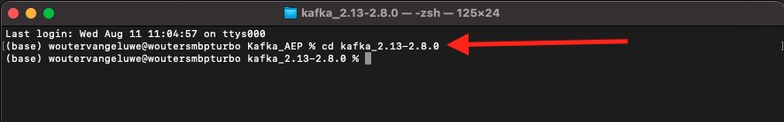
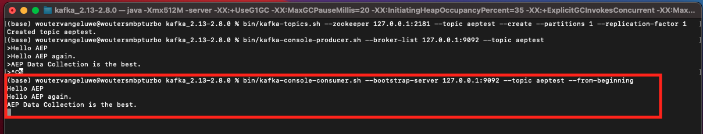
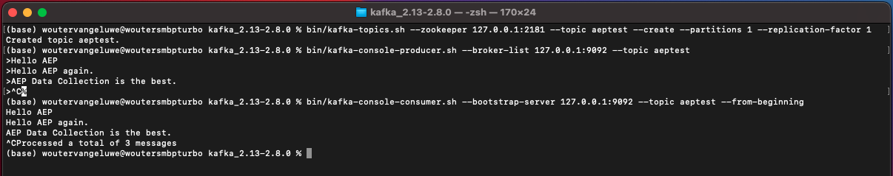

# 15.2 Instalar y configurar el clúster de Kafka

## 15.2.1 Descargar Apache Kafka

Vaya a [https://kafka.apache.org/downloads](https://kafka.apache.org/downloads) y descargue la última versión publicada. Seleccione la última versión binaria, en este caso **Scala 2.13**.

Luego te llevan a un sitio espejo. Haga clic en el enlace sugerido para descargar Kafka.

Cree una carpeta en el escritorio con el nombre **Kafka_AEP** y coloque el archivo descargado en ese directorio.

Abra un **Terminal** haciendo clic con el botón derecho en la carpeta y haciendo clic en **Nuevo terminal en la carpeta**.

Ejecute este comando en la ventana Terminal para descomprimir el archivo descargado:

`tar -xvf kafka_2.13-3.1.0.tgz`

>[!NOTE]
>
>Compruebe que el comando anterior coincide con la versión del archivo descargado. Si su versión es más reciente, deberá actualizar el comando anterior para que coincida con esa versión.

Verá esto:

Después de descomprimir ese archivo, ahora tiene un directorio como este:

Y en ese directorio, verán estos subdirectorios:

Vuelva a la ventana Terminal . Introduzca el siguiente comando:

`cd kafka_2.13-3.1.0`

>[!NOTE]
>
>Compruebe que el comando anterior coincide con la versión del archivo descargado. Si su versión es más reciente, deberá actualizar el comando anterior para que coincida con esa versión.

A continuación, introduzca el comando `bin/kafka-topics.sh`.

A continuación, debería ver esta respuesta. Esto significa que Kafka está correctamente instalado y que Java funciona bien. (Recordatorio: necesita tener instalado Java 8 JDK o Java 11 JDK para que esto funcione. Puede ver qué versión de Java ha instalado utilizando el comando `java -version`.)

## 15.2.2 Iniciar Kafka

Para empezar Kafka, tendrás que empezar Kafka Zookeeper y Kafka, en este orden.

Abra un **Terminal** haciendo clic con el botón derecho en la carpeta **kafka_2.13-3.1.0** y haga clic en **Nuevo terminal en la carpeta**.

Introduzca este comando:

`bin/zookeeper-server-start.sh config/zookeeper.properties`

Verá esto:

Mantenga esta ventana abierta mientras sigue estos ejercicios!

Abrir otro, nuevo **Terminal** haciendo clic con el botón derecho en la carpeta **kafka_2.13-3.1.0** y haga clic en **Nuevo terminal en la carpeta**.

Introduzca este comando:

`bin/kafka-server-start.sh config/server.properties`

Verá esto:

Mantenga esta ventana abierta mientras sigue estos ejercicios!

## 15.2.3 Crear un tema kafka

Abra un **Terminal** haciendo clic con el botón derecho en la carpeta **kafka_2.13-3.1.0** y haga clic en **Nuevo terminal en la carpeta**.

Introduzca este comando para crear un nuevo tema de Kafka con el nombre **aeptest**. Este tema se utilizará para realizar pruebas en este ejercicio.

`bin/kafka-topics.sh --create --topic aeptest --bootstrap-server localhost:9092`

A continuación, verá una confirmación similar:

Introduzca este comando para crear un nuevo tema de Kafka con el nombre **aep**. Este tema lo usará el conector Adobe Experience Platform Sink que configurará en los próximos ejercicios.

`bin/kafka-topics.sh --create --topic aep --bootstrap-server localhost:9092`

A continuación, verá una confirmación similar:

## 15.2.4 Producir eventos

Vuelva a la ventana Terminal en la que creó su primer tema de Kafka e introduzca el siguiente comando:

`bin/kafka-console-producer.sh --broker-list 127.0.0.1:9092 --topic aeptest`

Entonces verás esto. Cada nueva línea seguida del pulsador del botón Enter dará como resultado que se envíe un nuevo mensaje al tema **aeptest**.

Entrar `Hello AEP` y pulse Intro. El primer evento se ha enviado a la instancia local de Kafka, en el tema. **aeptest**.

Entrar `Hello AEP again.` y pulse Intro.

Entrar `AEP Data Collection is the best.` y pulse Intro.

Ahora ha producido 3 eventos en el tema **aeptest**. Estos eventos ahora se pueden consumir en una aplicación que pueda necesitar esos datos.

En el teclado, haga clic en `Control` y `C` al mismo tiempo para cerrar el productor.

## 15.2.4 Consumir eventos

En la misma ventana Terminal que utilizó para producir eventos, introduzca el siguiente comando:

`bin/kafka-console-consumer.sh --bootstrap-server 127.0.0.1:9092 --topic aeptest --from-beginning`

A continuación, verá todos los mensajes que se produjeron en el ejercicio anterior para el tema **aeptest**, aparece en el consumidor. Así es como funciona Apache Kafka: un productor crea eventos en una canalización y un consumidor los consume.

En el teclado, haga clic en `Control` y `C` al mismo tiempo para cerrar el productor.

En este ejercicio, ha pasado por todo lo básico para configurar un clúster local de Kafka, crear un tema de Kafka, producir eventos y consumir eventos.

El objetivo de este módulo es simular lo que sucedería si una organización real ya ha implementado un clúster de Apache Kafka, y quiere transmitir datos de su clúster de Kafka a Adobe Experience Platform.

Para facilitar dicha implementación, se creó un conector Adobe Experience Platform Sink que se puede implementar utilizando Kafka Connect. Puede encontrar la documentación de ese Adobe Experience Platform Sink Connector aquí: [https://github.com/adobe/experience-platform-streaming-connect](https://github.com/adobe/experience-platform-streaming-connect).

En los próximos ejercicios, implementará todo lo que necesite para usar ese conector Adobe Experience Platform Sink desde su propio clúster local de Kafka.

Cierre la ventana de terminal.

Ha terminado este ejercicio.

Paso siguiente: [15.3 Configurar el extremo de la API HTTP en Adobe Experience Platform](./ex3.md)

[Volver al módulo 15](./aep-apache-kafka.md)

[Volver a todos los módulos](../../overview.md)
