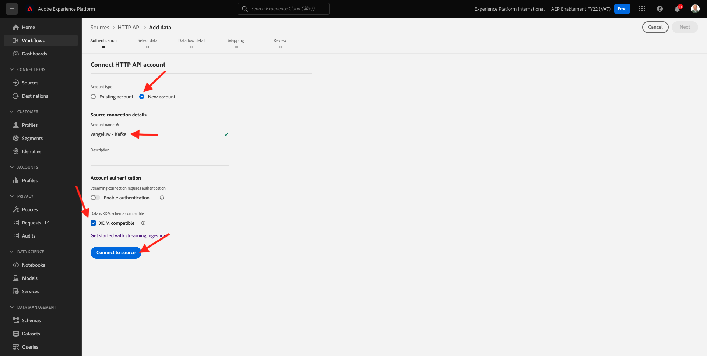
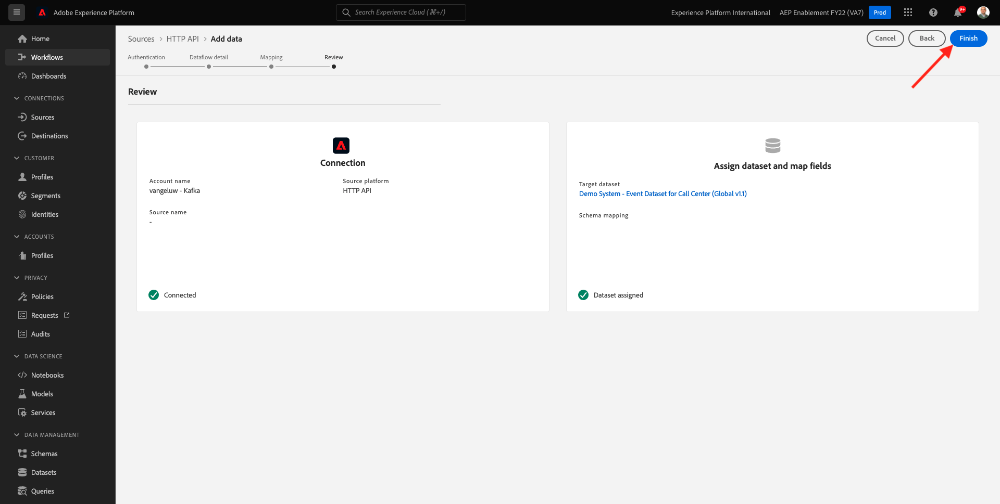

# 15.3 Configurar el extremo de transmisión de API HTTP en Adobe Experience Platform

Antes de configurar el conector de Adobe Experience Platform Sink en Kafka, debe crear un conector de origen de API HTTP en Adobe Experience Platform. La URL de extremo de transmisión de API HTTP es necesaria para configurar el conector de Adobe Experience Platform Sink.

Para crear un conector de origen de API HTTP, inicie sesión en Adobe Experience Platform en esta dirección URL: [https://experience.adobe.com/platform](https://experience.adobe.com/platform).

Después de iniciar sesión, llegará a la página principal de Adobe Experience Platform.

Antes de continuar, debe seleccionar un **entorno limitado**. El nombre del simulador de pruebas que se va a seleccionar es ``--aepSandboxId--``. Para ello, haga clic en el texto **[!UICONTROL Producción]** en la línea azul de la parte superior de la pantalla. Después de seleccionar el simulador para pruebas apropiado, verá el cambio de pantalla y ahora estará en su simulador para pruebas dedicado.

En el menú de la izquierda, vaya a **Fuentes** y desplácese hacia abajo en el **Catálogo de fuentes** hasta que vea **API HTTP**. Haga clic en **Agregar datos**.

Haga clic en **Nueva cuenta**. Uso `--demoProfileLdap-- - Kafka` como nombre de la conexión API HTTP, en este caso **vangeluw - Kafka**. Active la casilla de verificación para **Compatible con XDM**. Haga clic en **Conectar a origen**.

A continuación, verá esto, haga clic en **Siguiente**.

Select **Conjunto de datos existente**, abra el menú desplegable . Buscar y seleccionar el conjunto de datos **Sistema de demostración: conjunto de datos de evento para el centro de llamadas (Global v1.1)**.

Haga clic en **Siguiente**.

Haga clic en **Siguiente**.

Haga clic en **Finalizar**.

A continuación, verá una descripción general del conector de origen de API HTTP que acaba de crear.

Tendrá que copiar el **Punto final de transmisión** URL, que se parece a la de abajo, como la necesitará en el próximo ejercicio.

`https://dcs.adobedc.net/collection/d282bbfc8a540321341576275a8d052e9dc4ea80625dd9a5fe5b02397cfd80dc`

Ha terminado este ejercicio.

Paso siguiente: [15.4 Instalar y configurar Kafka Connect y el conector Adobe Experience Platform Sink](./ex4.md)

[Volver al módulo 15](./aep-apache-kafka.md)

[Volver a todos los módulos](../../overview.md)
