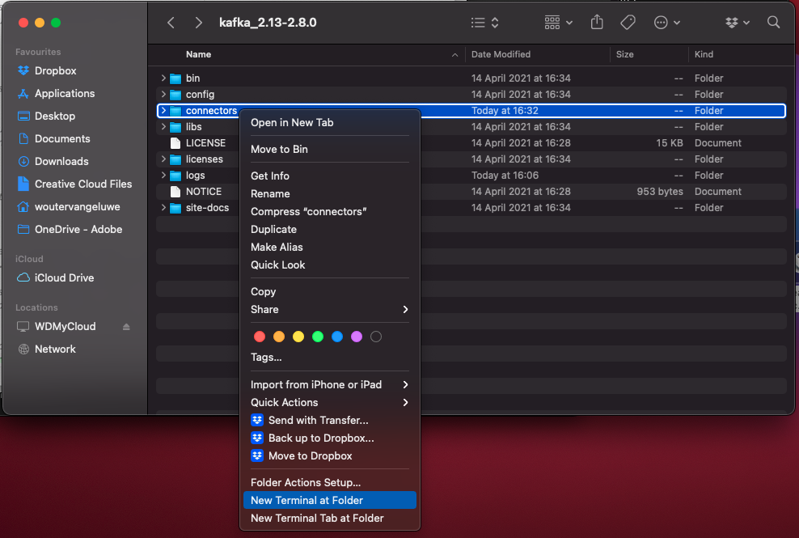
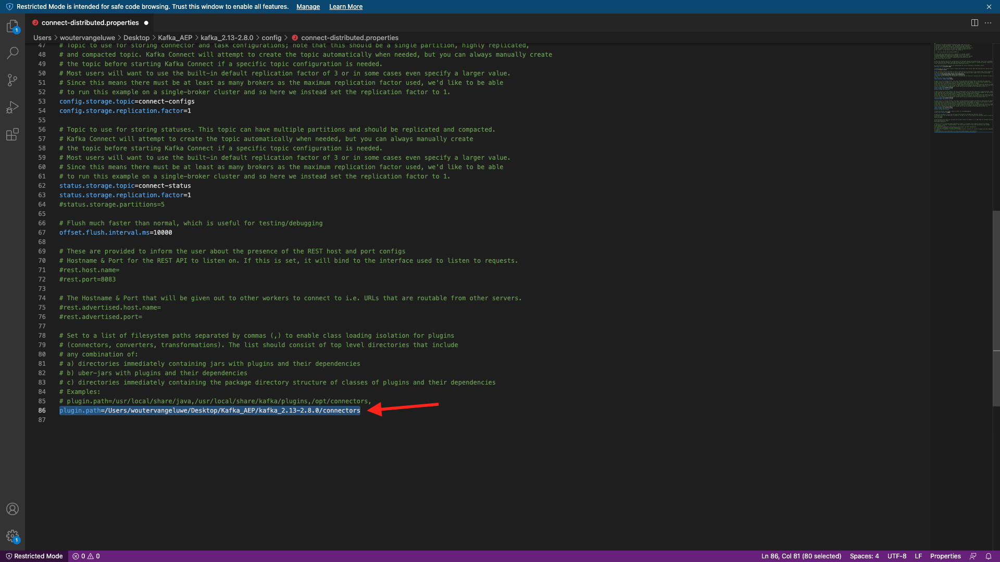
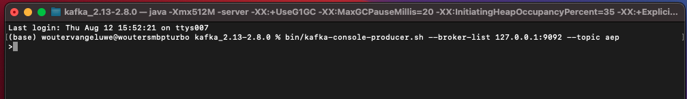

# 15.4 Instalar y configurar Kafka Connect y el conector Adobe Experience Platform Sink

## 15.4.1 Descarga del conector Adobe Experience Platform Sink

Vaya a [https://github.com/adobe/experience-platform-streaming-connect/releases](https://github.com/adobe/experience-platform-streaming-connect/releases) y descargue la última versión oficial del conector Adobe Experience Platform Sink.


Coloque el archivo de descarga, **streaming-connect-sipador-0.0.14-java-11.jar**, en el escritorio.


## 15.4.2 Configuración de Kafka Connect

Vaya a la carpeta de su escritorio denominada **Kafka_AEP** y vaya a la carpeta `kafka_2.13-3.1.0/config`.
En esa carpeta, abra el archivo . **connect-distribution.properties** con cualquier editor de texto.


En el Editor de texto, vaya a las líneas 34 y 35 y asegúrese de definir los campos `key.converter.schemas.enable` y `value.converter.schemas.enable` a `false`

```json
key.converter.schemas.enable=false
value.converter.schemas.enable=false
```

Guarde los cambios en este archivo.


A continuación, vuelva a la carpeta . `kafka_2.13-3.1.0` y cree manualmente una nueva carpeta y asígnele un nombre `connectors`.


Haga clic con el botón derecho en la carpeta y haga clic en **Nuevo terminal en la carpeta**.



Entonces verás esto. Introduzca el comando `pwd` para recuperar la ruta completa de esa carpeta. Seleccione la ruta completa y cópiela en el portapapeles.


Vuelva al Editor de texto, al archivo . **connect-distribution.properties** y desplácese hacia abajo hasta la última línea (línea 86 en la captura de pantalla). Debe anular el comentario de la línea que empieza por `# plugin.path=` y debe pegar la ruta completa en la carpeta denominada `connectors`. El resultado debería ser similar al siguiente:

`plugin.path=/Users/woutervangeluwe/Desktop/Kafka_AEP/kafka_2.13-3.1.0/connectors`

Guarde los cambios en el archivo **connect-distribution.properties** y cierre el Editor de texto.



A continuación, copie la última versión oficial del conector Adobe Experience Platform Sink que descargó en la carpeta denominada `connectors`. El nombre del archivo que descargó anteriormente es **streaming-connect-sipador-0.0.14-java-11.jar**, simplemente puede moverlo a la `connectors` carpeta.


A continuación, abra una nueva ventana de terminal en el nivel del **kafka_2.13-3.1.0** carpeta. Haga clic con el botón derecho en esa carpeta y haga clic en **Nuevo terminal en la carpeta**.

En la ventana Terminal , pegue este comando: `bin/connect-distributed.sh config/connect-distributed.properties` y haga clic en **Entrar**. Este comando iniciará Kafka Connect y cargará la biblioteca del conector Adobe Experience Platform Sink.


Después de un par de segundos, verá algo así:


## 15.4.3 Crear el conector Adobe Experience Platform Sink con Postman

Ahora puede interactuar con Kafka Connect mediante Postman. Para ello, descargue [esta colección de Postman](../../assets/postman/postman_kafka.zip) y descomprima el equipo local en el escritorio. A continuación, tendrá un archivo llamado `Kafka_AEP.postman_collection.json`.


Debe importar este archivo en Postman. Para ello, abra Postman y haga clic en **Importar**, arrastre y suelte el archivo `Kafka_AEP.postman_collection.json` en la ventana emergente y haga clic en **Importar**.


Encontrará esta colección en el menú izquierdo de Postman. Haga clic en la primera solicitud, **Conectores Kafka Connect disponibles para GET** para abrirlo.


Entonces verás esto. Haga clic en el icono azul **Enviar** , después de lo cual debería ver una respuesta vacía `[]`. La respuesta vacía se debe a que no hay conectores Kafka Connect definidos actualmente.


Para crear un conector, haga clic en para abrir la segunda solicitud en la colección Kafka, **POST Crear conector de AEP Sink**. Entonces verás esto. En la línea 11, donde dice **&quot;aep.endpoint&quot;: &quot;&quot;**, debe pegar la URL del extremo de flujo de API HTTP que recibió al final del ejercicio. [15,3](./ex3.md). La URL de extremo de transmisión de API HTTP tiene este aspecto: `https://dcs.adobedc.net/collection/d282bbfc8a540321341576275a8d052e9dc4ea80625dd9a5fe5b02397cfd80dc`.


Después de pegarlo, el cuerpo de la solicitud debería tener este aspecto. Haga clic en el icono azul **Enviar** para crear el conector. Obtendrá una respuesta inmediata de la creación de su conector.


Haga clic en la primera solicitud, **Conectores Kafka Connect disponibles para GET** para abrirlo de nuevo y haga clic en el botón azul **Enviar** de nuevo. ahora verá que se ha creado un conector Kafka Connect.


A continuación, abra la tercera solicitud de la colección Kafka, **Comprobación del estado del conector Kafka Connect**. Haga clic en el icono azul **Enviar** , obtendrá una respuesta como la que se muestra a continuación, indicando que el conector se está ejecutando.


## 15.4.4 Producir un evento de experiencia

Abra una nueva **Terminal** haciendo clic con el botón derecho en la carpeta **kafka_2.13-3.1.0** y haga clic en **Nuevo terminal en la carpeta**.


Introduzca el siguiente comando:

`bin/kafka-console-producer.sh --broker-list 127.0.0.1:9092 --topic aep`


Entonces verás esto. Cada nueva línea seguida del pulsador del botón Enter dará como resultado que se envíe un nuevo mensaje al tema **aep**.



Ahora puede enviar un mensaje, que resultará en que el conector Adobe Experience Platform Sink lo consuma y que se incorporará en Adobe Experience Platform en tiempo real.

Hagamos una pequeña demostración para probar esto.

Vaya a [https://builder.adobedemo.com/projects](https://builder.adobedemo.com/projects). Después de iniciar sesión en Adobe ID, verá esto. Haga clic en el proyecto del sitio web para abrirlo.


En el **Pantallas** página, haga clic en **Ejecutar**.


Verá que su sitio web de demostración se abre. Seleccione la dirección URL y cópiela en el portapapeles.


Abra una nueva ventana del explorador incógnito.


Pegue la dirección URL del sitio web de la demostración, que copió en el paso anterior. A continuación, se le pedirá que inicie sesión con su Adobe ID.


Seleccione su tipo de cuenta y complete el proceso de inicio de sesión.


Verá su sitio web cargado en una ventana del navegador incógnito. Para cada demostración, tendrá que usar una ventana nueva del explorador incógnito para cargar la URL de su sitio web de demostración.


Haga clic en el icono del logotipo de Adobe en la esquina superior izquierda de la pantalla para abrir el Visor de perfiles.


Consulte el panel Visualizador de perfiles y el perfil del cliente en tiempo real con el **ID de Experience Cloud** como identificador principal para este cliente actualmente desconocido.


Vaya a la página Registro/Inicio de sesión . Haga clic en **CREAR UNA CUENTA**.


Complete los detalles y haga clic en **Registro** después de lo cual, se le redirigirá a la página anterior.


Abra el panel Visor de perfiles y vaya a Perfil del cliente en tiempo real. En el panel Visor de perfiles, debería ver todos los datos personales mostrados, como los identificadores de correo electrónico y teléfono recién agregados.


Puede ver algunos eventos de experiencia basados en actividades anteriores.


Cambiemos eso y enviemos un evento de experiencia Callcenter de Kafka a Adobe Experience Platform.

Tome la siguiente carga útil de evento de experiencia de ejemplo y cópiela en un Editor de texto.

```json
{
  "header": {
    "datasetId": "61fe23fd242870194a6d779c",
    "imsOrgId": "--aepImsOrgID--",
    "source": {
      "name": "Launch"
    },
    "schemaRef": {
      "id": "https://ns.adobe.com/experienceplatform/schemas/b0190276c6e1e1e99cf56c99f4c07a6e517bf02091dcec90",
      "contentType": "application/vnd.adobe.xed-full+json;version=1"
    }
  },
  "body": {
    "xdmMeta": {
      "schemaRef": {
        "id": "https://ns.adobe.com/experienceplatform/schemas/b0190276c6e1e1e99cf56c99f4c07a6e517bf02091dcec90",
        "contentType": "application/vnd.adobe.xed-full+json;version=1"
      }
    },
    "xdmEntity": {
      "eventType": "callCenterInteractionKafka",
      "_id": "",
      "timestamp": "2022-02-23T09:54:12.232Z",
      "_experienceplatform": {
        "identification": {
          "core": {
            "phoneNumber": ""
          }
        },
        "interactionDetails": {
          "core": {
            "callCenterAgent": {
              "callID": "Support Contact - 3767767",
              "callTopic": "contract",
              "callFeeling": "negative"
            }
          }
        }
      }
    }
  }
}
```

Entonces verás esto. Debe actualizar manualmente 2 campos:

- **_id**: configúrelo en un id aleatorio, algo como `--demoProfileLdap--1234`
- **timestamp**: actualizar la marca de tiempo a la fecha y hora actuales
- **phoneNumber**: introduzca el phoneNumber de la cuenta que acaba de crearse en el sitio web de demostración. Puede encontrarlo en el panel Visor de perfiles en **Identidades**.

También debe comprobar y actualizar estos campos:
- **datasetId**: debe copiar el ID del conjunto de datos para el sistema de demostración del conjunto de datos: conjunto de datos de evento para el centro de llamadas (Global v1.1)
- **imsOrgID**: su ID de organización de IMS es `--aepImsOrgId--`

>[!NOTE]
>
>El campo **_id** debe ser único para cada ingesta de datos. Si produce varios eventos, asegúrese de actualizar el campo **_id** cada vez a un nuevo valor único.


Entonces debería tener algo como esto:


A continuación, copie el evento de experiencia completo en el portapapeles. El espacio en blanco de su carga útil JSON debe eliminarse y utilizaremos una herramienta en línea para hacerlo. Vaya a [http://jsonviewer.stack.hu/](http://jsonviewer.stack.hu/) para hacer eso.


Pegue el evento de experiencia en el editor y haga clic en **Eliminar espacio en blanco**.


A continuación, seleccione todo el texto de salida y cópielo en el portapapeles.


Vuelva a la ventana Terminal .


Pegue la nueva carga útil sin espacios en blanco en la ventana Terminal y haga clic en **Entrar**.


A continuación, vuelva al sitio web de demostración y actualice la página. Ahora debería ver un evento de experiencia en su perfil, en **Otros eventos**, igual que el de abajo:


>[!NOTE]
>
>Si desea que las interacciones del centro de llamadas aparezcan en el panel Visor de perfiles , debe añadir la etiqueta siguiente y filtrar el proyecto en [https://builder.adobedemo.com/projects](https://builder.adobedemo.com/projects), accediendo a la pestaña **Visor de perfiles**.


Ha terminado este ejercicio.

Paso siguiente: [Resumen y beneficios](./summary.md)

[Volver al módulo 15](./aep-apache-kafka.md)

[Volver a todos los módulos](../../overview.md)
