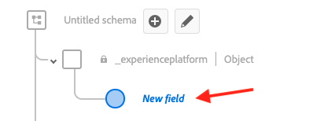
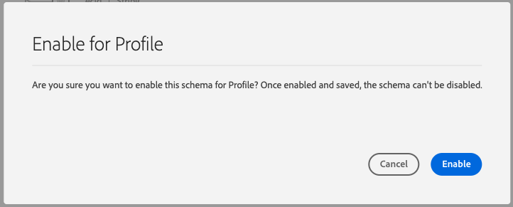
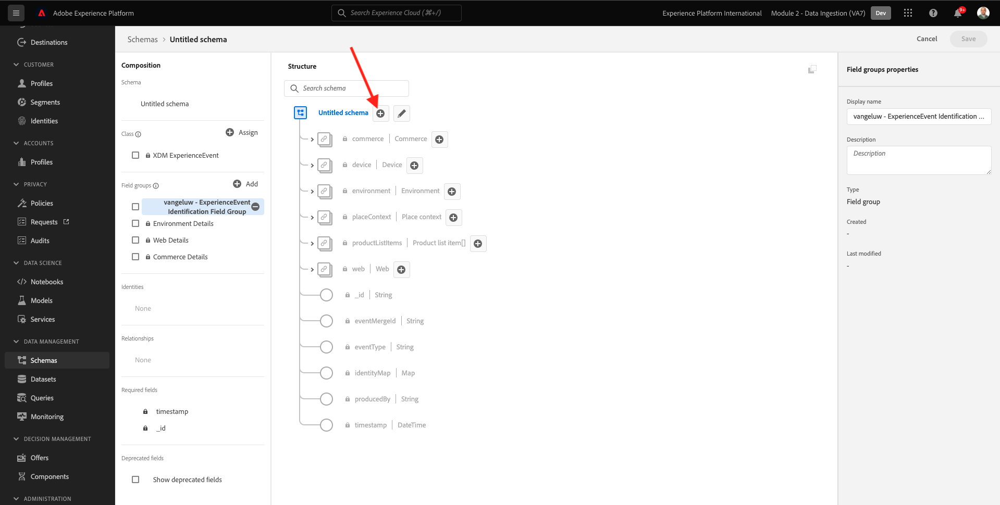

# 2.2 Configurar esquemas y definir identificadores

En este ejercicio, debe configurar los esquemas XDM necesarios para clasificar la información de perfil y el comportamiento del cliente. En cada esquema XDM, también tendrá que configurar un identificador principal para vincular toda la información.

## Historia

Antes de empezar a configurar los identificadores principales del esquema XDM y a configurar los identificadores principales, tenemos que pensar en el contexto empresarial de lo que estamos intentando hacer:

- Desea datos
- Desea vincular datos a un cliente
- Desea crear un perfil de cliente progresivo y en tiempo real

Hay dos tipos de datos que queremos capturar:

- ¿Quién es este cliente?
- ¿Qué hace este cliente?

Sin embargo, la pregunta **¿Quién es este cliente?** es una pregunta muy abierta que tiene muchas respuestas. Cuando su empresa quiere que esta pregunta sea respondida, está buscando información demográfica como Nombre, Apellido y Dirección. Pero también para información de contacto como una dirección de correo electrónico o un número de teléfono móvil. Y también para información relacionada con Idioma, OptIn/OptOut y tal vez incluso Imágenes de Perfil. Y finalmente, lo que realmente necesita saber, es cómo identificaremos a este cliente en los diversos sistemas que usa su empresa.

Lo mismo ocurre con la pregunta **¿Qué hace este cliente?**. Es una pregunta muy abierta con muchas respuestas. Cuando su empresa desee que se responda a esta pregunta, está buscando cualquier interacción que un cliente haya tenido con cualquiera de sus propiedades en línea y sin conexión. ¿Qué páginas o productos se han visitado? ¿Ha agregado este cliente un producto al carro o incluso ha comprado un artículo? ¿Qué dispositivo y navegador se ha utilizado para examinar el sitio web? ¿Qué tipo de información busca este cliente y cómo podemos utilizarla para configurar y ofrecer una experiencia deliciosa a este cliente? Y finalmente, lo que realmente necesitamos saber, es cómo vamos a identificar a este cliente en los diversos sistemas que utilizará su empresa.

## 2.1.1: Quién es este cliente

Captura de la respuesta a **¿Quién es este cliente?** para su empresa se realiza a través de la página de inicio de sesión/registro.

Desde la perspectiva del esquema, vemos esto como una **Clase**. La pregunta: **¿Quién es este cliente?** es algo que definimos en la clase **[!UICONTROL Perfil individual XDM]**.

Por lo tanto, cuando crea un esquema XDM para capturar la respuesta a **¿Quién es este cliente?**, primero que todo, debe crear y definir 1 esquema que haga referencia a la clase **[!UICONTROL Perfil individual XDM]**.

Para especificar qué tipo de respuestas se pueden dar a esa pregunta, debe definir [!UICONTROL Grupos de campos]. [!UICONTROL Grupos de campos] son extensiones de la clase Profile y tienen configuraciones muy específicas. Por ejemplo, la información demográfica como Nombre, Apellido, Sexo y Cumpleaños forman parte de [!UICONTROL Grupo de campos]: **[!UICONTROL Detalles demográficos]**.

En segundo lugar, su empresa debe decidir cómo identificar a este cliente. En el caso de su empresa, el identificador principal de un cliente conocido puede ser un ID de cliente específico, como, por ejemplo, una dirección de correo electrónico. Pero técnicamente, hay otras formas de identificar a un cliente en su empresa, como usar un número de teléfono móvil.
En este laboratorio, definiremos la dirección de correo electrónico como identificador principal y el número de teléfono como identificador secundario.

Por último, es importante distinguir el canal en el que se capturaron los datos. En este caso, hablamos de registros de sitios web y el esquema que debe definirse debe reflejar **donde** se capturaron los datos de registro. El canal también tendrá un papel importante en la influencia de los datos capturados. Como tal, se recomienda definir los esquemas para cada combinación de canal, identificador principal y tipo de datos recopilados.

En función de lo anterior, deberá configurar un esquema en Adobe Experience Platform.

Inicie sesión en Adobe Experience Platform accediendo a esta URL: [https://experience.adobe.com/platform](https://experience.adobe.com/platform).

Después de iniciar sesión, llegará a la página principal de Adobe Experience Platform.

Antes de continuar, debe seleccionar un **entorno limitado**. El nombre del simulador de pruebas que se va a seleccionar es ``--module2sandbox--``. Para ello, haga clic en el texto **[!UICONTROL Producción]** en la línea azul de la parte superior de la pantalla. Después de seleccionar el simulador para pruebas apropiado, verá el cambio de pantalla y ahora estará en su simulador para pruebas dedicado.

En Adobe Experience Platform, haga clic en **[!UICONTROL Esquemas]** en el menú de la izquierda de la pantalla. Verá la lista de [!UICONTROL Esquemas].

Debe crear un nuevo esquema. Para crear un nuevo esquema, haga clic en el botón . **[!UICONTROL + Crear esquema]** y seleccione **[!UICONTROL Perfil individual XDM]**.

Después de hacer clic en el botón **[!UICONTROL + Crear esquema]** , se crea un nuevo esquema y se le pedirá que seleccione o cree **grupos de campos**.

Ahora debe definir qué respuesta a la pregunta **¿Quién es este cliente?** debería parecerse a.
En la introducción de este laboratorio, hemos observado la necesidad de los siguientes atributos para definir un cliente:

- Información demográfica como Nombre, Apellido y Dirección
- Información de contacto como una dirección de inicio, una dirección de correo electrónico o un número de teléfono móvil
- Otra información vinculada a Idioma, Inclusión/Exclusión e incluso imágenes de perfil.
- Identificador principal de un cliente

Para que esa información forme parte del esquema, debe añadir lo siguiente [!UICONTROL Grupos de campos] al esquema:

- Información demográfica
- Detalles de contacto personal (información de contacto)
- Detalles de preferencia (otra información)
- grupo de campos de identificación de perfil personalizado de su empresa (identificadores principales y secundarios)

En el **[!UICONTROL Agregar grupo de campos]** seleccione [!UICONTROL Grupo de campos] **[!UICONTROL Detalles demográficos]**, **[!UICONTROL Detalles de contacto personal]** y **[!UICONTROL Detalles de preferencia]**.

Haga clic en el **[!UICONTROL Agregar grupos de campos]** para agregar la variable [!UICONTROL Grupo de campos] al esquema.

Ahora tendrá esto:

A continuación, necesita una nueva [!UICONTROL Grupo de campos] para capturar el **[!UICONTROL Identificador]** se utiliza para la recopilación de datos. Como ha visto en el ejercicio anterior, hay un concepto de identificadores primarios y secundarios. Un identificador principal es el más importante, ya que todos los datos recopilados se vincularán a este identificador.

Ahora creará su propia [!UICONTROL Grupo de campos] y como tal, ampliará el [!UICONTROL Esquema XDM] para satisfacer las necesidades de su propia empresa.

Haga clic en el **[!UICONTROL + Agregar]** para empezar a agregar un [!UICONTROL Grupo de campos].

En lugar de reutilizar una [!UICONTROL Grupo de campos], ahora creará su propio [!UICONTROL Grupo de campos]. Para ello, seleccione **[!UICONTROL Crear nuevo grupo de campos]**.

Ahora debe proporcionar una **[!UICONTROL Nombre para mostrar]** y **[!UICONTROL Descripción]** para el nuevo [!UICONTROL Grupo de campos].

Como nombre para nuestro esquema, utilizaremos esto:
`--demoProfileLdap-- - Profile Identification Field Group`

Como ejemplo, para ldap **[!UICONTROL vangeluw]**, este debe ser el nombre del esquema:

**[!UICONTROL vangeluw - Grupo de campos de identificación de perfil]**

Eso debería darle algo así:

Haga clic en el **[!UICONTROL Agregar grupos de campos]** para añadir el [!UICONTROL Grupo de campos] al esquema.

Ahora debería tener esta estructura de esquema en su lugar.

El nuevo [!UICONTROL Grupo de campos] sigue vacío, por lo que ahora tendrá que añadir campos a [!UICONTROL Grupo de campos].
En el [!UICONTROL Grupo de campos]-list, haga clic en su [!UICONTROL Grupo de campos].

Ahora aparece un número de botones nuevos.

En el nivel superior del esquema, haga clic en el botón **[!UICONTROL + Agregar campo]** botón.

Después de hacer clic en el botón **[!UICONTROL + Agregar campo]** ahora verá un nuevo **[!UICONTROL object]** en el esquema. Este objeto representa un **[!UICONTROL object]** en el esquema y recibe el nombre de su ID de inquilino de Adobe Experience Platform. Su ID de inquilino de Adobe Experience Platform es `--aepTenantId--`.

Ahora agregará un nuevo objeto debajo de ese inquilino. Para ello, haga clic en el campo **[!UICONTROL Campo nuevo]** en el inquilino-objeto.

Utilice estas definiciones de objeto:

- Nombre del campo: **[!UICONTROL identificación]**
- Nombre para mostrar:  **[!UICONTROL identificación]**
- Tipo: **[!UICONTROL Objeto]**

Haga clic en **[!UICONTROL Aplicar]** para guardar los cambios.

Después de hacer clic en **[!UICONTROL Aplicar]**, ahora verá su **[!UICONTROL identificación]** en el Esquema.

Ahora, agregará 3 campos nuevos en la sección  **[!UICONTROL identificación]** objeto:

- ecid:
   - Nombre del campo: **[!UICONTROL ecid]**
   - Nombre para mostrar:  **[!UICONTROL ecid]**
   - Tipo:**[!UICONTROL String]**

- emailId
   - Nombre del campo: **[!UICONTROL emailId]**
   - Nombre para mostrar:  **[!UICONTROL emailId]**
   - Tipo:**[!UICONTROL String]**

- mobilenr
   - Nombre del campo: **[!UICONTROL mobilenr]**
   - Nombre para mostrar:  **[!UICONTROL mobilenr]**
   - Tipo:**[!UICONTROL String]**

Cada campo se definirá como tipo **[!UICONTROL Cadena]** y configuraremos estos campos como **[!UICONTROL Identidades]**. Para el esquema **[!UICONTROL Esquema de registro del sitio web]**, suponemos que un cliente siempre se identificará por su dirección de correo electrónico, lo que significa que debe configurar el campo **[!UICONTROL emailId]** como **[!UICONTROL principal]** y los demás campos como **[!UICONTROL secundario]** identificadores.

Para añadir los campos, haga clic en el botón **[!UICONTROL +]** junto al botón **[!UICONTROL identificación]** objeto.

Ahora tiene un campo vacío. Debe configurar los 3 campos anteriores como se indica.

Así es como cada campo debe cuidar de la configuración inicial del campo.

Haga clic en el **[!UICONTROL +]** junto al botón **[!UICONTROL identificación]** para crear un nuevo campo y rellenar los campos como se indica.

- ecid

Para guardar el campo, desplácese hacia abajo en la **[!UICONTROL Propiedades de campo]** hasta que vea el botón **[!UICONTROL Aplicar]**. Haga clic en el **[!UICONTROL Aplicar]** botón.

Haga clic en el **[!UICONTROL +]** junto al botón **[!UICONTROL identificación]** para crear un nuevo campo y rellenar los campos como se indica.

- emailId

Para guardar el campo, desplácese hacia abajo en la **[!UICONTROL Propiedades de campo]** hasta que vea el botón **[!UICONTROL Aplicar]**. Haga clic en el **[!UICONTROL Aplicar]** botón.

Haga clic en el **[!UICONTROL +]** junto al botón **[!UICONTROL identificación]** para crear un nuevo campo y rellenar los campos como se indica.

- mobilenr

Para guardar el campo, desplácese hacia abajo en la **[!UICONTROL Propiedades de campo]** hasta que vea el botón **[!UICONTROL Aplicar]**. Haga clic en el **[!UICONTROL Aplicar]** botón.

Ahora tiene 3 campos, pero estos no se han definido como **[!UICONTROL Identidad]**-campos todavía.

Para empezar a definir estos campos como **[!UICONTROL Identidad]**-campos, siga estos pasos:

- Seleccione el campo **[!UICONTROL emailId]**.
- En el lado derecho, en las propiedades del campo, desplácese hacia abajo hasta que vea **[!UICONTROL Identidad]**. Marque la casilla de verificación para **[!UICONTROL Identidad]**.

   

- Ahora marque la casilla de verificación para **[!UICONTROL Identidad principal]**.

   

- Finalmente, seleccione el área de nombres **[!UICONTROL Correo electrónico]** de la lista de **[!UICONTROL Espacios de nombres]**. Identity Graph de Adobe Experience Platform utiliza un área de nombres para clasificar identificadores en áreas de nombres y definir la relación entre esas áreas de nombres.

   

- Finalmente, haga clic en **[!UICONTROL Aplicar]** para guardar los cambios.

   

A continuación, debe definir los demás campos para **[!UICONTROL ecid]** y **[!UICONTROL mobilenr]** como identificadores secundarios.

- Seleccione el campo **[!UICONTROL ecid]**.
- En el lado derecho, en las propiedades del campo, desplácese hacia abajo hasta que vea **[!UICONTROL Identidad]**. Marque la casilla de verificación para **[!UICONTROL Identidad]**.

   

- A continuación, seleccione el área de nombres **[!UICONTROL ECID]** de la lista de **[!UICONTROL Espacios de nombres]**. A [!UICONTROL Área de nombres] es utilizado por Identity Graph en Adobe Experience Platform para clasificar identificadores en áreas de nombres y definir la relación entre esas áreas de nombres.

   

- Haga clic en **[!UICONTROL Aplicar]** para guardar los cambios.

   

- Seleccione el campo **[!UICONTROL mobilenr]**.
- En el lado derecho, en las propiedades del campo, desplácese hacia abajo hasta que vea **[!UICONTROL Identidad]**. Marque la casilla de verificación para **[!UICONTROL Identidad]**.

   

- Asegúrese de seleccionar el área de nombres **[!UICONTROL Teléfono]** de la lista de **[!UICONTROL Espacios de nombres]**. Identity Graph de Adobe Experience Platform utiliza un área de nombres para clasificar identificadores en áreas de nombres y definir la relación entre esas áreas de nombres.

   

- Haga clic en **[!UICONTROL Aplicar]** para guardar los cambios.

   

La variable **[!UICONTROL identificación]** ahora debería tener el siguiente aspecto: los campos de id de 3 ahora también muestran un **[!UICONTROL huella digital]** para mostrar que se han definido como identificadores.

Asignemos un nombre al esquema. Seleccione el campo **Esquema sin título**.

Como nombre para nuestro esquema, debe utilizar esto:

`--demoProfileLdap-- - Demo System - Profile Schema for Website`

Reemplazar **[!UICONTROL ldap]** por su LDAP específico. Como ejemplo, para ldap **[!UICONTROL vangeluw]**, este debe ser el nombre del esquema:

**[!UICONTROL vangeluw - Sistema de demostración - Esquema de perfil para sitio web]**

Eso debería darle algo así:

Ahora ha definido un esquema vinculado, existente y recién creado [!UICONTROL Grupos de campos] y tienen identificadores definidos.

Haga clic en **[!UICONTROL Guardar]** para guardar los cambios.

Lo último que hay que hacer aquí es activar el esquema para que se vincule al **[!UICONTROL Perfil]**.
Al habilitar el esquema para Perfil, se asegura de que todos los datos enviados a Adobe Experience Platform con este esquema formen parte del entorno Perfil del cliente en tiempo real, lo que garantiza que todos esos datos se puedan utilizar en tiempo real para consultas, segmentación y activación.

Para ello, vamos a seleccionar el nombre de su esquema.

En la pestaña derecha del esquema, verá una **[!UICONTROL Alternar perfil]**, que está actualmente desactivado.

Active la variable [!UICONTROL Perfil] - haga clic en él para cambiar.

Verá este mensaje:

Haga clic en **[!UICONTROL Habilitar]** para habilitar este esquema para Perfil.

El esquema ahora está configurado para formar parte de la variable [!UICONTROL Perfil del cliente en tiempo real].

Finalmente, haga clic en **[!UICONTROL Guardar]** para guardar el esquema.

### 2.1.2 - Qué hace este cliente

Captura de la respuesta a la pregunta **¿Qué hace este cliente?** para su empresa se realiza, por ejemplo, mediante una vista de producto en una página de producto.

Desde una perspectiva de esquema, vemos esto como una **[!UICONTROL Clase]**. La pregunta: **¿Qué hace este cliente?** es algo que hemos definido en la clase **[!UICONTROL ExperienceEvent]**.

Por lo tanto, al crear un [!UICONTROL Esquema XDM] para capturar la respuesta a **¿Qué hace este cliente?**, primero que todo, debe crear y definir 1 esquema que haga referencia a la clase **[!UICONTROL ExperienceEvent]**.

Para especificar qué tipo de respuestas se pueden dar a esa pregunta, debe definir [!UICONTROL Grupo de campos]. [!UICONTROL Grupos de campos] son extensiones de [!UICONTROL ExperienceEvent]y tienen configuraciones muy específicas. Por ejemplo, la información sobre qué tipo de productos vio o agregó un cliente al carro de compras forma parte del [!UICONTROL Grupo de campos] **Detalles del comercio**.

En segundo lugar, su empresa debe decidir cómo identificará el comportamiento de este cliente. Dado que hablamos de interacciones en un sitio web, es posible que su empresa conozca al cliente, pero es igualmente posible que un visitante anónimo y anónimo esté activo en el sitio web. Por lo tanto, no podemos usar un identificador como la dirección de correo electrónico. En este caso, es probable que su empresa decida usar la variable [!UICONTROL ID de Experience Cloud (ECID)] como identificador principal.

Por último, es importante distinguir el canal en el que se capturaron los datos. En este caso, hablamos de interacciones de sitios web y el esquema que debe definirse debe reflejar **donde** se capturaron los datos de interacción. El canal también tendrá un papel importante en la influencia de los datos capturados. Como tal, se recomienda definir los esquemas para cada combinación de canal, identificador principal y tipo de datos recopilados.

En función de lo anterior, deberá configurar un esquema en Adobe Experience Platform.

Después de iniciar sesión, llegará a la página principal de Adobe Experience Platform.

Antes de continuar, debe seleccionar un **[!UICONTROL entorno limitado]**. La variable [!UICONTROL entorno limitado] para seleccionar, se llamará ``--module2sandbox--``. Para ello, haga clic en el texto **[!UICONTROL Producción]** en la línea azul de la parte superior de la pantalla. Después de seleccionar el simulador para pruebas apropiado, verá el cambio de pantalla y ahora estará en su simulador para pruebas dedicado.

En Adobe Experience Platform, haga clic en **[!UICONTROL Esquemas]** en el menú de la izquierda de la pantalla.

En [!UICONTROL Esquemas], verá todos los esquemas existentes.

Debe crear un nuevo esquema. Para crear un nuevo esquema, haga clic en el botón . **[!UICONTROL + Crear esquema]** y seleccione **[!UICONTROL XDM ExperienceEvent]**.

Después de hacer clic en el botón **[!UICONTROL + Crear esquema]** , se crea un nuevo esquema y se le pedirá que seleccione o cree **grupos de campos**.

Ahora debe definir qué respuesta a la pregunta **¿Qué hace este cliente?** debería parecerse a.
En la introducción de este laboratorio, hemos observado la necesidad de los siguientes atributos para definir lo que hace un cliente:

- ¿Qué páginas o productos se han visitado?
- ¿Ha agregado este cliente un producto al carro o incluso ha comprado un artículo?
- ¿Qué dispositivo y navegador se ha utilizado para examinar el sitio web?
- ¿Qué tipo de información busca este cliente y cómo podemos utilizarla para configurar y ofrecer una experiencia deliciosa a este cliente?
- Identificador principal de un cliente

Para que esa información forme parte del esquema, debe añadir lo siguiente [!UICONTROL Grupo de campos] al esquema:

- Detalles web
- Detalles del comercio
- Detalles del entorno
- la identificación de perfil personalizada de su empresa [!UICONTROL Grupo de campos] (Identificadores primarios y secundarios)

En el **[!UICONTROL Agregar grupo de campos]** seleccione [!UICONTROL Grupos de campos] **[!UICONTROL Detalles web]**, **[!UICONTROL Detalles del comercio]** y **[!UICONTROL Detalles del entorno]**.

Haga clic en el **[!UICONTROL Agregar grupos de campos]** para añadir el grupo de campos al esquema.

Entonces tendrá esto:

A continuación, debe crear una [!UICONTROL Grupo de campos] para capturar el **[!UICONTROL Identificador]** se utiliza para la recopilación de datos. Como ha visto en el ejercicio anterior, hay un concepto de identificadores primarios y secundarios. Un identificador principal es el más importante, ya que todos los datos recopilados se vincularán a este identificador.

Ahora creará su propia [!UICONTROL Grupo de campos] y como tal, ampliará el [!UICONTROL Esquema XDM] para satisfacer las necesidades de su propia empresa.

A [!UICONTROL Grupo de campos] está vinculado a un [!UICONTROL Clase], lo que significa que no puede simplemente reutilizar el [!UICONTROL Grupo de campos].

Haga clic en el **[!UICONTROL + Agregar]** para empezar a agregar un [!UICONTROL Grupo de campos].

En lugar de reutilizar una [!UICONTROL Grupo de campos], ahora creará su propio [!UICONTROL Grupo de campos]. Para ello, seleccione **[!UICONTROL Crear nuevo grupo de campos]**.

Ahora debe proporcionar una **[!UICONTROL Nombre para mostrar]** y **[!UICONTROL Descripción]** para el nuevo grupo de campos.

Como nombre del grupo de campos, utilice lo siguiente:

`--demoProfileLdap-- - ExperienceEvent Identification Field Group`

Como ejemplo, para ldap **[!UICONTROL vangeluw]**, este debe ser el nombre del esquema:

**[!UICONTROL vangeluw - Grupo de campos de identificación de ExperienceEvent]**

Eso debería darle algo así:

Haga clic en el **[!UICONTROL Agregar grupo de campos]** para añadir el [!UICONTROL Grupo de campos] al esquema.

Ahora debería tener esto [!UICONTROL Esquema] estructura en su lugar.

El nuevo [!UICONTROL Grupo de campos] sigue vacío, por lo que ahora tendrá que agregar campos a ese grupo de campos.
En el [!UICONTROL Grupo de campos]-list, haga clic en su [!UICONTROL Grupo de campos].

Ahora aparece un número de botones nuevos.

En el nivel superior del esquema, junto al nombre del esquema, haga clic en el botón **[!UICONTROL +]** botón.

Después de hacer clic en el botón **[!UICONTROL +]** ahora verá un nuevo **[!UICONTROL object]** en el esquema. Este objeto representa un **[!UICONTROL object]** en su [!UICONTROL Esquema] y recibe el nombre de su ID de inquilino de Adobe Experience Platform. Su ID de inquilino de Adobe Experience Platform es `--aepTenantId--`.

Ahora agregará un nuevo objeto debajo de ese inquilino. Para ello, haga clic en el campo **[!UICONTROL Campo nuevo]** en el inquilino-objeto.

Utilice estas definiciones de objeto:

- Nombre del campo: **[!UICONTROL identificación]**
- Nombre para mostrar:  **[!UICONTROL identificación]**
- Tipo: **[!UICONTROL Objeto]**

Desplácese hacia abajo y haga clic en **[!UICONTROL Aplicar]** para guardar los cambios.

Después de hacer clic en **[!UICONTROL Aplicar]**, ahora verá su **[!UICONTROL identificación]** en el Esquema.

Ahora agregará 1 nuevo campo en la sección  **[!UICONTROL identificación]** objeto.

Haga clic en el **[!UICONTROL +]** junto al botón **[!UICONTROL identificación]** para crear un nuevo campo.

El campo ECID se definirá como tipo **[!UICONTROL Cadena]** y configurará este campo como un **[!UICONTROL Identidad]**. Para el esquema **[!UICONTROL Sistema de demostración: Esquema de eventos para sitio web]**, suponemos que un cliente siempre se identificará por su [!UICONTROL ECID], lo que significa que debe configurar el campo **[!UICONTROL ECID]** como **principal** identifier

Ahora tiene un campo vacío. Debe configurar el campo anterior como se indica.

- ecid:

   - Nombre del campo: **[!UICONTROL ecid]**
   - Nombre para mostrar:  **[!UICONTROL ecid]**
   - Tipo:**[!UICONTROL String]**

Así es como la variable [!UICONTROL ecid]-field debe cuidar de la configuración inicial del campo:

Desplácese hacia abajo y haga clic en **[!UICONTROL Aplicar]**.

Ahora tiene un nuevo campo, pero este campo no se ha definido como **[!UICONTROL Identidad]**-field todavía.

Para empezar a definir estos campos como **[!UICONTROL Identidad]**-campos, siga estos pasos:

- Seleccione el campo **[!UICONTROL ecid]**.
- En el lado derecho, en las propiedades del campo, desplácese hacia abajo hasta que vea **[!UICONTROL Identidad]**. Marque la casilla de verificación para **[!UICONTROL Identidad]**.

- Ahora marque la casilla de verificación para **[!UICONTROL Identidad principal]**.

- Finalmente, seleccione el área de nombres **[!UICONTROL ECID]** de la lista de **[!UICONTROL Espacios de nombres]**. A [!UICONTROL Área de nombres] la usa el [!UICONTROL Gráfico de identidad] en Adobe Experience Platform para clasificar identificadores en áreas de nombres y definir la relación entre esas áreas de nombres.

   

- Finalmente, haga clic en **[!UICONTROL Aplicar]** para guardar los cambios.

   

La variable **[!UICONTROL identificación]** ahora debería tener este aspecto: el campo ecid ahora también muestra un **huella digital** para mostrar que se han definido como identificadores.

Asignemos un nombre al esquema. Seleccione el campo **Esquema sin título**.

Como nombre para nuestro esquema, utilizaremos esto:
`--demoProfileLdap-- - Demo System - Event Schema for Website`

Como ejemplo, para ldap **[!UICONTROL vangeluw]**, este debe ser el nombre del esquema:

**[!UICONTROL vangeluw - Sistema de demostración - Esquema de evento para el sitio web]**

Eso debería darle algo así:

Haga clic en **[!UICONTROL Guardar]** para guardar los cambios.

Es importante tener en cuenta que, al eventualmente ingerir datos con este esquema, se requieren algunos campos.
Por ejemplo, los campos **[!UICONTROL _id]** y **[!UICONTROL timestamp]** son campos obligatorios.

- _id necesita contener un id único para una ingesta de datos específica
- timestamp debe ser la marca de tiempo de esta visita, en formato **[!UICONTROL &quot;AAAA-MM-DDTHH:MM:SSSZ&quot;]**, como por ejemplo: **[!UICONTROL &quot;2019-04-08T07:20:000Z&quot;]**

Ahora ha definido un esquema vinculado, existente y recién creado [!UICONTROL Grupos de campos] y tienen identificadores definidos.

Lo último que hay que hacer aquí es activar el esquema para que se vincule al **[!UICONTROL Perfil]**.
Al habilitar el esquema para [!UICONTROL Perfil], debe asegurarse de que todos los datos enviados a Adobe Experience Platform con este esquema formen parte del perfil del cliente en tiempo real, lo que garantiza que todos esos datos se puedan utilizar en tiempo real para consultas, segmentación y activación.

Para ello, vamos a seleccionar el nombre de su esquema.

En la pestaña derecha del esquema, verá una **[!UICONTROL Perfil] alternar**, que está actualmente desactivado.

Active la variable [!UICONTROL Perfil] - haga clic en él para cambiar.

Verá este mensaje:

Haga clic en **[!UICONTROL Habilitar]** para habilitar este esquema para Perfil.

El esquema ahora está configurado para formar parte del perfil del cliente en tiempo real.

Finalmente, haga clic en **[!UICONTROL Guardar]** para guardar el esquema.

Ya ha finalizado la creación de esquemas activados para su uso en el Perfil del cliente en tiempo real.

Veamos los conjuntos de datos en el siguiente ejercicio.

Paso siguiente: [2.3 Configurar conjuntos de datos](./ex3.md)

[Volver al módulo 2](./data-ingestion.md)

[Volver a todos los módulos](../../overview.md)
