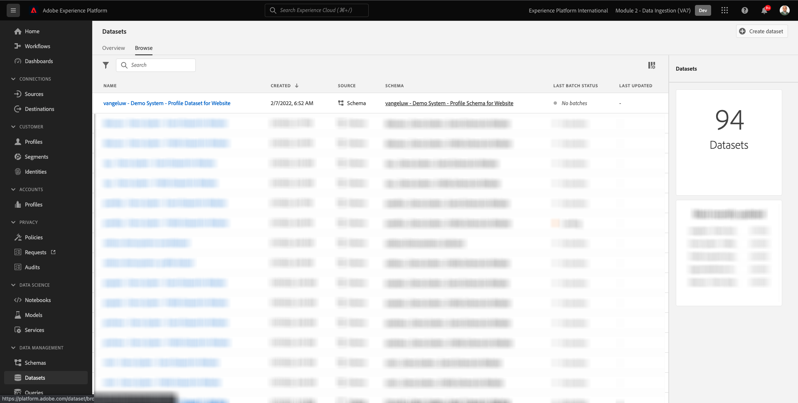
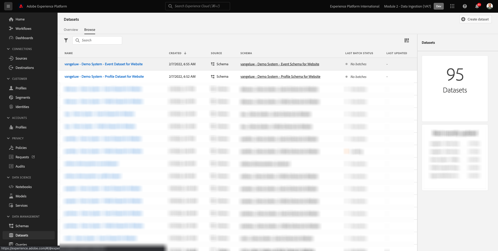

# 2.3 Configurar conjuntos de datos

En este ejercicio, configurará los conjuntos de datos necesarios para capturar y almacenar información de perfil y comportamiento del cliente. Todos los conjuntos de datos que cree en esto utilizarán uno de los esquemas que creó en el paso anterior.

## Historia

Después de definir la respuesta a las preguntas **¿Quién es este cliente?** y **¿Qué hace este cliente?** debería tener el aspecto siguiente: ahora debe crear un bloque que utilice esa información para recibir y validar los datos que se han enviado a Adobe Experience Platform.

## 2.3.1: Crear conjuntos de datos

Ahora necesita crear 2 conjuntos de datos:

- 1 conjunto de datos para capturar la información que responde a la variable **¿Quién es este cliente?** - pregunta.
- 1 conjunto de datos para capturar la información que responde a la variable **¿Qué hace este cliente?** - pregunta.

Inicie sesión en Adobe Experience Platform accediendo a esta URL: [https://experience.adobe.com/platform](https://experience.adobe.com/platform).

Después de iniciar sesión, llegará a la página principal de Adobe Experience Platform.

Antes de continuar, debe seleccionar un **[!UICONTROL entorno limitado]**. El nombre del simulador de pruebas que se va a seleccionar es ``--module2sandbox--``. Para ello, haga clic en el texto **[!UICONTROL Producción]** en la línea azul de la parte superior de la pantalla. Después de seleccionar los elementos adecuados [!UICONTROL entorno limitado], verá el cambio de pantalla y ahora estará en su [!UICONTROL entorno limitado].

En Adobe Experience Platform, haga clic en **[!UICONTROL Conjuntos de datos]** en el menú de la izquierda de la pantalla.  Verá esto:

Empecemos creando el conjunto de datos para capturar la información de registro del sitio web.

Debe crear un nuevo conjunto de datos. Para crear un nuevo conjunto de datos, haga clic en el botón . **[!UICONTROL + Crear conjunto de datos]**.

Después de hacer clic en el botón **[!UICONTROL + Crear conjunto de datos]** , verá la siguiente pantalla.

Debe definir un conjunto de datos del esquema definido en el paso anterior. Haga clic en el **[!UICONTROL Crear conjunto de datos a partir del esquema]** - .

En la siguiente pantalla, debe seleccionar el esquema que ha creado en 1, `--demoProfileLdap-- - Demo System - Profile Schema for Website`.

Después de seleccionar el esquema, haga clic en **[!UICONTROL Siguiente]** para continuar.

Asignemos un nombre a su conjunto de datos.

Como nombre de nuestro conjunto de datos, utilice esto:

`--demoProfileLdap-- - Demo System - Profile Dataset for Website`

Como ejemplo, para ldap **[!UICONTROL vangeluw]**, este debe ser el nombre del esquema:

**[!UICONTROL vangeluw - Sistema de demostración - Conjunto de datos de perfil para sitio web]**

Eso debería darle algo así:

Haga clic en **[!UICONTROL Finalizar]** para finalizar la configuración del conjunto de datos.

Ahora verá esto:

Vuelva a la [!UICONTROL Conjuntos de datos] información general. Ahora verá la ventana emergente del conjunto de datos que ha creado en la descripción general.

A continuación, configurará un segundo conjunto de datos para capturar las interacciones con el sitio web.

Debe crear un nuevo conjunto de datos. Para crear un nuevo conjunto de datos, haga clic en el botón . **[!UICONTROL + Crear conjunto de datos]**.

Después de hacer clic en el botón **[!UICONTROL + Crear conjunto de datos]** , verá la siguiente pantalla.

Debe definir un conjunto de datos del esquema definido en el paso anterior. Haga clic en el **[!UICONTROL Crear conjunto de datos a partir del esquema]** - .

En la siguiente pantalla, debe seleccionar el esquema creado en 2.2, `--demoProfileLdap-- - Demo System - Event Schema for Website`.

Después de seleccionar el esquema, haga clic en **[!UICONTROL Siguiente]** para continuar.

Asignemos un nombre a su conjunto de datos.

Como nombre de nuestro conjunto de datos, usaremos esto:

`--demoProfileLdap-- - Demo System - Event Dataset for Website`

Como ejemplo, para ldap **[!UICONTROL vangeluw]**, este debe ser el nombre del esquema:

**[!UICONTROL vangeluw - Sistema de demostración - Conjunto de datos de evento para el sitio web]**

Eso debería darle algo así:

Haga clic en **[!UICONTROL Finalizar]** para finalizar la configuración del conjunto de datos.

Verá esto:

Vuelva a la [!UICONTROL Conjuntos de datos] pantalla de información general.

Ahora debe habilitar sus conjuntos de datos para que formen parte del perfil del cliente en tiempo real de Adobe Experience Platform.

Abra el conjunto de datos `--demoProfileLdap--` - Sistema de demostración - Conjunto de datos de perfil para sitio web haciendo clic en él.

Busque la variable [!UICONTROL Perfil] en el lado derecho de la pantalla.

Haga clic en el [!UICONTROL Perfil] alternar para habilitar este conjunto de datos para [!UICONTROL Perfil].

Haga clic en el **[!UICONTROL Habilitar]**.

El conjunto de datos ahora está habilitado para [!UICONTROL Perfil].

Vuelva a la descripción general de los conjuntos de datos y abra su conjunto de datos `--demoProfileLdap-- - Demo System - Event Dataset` para el sitio web haciendo clic en él.

Busque la variable [!UICONTROL Perfil] en el lado derecho de la pantalla.

Haga clic en el [!UICONTROL Perfil] alternar para habilitar [!UICONTROL Perfil].

Haga clic en **[!UICONTROL Habilitar]**.

El conjunto de datos ahora está habilitado para [!UICONTROL Perfil].

Paso siguiente: [2.4 Ingesta de datos de fuentes sin conexión](./ex4.md)

[Volver al módulo 2](./data-ingestion.md)

[Volver a todos los módulos](../../overview.md)
