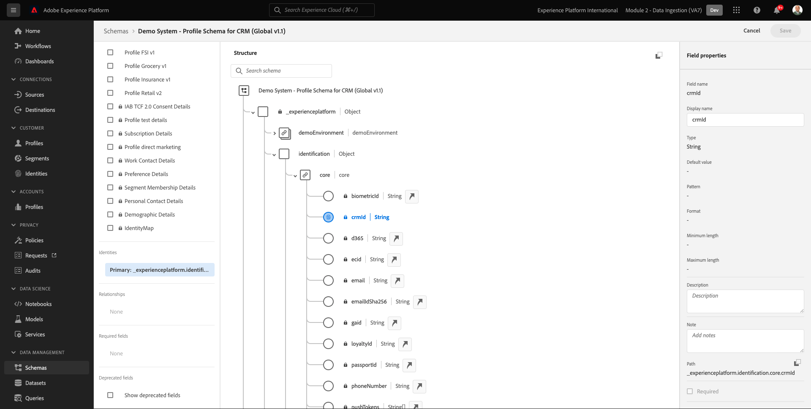
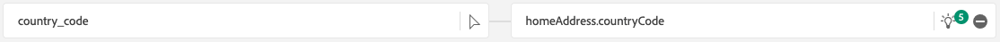
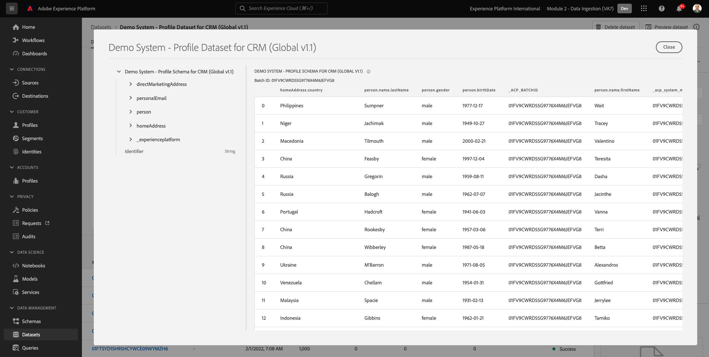

# 2.4 Ingesta de datos de fuentes sin conexión

En este ejercicio, el objetivo es incorporar datos externos como datos CRM en Platform.

## Objetivos de aprendizaje

- Obtenga información sobre cómo generar datos de prueba
- Obtenga información sobre cómo introducir CSV
- Aprenda a utilizar la interfaz de usuario web para la ingesta de datos a través de flujos de trabajo
- Comprender las características de control de datos de Experience Platform

## Recursos

- Interfaz de usuario de Mockaroo: [https://www.mockaroo.com/](https://www.mockaroo.com/)
- IU del Experience Platform: [https://experience.adobe.com/platform/](https://experience.adobe.com/platform/)

## Tareas

- Cree un archivo CSV con fecha de demostración. Ingeste el archivo CSV en Adobe Experience Platform utilizando los flujos de trabajo disponibles.
- Comprender las opciones de control de datos en Adobe Experience Platform

## 2.4.1 Crear su conjunto de datos CRM mediante una herramienta de generación de datos

Para ello, necesita 1000 líneas de muestra de datos CRM.

Abra la plantilla de Mockaroo en [https://www.mockaroo.com/12674210](https://www.mockaroo.com/12674210).

En la plantilla , verá los siguientes campos:

- id
- first_name
- last_name
- email
- gender
- birthDate
- home_latitude
- home_longitude
- country_code
- city
- country

Todos estos campos se han definido para producir datos compatibles con Platform.

Para generar el archivo CSV, haga clic en el botón **[!UICONTROL Descargar datos]** que le proporcionará un archivo CSV con 1000 líneas de datos de demostración.

Abra el archivo CSV en Microsoft Excel para visualizar su contenido.

Con el archivo CSV listo, puede continuar asignándolo a XDM.

### 2.4.2 Verificar el conjunto de datos de integración de CRM en Adobe Experience Platform

Apertura [Adobe Experience Platform](https://experience.adobe.com/platform) y vaya a **[!UICONTROL Conjuntos de datos]**.

Antes de continuar, debe seleccionar un **[!UICONTROL entorno limitado]**. El nombre del simulador de pruebas que se va a seleccionar es ``--module2sandbox--``. Para ello, haga clic en el texto **[!UICONTROL Producción]** en la línea azul de la parte superior de la pantalla. Después de seleccionar los elementos adecuados [!UICONTROL entorno limitado], verá el cambio de pantalla y ahora estará en su [!UICONTROL entorno limitado].

En Adobe Experience Platform, haga clic en **[!UICONTROL Conjuntos de datos]** en el menú de la izquierda de la pantalla.

Utilizará un conjunto de datos compartido basado en esta habilitación. El conjunto de datos compartido ya se ha creado y se llama **[!UICONTROL Sistema de demostración: conjunto de datos de perfil para CRM (Global v1.1)]**.

Abrir el conjunto de datos **[!UICONTROL Sistema de demostración: conjunto de datos de perfil para CRM (Global v1.1)]**.

En la pantalla de información general, puede ver 3 fragmentos de información principales.

En primer lugar, el [!UICONTROL Actividad de conjunto de datos] el panel muestra el número total de registros CRM en el conjunto de datos y los lotes ingestados y su estado

En segundo lugar, al desplazarse hacia abajo en la página, puede comprobar cuándo se introdujeron lotes de datos, cuántos registros se incorporaron y también si el lote se incorporó correctamente o no. La variable **[!UICONTROL ID de lote]** es el identificador de un trabajo por lotes específico y la variable **[!UICONTROL ID de lote]** es importante, ya que se puede utilizar para solucionar problemas por los que un lote específico no se ha incorporado correctamente.

Por último, la [!UICONTROL Información del conjunto de datos] muestra información importante como la [!UICONTROL ID de conjunto de datos] (de nuevo, importante desde una perspectiva de solución de problemas), el nombre del conjunto de datos y si el conjunto de datos estaba habilitado para Perfil.

La configuración más importante aquí es el vínculo entre el conjunto de datos y el esquema. El esquema define qué datos se pueden introducir y cómo deberían aparecer.

En este caso, estamos usando la variable **[!UICONTROL Sistema de demostración: Esquema de perfil para CRM (Global v1.1)]**, que se asigna a la clase de **[!UICONTROL Perfil]** y ha implementado extensiones, también denominadas grupos de campos.

Al hacer clic en el nombre del esquema, se le redirige al [!UICONTROL Esquema] información general en la que se pueden ver todos los campos activados para este esquema.

Cada esquema debe tener un descriptor primario personalizado definido. En el caso de nuestro conjunto de datos CRM, el esquema ha definido que el campo **[!UICONTROL crmId]** debe ser el identificador principal. Si desea crear un esquema y vincularlo al [!UICONTROL Perfil del cliente en tiempo real], debe definir una [!UICONTROL Grupo de campos] que hace referencia al descriptor principal.

En la captura de pantalla anterior, puede ver que nuestro descriptor se encuentra en `--aepTenantId--.identification.core.crmId`, que se establece como [!UICONTROL Identificador principal], vinculado al [!UICONTROL namespace] de **[!UICONTROL Sistema de demostración: CRMID]**.

Cada esquema y, como tal, cada conjunto de datos que debe utilizarse en la variable [!UICONTROL Perfil del cliente en tiempo real] debería tener uno [!UICONTROL Identificador principal]. Esta [!UICONTROL Identificador principal] es el usuario identificador por la marca para un cliente en ese conjunto de datos. En el caso de un conjunto de datos CRM, puede ser la dirección de correo electrónico o el ID de CRM, en el caso de un conjunto de datos del centro de llamadas puede ser el número móvil de un cliente.

Se recomienda crear un esquema específico independiente para cada conjunto de datos y establecer el descriptor para cada conjunto de datos específicamente para que coincida con el funcionamiento de las soluciones actuales utilizadas por la marca.

### 2.4.3 Uso de un flujo de trabajo para asignar un archivo CSV a un esquema XDM

El objetivo de esto es incorporar datos CRM en Platform. Todos los datos incorporados en Platform deben asignarse al esquema XDM específico. Lo que tiene actualmente es un conjunto de datos CSV con 1000 líneas por un lado y un conjunto de datos vinculado a un esquema por el otro lado. Para cargar ese archivo CSV en ese conjunto de datos, debe realizarse una asignación. Para facilitar este ejercicio de asignación, tenemos **[!UICONTROL Flujos de trabajo]** disponible en Adobe Experience Platform.

La variable [!UICONTROL flujo de trabajo] que usaremos aquí, es el [!UICONTROL flujo de trabajo] named **[!UICONTROL Asignar CSV al esquema XDM]** en el [!UICONTROL Ingesta de datos] para abrir el Navegador.

Haga clic en el **[!UICONTROL Asignar CSV al esquema XDM]** botón. Haga clic en **[!UICONTROL Launch]** para iniciar el proceso.

En la siguiente pantalla, debe seleccionar un conjunto de datos para introducir el archivo en. Tiene la opción de seleccionar un conjunto de datos ya existente o de crear uno nuevo. Para este ejercicio, reutilizaremos uno existente: seleccione **[!UICONTROL Sistema de demostración: conjunto de datos de perfil para CRM (Global v1.1)]** como se indica a continuación, deje los demás ajustes definidos como predeterminados.

Haga clic en **[!UICONTROL Siguiente]** para ir al siguiente paso.

Arrastre y suelte el archivo CSV o haga clic en **[!UICONTROL Examinar]** y vaya al escritorio del equipo y seleccione el archivo CSV.

Después de seleccionar el archivo CSV, se cargará inmediatamente y verá una vista previa del archivo en cuestión de segundos.

Haga clic en **[!UICONTROL Siguiente]** para ir al siguiente paso. Puede tardar unos segundos mientras el archivo se procesa por completo.

Ahora necesita asignar los encabezados de columna CSV con una propiedad XDM en su **[!UICONTROL Sistema de demostración: conjunto de datos de perfil para CRM]**.

Adobe Experience Platform ya ha hecho algunas propuestas al intentar vincular la variable [!UICONTROL Atributos de origen] con la variable [!UICONTROL Campos de esquema de Target].

Para la variable [!UICONTROL Asignaciones de esquemas], Adobe Experience Platform ya ha intentado vincular campos. Sin embargo, no todas las propuestas de asignación son correctas. Ahora necesita **Aceptar campos de destino** uno por uno.

#### birthDate

El campo Esquema de origen **birthDate** debe estar vinculado al campo de destino **person.birthDate**.

#### city

El campo Esquema de origen **city** debe estar vinculado al campo de destino **homeAddress.city**.

#### country

El campo Esquema de origen **country** debe estar vinculado al campo de destino **homeAddress.country**.

#### country_code

El campo Esquema de origen **country_code** debe estar vinculado al campo de destino **homeAddress.countryCode**.

#### email

El campo Esquema de origen **email** debe estar vinculado al campo de destino **personalEmail.address**.

#### crmid

El campo Esquema de origen ** crmid** debe estar vinculado al campo de destino **`--aepTenantId--`.identification.core.crmId**.

#### first_name

El campo Esquema de origen **first_name** debe estar vinculado al campo de destino **person.name.firstName**.

#### sexo

El campo Esquema de origen **sexo** debe estar vinculado al campo de destino **person.gender**.

#### home_latitude

El campo Esquema de origen **home_latitude** debe estar vinculado al campo de destino **homeAddress._schema.latitude**.

#### home_longitude

El campo Esquema de origen **home_longitude** debe estar vinculado al campo de destino **homeAddress._schema.longitude**.

#### id

El campo Esquema de origen **id** debe estar vinculado al campo de destino **_id**.

#### last_name

El campo Esquema de origen **last_name** debe estar vinculado al campo de destino **person.name.lastName**.

Ahora debería tener esto:

Haga clic en el **[!UICONTROL Finalizar]** para finalizar el flujo de trabajo.

Después de hacer clic en **[!UICONTROL Finalizar]**, verá el **Flujo de datos** información general, y después de un par de minutos, puede actualizar la pantalla para ver si el flujo de trabajo se ha completado correctamente. Haga clic en **Nombre del conjunto de datos de Target**.

A continuación, verá el conjunto de datos en el que se ha procesado su ingesta.

En el conjunto de datos, verá un [!UICONTROL ID de lote] que acaba de ingerirse, con 1000 registros incorporados y un estado de **[!UICONTROL Correcto]**.

Haga clic en el **[!UICONTROL Vista previa del conjunto de datos]**: para obtener una vista rápida de una pequeña muestra del conjunto de datos para asegurarse de que los datos cargados son correctos.

Una vez cargados los datos, puede definir el método de control de datos correcto para nuestro conjunto de datos.

### 2.5.4 Añadir el control de datos a su conjunto de datos

Ahora que los datos de sus clientes se han introducido, debe asegurarse de que este conjunto de datos esté regulado correctamente para el uso y el control de exportación. Haga clic en el **[!UICONTROL Administración de datos]** y observe que puede establecer tres tipos de restricciones: Datos contractuales, de identidad y confidenciales.

Puede encontrar más información sobre las diferentes etiquetas y cómo se aplican en el futuro a través del marco de políticas en este vínculo: [https://www.adobe.io/apis/experienceplatform/home/dule/duleservices.html](https://www.adobe.io/apis/experienceplatform/home/dule/duleservices.html)

Restrinjamos los datos de identidad para todo el conjunto de datos. Pase el ratón sobre el nombre del conjunto de datos y haga clic en el icono Lápiz para editar la configuración.

Vaya a **[!UICONTROL Datos de identidad]** y verá que la variable **[!UICONTROL I2]** está activada : esto supondrá que toda la información de este conjunto de datos es al menos indirectamente identificable por la persona.

Haga clic en **[!UICONTROL Guardar cambios]** y observe que **[!UICONTROL I2]** ahora se establece para todos los campos de datos del conjunto de datos.

También puede establecer estos indicadores para campos de datos individuales; por ejemplo, la variable **[!UICONTROL firstName]** es probable que se clasifique como un campo **[!UICONTROL I1]** para información directamente identificable.

Seleccione el campo **[!UICONTROL firstName]** marcando la casilla de verificación y haga clic en **[!UICONTROL Editar etiquetas de administración]** en la esquina superior derecha de la pantalla.

Vaya a **[!UICONTROL Datos de identidad]** y verá que la variable **[!UICONTROL I2]** ya está marcada (heredada del conjunto de datos). El campo firstName también tiene una configuración específica de campo y se establece como **[!UICONTROL I1: Datos de identificación directa]**.

Con esto, ahora ha introducido y clasificado correctamente los datos CRM en Adobe Experience Platform.

Paso siguiente: [2.5 Zona de aterrizaje de datos](./ex5.md)

[Volver al módulo 2](./data-ingestion.md)

[Volver a todos los módulos](../../overview.md)
