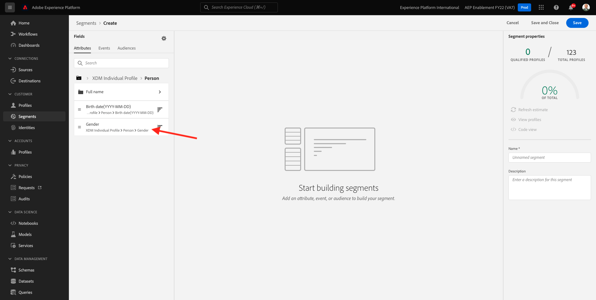
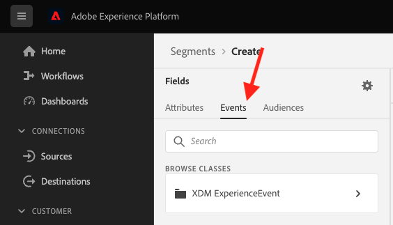

# 3.4 Crear un segmento: IU

En este ejercicio, creará un segmento utilizando el Generador de segmentos de Adobe Experience Platform.

## Historia

Vaya a [Adobe Experience Platform](https://experience.adobe.com/platform). Después de iniciar sesión, llegará a la página principal de Adobe Experience Platform.


Antes de continuar, debe seleccionar un **entorno limitado**. El nombre del simulador de pruebas que se va a seleccionar es ``--aepSandboxId--``. Para ello, haga clic en el texto **[!UICONTROL Producción]** en la línea azul de la parte superior de la pantalla. Después de seleccionar los elementos adecuados [!UICONTROL entorno limitado], verá el cambio de pantalla y ahora estará en su [!UICONTROL entorno limitado].


En el menú de la izquierda, vaya a **Segmentos**. En esta página puede ver información general sobre todos los segmentos existentes. Haga clic en el **+ Crear segmento** para empezar a crear un segmento nuevo.


Una vez que esté en el nuevo generador de segmentos, inmediatamente verá la variable **Atributos** y **Perfil individual XDM** referencia.


Dado que XDM es el idioma que impulsa el negocio de la experiencia, XDM también es la base del generador de segmentos. Todos los datos incorporados en Platform deben asignarse a XDM y, como tales, todos los datos pasan a formar parte del mismo modelo de datos independientemente de de la procedencia de dichos datos. Esto le ofrece una gran ventaja a la hora de crear segmentos, ya que desde esta interfaz de usuario del generador de segmentos puede combinar datos de cualquier origen en el mismo flujo de trabajo. Los segmentos creados dentro del Generador de segmentos se pueden enviar a soluciones como Adobe Target, Adobe Campaign y Adobe Audience Manager para su activación.

Generemos un segmento que incluya todos los **Masculino** clientes.

Para llegar al atributo gender, debe comprender y conocer XDM.

El género es un atributo de Persona que se puede encontrar en Atributos. Para llegar allí, empezarán haciendo clic en **Perfil individual XDM**. Entonces verás esto. En el **Perfil individual XDM** ventana, seleccione **Persona**.


Entonces verás esto. En **Persona**, puede encontrar la variable **Sexo** atributo. Arrastre el atributo Gender al generador de segmentos.



Ahora puede elegir el sexo específico entre las opciones previamente completadas. En este caso, vamos a elegir **Hombre**.


Después de seleccionar **Hombre**, puede obtener una estimación de la población del segmento presionando la variable **Actualizar estimación** botón. Esto es muy útil para un usuario empresarial, para que pueda ver el impacto de ciertos atributos en el tamaño de segmento resultante.


A continuación, verá una estimación como la siguiente:


A continuación, debería refinar un poco el segmento. Debe crear un segmento con todos los clientes masculinos que han visto el producto **Camisas protectoras (Naranja)**.

Para crear este segmento, debe agregar un Evento de experiencia. Para encontrar todos los eventos de experiencias, haga clic en el icono **Eventos** en el **Campos** barra de herramientas.



A continuación, verá el nivel superior, **ExperienceEvents de XDM** nodo . Haga clic en **XDM ExperienceEvent**.


Vaya a **Elementos de lista de productos**.


Select **Nombre** y arrastre y suelte el **Nombre** del menú de la izquierda al lienzo del generador de segmentos en el **Eventos** para obtener más información.


Verá esto:


El parámetro de comparación debe ser **es igual que** y en el campo de entrada, introduzca **MONTANA EÓLICO**.


Cada vez que agregue un elemento al Generador de segmentos, puede hacer clic en el botón **Actualizar estimación** para obtener una nueva estimación de la población en el segmento.

Hasta ahora, solo ha utilizado la interfaz de usuario para crear su segmento, pero también hay una opción de código para crear un segmento.

Al crear un segmento, está creando una consulta de lenguaje de consulta de perfil (PQL). Para visualizar el código PQL, puede hacer clic en el **Vista de código** en la esquina superior derecha del generador de segmentos.


Ahora puede ver la declaración PQL completa:

```sql
person.gender in ["male"] and CHAIN(xEvent, timestamp, [C0: WHAT(productListItems.exists(name.equals("MONTANA WIND JACKET", false)))])
```

También puede obtener una vista previa de una muestra de los perfiles de cliente que forman parte de este segmento, haciendo clic en **Ver perfiles**.


Finalmente, démosle un nombre al segmento y guárdelo.

Como convención de nomenclatura, utilice:

- `--demoProfileLdap-- - Male customers with interest in Montana Wind Jacket`


A continuación, haga clic en el **Guardar y cerrar** para guardar el segmento, tras lo cual volverá a la página de información general del segmento.


Ahora puede continuar con el siguiente ejercicio y crear un segmento a través de la API.

Paso siguiente: [3.5 Crear un segmento: API](./ex5.md)

[Volver al módulo 3](./real-time-customer-profile.md)

[Volver a todos los módulos](../../overview.md)
