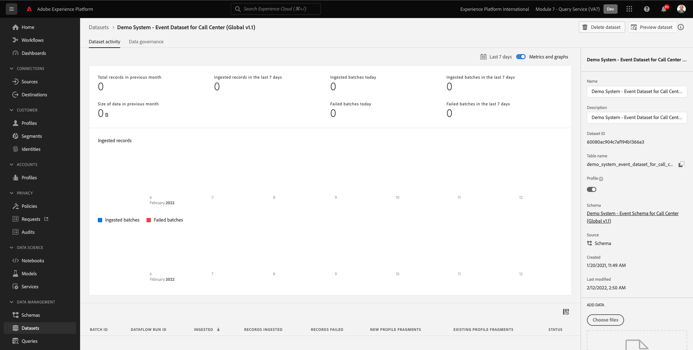
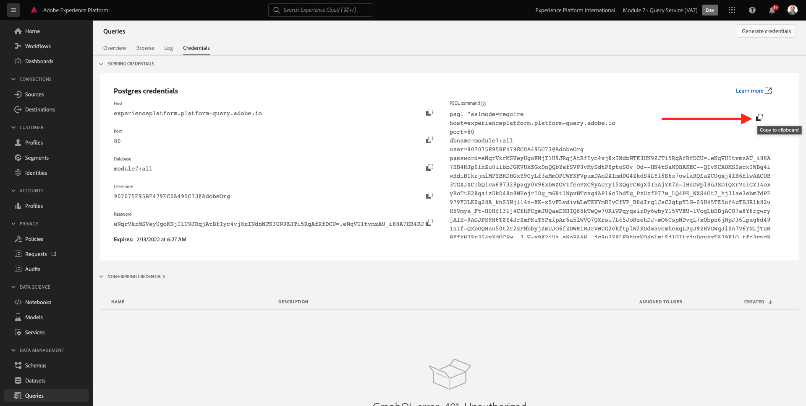

# 4.1 Introducción

## 4.1.1 Familiarizarse con la IU de Adobe Experience Platform

Vaya a [Adobe Experience Platform](https://experience.adobe.com/platform). Después de iniciar sesión, llegará a la página principal de Adobe Experience Platform.

Antes de continuar, debe seleccionar un **entorno limitado**. El nombre del simulador de pruebas que se va a seleccionar es ``--module7sandbox--``. Para ello, haga clic en el texto **[!UICONTROL Producción]** en la línea azul de la parte superior de la pantalla. Después de seleccionar los elementos adecuados [!UICONTROL entorno limitado], verá el cambio de pantalla y ahora estará en su [!UICONTROL entorno limitado].

## 4.1.2 Explorar los datos en la plataforma

Traer datos de diferentes canales es una tarea difícil para cualquier marca. Y en este ejercicio, los clientes de Citi Signal están interactuando con Citi Signal en su sitio web, en su aplicación móvil, el sistema de puntos de venta de Citi Signal recopila datos de compras y cuentan con datos de CRM y fidelidad. Citi Signal utiliza Adobe Analytics y Adobe Launch para capturar datos en su sitio web, aplicación móvil y sistema POS, por lo que estos datos ya fluyen a Adobe Experience Platform. Empecemos explorando todos los datos para Citi Signal que ya existen en Adobe Experience Platform.

En el menú de la izquierda, vaya a **Conjuntos de datos**.

Citi Signal transmite datos a Adobe Experience Platform y estos datos están disponibles en el `Demo System - Event Dataset for Website (Global v1.1)` conjunto de datos. Buscar `Demo System - Event Dataset for Website`.

Los datos de interacción Callcenter de Citi Signal se capturan en el `Demo System - Event Dataset for Call Center (Global v1.1)` conjunto de datos. Buscar `Demo System - Event Dataset for Call Center` datos en el cuadro de búsqueda. Haga clic en el nombre del conjunto de datos para abrirlo.

Después de hacer clic en el conjunto de datos, obtendrá una descripción general de la actividad del conjunto de datos, como lotes ingeridos y con errores.

Haga clic en **Vista previa del conjunto de datos** para ver una muestra de los datos almacenados en `Demo System - Event Dataset for Call Center (Global v1.1)` conjunto de datos. El panel izquierdo muestra la estructura de esquema para este conjunto de datos.

Haga clic en el **Cerrar** para cerrar el **Vista previa del conjunto de datos** ventana.

## 4.1.3 Introducción al servicio de consultas

Para acceder al servicio de consultas de Adobe Experience Platform, haga clic en **Consultas** en el menú de la izquierda.

Accediendo a **Registro** verá la página Lista de consultas , que proporciona una lista de todas las consultas que se han ejecutado en esta organización, con la última en la parte superior.

Haga clic en cualquier consulta SQL de la lista y observe los detalles proporcionados en el carril derecho.

Puede desplazarse por la ventana para ver toda la consulta, o puede hacer clic en el icono resaltado abajo para copiar toda la consulta en el bloc de notas. No es necesario copiar la consulta en este momento.

No solo puede ver las consultas que se han ejecutado, esta interfaz de usuario le permite crear nuevos conjuntos de datos a partir de consultas. Estos conjuntos de datos pueden vincularse al perfil del cliente en tiempo real de Adobe Experience Platform o utilizarse como entrada para Adobe Experience Platform Data Science Workspace.

## 4.1.4 Conectar el cliente PSQL con el servicio de consulta

El servicio de consultas admite clientes con un controlador para PostgreSQL. En esto usaremos PSQL, una interfaz de línea de comandos, y Power BI o Tableau. Conectémonos a PSQL.

Haga clic en **Credenciales**.

Verá la siguiente pantalla. La pantalla Configuración proporciona información del servidor y credenciales para autenticarse en el servicio de consulta. Por ahora, nos centraremos en el lado derecho de la pantalla que contiene un comando connect para PSQL. Haga clic en el botón Copiar para copiar el comando en el portapapeles.

Para Windows: Abra la línea de comandos pulsando la tecla windows, escribiendo cmd y luego haciendo clic en el resultado del símbolo del sistema.

Para macOS: Abra terminal.app mediante la búsqueda de puntos destacados:

Pegue el comando connect que ha copiado de la interfaz de usuario del servicio de consulta y pulse Enter en la ventana del símbolo del sistema:

Windows:

MacOS:

Ahora está conectado al servicio de consulta mediante PSQL.

En los próximos ejercicios, habrá bastante interacción con esta ventana. Nos referiremos a él como su **Interfaz de línea de comandos de PSQL**.

Ahora está listo para empezar a enviar consultas.

Paso siguiente: [4.2 Uso del servicio de consulta](./ex2.md)

[Volver al módulo 4](./query-service.md)

[Volver a todos los módulos](../../overview.md)
