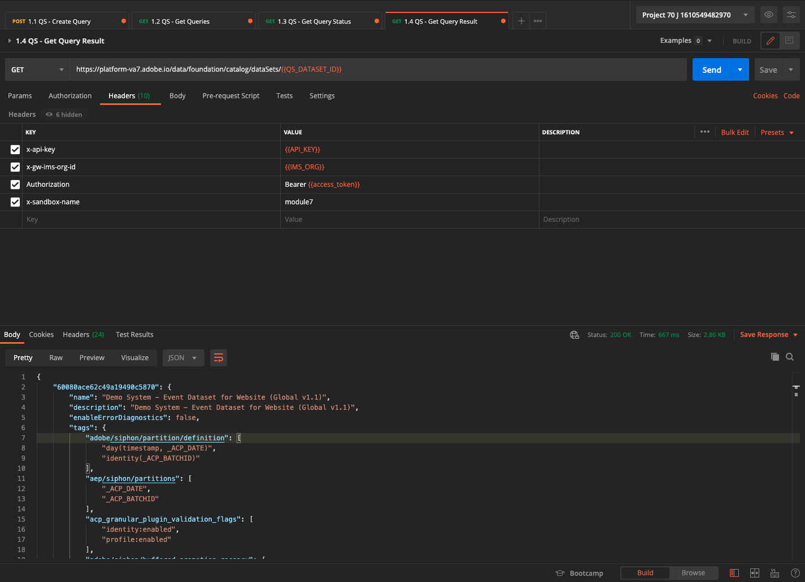

# API del servicio de consulta 4.7

## Objetivo

- Utilice la API del servicio de consulta para administrar las plantillas de consulta y las programaciones de consultas

## Contexto

En este ejercicio, ejecutará llamadas de API para administrar plantillas de consulta y programaciones de consultas mediante una colección de Postman. Definirá plantillas de consulta, ejecutará consultas regulares y consultas CTAS. A **CTAS** query (crear tabla como consulta de selección) almacena su conjunto de resultados en un conjunto de datos explícito. Mientras que las consultas regulares se almacenan en un conjunto de datos implícito (o generado por el sistema), que generalmente se exporta en formato de archivo de parquet.

## Documentación

- [Ayuda del servicio de Consulta de Adobe Experience Platform](https://experienceleague.adobe.com/docs/experience-platform/query/api/getting-started.html)
- [API del servicio de consulta](https://www.adobe.io/apis/experienceplatform/home/api-reference.html#!acpdr/swagger-specs/qs-api.yaml)

## 4.7.1 API de servicio de consulta

La API del servicio de consulta le permite administrar consultas no interactivas con los datos del lago de Adobe Experience Platform.

No interactivo significa que una solicitud para ejecutar una consulta no dará como resultado una respuesta inmediata. La consulta se procesará y su conjunto de resultados se almacenará en forma implícita o explícita (CTAS: crear tabla como conjunto de datos seleccionado.

## 4.7.2 Consulta de ejemplo

Como consulta de ejemplo, utilizará la primera consulta enumerada en [4.3 - Consultas, consultas, consultas... y análisis de pérdida](./ex3.md):

¿Cuántas vistas de productos tenemos a diario?

**SQL**

```sql
select date_format( timestamp , 'yyyy-MM-dd') AS Day,
       count(*) AS productViews
from   demo_system_event_dataset_for_website_global_v1_1
where  --aepTenantId--.demoEnvironment.brandName IN ('Luma Telco', 'Citi Signal')
and eventType = 'commerce.productViews'
group by Day
limit 10;
```

## Consultas 4.7.3

Abra Postman en el equipo. Como parte del Módulo 3, se ha creado un entorno de Postman y se ha importado una colección de Postman. Siga las instrucciones indicadas en [Ejercicio 3.3.3](./../module3/ex3.md) en caso de que aún no lo hayas hecho.

Como parte de la colección de Postman que ha importado, verá una carpeta **3. Servicio de consultas**. Si no ve esta carpeta, vuelva a descargar la [Colección Postman](../../assets/postman/postman_profile.zip) y vuelva a importar esa colección en Postman como se indica en [Ejercicio 3.3.3](./../module3/ex3.md).


>[!NOTE]
>
>En este momento, solo la carpeta **1. Consultas** contiene solicitudes. Se agregarán otras solicitudes en una fase de capa.

Abra esa carpeta y conozca las llamadas de API del servicio de consulta para ejecutar, supervisar y descargar el conjunto de resultados de la consulta.

Una llamada del POST a [/query/queries] con la siguiente carga útil se déclencheur la ejecución de nuestra consulta;

### 4.7.3.1 Crear consulta

Haga clic en la solicitud denominada **1.1 QS - Crear consulta** y vaya a **Encabezados**. Verá esto:


Centrémonos en este campo de encabezado:

| Clave | Valor |
| ----------- | ----------- |
| x-sandbox-name | `--module7sandbox--` |

>[!NOTE]
>
>Debe especificar el nombre del simulador para pruebas de Adobe Experience Platform que está utilizando. El campo de encabezado **x-sandbox-name** debe `--module7sandbox--`.

Vaya a la **Cuerpo** de esta solicitud. En el **Cuerpo** de esta solicitud, verá lo siguiente:


```sql
{
    "name" : "ldap - QS API demo - Citi Signal - Product Views Per Day",
	"description": "ldap - QS API demo - Citi Signal - Product Views Per Day",
	"dbName": "module7:all",
	"sql": "select date_format( timestamp , 'yyyy-MM-dd') AS Day, count(*) AS productViews from demo_system_event_dataset_for_website_global_v1_1 where _experienceplatform.demoEnvironment.brandName IN ('Luma Telco', 'Citi Signal') and eventType = 'commerce.productViews' group by Day limit 10"
}
```

Atención: actualice la variable **name** en la siguiente solicitud sustituyendo **ldap** con su **ldap**.

Después de agregar el **ldap**, el cuerpo debe tener un aspecto similar al siguiente:

```json
{
    "name" : "vangeluw - QS API demo - Citi Signal - Product Views Per Day",
	"description": "vangeluw - QS API demo - Citi Signal - Product Views Per Day",
	"dbName": "module7:all",
	"sql": "select date_format( timestamp , 'yyyy-MM-dd') AS Day, count(*) AS productViews from demo_system_event_dataset_for_website_global_v1_1 where _experienceplatform.demoEnvironment.brandName IN ('Luma Telco', 'Citi Signal') and eventType = 'commerce.productViews' group by Day limit 10"
}
```

>[!NOTE]
>
>La clave **dbName** en el cuerpo JSON anterior hace referencia al simulador de pruebas que se utiliza en la instancia de Adobe Experience Platform. Si utiliza el simulador de pruebas de PROD, el dbName debe ser **prod:all**, si utiliza otro simulador de pruebas como, por ejemplo, **module7**, dbName debe ser igual a **módulo7:all**.

A continuación, haga clic en el azul **Enviar** para crear el segmento y ver los resultados.


Cuando la solicitud del POST se complete correctamente, se devolverá la siguiente respuesta:

```json
{
    "isInsertInto": false,
    "request": {
        "dbName": "module7:all",
        "sql": "select date_format( timestamp , 'yyyy-MM-dd') AS Day, count(*) AS productViews from demo_system_event_dataset_for_website_global_v1_1 where _experienceplatform.demoEnvironment.brandName IN ('Luma Telco', 'Citi Signal') and eventType = 'commerce.productViews' group by Day limit 10",
        "name": "vangeluw - QS API demo - Citi Signal - Product Views Per Day",
        "description": "vangeluw - QS API demo - Citi Signal - Product Views Per Day"
    },
    "clientId": "5a143b5ae4aa4631a1f3b09cd051333f",
    "state": "SUBMITTED",
    "rowCount": 0,
    "errors": [],
    "isCTAS": false,
    "version": 1,
    "id": "8f0d7f25-f7aa-493b-9792-290f884a7e5b",
    "elapsedTime": 0,
    "updated": "2021-01-20T13:23:13.951Z",
    "client": "API",
    "userId": "A3392DB95FFF08EE0A495E87@techacct.adobe.com",
    "created": "2021-01-20T13:23:13.951Z",
    "_links": {
        "self": {
            "href": "https://platform-va7.adobe.io/data/foundation/query/queries/8f0d7f25-f7aa-493b-9792-290f884a7e5b",
            "method": "GET"
        },
        "soft_delete": {
            "href": "https://platform-va7.adobe.io/data/foundation/query/queries/8f0d7f25-f7aa-493b-9792-290f884a7e5b",
            "method": "PATCH",
            "body": "{ \"op\": \"soft_delete\"}"
        },
        "cancel": {
            "href": "https://platform-va7.adobe.io/data/foundation/query/queries/8f0d7f25-f7aa-493b-9792-290f884a7e5b",
            "method": "PATCH",
            "body": "{ \"op\": \"cancel\"}"
        }
    }
}
```

El **state** de la consulta es **ENVIADO**, una vez ejecutado, su estado se convertirá en **ÉXITO**.

También puede buscar consultas enviadas a través de la interfaz de usuario de Adobe Experience Platform, abra [Adobe Experience Platform](https://experience.adobe.com/#/@experienceplatform/platform/home), vaya a **Consultas**, a **Registro** y seleccione la consulta:


### 4.7.3.2 Obtener consultas

Haga clic en la solicitud denominada **1.2 QS - Obtener consultas** y vaya a **Encabezados**. Verá esto:


Centrémonos en este campo de encabezado:

| Clave | Valor |
| ----------- | ----------- |
| x-sandbox-name | `--module7sandbox--` |

>[!NOTE]
>
>Debe especificar el nombre del simulador para pruebas de Adobe Experience Platform que está utilizando. El campo de encabezado **x-sandbox-name** debe `--module7sandbox--`.

Vaya a **Parámetros**. Verá esto:


La variable **orderby** permite especificar un criterio de ordenación basado en la variable **created** propiedad. Observe que **&#39;-&#39;** iniciar sesión delante de created, lo que significa que el orden en el que se devuelve la lista de consultas estará utilizando la fecha creada en **descendiente** pedido. La consulta debe estar en la parte superior de la lista.

A continuación, haga clic en el azul **Enviar** para crear el segmento y ver los resultados.


Cuando la solicitud se complete correctamente, devolverá una respuesta similar a la que se muestra a continuación. La variable **state** de la respuesta puede ser **ENVIADO**, **IN_PROGRESS** o **ÉXITO**. Puede tardar varios minutos en que la consulta tenga un **ÉXITO** estado. Puede repetir el envío de esta solicitud varias veces hasta que vea la variable **ÉXITO** estado.

```json
{
    "queries": [
        {
            "isInsertInto": false,
            "request": {
                "dbName": "module7:all",
                "sql": "select date_format( timestamp , 'yyyy-MM-dd') AS Day, count(*) AS productViews from demo_system_event_dataset_for_website_global_v1_1 where _experienceplatform.demoEnvironment.brandName IN ('Luma Telco', 'Citi Signal') and eventType = 'commerce.productViews' group by Day limit 10",
                "name": "vangeluw - QS API demo - Citi Signal - Product Views Per Day",
                "description": "vangeluw - QS API demo - Citi Signal - Product Views Per Day"
            },
            "clientId": "5a143b5ae4aa4631a1f3b09cd051333f",
            "state": "SUCCESS",
            "rowCount": 1,
            "errors": [],
            "isCTAS": false,
            "version": 1,
            "id": "8f0d7f25-f7aa-493b-9792-290f884a7e5b",
            "elapsedTime": 217481,
            "updated": "2021-01-20T13:26:51.432Z",
            "client": "API",
            "userId": "A3392DB95FFF08EE0A495E87@techacct.adobe.com",
            "created": "2021-01-20T13:23:13.951Z",
            "_links": {
                "self": {
                    "href": "https://platform-va7.adobe.io/data/foundation/query/queries/8f0d7f25-f7aa-493b-9792-290f884a7e5b",
                    "method": "GET"
                },
                "soft_delete": {
                    "href": "https://platform-va7.adobe.io/data/foundation/query/queries/8f0d7f25-f7aa-493b-9792-290f884a7e5b",
                    "method": "PATCH",
                    "body": "{ \"op\": \"soft_delete\"}"
                },
                "referenced_datasets": [
                    {
                        "id": "60080ace62c49a19490c5870",
                        "href": "https://platform-va7.adobe.io/data/foundation/catalog/dataSets/60080ace62c49a19490c5870"
                    }
                ]
            }
        }
     ]
    },
    "version": 1
}
```

Cuando el estado es **ÉXITO**, continúe con la siguiente solicitud.

### 4.7.3.3 Obtener estado de consulta

Haga clic en la solicitud denominada **1.3 QS - Obtener estado de consulta** y vaya a **Encabezados**. Verá esto:


Centrémonos en este campo de encabezado:

| Clave | Valor |
| ----------- | ----------- |
| x-sandbox-name | `--module7sandbox--` |

>[!NOTE]
>
>Debe especificar el nombre del simulador para pruebas de Adobe Experience Platform que está utilizando. El campo de encabezado **x-sandbox-name** debe `--module7sandbox--`.

A continuación, haga clic en el azul **Enviar** para crear el segmento y ver los resultados.


Cuando la solicitud se complete correctamente, devolverá una respuesta similar a la que se muestra a continuación.

```json
{
    "isInsertInto": false,
    "request": {
        "dbName": "module7:all",
        "sql": "select date_format( timestamp , 'yyyy-MM-dd') AS Day, count(*) AS productViews from demo_system_event_dataset_for_website_global_v1_1 where _experienceplatform.demoEnvironment.brandName IN ('Luma Telco', 'Citi Signal') and eventType = 'commerce.productViews' group by Day limit 10",
        "name": "vangeluw - QS API demo - Citi Signal - Product Views Per Day",
        "description": "vangeluw - QS API demo - Citi Signal - Product Views Per Day"
    },
    "clientId": "5a143b5ae4aa4631a1f3b09cd051333f",
    "state": "SUCCESS",
    "rowCount": 1,
    "errors": [],
    "isCTAS": false,
    "version": 1,
    "id": "8f0d7f25-f7aa-493b-9792-290f884a7e5b",
    "elapsedTime": 217481,
    "updated": "2021-01-20T13:26:51.432Z",
    "client": "API",
    "userId": "A3392DB95FFF08EE0A495E87@techacct.adobe.com",
    "created": "2021-01-20T13:23:13.951Z",
    "_links": {
        "self": {
            "href": "https://platform-va7.adobe.io/data/foundation/query/queries/8f0d7f25-f7aa-493b-9792-290f884a7e5b",
            "method": "GET"
        },
        "soft_delete": {
            "href": "https://platform-va7.adobe.io/data/foundation/query/queries/8f0d7f25-f7aa-493b-9792-290f884a7e5b",
            "method": "PATCH",
            "body": "{ \"op\": \"soft_delete\"}"
        },
        "referenced_datasets": [
            {
                "id": "60080ace62c49a19490c5870",
                "href": "https://platform-va7.adobe.io/data/foundation/catalog/dataSets/60080ace62c49a19490c5870"
            }
        ]
    }
}
```

Cuando una consulta alcanza el estado de **ÉXITO**, la respuesta también indicará el número de filas recuperadas por la consulta a través de la variable **rowCount** propiedad. En nuestro ejemplo, la consulta devuelve 10 filas. Veamos en la siguiente sección cómo podemos recuperar las 10 filas.

### 4.7.3.4 Recuperar resultado de consulta

La variable **ÉXITO** la respuesta anterior incluye un **referenced_datasets** , que apunta al conjunto de datos implícito que almacena el resultado de la consulta. Para obtener acceso al resultado, utilizamos su **href** o **id** propiedad.

Haga clic en la solicitud denominada **1.4 QS - Obtener resultado de consulta** y vaya a **Encabezados**. Verá esto:


Centrémonos en este campo de encabezado:

| Clave | Valor |
| ----------- | ----------- |
| x-sandbox-name | `--module7sandbox--` |

>[!NOTE]
>
>Debe especificar el nombre del simulador para pruebas de Adobe Experience Platform que está utilizando. El campo de encabezado **x-sandbox-name** debe `--module7sandbox--`.

A continuación, haga clic en el azul **Enviar** para crear el segmento y ver los resultados.



La respuesta de esta solicitud apuntará a los archivos del conjunto de datos:

```json
{
    "60080ace62c49a19490c5870": {
        "name": "Demo System - Event Dataset for Website (Global v1.1)",
        "description": "Demo System - Event Dataset for Website (Global v1.1)",
        "enableErrorDiagnostics": false,
        "tags": {
            "adobe/siphon/partition/definition": [
                "day(timestamp, _ACP_DATE)",
                "identity(_ACP_BATCHID)"
            ],
            "aep/siphon/partitions": [
                "_ACP_DATE",
                "_ACP_BATCHID"
            ],
            "acp_granular_plugin_validation_flags": [
                "identity:enabled",
                "profile:enabled"
            ],
            "adobe/siphon/buffered-promotion-recency": [
                "live"
            ],
            "adobe/siphon/use-buffered-promotion": [
                "true"
            ],
            "adobe/pqs/table": [
                "demo_system_event_dataset_for_website_global_v1_1"
            ],
            "aep/siphon/expire-snapshot-timestamp": [
                "1611141272703"
            ],
            "acp_granular_validation_flags": [
                "requiredFieldCheck:enabled"
            ],
            "acp_validationContext": [
                "enabled"
            ],
            "adobe/siphon/table/format": [
                "iceberg"
            ],
            "unifiedProfile": [
                "enabled:true",
                "enabledAt:2021-01-20 10:49:51"
            ],
            "unifiedIdentity": [
                "enabled:true"
            ]
        },
        "namespace": "ACP",
        "state": "DRAFT",
        "imsOrg": "907075E95BF479EC0A495C73@AdobeOrg",
        "sandboxId": "62cd9f38-8529-4b05-8d9f-388529db0540",
        "lastBatchId": "01EWFQZ15XRNNB1FPKPW5ETRVP",
        "lastBatchStatus": "success",
        "lastSuccessfulBatch": "01EWFQZ15XRNNB1FPKPW5ETRVP",
        "version": "1.0.6",
        "created": 1611139790698,
        "updated": 1611149266031,
        "createdClient": "750e24ee855b4ac18ccc4f4817f96ee1",
        "createdUser": "3A260B485E909A170A495E76@techacct.adobe.com",
        "updatedUser": "acp_foundation_dataTracker@AdobeID",
        "viewId": "60080ace62c49a19490c5871",
        "fileDescription": {
            "persisted": true,
            "containerFormat": "parquet",
            "format": "parquet"
        },
        "files": "@/dataSets/60080ace62c49a19490c5870/views/60080ace62c49a19490c5871/files",
        "schemaMetadata": {
            "delta": [],
            "gdpr": []
        },
        "schemaRef": {
            "id": "https://ns.adobe.com/experienceplatform/schemas/d9b88a044ad96154637965a97ed63c7b20bdf2ab3b4f642e",
            "contentType": "application/vnd.adobe.xed-full+json;version=1"
        }
    }
}
```

>[!NOTE]
>
>Próximamente se añadirán más ejercicios para ayudarle a interactuar con la API del servicio de consulta.

Paso siguiente: [Resumen y beneficios](./summary.md)

[Volver al módulo 4](./query-service.md)

[Volver a todos los módulos](../../overview.md)
