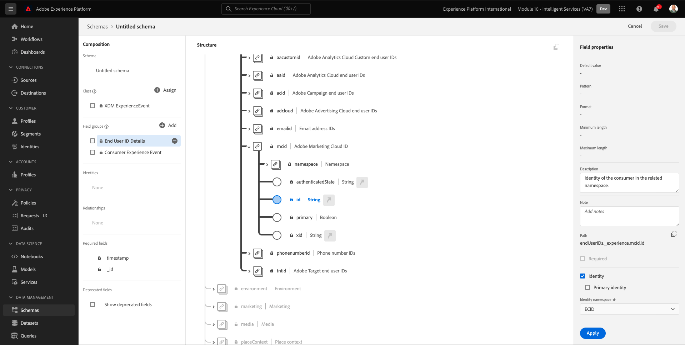
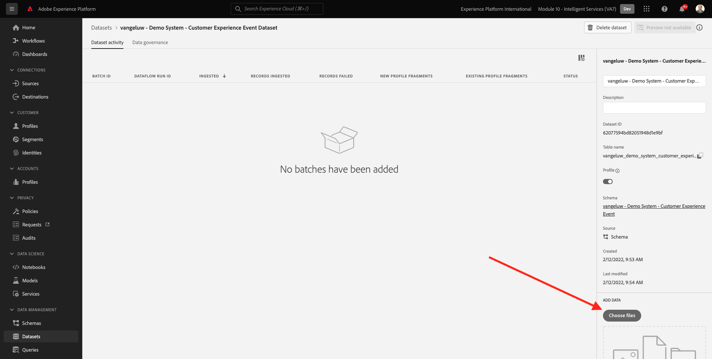

# 5.1 AI del cliente: preparación de datos (ingesta)

Para que los servicios inteligentes puedan descubrir perspectivas a partir de los datos de eventos de marketing, los datos deben enriquecirse semánticamente y mantenerse en una estructura estándar. Los servicios inteligentes aprovechan los esquemas del Modelo de datos de experiencia (XDM) de Adobe para conseguirlo.
Específicamente, todos los conjuntos de datos que se utilizan en los servicios inteligentes deben cumplir la función **Evento de experiencia del consumidor** esquema XDM.

## 5.1.1 Crear esquema

En este ejercicio, creará un esquema que contenga la variable **Mezcla de eventos de la experiencia del consumidor**, que requiere el **Customer AI** Servicio inteligente.

Inicie sesión en Adobe Experience Platform accediendo a esta URL: [https://experience.adobe.com/platform](https://experience.adobe.com/platform).

Después de iniciar sesión, llegará a la página principal de Adobe Experience Platform.

Antes de continuar, debe seleccionar un **entorno limitado**. El nombre del simulador de pruebas que se va a seleccionar es ``--module10sandbox--``. Para ello, haga clic en el texto **[!UICONTROL Producción]** en la línea azul de la parte superior de la pantalla. Después de seleccionar el simulador para pruebas apropiado, verá el cambio de pantalla y ahora estará en su simulador para pruebas dedicado.

En el menú de la izquierda, haga clic en **Esquemas** y vaya a **Examinar**. Haga clic en **Crear esquema**.

En la ventana emergente, seleccione **XDM ExperienceEvent**.

Entonces verás esto.

Busque y seleccione lo siguiente **Mezclas** para agregar a este esquema:

- Evento de experiencia del consumidor

   

- Detalles del ID de usuario final

   

Haga clic en **Agregar grupos de campos**.

Entonces verás esto. Seleccionar la mezcla **Detalles del ID de usuario final**.

Navegar al campo **endUserIDs._experience.emailid.id**.

En el menú derecho del campo **endUserIDs._experience.emailid.id**, desplácese hacia abajo y marque la casilla de verificación **Identidad**, marque la casilla de verificación **Identidad principal** y seleccione **Área de nombres de identidad** de **Correo electrónico**.

Navegar al campo **endUserIDs._experience.mcid.id**. Marque la casilla de verificación para **Identidad** y seleccione **Área de nombres de identidad** de **ECID**. Haga clic en **Aplicar**.

Asigne un nombre al esquema ahora.

Como nombre para nuestro esquema, debe utilizar esto:

- `--demoProfileLdap-- - Demo System - Customer Experience Event`

Como ejemplo, para ldap **vangeluw**, este debe ser el nombre del esquema:

- **vangeluw - Sistema de demostración - Evento de experiencia del cliente**

Eso debería darte algo así. Haga clic en el **+ Agregar** para agregar **Mezclas**.

Seleccione el nombre del esquema. Ahora debe habilitar el esquema para **Perfil**, haciendo clic en el botón **Perfil** alternar.

Entonces verás esto. Haga clic en **Habilitar**.

Ahora deberías tener esto. Haga clic en **Guardar** para guardar el esquema.

## 5.1.2 Crear conjunto de datos

En el menú de la izquierda, haga clic en **Conjuntos de datos** y vaya a **Examinar**. Haga clic en **Crear conjunto de datos**.

Haga clic en **Crear conjunto de datos a partir de esquema**.

En la siguiente pantalla, seleccione el conjunto de datos que creó en el ejercicio anterior, que tiene el nombre **[!UICONTROL ldap - Sistema de demostración - Evento de experiencia del cliente]**. Haga clic en **Siguiente**.

Como nombre para su conjunto de datos, utilice `--demoProfileLdap-- - Demo System - Customer Experience Event Dataset`. Haga clic en **Finalizar**.

Se ha creado el conjunto de datos. Active la variable **Perfil** alternar.

Haga clic en **Habilitar**.

Ahora debería tener esto:

Ya está listo para empezar a ingerir datos de Evento de experiencias del consumidor y empezar a utilizar el servicio de AI del cliente.

## 5.1.3 Descargar datos de prueba de Experience Event

Una vez que la variable **Esquema** y **Conjunto de datos** están configuradas, ya está listo para ingerir datos de Experience Event. Dado que Customer AI requiere datos entre **2 trimestres como mínimo**, tendrá que ingerir datos preparados externamente.

Los datos preparados para los eventos de experiencia deben cumplir los requisitos y el esquema del [Mezcla XDM de Evento de experiencia del consumidor](https://github.com/adobe/xdm/blob/797cf4930d5a80799a095256302675b1362c9a15/docs/reference/context/experienceevent-consumer.schema.md).

Descargue el archivo que contiene datos de ejemplo desde esta ubicación: [https://dashboard.adobedemo.com/data](https://dashboard.adobedemo.com/data). Haga clic en el **Descargar** botón.

Ya ha descargado un archivo denominado **retail-v1-dec2020-xl.json.zip**. Coloque el archivo en el escritorio del equipo y descomprima el archivo, después de lo cual verá un archivo denominado **retail-v1.json**. Necesitará este archivo en el próximo ejercicio.

## 5.1.4 Datos de prueba de Evento de experiencia de ingesta

En Adobe Experience Platform, vaya a **Conjuntos de datos** y abra el conjunto de datos, que tiene su nombre **[!UICONTROL ldap - Sistema de demostración - Conjunto de datos del evento de la experiencia del cliente]**.

En el conjunto de datos, haga clic en **Elegir archivos** para agregar datos.

En la ventana emergente, seleccione el archivo **retail-v1.json** y haga clic en **Apertura**.

Después verá los datos que se importan y se creará un nuevo lote en la variable **Carga** estado. No se aleje de esta página hasta que se cargue el archivo.

Una vez cargado el archivo, verá que el estado del lote cambia de **Carga** a **Procesamiento**.

La ingesta y el procesamiento de los datos pueden tardar entre 10 y 20 minutos.

Una vez que la ingesta de datos se haya realizado correctamente, el estado del lote cambiará a **Correcto**.

Paso siguiente: [5.2 Customer AI: crear una nueva instancia (configurar)](./ex2.md)

[Volver al módulo 5](./intelligent-services.md)

[Volver a todos los módulos](./../../overview.md)
