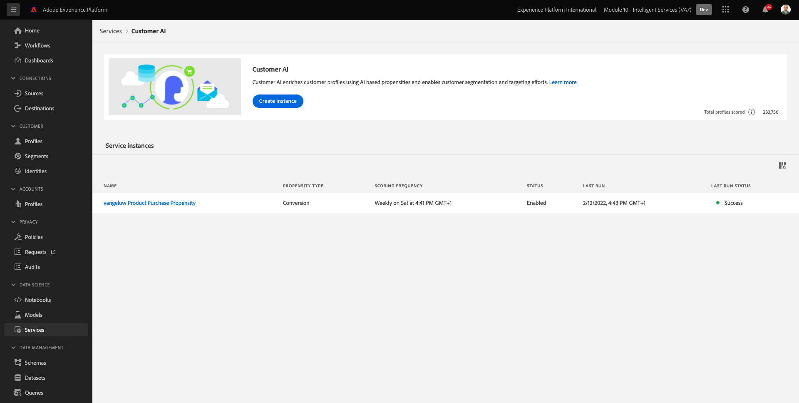

# 5.3 AI del cliente: panel de puntuación y segmentación (Predecir y tomar medidas)

Una vez que la instancia de Customer AI completa la ejecución de un modelo, le permite visualizar la puntuación de tendencia evaluada para predecir que un cliente realizará una compra en los próximos 30 días.

>[!NOTE]
>
>Solo una instancia de Customer AI con el estado de **Correcto** le permite obtener una vista previa de las perspectivas del servicio.

## 5.3.1 Predicción de tendencia

Ahora vamos a revisar la tendencia prevista generada por el modelo de instancia de Customer AI. Haga clic en el nombre de la instancia para ver el tablero.

El panel Customer AI muestra el resumen sobre la puntuación, la distribución de la población y los factores influyentes que el modelo debe evaluar.

Pase el ratón sobre los factores influyentes para ver un desglose adicional de la distribución de datos.

## 5.3.2 Acciones empresariales

### 5.3.2.1 Segmentación de clientes

El panel Customer AI permite definir segmentos con un solo clic. Haga clic en el **Crear segmento** en las tarjetas de inclinación.

Verá que una definición de segmento se crea automáticamente.

Asigne un nombre al segmento siguiendo esta convención de nomenclatura: `--demoProfileLdap-- - Customer AI High Propensity`. Haga clic en **Guardar**.

Ahora puede utilizar este segmento para la segmentación mediante, por ejemplo, CDP en tiempo real, Journey Orchestration y Adobe Target.

### 5.3.2.2 Información general del perfil

Como la puntuación de tendencia de AI del cliente forma parte del perfil del cliente en tiempo real, puede ver la puntuación del cliente individual.

En Adobe Experience Platform, vaya a **Perfiles** en el menú de la izquierda y seleccione **Examinar**.

Busque un perfil utilizando cualquiera de los identificadores, como por ejemplo **CORREO ELECTRÓNICO hbirkenshawa@businessweek.com**, que están disponibles en el archivo JSON que ha introducido. Haga clic en el **ID de perfil** para abrir el perfil.

Verá esto:

Vaya a **Atributos**, que contiene el resultado del modelo AI del cliente.

Desplácese hacia abajo para ver la puntuación de tendencia calculada por el modelo AI del cliente.

Paso siguiente: [Resumen y beneficios](./summary.md)

[Volver al módulo 5](./intelligent-services.md)

[Volver a todos los módulos](./../../overview.md)
