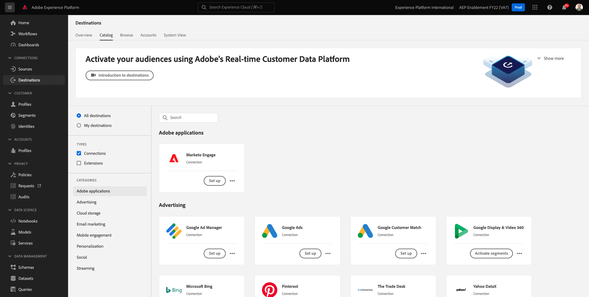

# 6.3 Acción: enviar el segmento a DV360

Vaya a [Adobe Experience Platform](https://experience.adobe.com/platform). Después de iniciar sesión, llegará a la página principal de Adobe Experience Platform.

Antes de continuar, debe seleccionar un **entorno limitado**. El nombre del simulador de pruebas que se va a seleccionar es ``--aepSandboxId--``. Para ello, haga clic en el texto **[!UICONTROL Producción]** en la línea azul de la parte superior de la pantalla. Después de seleccionar los elementos adecuados [!UICONTROL entorno limitado], verá el cambio de pantalla y ahora estará en su [!UICONTROL entorno limitado].

En el menú de la izquierda, vaya a **Destinos** y vaya a **Catálogo**. Verá el **Catálogo de destinos**.

En **Destinos**, haga clic en **Activar segmentos** en el **Pantalla y vídeo de Google 360** tarjeta.

Seleccione el destino y haga clic en **Siguiente**.

En la lista de segmentos disponibles, seleccione el segmento que creó en el ejercicio anterior. Haga clic en **Siguiente**.

En el **Programación de segmentos** página, haga clic en **Siguiente**.

Por último, en la **Consulte** página, haga clic en **Finalizar**.

El segmento ahora está vinculado a Google DV360. Cada vez que un cliente califica para este segmento, se envía una señal a Google DV360 para incluir a ese cliente en la audiencia de Google DV360.

Paso siguiente: [6.4 Acción: enviar el segmento a un destino S3](./ex4.md)

[Volver al módulo 6](./real-time-cdp-build-a-segment-take-action.md)

[Volver a todos los módulos](../../overview.md)
