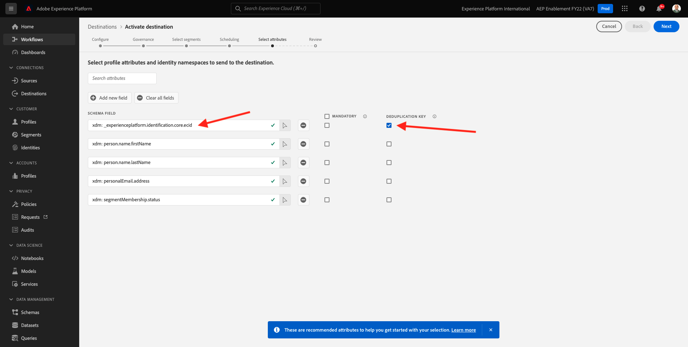

# 6.4 Acción: enviar el segmento a un destino S3

Adobe Experience Platform también tiene la capacidad de compartir audiencias con destinos de marketing por correo electrónico, como Marketing Cloud de Salesforce, Eloqua de Oracle, Responsys de Oracle y Adobe Campaign.

Puede usar FTP o SFTP como parte de los destinos específicos para cada uno de estos destinos de marketing por correo electrónico, o bien puede usar AWS S3 para intercambiar listas de clientes entre Adobe Experience Platform y estos destinos de marketing por correo electrónico.

En este módulo, puede configurar un destino de este tipo utilizando un compartimento de AWS S3.

## 6.4.1 Cree su cubo S3

Vaya a [https://console.aws.amazon.com](https://console.aws.amazon.com) e inicie sesión con la cuenta de Amazon que creó anteriormente.

Después de iniciar sesión, se le redirigirá al **Consola de administración de AWS**.

En el **Buscar servicios** menú, buscar **s3**. Haga clic en el primer resultado de búsqueda: **S3: Almacenamiento escalable en la nube**.

Verá el **Amazon S3** página principal. Haga clic en **Crear depósito**.

En el **Crear depósito** , debe configurar dos opciones:

- Nombre: use el nombre `aepmodulertcdp--demoProfileLdap--`. Por ejemplo, en este ejercicio, el nombre del bloque es **aepmoduertcdpvangeluw**
- Región: usar la región **EU (Frankfurt) eu-central-1**

Mantenga el resto de la configuración predeterminada tal cual. Desplácese hacia abajo y haga clic en **Crear cubo**.

A continuación, verá que se está creando su espacio y se redirigirá a la página de inicio de Amazon S3.

## 6.4.2 Establezca permisos para acceder a su compartimento S3

El siguiente paso es configurar el acceso a su compartimento S3.

Para ello, vaya a [https://console.aws.amazon.com/iam/home](https://console.aws.amazon.com/iam/home).

El acceso a los recursos de AWS está controlado por la Administración de identidad y acceso (IAM) de Amazon.

Ahora verá esta página.

En el menú de la izquierda, haga clic en **Usuarios**. Verá el **Usuarios** en el Navegador. Haga clic en **Agregar usuarios**.

A continuación, configure el usuario:

- Nombre de usuario: use `s3_--demoProfileLdap--_rtcdp` como nombre, por lo que en este ejemplo el nombre es `s3_vangeluw_rtcdp`.
- Tipo de acceso de AWS: select **Tecla de acceso - Acceso programático**.

Haga clic en **Siguiente: Permisos**.

A continuación, verá esta pantalla de permisos. Haga clic en **Adjuntar las políticas existentes directamente**.

Escriba el término de búsqueda **s3** para ver todas las directivas de S3 relacionadas. Seleccione la directiva **AmazonS3FullAccess**. Haga clic en **Siguiente: Etiquetas**.

En el **Etiquetas** no es necesario configurar nada. Haga clic en **Siguiente: Consulte**.

Revise la configuración. Haga clic en **Crear usuario**.

El usuario se ha creado y verá sus credenciales para acceder a su entorno S3. Esta es la única vez que verás tus credenciales, así que por favor escríbalas.

Haga clic en **Show** para ver la clave de acceso secreta:

>[!IMPORTANT]
>
>Almacene sus credenciales en un archivo de texto en su equipo.
>
> - Access key ID: ...
> - Clave de acceso secreta: ...
>
> Una vez que haga clic en **Cerrar** ¡nunca volverá a ver sus credenciales!

Haga clic en **Cerrar**.

Ahora ha creado correctamente un bucket de AWS S3 y ha creado un usuario con permisos para acceder a este bucket.

## 6.4.3 Configurar destinos en Adobe Experience Platform

Vaya a [Adobe Experience Platform](https://experience.adobe.com/platform). Después de iniciar sesión, llegará a la página principal de Adobe Experience Platform.

Antes de continuar, debe seleccionar un **entorno limitado**. El nombre del simulador de pruebas que se va a seleccionar es ``--aepSandboxId--``. Para ello, haga clic en el texto **[!UICONTROL Producción]** en la línea azul de la parte superior de la pantalla. Después de seleccionar los elementos adecuados [!UICONTROL entorno limitado], verá el cambio de pantalla y ahora estará en su [!UICONTROL entorno limitado].

En el menú de la izquierda, vaya a **Destinos** y vaya a **Catálogo**. Verá el **Catálogo de destinos**.

Haga clic en **Almacenamiento en la nube** y, a continuación, haga clic en el botón **Configuración** botón (o activado) **Activar segmentos**, según su entorno) en la variable **Amazon S3** tarjeta.

Según el entorno, es posible que tenga que hacer clic en **+ Configurar nuevo destino** para empezar a crear su destino.

Select **Nueva cuenta** como Tipo de cuenta. Utilice las credenciales de S3 que se le proporcionaron en el paso anterior:

| Acceso a ID de clave | Clave de acceso secreto |
|:-----------------------:| :-----------------------:|
| AKIA...... | Cm5Ln...... |

Haga clic en **Conectarse al destino**.

A continuación, verá una confirmación visual de que este destino ya está conectado.

Debe proporcionar un nombre y una carpeta para que Adobe Experience Platform pueda conectarse al compartimento S3.

Como convención de nomenclatura, utilice lo siguiente:

| Acceso a ID de clave | Clave de acceso secreto |
|:-----------------------:| :-----------------------:|
| Nombre | `AWS - S3 - --demoProfileLdap--` |
| Descripción | `AWS - S3 - --demoProfileLdap--` |
| Nombre del depósito | `aepmodulertcdp--demoProfileLdap--` |
| Ruta de carpeta | / |

Haga clic en **Siguiente**.

Ahora, si lo desea, puede adjuntar una directiva de control de datos al nuevo destino. Haga clic en **Siguiente**.

En la lista de segmentos, busque el segmento que ha creado en el ejercicio 1 y selecciónelo. Haga clic en **Siguiente**.

Entonces verás esto. Si lo desea, puede editar la programación haciendo clic en el botón **lápiz** icono. **Crear programa**.

Defina la programación que desee. Select **Exportar archivos incrementales** y establezca la frecuencia en **Por hora** every **3 horas**. Haga clic en **Crear**.

Entonces tendrás esto. Haga clic en **Siguiente**.

Ahora puede seleccionar atributos para la exportación a AWS S3. Haga clic en **Añadir nuevo campo** y asegúrese de que el campo `--aepTenantId--.identification.core.ecid` se añade y marca como **Clave de deduplicación**.

De forma opcional, puede agregar tantos otros campos como sea necesario.

Una vez añadidos todos los campos, haga clic en **Siguiente**.

Revise la configuración. Haga clic en **Finalizar** para finalizar la configuración.

Volverá a la pantalla de Activación de destino y verá que el segmento se ha agregado a este destino.

Si desea agregar más exportaciones de segmentos, puede hacer clic en **Activar segmentos** para reiniciar el proceso y agregar más segmentos.

Paso siguiente: [6.5 Acción: enviar el segmento a Adobe Target](./ex5.md)

[Volver al módulo 6](./real-time-cdp-build-a-segment-take-action.md)

[Volver a todos los módulos](../../overview.md)
