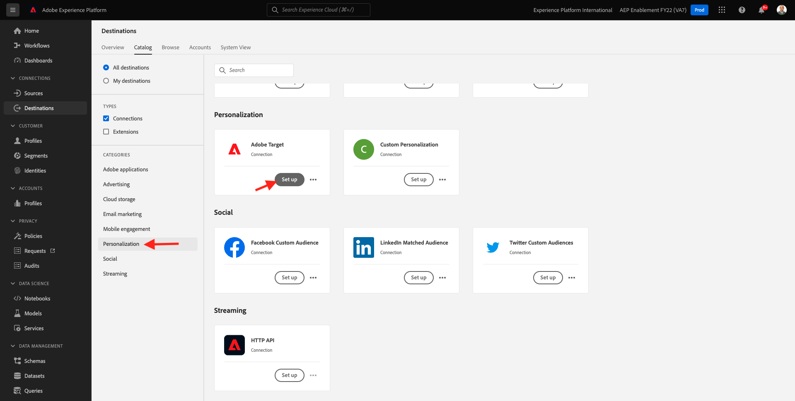
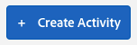
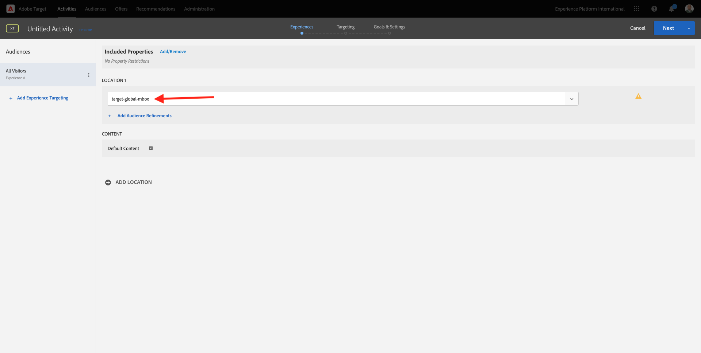
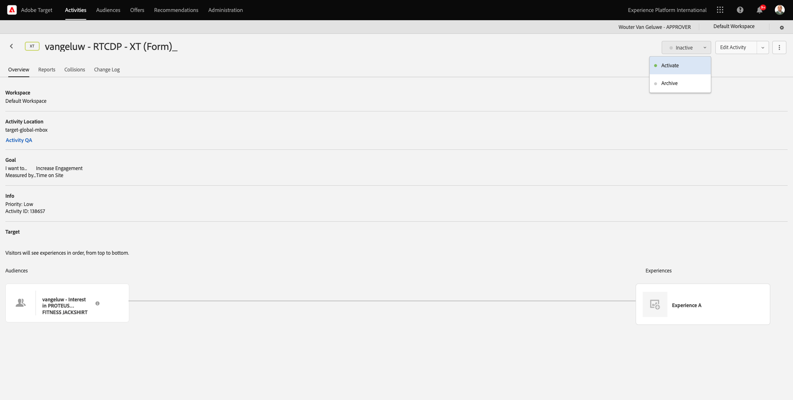
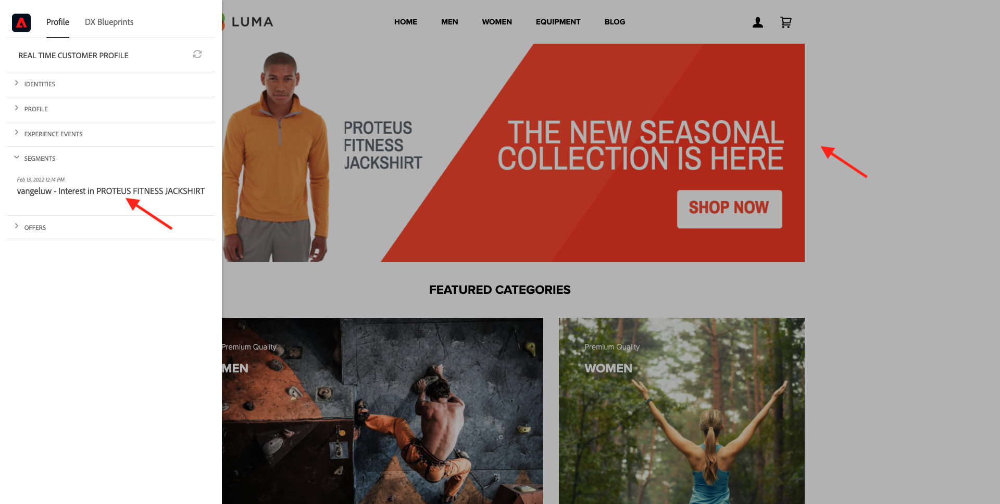

# 6.5 Acción: enviar el segmento a Adobe Target

Vaya a [Adobe Experience Platform](https://experience.adobe.com/platform). Después de iniciar sesión, llegará a la página principal de Adobe Experience Platform.


Antes de continuar, debe seleccionar un **entorno limitado**. El nombre del simulador de pruebas que se va a seleccionar es ``--aepSandboxId--``. Para ello, haga clic en el texto **[!UICONTROL Producción]** en la línea azul de la parte superior de la pantalla. Después de seleccionar los elementos adecuados [!UICONTROL entorno limitado], verá el cambio de pantalla y ahora estará en su [!UICONTROL entorno limitado].


## 6.5.1 Verificar el almacén de datos

El destino de Adobe Target en Real-Time CDP está conectado al conjunto de datos que se utiliza para introducir datos en la red perimetral de Adobe. Si desea configurar el destino de Adobe Target, primero debe comprobar si el conjunto de datos ya está habilitado para Adobe Target. El datastram se configuró en [Ejercicio 0.2 Crear el conjunto de datos](./../module0/ex2.md) y se denominó `--demoProfileLdap-- - Demo System Datastream`.

Vaya a [https://experience.adobe.com/#/data-collection/](https://experience.adobe.com/#/data-collection/)y haga clic en **Datastreams** o **Datastreams (Beta)**.


En la esquina superior derecha de la pantalla, seleccione el nombre del simulador de pruebas, que debería ser `--aepSandboxId--`.


En Datastreams, busque el conjunto de datos con el nombre `--demoProfileLdap-- - Demo System Datastream`. Haga clic en el conjunto de datos para abrirlo.


A continuación, verá esto, haga clic en **...** junto a **Adobe Experience Platform** y haga clic en **Editar**.


Marque las casillas de verificación para ambas **Segmentación de Edge** y **Destinos de personalización**. Haga clic en **Guardar**.


A continuación, haga clic en **+ Añadir servicio**.


Seleccione el servicio **Adobe Target**. Haga clic en **Guardar**.


El conjunto de datos ya está configurado para Adobe Target.


## 6.5.2 Configurar su destino de Adobe Target

Adobe Target está disponible como destino en Real-Time CDP. Para configurar la integración de Adobe Target, vaya a **Destinos**, a **Catálogo**.


Haga clic en **Personalización** en el **Categorías** para abrir el Navegador. Verá el **Adobe Target** tarjeta de destino. Haga clic en **Activar segmentos** (o **Configuración** según el entorno).



Según el entorno, es posible que tenga que hacer clic en **+ Configurar nuevo destino** para empezar a crear su destino.


Entonces verás esto.


En el **Configurar nuevo destino** , debe configurar dos opciones:

- Nombre: use el nombre `--demoProfileLdap-- - Adobe Target (Web)`, que debería tener este aspecto: **vangeluw - Adobe Target (Web)**.
- ID de almacén de datos: debe seleccionar el conjunto de datos configurado en [Ejercicio 0.2 Crear el conjunto de datos](./../module0/ex2.md). El nombre del conjunto de datos debe ser: `--demoProfileLdap-- - Demo System Datastream`.

Haga clic en **Siguiente**.


En la siguiente pantalla, puede seleccionar una directiva de control de forma opcional. No es necesario seleccionar uno, en este caso no es necesario seleccionar uno, por lo que haga clic en **Crear**.


El destino se ha creado y se mostrará en la lista. Seleccione el destino y haga clic en **Siguiente** para empezar a enviar segmentos a su destino.


En la lista de segmentos disponibles, seleccione el segmento en el que ha creado [Ejercicio 6.1 Crear un segmento](./ex1.md), cuyo nombre es `--demoProfileLdap-- - Interest in PROTEUS FITNESS JACKSHIRT`. A continuación, haga clic en **Siguiente**.


En la página siguiente, haga clic en **Siguiente**.


Haga clic en **Finalizar**.


El segmento ahora se activa para Adobe Target.


>[!IMPORTANT]
>
>Cuando acaba de crear su destino de Adobe Target en Real-Time CDP, puede que tarde hasta una hora en estar activo el destino. Es un tiempo de espera único, debido a la configuración del servidor. Una vez que se haya completado la configuración inicial de 1 hora de espera y back-end, los segmentos Edge recién añadidos que se envíen al destino de Adobe Target estarán disponibles para su segmentación en tiempo real.

## 6.5.3 Configurar la actividad basada en formularios de Adobe Target

Ahora que el segmento de Real-Time CDP está configurado para enviarse a Adobe Target, puede configurar la actividad de segmentación de experiencias en Adobe Target. En este ejercicio debe configurar una actividad basada en formularios.

Vaya a la página de inicio de Adobe Experience Cloud en [https://experiencecloud.adobe.com/](https://experiencecloud.adobe.com/). Haga clic en **Target** para abrirlo.


En el **Adobe Target** página principal, verá todas las actividades existentes.


Haga clic en **+ Crear actividad** para crear una nueva actividad.



Select **Segmentación de experiencias**.


Select **Formulario** y seleccione **Sin restricciones de propiedad**. Haga clic en **Siguiente**.


Ahora se encuentra en el Compositor de actividades basadas en formularios.


Para el campo **UBICACIÓN 1**, seleccione **target-global-mbox**.



Actualmente, la audiencia predeterminada es **Todos los visitantes**. Haga clic en el **3 puntos** junto a **Todos los visitantes** y haga clic en **Cambiar audiencia**.


Ahora está viendo la lista de audiencias disponibles, y el segmento de Adobe Experience Platform que creó anteriormente y envió a Adobe Target ahora forma parte de esta lista. Seleccione el segmento que ha creado anteriormente en Adobe Experience Platform. Haga clic en **Asignar audiencia**.


El segmento de Adobe Experience Platform ahora forma parte de esta actividad de segmentación de experiencias.


Ahora vamos a cambiar la imagen principal en la página de inicio del sitio web. Haga clic en para abrir la lista desplegable junto a **Contenido predeterminado** y haga clic en **Crear oferta HTML**.


Pegue el siguiente código. A continuación, haga clic en **Siguiente**.

```javascript
<script>document.querySelector("#home > div > div > div > div > div.banner_img.d-none.d-lg-block > img").src="https://parsefiles.back4app.com/hgJBdVOS2eff03JCn6qXXOxT5jJFzialLAHJixD9/ff92fdc3885972c0090ad5419e0ef4d4_Luma - Product - Proteus - Hero Banner.png"; document.querySelector(".banner_text > *").remove()</script>
```


A continuación, verá la nueva experiencia con la nueva imagen para la audiencia seleccionada.


Haga clic en el título de la actividad en la esquina superior izquierda para cambiarle el nombre.


Para el nombre, utilice:

- `--demoProfileLdap-- - RTCDP - XT (Form)`


Haga clic en **Siguiente**.


En el **Objetivos y configuración** - página, vaya a **Métricas de objetivo**.


Definir el objetivo principal como **Participación** - **Tiempo en el sitio**.


Haga clic en **Guardar y cerrar**.


Ahora estás en el **Información general de actividad** página. Aún necesita activar su actividad.


Haga clic en el campo . **Inactivo** y seleccione **Activar**.



A continuación, obtendrá una confirmación visual de que su actividad ya está activa.


La actividad ya está activa y se puede probar en el sitio web de demostración.

>[!IMPORTANT]
>
>Cuando acaba de crear su destino de Adobe Target en Real-Time CDP, puede que tarde hasta una hora en estar activo el destino. Es un tiempo de espera único, debido a la configuración del servidor. Una vez que se haya completado la configuración inicial de 1 hora de espera y back-end, los segmentos Edge recién añadidos que se envíen al destino de Adobe Target estarán disponibles para su segmentación en tiempo real.

Si vuelve al sitio web de la demostración y visita la página del producto para PROTEUS FITNESS JACKSHIRT, calificará instantáneamente para el segmento que ha creado y verá que la actividad de Adobe Target se muestra en la página principal en tiempo real.



Paso siguiente: [6.6 Audiencias externas](./ex6.md)

[Volver al módulo 6](./real-time-cdp-build-a-segment-take-action.md)

[Volver a todos los módulos](../../overview.md)
