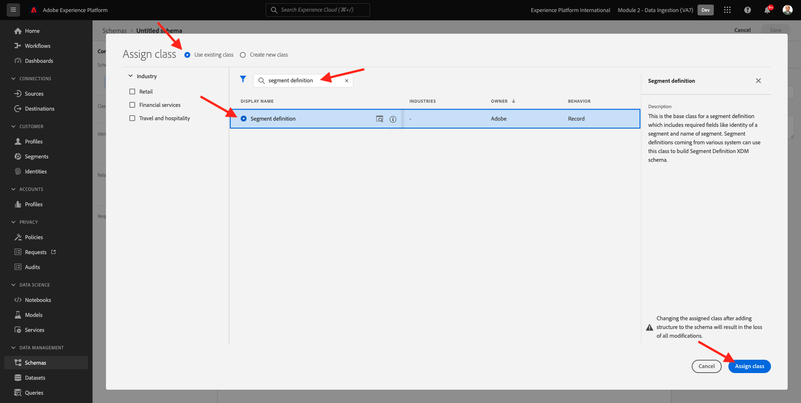
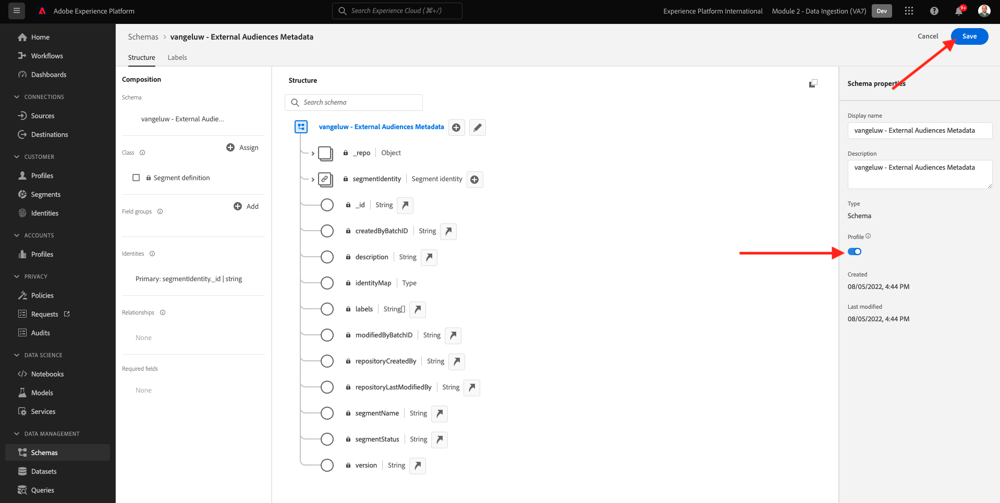
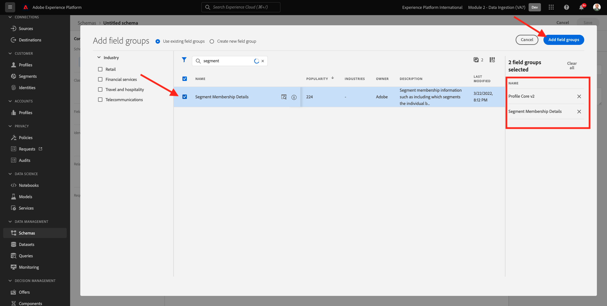

# 6.6 Audiencias externas

En muchos casos, es posible que su empresa desee utilizar segmentos existentes de otras aplicaciones para enriquecer el perfil del cliente en Adobe Experience Platform.
Estas audiencias externas pueden haberse definido en función de un modelo de ciencia de datos o utilizando plataformas de datos externas.

La función de audiencias externas de Adobe Experience Platform le permite centrarse en la incorporación de las audiencias externas y su activación sin necesidad de redefinir la definición de segmento correspondiente en detalle en Adobe Experience Platform.

El proceso general se divide en tres pasos principales:

- Importe los metadatos de audiencia externa: este paso pretende introducir en Adobe Experience Platform los metadatos de audiencia externos, como el nombre de audiencia.
- Asigne la pertenencia de audiencia externa al perfil del cliente: este paso está diseñado para enriquecer el perfil del cliente con el atributo de pertenencia a segmentos externos.
- Cree los segmentos en Adobe Experience Platform: este paso está diseñado para crear segmentos procesables basados en la pertenencia a audiencias externas.

## 6.6.1 Metadatos

Vaya a [Adobe Experience Platform](https://experience.adobe.com/platform). Después de iniciar sesión, llegará a la página principal de Adobe Experience Platform.


>[!IMPORTANT]
>
>El simulador para pruebas que se utilizará para este ejercicio es ``--module2sandbox--``!

Antes de continuar, debe seleccionar un **entorno limitado**. El nombre del simulador de pruebas que se va a seleccionar es ``--module2sandbox--``. Para ello, haga clic en el texto **[!UICONTROL Producción]** en la línea azul de la parte superior de la pantalla. Después de seleccionar los elementos adecuados [!UICONTROL entorno limitado], verá el cambio de pantalla y ahora estará en su [!UICONTROL entorno limitado].


Aunque los datos del segmento definen la condición para que un perfil forme parte de un segmento, los metadatos del segmento son información sobre el segmento, como el nombre, la descripción y el estado del segmento. Como los metadatos de audiencias externas se almacenan en Adobe Experience Platform, debe utilizar un área de nombres de identidad para introducir los metadatos en Adobe Experience Platform.

## 6.6.1.1 Área de nombres de identidad para audiencias externas

Ya se ha creado un área de nombres de identidad para su uso con **Audiencias externas**.
Para ver la identidad que ya se ha creado, vaya a **Identidades** y busque **Externo**. Haga clic en el elemento Audiencias externas.

Tenga en cuenta:

- El símbolo de identidad **audiencias externas** se utilizará en los pasos siguientes para hacer referencia a la identidad de audiencias externas.
- La variable **Identificador de no personas** se utiliza para este área de nombres de identidad, ya que este área de nombres no está pensada para identificar perfiles de cliente sino segmentos.


## 6.6.1.2 Crear el esquema de metadatos de audiencias externas

Los metadatos de audiencias externas se basan en la variable **Esquema de definición de segmento**. Puede encontrar más detalles en la [Repositorio XDM Github](https://github.com/adobe/xdm/blob/master/docs/reference/classes/segmentdefinition.schema.md).

En el menú de la izquierda, vaya a Esquemas. Haga clic en **+ Crear esquema** y haga clic en **Examinar**.


Para asignar una clase, busque **definición de segmento**. Seleccione el **Definición del segmento** clase y haga clic en **Asignar clase**.



Entonces verás esto. Haga clic en **Cancelar**.


Entonces verás esto. Seleccione el campo **_id**. En el menú de la derecha, desplácese hacia abajo y habilite la **Identidad** y **Identidad primaria** casillas de verificación. Seleccione el **Audiencias externas** área de nombres de identidad. Haga clic en **Aplicar**.


A continuación, seleccione el nombre del esquema **Esquema sin título**. Cambie el nombre a `--demoProfileLdap-- - External Audiences Metadata`.


Active la variable **Perfil** alterne y confirme. Finalmente, haga clic en **Guardar**.



## 6.6.1.3 Crear el conjunto de datos de metadatos de audiencias externas

En **Esquemas**, vaya a **Examinar**. Busque y haga clic en el botón `--demoProfileLdap-- - External Audiences Metadata` esquema creado en el paso anterior. A continuación, haga clic en **Crear conjunto de datos a partir del esquema**.


Para el campo **Nombre**, introduzca `--demoProfileLdap-- - External Audience Metadata`. Haga clic en **Crear conjunto de datos**.


Entonces verás esto. No olvide habilitar la variable **Perfil** alterne!


## 6.6.1.4 Crear una conexión de origen de API HTTP

A continuación, debe configurar el conector de origen de la API HTTP que utilizará para introducir los metadatos en el conjunto de datos.

Vaya a **Fuentes**. En el campo de búsqueda, introduzca **HTTP**. Haga clic en **Agregar datos**.


Especifique la siguiente información:

- **Tipo de cuenta**: select **Nueva cuenta**
- **Nombre de la cuenta**: enter `--demoProfileLdap-- - External Audience Metadata`
- Marque la casilla de verificación **Cuadro compatible XDM**

A continuación, haga clic en **Conectar a origen**.


Entonces verás esto. Haga clic en **Siguiente**.


Select **Conjunto de datos existente** y en el menú desplegable, busque y seleccione el conjunto de datos `--demoProfileLdap-- - External Audience Metadata`.

Compruebe el **Detalles del flujo de datos** y haga clic en **Siguiente**.


Entonces verás esto.

La variable **Asignación** el paso del asistente está vacío, ya que se va a introducir una carga útil compatible con XDM en el conector de origen de la API HTTP, por lo que no se requiere asignación. Haga clic en **Siguiente**.


En el **Consulte** paso puede revisar opcionalmente la conexión y los detalles de asignación. Haga clic en **Finalizar**.


Entonces verás esto.


## 6.6.1.5 Ingesta de metadatos de audiencias externas

En la ficha Información general del conector de origen, haga clic en **...** y haga clic en **Copiar carga útil de esquema**.


Abra la aplicación Editor de texto en el equipo y pegue la carga útil que acaba de copiar, que tiene este aspecto. A continuación, debe actualizar la variable **xdmEntity** en esta carga útil.


El objeto **xdmEntity** debe reemplazarse por el siguiente código. Copie el código siguiente y péguelo en el archivo de texto reemplazando el **xdmEntity** en el editor de texto.

```
"xdmEntity": {
    "_id": "--demoProfileLdap---extaudience-01",
    "description": "--demoProfileLdap---extaudience-01 description",
    "segmentIdentity": {
      "_id": "--demoProfileLdap---extaudience-01",
      "namespace": {
        "code": "externalaudiences"
      }
    },
    "segmentName": "--demoProfileLdap---extaudience-01 name",
    "segmentStatus": "ACTIVE",
    "version": "1.0"
  }
```

Debería ver esto:


A continuación, abra una nueva **Terminal** ventana. Copie todo el texto del Editor de texto y péguelo en la ventana de terminal.


A continuación, pulse **Entrar**.

A continuación, verá una confirmación de la ingesta de datos en la ventana Terminal :


Actualice la pantalla del conector de origen de la API HTTP, donde ahora verá que se están procesando los datos:


## 6.6.1.6 Validar la incorporación de metadatos de Audiencias externas

Una vez completado el procesamiento, puede comprobar la disponibilidad de los datos en el conjunto de datos mediante el servicio de consulta.

En el menú de la derecha, vaya a **Conjuntos de datos** y seleccione `--demoProfileLdap-- - External Audience Metadata` conjunto de datos creado anteriormente.


En el menú de la derecha, vaya a Consultas y haga clic en **Crear consulta**.


Introduzca el código siguiente y, a continuación, pulse **MAYÚS + ENTRAR**:

```
select * from --demoProfileLdap--_external_audience_metadata
```

En los resultados de la consulta, verá los metadatos de la audiencia externa que ha introducido.


## 6.6.2 Pertenencia a segmentos

Con los metadatos de audiencia externa disponibles, ahora puede introducir la pertenencia a segmentos para un perfil de cliente específico.

Ahora necesita preparar un conjunto de datos de perfil enriquecido con el esquema de pertenencia al segmento. Puede encontrar más detalles en la [Repositorio XDM Github](https://github.com/adobe/xdm/blob/master/docs/reference/datatypes/segmentmembership.schema.md).

## 6.6.2.1 Crear el esquema de pertenencia de Audiencias externas

En el menú de la derecha, vaya a **Esquemas**. Haga clic en **Crear esquema** y haga clic en **Perfil individual XDM**.


En el **Agregar grupos de campos** ventana emergente, buscar **Principal del perfil**. Seleccione el **Perfil principal v2** grupo de campos.


A continuación, en la **Agregar grupos de campos** ventana emergente, buscar **Pertenencia a segmentos**. Seleccione el **Detalles de pertenencia a segmentos** grupo de campos. A continuación, haga clic en **Agregar grupos de campos**.



Entonces verás esto. Navegar al campo `--aepTenantId--.identification.core`. Haga clic en el **crmId** campo . En el menú de la derecha, desplácese hacia abajo y marque la **Identidad** y **Identidad primaria** casillas de verificación. Para la variable **Área de nombres de identidad** select **Sistema de demostración: CRMID**.

Haga clic en **Aplicar**.


A continuación, seleccione el nombre del esquema **Esquema sin título**. En el campo display name , introduzca `--demoProfileLdap-- - External Audiences Membership`.


A continuación, active la variable **Perfil** alterne y confirme. Haga clic en **Guardar**.


## 6.6.2.2 Crear el conjunto de datos de membresía de Audiencias externas

En **Esquemas**, vaya a **Examinar**. Busque y haga clic en el botón `--demoProfileLdap-- - External Audiences Membership` esquema creado en el paso anterior. A continuación, haga clic en **Crear conjunto de datos a partir del esquema**.


Para el campo **Nombre**, introduzca `--demoProfileLdap-- - External Audiences Membership`. Haga clic en **Crear conjunto de datos**.


Entonces verás esto. No olvide habilitar la variable **Perfil** alterne!


## 6.6.2.3 Crear una conexión de origen de API HTTP


A continuación, debe configurar el conector de origen de la API HTTP que utilizará para introducir los metadatos en el conjunto de datos.

Vaya a **Fuentes**. En el campo de búsqueda, introduzca **HTTP**. Haga clic en **Agregar datos**.


Especifique la siguiente información:

- **Tipo de cuenta**: select **Nueva cuenta**
- **Nombre de la cuenta**: enter `--demoProfileLdap-- - External Audience Membership`
- Marque la casilla de verificación **Cuadro compatible XDM**

A continuación, haga clic en **Conectar a origen**.


Entonces verás esto. Haga clic en **Siguiente**.


Select **Conjunto de datos existente** y en el menú desplegable, busque y seleccione el conjunto de datos `--demoProfileLdap-- - External Audiences Membership`.

Compruebe el **Detalles del flujo de datos** y haga clic en **Siguiente**.


Entonces verás esto.

La variable **Asignación** el paso del asistente está vacío, ya que se va a introducir una carga útil compatible con XDM en el conector de origen de la API HTTP, por lo que no se requiere asignación. Haga clic en **Siguiente**.


En el **Consulte** paso puede revisar opcionalmente la conexión y los detalles de asignación. Haga clic en **Finalizar**.


Entonces verás esto.


## 6.6.2.4 Ingesta de datos de pertenencia a audiencias externas

En la ficha Información general del conector de origen, haga clic en **...** y haga clic en **Copiar carga útil de esquema**.


Abra la aplicación Editor de texto en el equipo y pegue la carga útil que acaba de copiar, que tiene este aspecto. A continuación, debe actualizar la variable **xdmEntity** en esta carga útil.


El objeto **xdmEntity** debe reemplazarse por el siguiente código. Copie el código siguiente y péguelo en el archivo de texto reemplazando el **xdmEntity** en el editor de texto.

```
  "xdmEntity": {
    "_id": "--demoProfileLdap---profile-test-01",
    "_experienceplatform": {
      "identification": {
        "core": {
          "crmId": "--demoProfileLdap---profile-test-01"
        }
      }
    },
    "personID": "--demoProfileLdap---profile-test-01",
    "segmentMembership": {
      "externalaudiences": {
        "--demoProfileLdap---extaudience-01": {
          "status": "realized",
          "lastQualificationTime": "2022-03-05T00:00:00Z"
        }
      }
    }
  }
```

Debería ver esto:


A continuación, abra una nueva **Terminal** ventana. Copie todo el texto del Editor de texto y péguelo en la ventana de terminal.


A continuación, pulse **Entrar**.

A continuación, verá una confirmación de la ingesta de datos en la ventana Terminal :


Actualice la pantalla del conector de origen de la API HTTP, donde después de un par de minutos verá que se están procesando los datos:


## 6.6.2.5 Validar la incorporación de audiencias externas

Una vez completado el procesamiento, puede comprobar la disponibilidad de los datos en el conjunto de datos mediante el servicio de consulta.

En el menú de la derecha, vaya a **Conjuntos de datos** y seleccione `--demoProfileLdap-- - External Audiences Membership ` conjunto de datos creado anteriormente.


En el menú de la derecha, vaya a Consultas y haga clic en **Crear consulta**.


Introduzca el código siguiente y, a continuación, pulse **MAYÚS + ENTRAR**:

```
select * from --demoProfileLdap--_external_audiences_membership
```

En los resultados de la consulta, verá los metadatos de la audiencia externa que ha introducido.


## 6.6.3 Crear un segmento

Ahora está listo para realizar acciones en las audiencias externas.
En Adobe Experience Platform, la acción se realiza mediante la creación de segmentos, la rellenado de las audiencias respectivas y el uso compartido de esas audiencias con los destinos.
Ahora creará un segmento utilizando la audiencia externa que acaba de crear.

En el menú de la izquierda, vaya a **Segmentos** y haga clic en **Crear segmento**.


Vaya a **Audiencias**. Entonces verás esto. Haga clic en **Audiencias externas**.


Seleccione la audiencia externa que creó anteriormente, con el nombre `--demoProfileLdap---extaudience-01`. Arrastre y suelte la audiencia en el lienzo.


Asigne un nombre al segmento, utilice `--demoProfileLdap-- - extaudience-01`. Haga clic en **Guardar y cerrar**.


Entonces verás esto. También notará que el perfil para el que ha introducido la pertenencia al segmento ahora se muestra en la lista de **Perfiles de muestra**.


El segmento está listo ahora y se puede enviar a un destino para la activación.

## 6.6.4 Visualizar el perfil del cliente

Ahora también puede visualizar la calificación de segmentos en su perfil de cliente. Vaya a **Perfiles**, utilice el área de nombres de identidad **Sistema de demostración: CRMID** y proporcionar la identidad `--demoProfileLdap---profile-test-01`, que utilizó como parte del ejercicio 6.6.2.4, y haga clic en **Ver**. A continuación, haga clic en el **ID de perfil** para abrir el perfil.


Vaya a **Pertenencia a segmentos**, donde verá aparecer su audiencia externa.


Paso siguiente: [SDK de destinos 6.7](./ex7.md)

[Volver al módulo 6](./real-time-cdp-build-a-segment-take-action.md)

[Volver a todos los módulos](../../overview.md)
