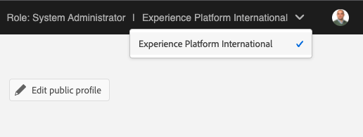
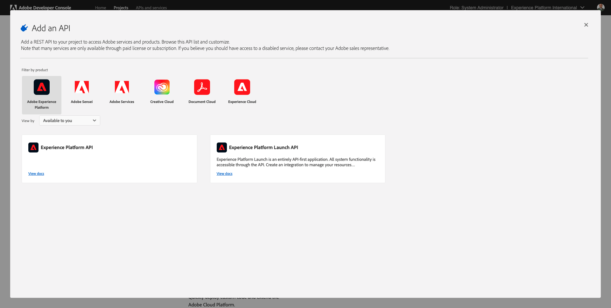
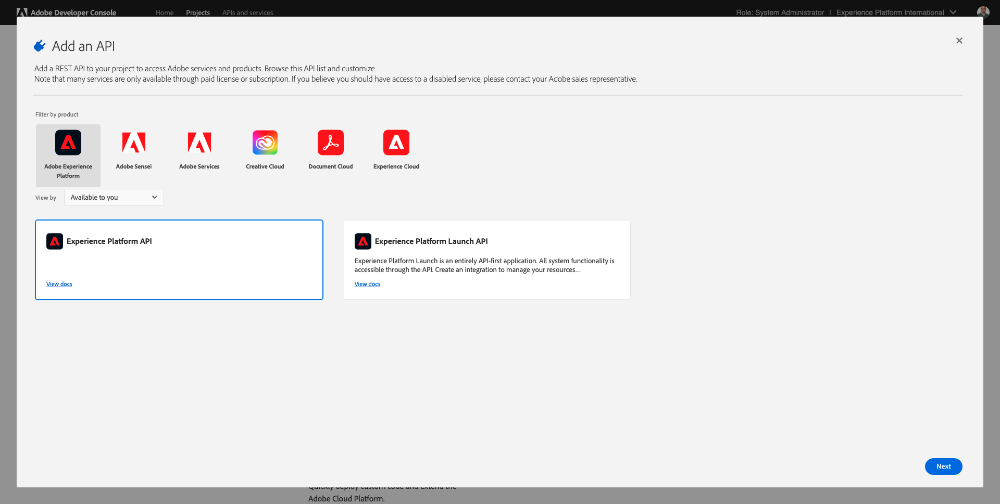
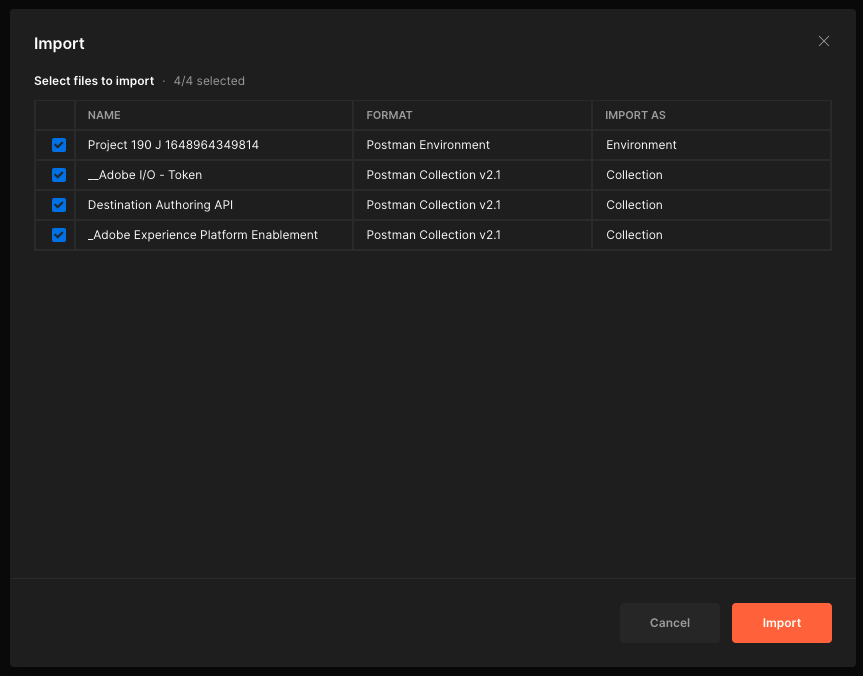
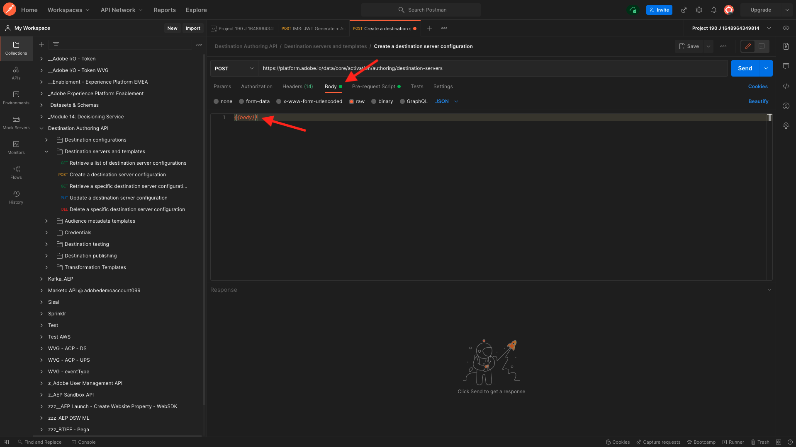
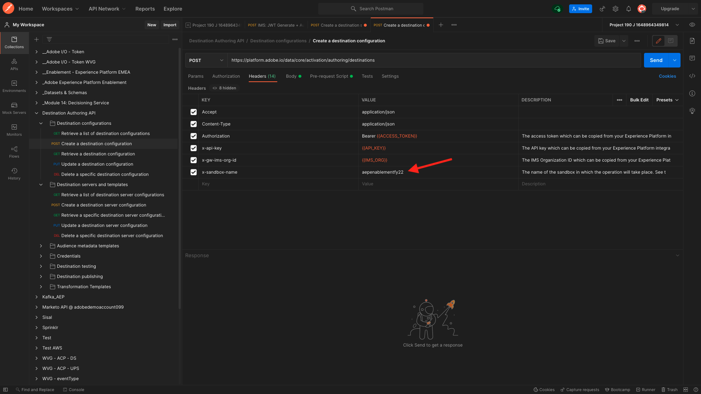
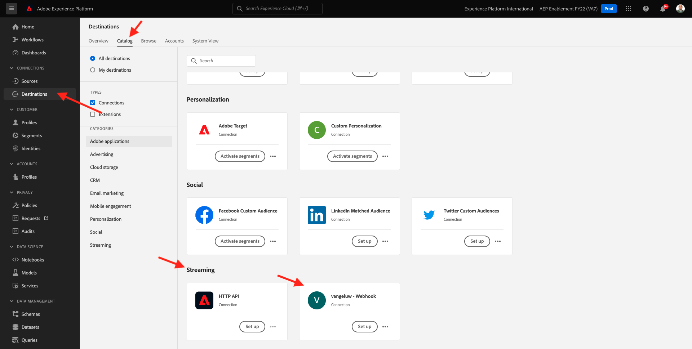
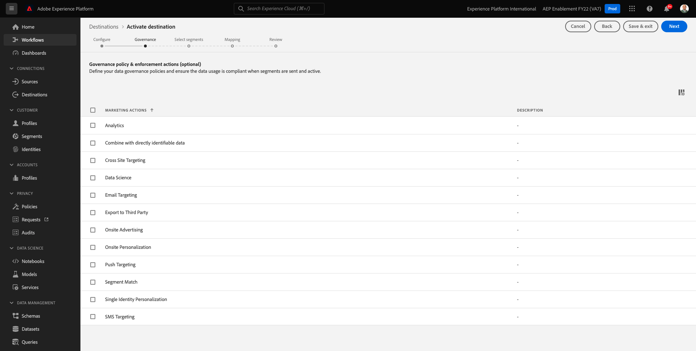

# SDK de destinos 6.7

## 6.7.1 Configuración del proyecto de Adobe I/O

>[!IMPORTANT]
>
>Si ha creado su proyecto de Adobe I/O después de diciembre de 2021, puede volver a utilizarlo, omitir este ejercicio y pasar a la versión 6.7.2 inmediatamente.
>
>Si creó el proyecto de Adobe I/O antes de diciembre de 2021, cree un nuevo proyecto para asegurarse de que sea compatible con la API de creación de destinos.

En este ejercicio, utilizará el Adobe I/O de forma intensiva para realizar consultas con las API de Platform. Siga los siguientes pasos para configurar el Adobe I/O.

Vaya a [https://developer.adobe.com/console/home](https://developer.adobe.com/console/home)


Asegúrese de seleccionar la instancia de Adobe Experience Platform correcta en la esquina superior derecha de la pantalla. Su instancia es `--envName--`.



Haga clic en **Crear nuevo proyecto**.

 o


Select **+ Agregar al proyecto** y seleccione **API**.


Verá esto:


Haga clic en el **Adobe Experience Platform** icono.



Haga clic en **API de Experience Platform**.



Haga clic en **Siguiente**.


Ahora puede elegir que el Adobe I/O genere su par de clave de seguridad o cargar uno existente.

Choose **Opción 1: Generación de un par de claves**.


Haga clic en **Generar par de teclas**.


Verá un control de número durante unos 30 segundos.


Verá esto y el par de claves generado se descargará como archivo zip: **config.zip**.

Descomprimir el archivo **config.zip** en el escritorio, verá que contiene 2 archivos:


- **certificate_pub.crt** es el certificado de clave pública. Desde una perspectiva de seguridad, este es el certificado que se utiliza libremente para configurar integraciones con aplicaciones en línea.
- **private.key** es la clave privada. Esto nunca debe ser compartido con nadie. La clave privada es lo que se utiliza para autenticarse en la implementación de la API y se supone que es un secreto. Si comparte la clave privada con alguien, este puede acceder a su implementación y utilizar la API para ingerir datos malintencionados en Platform y extraer todos los datos que se encuentran en Platform.


Asegúrese de guardar la variable **config.zip** en una ubicación segura, ya que lo necesitará para los próximos pasos y para el acceso futuro a las API de Adobe I/O y Adobe Experience Platform.

Haga clic en **Siguiente**.


Ahora tiene que seleccionar la variable **Perfil(s) de producto** para su integración.

Seleccione los perfiles de producto necesarios.

**FYI**: en la instancia de Adobe Experience Platform, los perfiles de producto tendrán un nombre diferente. Debe seleccionar al menos un perfil de producto con los derechos de acceso correctos, que están configurados en Adobe Admin Console.


Haga clic en **Guardar API configurada**.


Verá un control de número durante un par de segundos.


A continuación, verá su integración.


Haga clic en el **Descargar para Postman** y haga clic en **Cuenta de servicio (JWT)** para descargar un entorno de Postman (espere hasta que se descargue el entorno, puede tardar un par de segundos).


Desplácese hacia abajo hasta que vea **Cuenta de servicio (JWT)**, donde puede encontrar todos los detalles de integración que se utilizan para configurar la integración con Adobe Experience Platform.


El proyecto IO tiene actualmente un nombre genérico. Debe asignar un nombre descriptivo a la integración. Haga clic en **Proyecto 1** (o nombre similar), tal como se indica


Haga clic en **Editar proyecto**.


Introduzca un Nombre y una Descripción para la integración. Como convención de nomenclatura, utilizaremos `AEP API --demoProfileLdap--`. Sustituya ldap por su ldap.
Por ejemplo, si su ldap es vangeluw, el nombre y la descripción de su integración se convierten en vangeluw de la API de AEP.

Entrar `AEP API --demoProfileLdap--` como el **Título del proyecto**. Haga clic en **Guardar**.


La integración de Adobe I/O ha finalizado.


## 6.7.2 Autenticación de Postman con Adobe I/O

Vaya a [https://www.getpostman.com/](https://www.getpostman.com/).

Haga clic en **Introducción**.


A continuación, descargue e instale Postman.


Después de la instalación de Postman, inicie la aplicación.

En Postman, hay dos conceptos: Entornos y colecciones.

- El entorno contiene todas las variables de entorno que son más o menos coherentes. En Entorno, encontrará cosas como la IMSOrg de nuestro entorno de plataforma, junto con credenciales de seguridad como Clave privada y otras. El archivo de entorno es el que descargó durante la configuración del Adobe I/O en el ejercicio anterior, y su nombre es el siguiente: **service.postman_environment.json**.

- La colección contiene varias solicitudes de API que puede utilizar. Utilizaremos 2 colecciones
   - 1 Colección para la autenticación en el Adobe I/0
   - 1 Colección para los ejercicios en este módulo
   - 1 colección para los ejercicios del módulo Real-Time CDP, para la creación de destinos

Descargue el archivo [postman.zip](../../assets/postman/postman_profile.zip) al escritorio local.

En este **postman.zip** encontrará los siguientes archivos:

- `_Adobe I-O - Token.postman_collection.json`
- `_Adobe Experience Platform Enablement.postman_collection.json`
- `Destination_Authoring_API.json`

Descomprima el **postman.zip** y almacene estos 3 archivos en una carpeta de su escritorio, junto con el entorno de Postman descargado de Adobe I/O. Necesita tener estos 4 archivos en esa carpeta:


Vuelva a Postman. Haga clic en **Importar**.


Haga clic en **Cargar archivos**.


Vaya a la carpeta del escritorio en la que extrajo los 4 archivos descargados. Seleccione estos 4 archivos al mismo tiempo y haga clic en **Apertura**.


Después de hacer clic **Apertura**, Postman le mostrará una descripción general del entorno y las colecciones que está a punto de importar. Haga clic en **Importar**.



Ahora tiene todo lo que necesita en Postman para empezar a interactuar con Adobe Experience Platform a través de las API.

Lo primero que hay que hacer es asegurarse de que está autenticado correctamente. Para ser autenticado, debe solicitar un token de acceso.

Asegúrese de que ha seleccionado el Entorno correcto antes de ejecutar cualquier solicitud. Puede comprobar el Entorno seleccionado comprobando la lista desplegable Entorno en la esquina superior derecha.

El entorno seleccionado debe tener un nombre similar a este:


Haga clic en el **ojo** y haga clic en **Editar** para actualizar la clave privada en el archivo de entorno.


Entonces verás esto. Todos los campos se rellenan previamente, excepto el campo **PRIVATE_KEY**.


La clave privada se generó al crear el proyecto de Adobe I/O. Se descargó como archivo zip, denominado **config.zip**. Extraiga ese archivo zip en su escritorio.


Abra la carpeta . **config** y abra el archivo **private.key** con el editor de texto que elija.


Verá algo parecido a esto, copie todo el texto en el portapapeles.


Vuelva a Postman y pegue la clave privada en los campos junto a la variable . **PRIVATE_KEY**, para ambas columnas **VALOR INICIAL** y **VALOR ACTUAL**. Haga clic en **Guardar**.


El entorno y las colecciones de Postman ya están configurados y funcionando. Ahora puede autenticarse de Postman a Adobe I/O.

Para ello, debe cargar una biblioteca externa que se encargue del cifrado y descifrado de la comunicación. Para cargar esta biblioteca, debe ejecutar la solicitud con el nombre **INIT: Cargar biblioteca de criptografía para RS256**. Seleccione esta solicitud en el **_Adobe I/O: colección de tokens** y verán que se muestra en medio de la pantalla.


Haga clic en el icono azul **Enviar** botón. Después de un par de segundos, debería ver una respuesta en la **Cuerpo** de Postman:


Con la biblioteca criptográfica ahora cargada, podemos autenticarnos en el Adobe I/O.

En el **\_Adobe I/O - Recopilación de tokens**, seleccione la solicitud con el nombre **IMS: Generar + autenticación JWT**. De nuevo, verá los detalles de la solicitud en mitad de la pantalla.


Haga clic en el icono azul **Enviar** botón. Después de un par de segundos, debería ver una respuesta en la **Cuerpo** de Postman:


Si la configuración se ha realizado correctamente, debería ver una respuesta similar que contenga la siguiente información:

| Clave | Valor |
|:-------------:| :---------------:| 
| token_type | **portador** |
| access_token | **eyJ4NXUiOiJpbXNfbmEx...QT7mqZkumN1tdsPEioOEl4087Dg** |
| expires_in | **86399973** |

El Adobe I/O le ha dado un **portador**-token, con un valor específico (este token de acceso muy largo) y una ventana de caducidad.

El token que hemos recibido ahora es válido durante 24 horas. Esto significa que después de 24 horas, si desea utilizar Postman para autenticarse en el Adobe I/O, tendrá que generar un nuevo token ejecutando esta solicitud de nuevo.

## 6.7.3 Definir extremo y formato

Para este ejercicio, necesitará un punto final para configurar de modo que cuando un segmento cumpla los requisitos, el evento de calificación se pueda transmitir a ese punto final. En este ejercicio, utilizará un punto final de ejemplo utilizando [https://webhook.site/](https://webhook.site/). Vaya a [https://webhook.site/](https://webhook.site/), donde verá algo similar a esto. Haga clic en **Copiar al portapapeles** para copiar la dirección url. Deberá especificar esta dirección URL en el siguiente ejercicio. La dirección URL de este ejemplo es `https://webhook.site/e0eb530c-15b4-4a29-8b50-e40877d5490a`.


En cuanto al formato, utilizaremos una plantilla estándar que transmitirá cualificaciones o incualificaciones de segmentos junto con metadatos como identificadores de cliente. Las plantillas se pueden personalizar para satisfacer las expectativas de puntos finales específicos, pero en este ejercicio reutilizaremos una plantilla estándar, que dará como resultado una carga útil como esta que se transmitirá al punto final.

```json
{
  "profiles": [
    {
      "identities": [
        {
          "type": "ecid",
          "id": "64626768309422151580190219823409897678"
        }
      ],
      "AdobeExperiencePlatformSegments": {
        "add": [
          "f58c723c-f1e5-40dd-8c79-7bb4ab47f041"
        ],
        "remove": []
      }
    }
  ]
}
```

## 6.7.4 Crear un servidor y una configuración de plantilla

El primer paso para crear su propio destino en Adobe Experience Platform es crear un servidor y una configuración de plantilla.

Para ello, vaya a **API de creación de destino**, a **Servidores y plantillas de destino** y haga clic en para abrir la solicitud **POST: Crear una configuración de servidor de destino**. Entonces verás esto. En **Encabezados**, debe actualizar manualmente el valor de la clave **x-sandbox-name** y configúrelo en `--aepSandboxId--`. Seleccione el valor **{{SANDBOX_NAME}}**.


Sustitúyalo por `--aepSandboxId--`.


A continuación, vaya a **Cuerpo**. seleccione el marcador de posición **{{body}}**.



Ahora debe reemplazar el marcador de posición **{{body}}** por el siguiente código:

```json
{
    "name": "Custom HTTP Destination",
    "destinationServerType": "URL_BASED",
    "urlBasedDestination": {
        "url": {
            "templatingStrategy": "PEBBLE_V1",
            "value": "yourURL"
        }
    },
    "httpTemplate": {
        "httpMethod": "POST",
        "requestBody": {
            "templatingStrategy": "PEBBLE_V1",
            "value": "{\n    \"profiles\": [\n    \n        {\n            \"identities\": [\n            \n            \n                \n                {\n                    \"type\": \"{{ namespace }}\",\n                    \"id\": \"{{ identity.id }}\"\n                },\n                ,\n            \n            ],\n            \"AdobeExperiencePlatformSegments\": {\n                \"add\": [\n                \n                    \"{{ segment.key }}\",\n                \n                ],\n                \"remove\": [\n                {#- Alternative syntax for filtering segments by status: -#}\n                \n                    \"{{ segment.key }}\",\n                \n                ]\n            }\n        },\n    \n    ]\n}"
        },
        "contentType": "application/json"
    }
}
```

Después de pegar el código anterior, debe actualizar manualmente el campo **urlBasedDestination.url.value**, y debe configurarlo en la url del vínculo web que creó en el paso anterior, que era `https://webhook.site/e0eb530c-15b4-4a29-8b50-e40877d5490a` en este ejemplo.


Después de actualizar el campo **urlBasedDescription.url.value**, debería tener este aspecto. Haga clic en **Enviar**.


Después de hacer clic en **Enviar**, se creará la plantilla de servidor y, como parte de la respuesta, verá un campo denominado **instanceId**. Escriba, ya que lo necesitará en el siguiente paso. En este ejemplo, la variable **instanceId** es
`eb0f436f-dcf5-4993-a82d-0fcc09a6b36c`.


## 6.7.5 Crear la configuración de destino

En Postman, en **API de creación de destino**, vaya a **Configuraciones de destino** y haga clic en para abrir la solicitud **POST: crear una configuración de destino**. Entonces verás esto. En **Encabezados**, debe actualizar manualmente el valor de la clave **x-sandbox-name** y configúrelo en `--aepSandboxId--`. Seleccione el valor **{{SANDBOX_NAME}}**.


Sustitúyalo por `--aepSandboxId--`.



A continuación, vaya a **Cuerpo**. seleccione el marcador de posición **{{body}}**.


Ahora debe reemplazar el marcador de posición **{{body}}** por el siguiente código:

```json
{
    "name": "--demoProfileLdap-- - Webhook",
    "description": "Exports segment qualifications and identities to a custom webhook via Destination SDK.",
    "status": "TEST",
    "customerAuthenticationConfigurations": [
        {
            "authType": "BEARER"
        }
    ],
    "customerDataFields": [
        {
            "name": "endpointsInstance",
            "type": "string",
            "title": "Select Endpoint",
            "description": "We could manage several instances across the globe for REST endpoints that our customers are provisioned for. Select your endpoint in the dropdown list.",
            "isRequired": true,
            "enum": [
                "US",
                "EU",
                "APAC",
                "NZ"
            ]
        }
    ],
    "uiAttributes": {
        "documentationLink": "https://experienceleague.adobe.com/docs/experience-platform/destinations/home.html?lang=en",
        "category": "streaming",
        "connectionType": "Server-to-server",
        "frequency": "Streaming"
    },
    "identityNamespaces": {
        "ecid": {
            "acceptsAttributes": true,
            "acceptsCustomNamespaces": false
        }
    },
    "segmentMappingConfig": {
        "mapExperiencePlatformSegmentName": true,
        "mapExperiencePlatformSegmentId": true,
        "mapUserInput": false
    },
    "aggregation": {
        "aggregationType": "BEST_EFFORT",
        "bestEffortAggregation": {
            "maxUsersPerRequest": "1000",
            "splitUserById": false
        }
    },
    "schemaConfig": {
        "profileRequired": false,
        "segmentRequired": true,
        "identityRequired": true
    },
    "destinationDelivery": [
        {
            "authenticationRule": "NONE",
            "destinationServerId": "yourTemplateInstanceID"
        }
    ]
}
```


Después de pegar el código anterior, debe actualizar manualmente el campo **destinationDelivery. destinationServerId** y debe configurarlo en la variable **instanceId** de la plantilla de servidor de destino que creó en el paso anterior, que era `eb0f436f-dcf5-4993-a82d-0fcc09a6b36c` en este ejemplo. A continuación, haga clic en **Enviar**.


Verá esta respuesta.


El destino se ha creado en Adobe Experience Platform. Vayamos allí y veamos.

Vaya a [Adobe Experience Platform](https://experience.adobe.com/platform). Después de iniciar sesión, llegará a la página principal de Adobe Experience Platform.


Antes de continuar, debe seleccionar un **entorno limitado**. El nombre del simulador de pruebas que se va a seleccionar es ``--aepSandboxId--``. Para ello, haga clic en el texto **[!UICONTROL Producción]** en la línea azul de la parte superior de la pantalla. Después de seleccionar los elementos adecuados [!UICONTROL entorno limitado], verá el cambio de pantalla y ahora estará en su [!UICONTROL entorno limitado].


En el menú de la izquierda, vaya a **Destinos**, haga clic en **Catálogo** y desplácese hacia abajo hasta la categoría **Transmisión**. Verá su destino disponible allí ahora.



## 6.7.6 Vincular el segmento a su destino

En **Destinos** > **Catálogo**, haga clic en **Configuración** en el destino para empezar a agregar segmentos al nuevo destino.


Introduzca un token de portador ficticio, como **1234**. Haga clic en **Conectarse al destino**.


Entonces verás esto. Como nombre para el destino, utilice `--demoProfileLdap-- - Webhook`. Seleccione un punto final de su elección, en este ejemplo **UE**. Haga clic en **Siguiente**.


Si lo desea, puede seleccionar una directiva de control de datos. Haga clic en **Siguiente**.



Seleccione el segmento que creó anteriormente, con el nombre `--demoProfileLdap-- - Interest in PROTEUS FITNESS JACKSHIRT`. Haga clic en **Siguiente**.


Entonces verás esto. Asegúrese de asignar la variable **CAMPO DE ORIGEN** `--aepTenantId--.identification.core.ecid` al campo `Identity: ecid`. Haga clic en **Siguiente**.


Haga clic en **Finalizar**.


Su destino ya está activo, las nuevas cualificaciones de segmentos se transmitirán ahora a su enlace web personalizado.


## 6.7.7 Probar la activación de segmentos

Vaya a [https://builder.adobedemo.com/projects](https://builder.adobedemo.com/projects). Después de iniciar sesión en Adobe ID, verá esto. Haga clic en el proyecto del sitio web para abrirlo.


Ahora puede seguir el flujo siguiente para acceder al sitio web. Haga clic en **Integraciones**.


En el **Integraciones** , debe seleccionar la propiedad Recopilación de datos que se creó en el ejercicio 0.1.


Verá que su sitio web de demostración se abre. Seleccione la dirección URL y cópiela en el portapapeles.


Abra una nueva ventana del explorador incógnito.


Pegue la dirección URL del sitio web de la demostración, que copió en el paso anterior. A continuación, se le pedirá que inicie sesión con su Adobe ID.


Seleccione su tipo de cuenta y complete el proceso de inicio de sesión.


Verá su sitio web cargado en una ventana del navegador incógnito. Para cada demostración, tendrá que usar una ventana nueva del explorador incógnito para cargar la URL de su sitio web de demostración.


En el **Luma** página principal, vaya a **Hombres** y haga clic en el producto **MAZO DE CABLES DE LA PROTESTA**.


Ha visitado la página del producto durante **MAZO DE CABLES DE LA PROTESTA**, lo que significa que ahora cumplirá los requisitos para el segmento que creó anteriormente en este ejercicio.


Cuando abra el visor de perfiles y vaya a **Segmentos**, verá que el segmento cumple los requisitos.


Ahora vuelva a su enlace web abierto en [https://webhook.site/](https://webhook.site/), donde debería ver una nueva solicitud entrante, que se origina en Adobe Experience Platform y que contiene el evento de calificación de segmentos.


Paso siguiente: [Resumen y beneficios](./summary.md)

[Volver al módulo 6](./real-time-cdp-build-a-segment-take-action.md)

[Volver a todos los módulos](../../overview.md)
