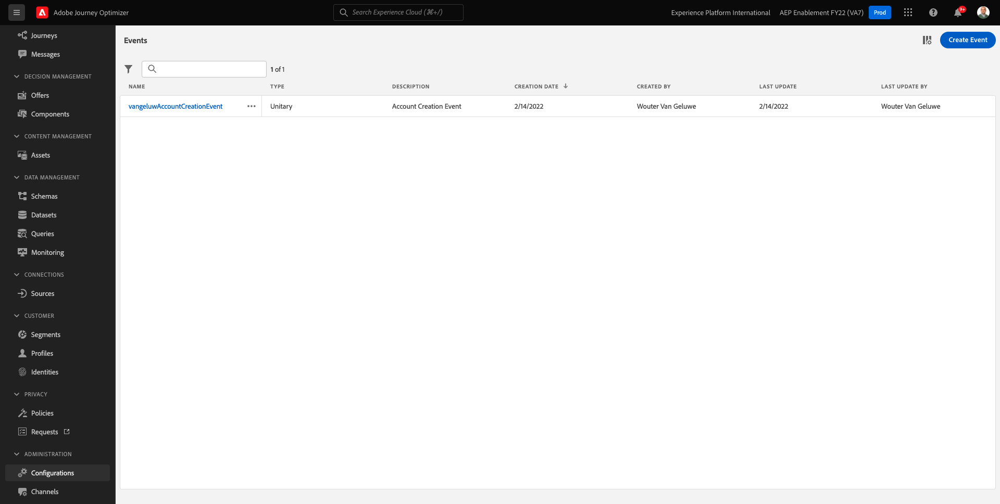
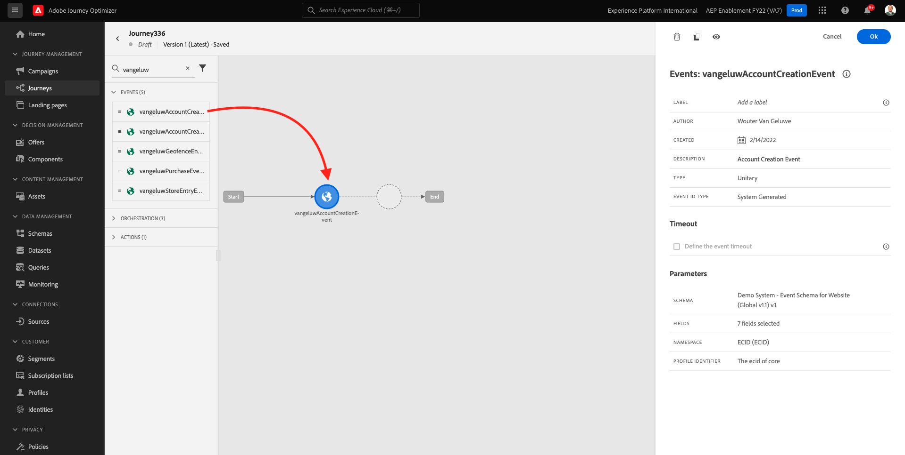
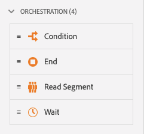
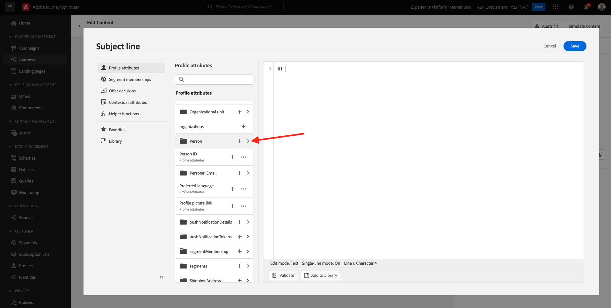
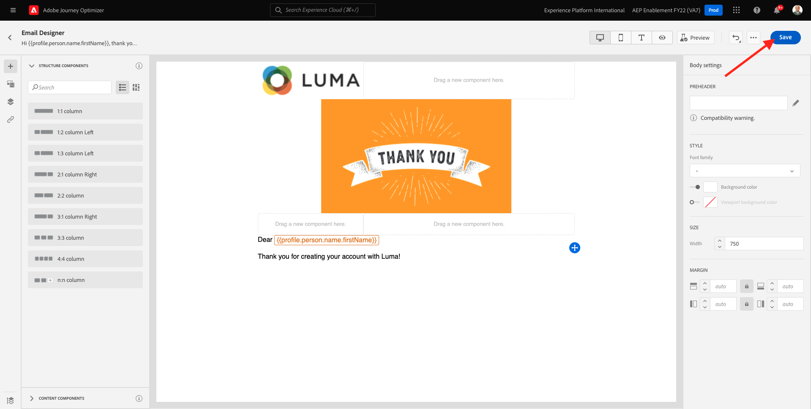
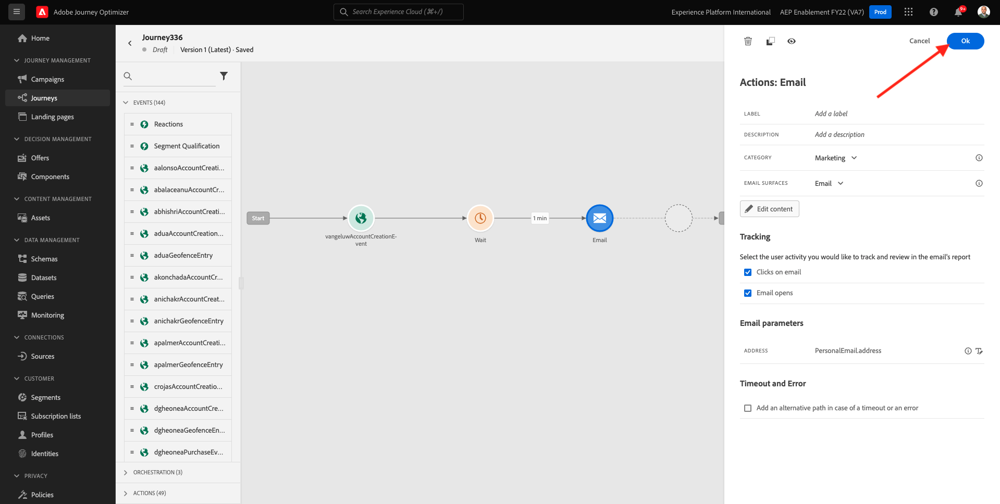

# 7.2 Crear el recorrido y el mensaje de correo electrónico

En este ejercicio, debe configurar el recorrido y el mensaje que debe activarse cuando alguien cree una cuenta en el sitio web de demostración.

Inicie sesión en Adobe Journey Optimizer desde [Adobe Experience Cloud](https://experience.adobe.com). Haga clic en **Journey Optimizer**.

Se le redirigirá al **Página principal**  en Journey Optimizer. En primer lugar, asegúrese de que está utilizando el simulador para pruebas correcto. El entorno limitado que se va a usar se denomina `--aepSandboxId--`. Para cambiar de un simulador de pruebas a otro, haga clic en **PRODUCCIÓN (VA7)** y seleccione el simulador de pruebas de la lista. En este ejemplo, el simulador de pruebas recibe el nombre **Habilitación de AEP para el año fiscal 22**. Entonces estará en el **Página principal** vista del entorno limitado `--aepSandboxId--`.

## 7.2.1 Cree su recorrido

En el menú de la izquierda, haga clic en **Recorridos**. A continuación, haga clic en **Crear Recorrido** para crear un nuevo recorrido.

A continuación, verá una pantalla de recorrido vacía.

En el ejercicio anterior, creó una **Evento**. Lo llamaste así `ldapAccountCreationEvent` y sustituido `ldap` con su ldap. Este fue el resultado de la creación del evento:

Ahora debe tomar este evento como el inicio de este Recorrido. Para ello, vaya a la izquierda de la pantalla y busque el evento en la lista de eventos.

Seleccione el evento, arrástrelo y suéltelo en el lienzo del Recorrido. El Recorrido ahora tiene este aspecto:

Como segundo paso en el recorrido, debe añadir una **Espera** paso a paso. Vaya al lado izquierdo de la pantalla a la **Organización** para encontrarlo. Utilizará atributos de perfil y tendrá que asegurarse de que se rellenen en el perfil del cliente en tiempo real.

Tu recorrido ahora se ve así. En el lado derecho de la pantalla, debe configurar el tiempo de espera. Configúrelo en 1 minuto. Esto dará tiempo suficiente para que los atributos de perfil estén disponibles después de que se active el evento.

Haga clic en **Ok** para guardar los cambios.

Como tercer paso en el recorrido, debe añadir un **Correo electrónico** acción. Vaya al lado izquierdo de la pantalla para **Acciones**, seleccione **Correo electrónico** a continuación, arrástrela y colóquela en el segundo nodo del recorrido. Ahora ven esto.

Configure las variables **Categoría** a **Marketing** y seleccione una superficie de correo electrónico que le permita enviar correos electrónicos. En este caso, la superficie de correo electrónico que se va a seleccionar es **Correo electrónico**. Asegúrese de que las casillas de verificación de **Clics en correos electrónicos** y **aperturas por correo electrónico** están activadas.

El siguiente paso es crear el mensaje. Para ello, haga clic en **Editar contenido**.

## 7.2.2 Crear su mensaje

Para crear el mensaje, haga clic en **Editar contenido**.

Ahora ven esto.

Haga clic en el **Línea de asunto** campo de texto.

En el área de texto empiece a escribir **Hi**

La línea de asunto aún no ha finalizado. A continuación, debe introducir el token de personalización para el campo **Nombre** que se almacenan en `profile.person.name.firstName`. En el menú de la izquierda, desplácese hacia abajo para encontrar la variable **Persona** y haga clic en la flecha para ir un nivel más profundo.

Ahora, busque **Nombre completo** y haga clic en la flecha para ir un nivel más profundo.

Finalmente, busque la **Nombre** y haga clic en el botón **+** a su lado. A continuación, verá que el token de personalización aparece en el campo de texto.

A continuación, añada el texto **, gracias por registrarse!**. Haga clic en **Guardar**.

Volverás aquí. Haga clic en **Diseñador de correo electrónico** para crear el contenido del correo electrónico.

En la siguiente pantalla, se le solicitarán 3 métodos diferentes para proporcionar el contenido del correo electrónico:

- **Diseño desde cero**: Comience con un lienzo vacío y utilice el editor WYSIWYG para arrastrar y soltar componentes de estructura y contenido para crear visualmente el contenido del correo electrónico.
- **Codifique sus propios**: Cree su propia plantilla de correo electrónico codificándola con HTML
- **Importar HTML**: Importe una plantilla de HTML existente, que podrá editar.

Haga clic en **Diseño desde cero**.

En el menú de la izquierda, encontrará los componentes de estructura que puede utilizar para definir la estructura del correo electrónico (filas y columnas).

Arrastre y suelte una **Columna 1:2 izquierda** del menú al lienzo. Será el marcador de posición de la imagen del logotipo.

Arrastre y suelte una **Columna 1:1** debajo del componente anterior. Este será el bloque de banners.

Arrastre y suelte una **Columna 1:2 izquierda** debajo del componente anterior. Será el contenido real con una imagen en el lado izquierdo y texto en el lado derecho.

A continuación, arrastre y suelte una **Columna 1:1** debajo del componente anterior. Será el pie de página del correo electrónico. El lienzo debería tener este aspecto:

A continuación, usemos Componentes de contenido para añadir contenido dentro de estos bloques. Haga clic en el **Componentes de contenido** elemento de menú

Arrastre y suelte una **Imagen** en la primera celda de la primera fila. Haga clic en **Examinar**.

Entonces verás esto. Vaya a la carpeta . **enablement-assets** y seleccione el archivo **luma-logo.png**. Haga clic en **Seleccionar**.

Ahora estás aquí de vuelta:

Vaya a **Componentes de contenido** y arrastre y suelte una **Imagen** en la primera celda de la primera fila. Haga clic en **Examinar**.

En el **Recursos** , vaya a la **enablement-assets** carpeta. En esta carpeta, encontrará todos los recursos preparados y cargados anteriormente por el equipo creativo. Select **module23-thankyou-new.png** y haga clic en **Select**.

Entonces tendrá esto:

Seleccione la imagen y, en el menú de la derecha, desplácese hacia abajo hasta que vea la variable **Tamaño** componente deslizador de ancho. Utilice el control deslizante para cambiar la anchura a f.i. **60 %**.

A continuación, vaya a **Componentes de contenido** y arrastre y suelte un **Texto** en el componente de estructura de la cuarta fila.

Seleccionar el texto predeterminado **Escriba el texto aquí.** como lo haría con cualquier editor de texto. Escritura **Estimado** en su lugar. Observe la barra de herramientas de texto que aparece cuando está en modo de texto.

En la barra de herramientas, haga clic en la **Añadir personalización** icono.

A continuación, debe traer la variable **Nombre** token de personalización que se almacena en `profile.person.name.firstName`. En el menú , busque la **Persona** elemento, desplácese hasta el **Nombre completo** y, a continuación, haga clic en el **+** para agregar el campo Nombre al editor de expresiones.

Haga clic en **Guardar**.

Ahora notará cómo se ha agregado el campo de personalización al texto.

En el mismo campo de texto, pulse **Entrar** dos veces para agregar dos líneas y escribir **¡Gracias por crear su cuenta con Luma!**.

La comprobación final que se debe realizar para garantizar que el correo electrónico está listo es previsualizarlo, haga clic en el **Simular contenido** botón.

Comience por identificar qué perfil desea utilizar para la vista previa. Seleccione el **email** espacio de nombres haciendo clic en el icono situado junto a **Introducir área de nombres de identidad** campo .

En la lista de áreas de nombres de identidad, seleccione la opción **Correo electrónico** espacio de nombres.

En el **Valor de identidad** , introduzca la dirección de correo electrónico de un perfil de demostración anterior que ya está almacenado en el perfil del cliente en tiempo real. Por ejemplo **woutervangeluwe+06022022-01@gmail.com** y haga clic en el botón **Buscar perfil de prueba** botón

Una vez que su perfil se muestre en la tabla, haga clic en el **Vista previa** para acceder a la pantalla de vista previa.

Cuando la vista previa esté lista, valide que la personalización sea correcta en la línea de asunto, el texto del cuerpo y el vínculo de baja se resaltan como un hipervínculo.

Haga clic en **Cerrar** para cerrar la vista previa.

Haga clic en **Guardar** para guardar el mensaje.

Vuelva al panel de mensajes haciendo clic en el **flecha** junto al texto de la línea de asunto en la esquina superior izquierda.

Ya ha terminado de crear su correo electrónico de registro. Haga clic en la flecha situada en la esquina superior izquierda para volver al recorrido.

Haga clic en **Ok**.

## 7.2.3 Publicar el recorrido

Aún necesita darle un Nombre a su recorrido. Para ello, haga clic en el botón **Propiedades** en la parte superior derecha de la pantalla.

A continuación, puede introducir el nombre del recorrido aquí. Utilice `--demoProfileLdap-- - Account Creation Journey`. Haga clic en **OK** para guardar los cambios.

Ahora puede publicar el recorrido haciendo clic en **Publicación**.

Haga clic en **Publicación** de nuevo.

A continuación, verá una barra de confirmación verde que indica que su recorrido se ha publicado.

Ya has terminado este ejercicio.

Paso siguiente: [7.3 Actualizar la propiedad de recopilación de datos y probar el recorrido](./ex3.md)

[Volver al módulo 7](./journey-orchestration-create-account.md)

[Volver a todos los módulos](../../overview.md)
