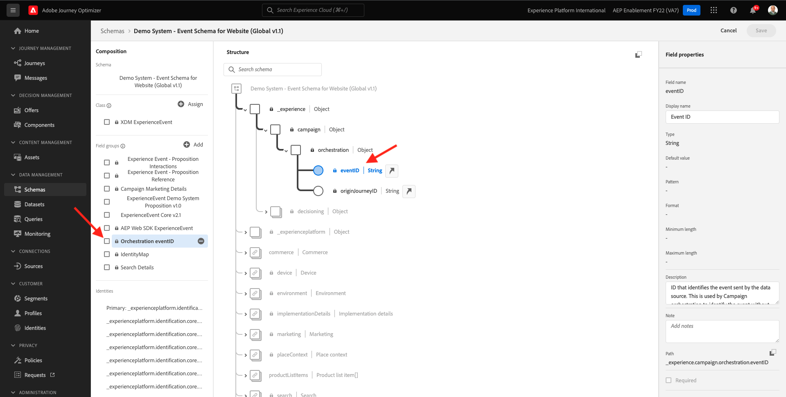

# 8.1 Definir un evento

Inicie sesión en Adobe Journey Optimizer desde [Adobe Experience Cloud](https://experience.adobe.com). Haga clic en **Journey Optimizer**.

Se le redirigirá al **Página principal**  en Journey Optimizer. En primer lugar, asegúrese de que está utilizando el simulador para pruebas correcto. El entorno limitado que se va a usar se denomina `--aepSandboxId--`. Para cambiar de un simulador de pruebas a otro, haga clic en **PRODUCCIÓN (VA7)** y seleccione el simulador de pruebas de la lista. En este ejemplo, el simulador de pruebas recibe el nombre **Habilitación de AEP para el año fiscal 22**. Entonces estará en el **Página principal** vista del entorno limitado `--aepSandboxId--`.

En el menú de la izquierda, desplácese hacia abajo y haga clic en **Configuraciones**. A continuación, haga clic en el **Administrar** botón debajo de **Eventos**.

A continuación, verá una descripción general de todos los eventos disponibles. Haga clic en **Crear evento** para comenzar a crear su propio evento.

A continuación, aparece una nueva ventana de evento vacía.

Como nombre del evento, utilice `--demoProfileLdap--GeofenceEntry`. En este ejemplo, el nombre del evento es `vangeluwGeofenceEntry`.

Establecer descripción como: `Geofence Entry Event`.

A continuación, asegúrese de que la variable **Tipo** está configurado como **Unitario** y para la variable **Tipo de ID de evento** selección, seleccionar **Sistema generado**

A continuación, debe seleccionar un esquema. Todos los esquemas que se muestran aquí son esquemas de Adobe Experience Platform.

Verá que no se muestran todos los esquemas. Hay muchos más esquemas disponibles en Adobe Experience Platform.
Para aparecer en esta lista, un esquema debe tener un grupo de campos muy específico vinculado a él. El grupo de campos que se necesita para aparecer aquí se llama `Orchestration eventID`.

Veamos rápidamente cómo se definen estos esquemas en Adobe Experience Platform.

En el menú de la izquierda, vaya a **Esquemas** y ábralo en una nueva pestaña del navegador. En **Esquemas**, vaya a **Examinar** para ver la lista de esquemas disponibles.
Abrir el esquema `Demo System - Event Schema for Website (Global v1.1)`.

Después de abrir el esquema, verá que el grupo de campos `Orchestration eventID` forma parte del esquema .
Este grupo de campos solo tiene dos campos, `_experience.campaign.orchestration.eventID` y `originJourneyID`.

Una vez que este grupo de campos y este campo eventID específico formen parte de un esquema, ese esquema estará disponible para su uso en Adobe Journey Optimizer.

Vuelva a la configuración de evento en Adobe Journey Optimizer.

En este caso de uso, desea escuchar un Evento de geovalla para comprender si un cliente se encuentra en una ubicación específica, por lo que ahora seleccione el Esquema `Demo System - Event Schema for Website (Global v1.1)` como Esquema para el evento.

A continuación, Adobe Journey Optimizer seleccionará automáticamente algunos campos obligatorios, pero puede editar los campos que están disponibles para Adobe Journey Optimizer.

Haga clic en el **lápiz** para editar los campos.

A continuación, verá una ventana emergente con una jerarquía de esquema que le permite seleccionar campos.

Los campos como ECID y el eventID de organización son obligatorios y, como tales, están preseleccionados.

Sin embargo, un comerciante necesita tener acceso flexible a todos los puntos de datos que proporcionan contexto a un Recorrido. Por lo tanto, asegúrese de seleccionar los siguientes campos como mínimo (que se encuentran dentro del nodo de contexto Colocar ):

- Ciudad

Una vez que haya terminado, haga clic en **OK**.

Adobe Journey Optimizer también necesita un identificador para identificar al cliente. Dado que Adobe Journey Optimizer está vinculado a Adobe Experience Platform, el identificador principal de un esquema se toma automáticamente como identificador del Recorrido.
El identificador principal también tendrá en cuenta automáticamente el gráfico de identidad completo de Adobe Experience Platform y vinculará todo el comportamiento en todas las identidades, dispositivos y canales disponibles con el mismo perfil, de modo que Adobe Journey Optimizer sea contextual, relevante y coherente.

Haga clic en **Guardar** para guardar el evento personalizado.

El evento formará parte de la lista de eventos disponibles.

Finalmente, debe recuperar el `Orchestration eventID` para el evento personalizado.

Vuelva a abrir el evento haciendo clic en él en la lista de eventos.
En el evento, haga clic en el botón **Ver carga útil** junto a **Campos**.

Al hacer clic en **Ver carga útil** abre una carga útil XDM de muestra para este evento.

Desplácese hacia abajo en la **Carga útil** hasta que vea la línea `eventID`.

Anote el `eventID` ya que lo necesitará en la última para probar la configuración.

En este ejemplo, la variable `eventID` es `fa42ab7982ba55f039eacec24c1e32e5c51b310c67f0fa559ab49b89b63f4934`.

Ahora han definido el evento que déclencheur el recorrido que estamos construyendo. Una vez activado el recorrido, los campos de geovalla como Ciudad y cualquier otro que haya elegido (como País, Latitud y Longitud) estarán disponibles para el recorrido.

Como se explica en la descripción del caso de uso, entonces necesitamos proporcionar promociones contextuales que dependan del clima. Para obtener información meteorológica, tendremos que definir fuentes de datos externas que nos proporcionen la información meteorológica para esa ubicación. Usará el **OpenWeather** para proporcionarnos esa información, como parte de 2.

Paso siguiente: [8.2 Definir una fuente de datos externa](./ex2.md)

[Volver al módulo 8](journey-orchestration-external-weather-api-sms.md)

[Volver a todos los módulos](../../overview.md)
