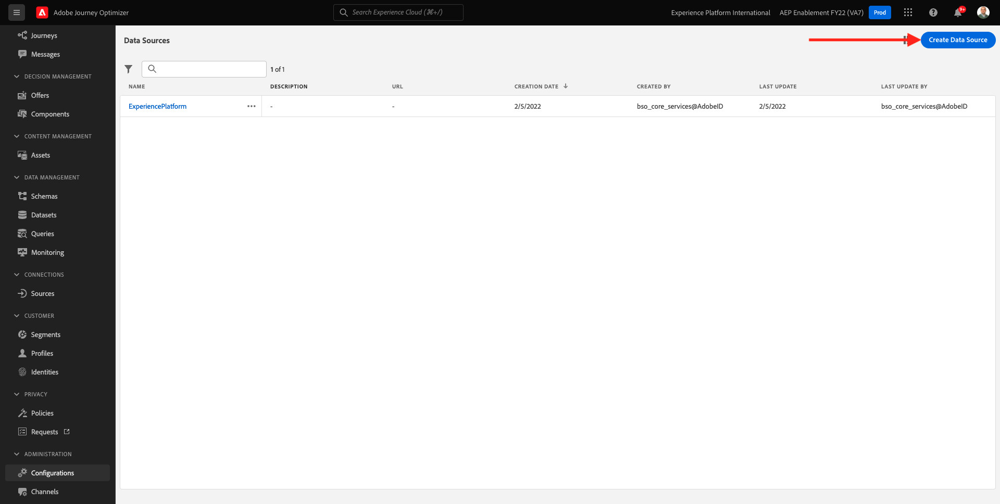
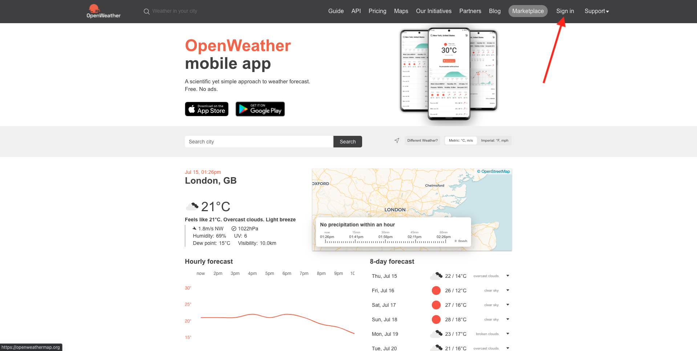

# 8.2 Definir una fuente de datos externa

En este ejercicio, creará una fuente de datos externa personalizada utilizando Adobe Journey Optimizer.

Inicie sesión en Adobe Journey Optimizer desde [Adobe Experience Cloud](https://experience.adobe.com). Haga clic en **Journey Optimizer**.


Se le redirigirá al **Página principal**  en Journey Optimizer. En primer lugar, asegúrese de que está utilizando el simulador para pruebas correcto. El entorno limitado que se va a usar se denomina `--aepSandboxId--`. Para cambiar de un simulador de pruebas a otro, haga clic en **PRODUCCIÓN (VA7)** y seleccione el simulador de pruebas de la lista. En este ejemplo, el simulador de pruebas recibe el nombre **Habilitación de AEP para el año fiscal 22**. Entonces estará en el **Página principal** vista del entorno limitado `--aepSandboxId--`.


En el menú de la izquierda, desplácese hacia abajo y haga clic en **Configuraciones**. A continuación, haga clic en el **Administrar** botón debajo de **Fuentes de datos**.


Verá el **Fuentes de datos** lista.
Haga clic en **Crear fuente de datos** para empezar a añadir la fuente de datos.



Verá una ventana emergente de fuente de datos vacía.


Antes de empezar a configurar esto, necesitará una cuenta con la variable **Abrir mapa del tiempo** servicio. Siga estos pasos para crear su cuenta y obtener su clave de API.

Vaya a [https://openweathermap.org/](https://openweathermap.org/). En la página principal, haga clic en **Iniciar sesión**.



Haga clic en **Crear una cuenta**.


Complete los detalles.


Haga clic en **Crear cuenta**.


A continuación, se le redirigirá a la página de su cuenta.


En el menú , haga clic en **Claves de API** para recuperar la clave de API, que deberá configurar la fuente de datos externa personalizada.


Un **Clave de API** tiene este aspecto: `b2c4c36b6bb59c3458d6686b05311dc3`.

Puede encontrar la variable **Documentación de API** para el **Tiempo actual** [here](https://openweathermap.org/current).

En nuestro caso de uso, implementaremos la conexión con el mapa de tiempo abierto basado en la ciudad en la que se encuentra el cliente.


Vuelva a **Adobe Journey Optimizer**, a su vacío **Fuente de datos externa** ventana emergente.


Como Nombre de la fuente de datos, utilice `--demoProfileLdap--WeatherApi`. En este ejemplo, el nombre de la fuente de datos es `vangeluwWeatherApi `.

Establecer descripción como: `Access to the Open Weather Map`.

La URL de la API de mapa de tiempo abierto es: **http://api.openweathermap.org/data/2.5/weather?units=metric**


A continuación, debe seleccionar la Autenticación que desea utilizar.

Utilice estas variables:

| Campo | Valor |
|:-----------------------:| :-----------------------|
| Tipo | **clave de API** |
| Nombre | **APPID** |
| Valor | **su clave de API** |
| Ubicación | **Parámetro de consulta** |


Finalmente, debe definir una **FieldGroup**, que es básicamente la solicitud que enviará a la API meteorológica. En nuestro caso, queremos usar el nombre de la ciudad para solicitar el Tiempo Actual para esa ciudad.


Según la documentación de la API meteorológica, necesitamos enviar un parámetro `q=City`.


Para que coincida con la solicitud de API esperada, configure FieldGroup de la siguiente manera:

>[!IMPORTANT]
>
>El nombre del grupo de campos debe ser único. Utilice esta convención de nombres: `--demoProfileLdap--WeatherByCity` por lo tanto, en este caso, el nombre debe ser `vangeluwWeatherByCity`


Para la carga útil de respuesta, debe pegar un ejemplo de la respuesta que enviará la API meteorológica.

Puede encontrar la respuesta JSON de API esperada en la página de documentación de la API [here](https://openweathermap.org/current).


O puede copiar la respuesta JSON desde aquí:

```json
{"coord": { "lon": 139,"lat": 35},
  "weather": [
    {
      "id": 800,
      "main": "Clear",
      "description": "clear sky",
      "icon": "01n"
    }
  ],
  "base": "stations",
  "main": {
    "temp": 281.52,
    "feels_like": 278.99,
    "temp_min": 280.15,
    "temp_max": 283.71,
    "pressure": 1016,
    "humidity": 93
  },
  "wind": {
    "speed": 0.47,
    "deg": 107.538
  },
  "clouds": {
    "all": 2
  },
  "dt": 1560350192,
  "sys": {
    "type": 3,
    "id": 2019346,
    "message": 0.0065,
    "country": "JP",
    "sunrise": 1560281377,
    "sunset": 1560333478
  },
  "timezone": 32400,
  "id": 1851632,
  "name": "Shuzenji",
  "cod": 200
}
```

Copie la respuesta JSON anterior en el portapapeles y vaya a la pantalla de configuración personalizada de la fuente de datos.

Haga clic en el **Editar carga útil** icono.


Verá una ventana emergente en la que ahora debe pegar la respuesta JSON anterior.


Pegue su respuesta JSON, después de lo cual verá esto. Haga clic en **Guardar**.


La configuración de la fuente de datos personalizada ya ha finalizado. Desplácese hacia arriba y haga clic en **Guardar**.


La fuente de datos se ha creado correctamente y forma parte del **Fuentes de datos** lista.


Paso siguiente: [8.3 Definir una acción personalizada](./ex3.md)

[Volver al módulo 8](journey-orchestration-external-weather-api-sms.md)

[Volver a todos los módulos](../../overview.md)
