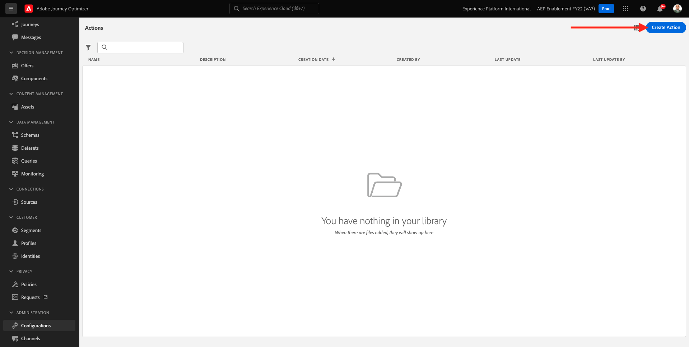
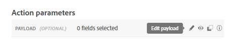

# 8.3 Definir una acción personalizada

En este ejercicio, creará dos acciones personalizadas utilizando Adobe Journey Optimizer en combinación.

Inicie sesión en Adobe Journey Optimizer desde [Adobe Experience Cloud](https://experience.adobe.com). Haga clic en **Journey Optimizer**.


Se le redirigirá al **Página principal**  en Journey Optimizer. En primer lugar, asegúrese de que está utilizando el simulador para pruebas correcto. El entorno limitado que se va a usar se denomina `--aepSandboxId--`. Para cambiar de un simulador de pruebas a otro, haga clic en **PRODUCCIÓN (VA7)** y seleccione el simulador de pruebas de la lista. En este ejemplo, el simulador de pruebas recibe el nombre **Habilitación de AEP para el año fiscal 22**. Entonces estará en el **Página principal** vista del entorno limitado `--aepSandboxId--`.


En el menú de la izquierda, desplácese hacia abajo y haga clic en **Configuraciones**. A continuación, haga clic en el **Administrar** botón debajo de **Acciones**.


Verá el **Acciones** lista.


Defina una acción que envíe un texto a un canal de Slack.

## 8.3.1 Acción: Enviar texto al canal del Slack

Ahora utilizará un canal de Slack existente y enviará mensajes a ese canal de Slack. Slack tiene una API fácil de usar y utilizaremos Adobe Journey Optimizer para almacenar en déclencheur su API.


Haga clic en **Crear acción** para empezar a agregar una nueva acción.



Verá una ventana emergente de acción vacía.


Como nombre de la acción, utilice `--demoProfileLdap--TextSlack`. En este ejemplo, el Nombre de la acción es `vangeluwTextSlack`.

Establecer descripción como: `Send Text to Slack`.


Para la variable **Configuración de URL**, utilice esto:

- Dirección URL: `https://2mnbfjyrre.execute-api.us-west-2.amazonaws.com/prod`
- Método: **POST**

>[!NOTE]
>
>La URL anterior hace referencia a una función de AWS Lambda que reenviará la solicitud al canal del Slack como se mencionó anteriormente. Esto se hace para proteger el acceso a un canal de Slack propiedad del Adobe. Si tiene su propio canal de Slack, debe crear una aplicación Slack a través de [https://api.slack.com/](https://api.slack.com/), debe crear un vínculo web entrante en esa aplicación Slack y, a continuación, reemplazar la URL anterior por la URL de vínculo web entrante.

No es necesario cambiar los campos del encabezado.


**Autenticación** debe configurarse como **Sin autenticación**.


Para la variable **Parámetros de acción**, debe definir qué campos se deben enviar al Slack. Lógicamente, queremos que Adobe Journey Optimizer y Adobe Experience Platform sean el cerebro de la personalización, por lo que el texto que se envía al Slack debe definirse por Adobe Journey Optimizer y luego enviarse al Slack para su ejecución.

Así que para la **Parámetros de acción**, haga clic en **Editar carga útil** icono.



A continuación, verá una ventana emergente vacía.


Copie el texto siguiente y péguelo en la ventana emergente vacía.

```json
{
 "text": {
  "toBeMapped": true,
  "dataType": "string",
  "label": "textToSlack"
 }
}
```

I.F.: al especificar los campos siguientes, se podrá acceder a estos campos desde el Recorrido del cliente y se podrán rellenar dinámicamente desde el Recorrido:

**&quot;toBeMapped&quot;: true,**

**&quot;dataType&quot;: &quot;string&quot;,**

**&quot;label&quot;: &quot;textToSlack&quot;**

Verá esto:


Haga clic en **Guardar**.


Desplácese hacia arriba y haga clic en **Guardar** una vez más para guardar la acción personalizada.


La acción personalizada ahora forma parte del **Acciones** lista.


Ha definido eventos, fuentes de datos externas y acciones. Ahora consolidemos todo eso en un recorrido.

Paso siguiente: [8.4 Crear su recorrido y mensajes](./ex4.md)

[Volver al módulo 8](journey-orchestration-external-weather-api-sms.md)

[Volver a todos los módulos](../../overview.md)
