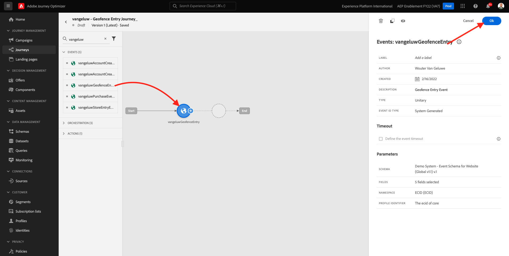
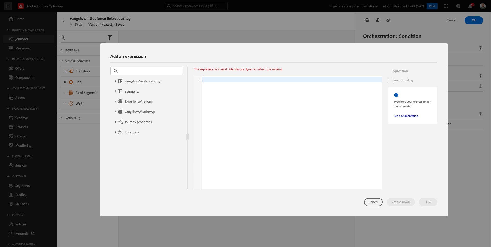
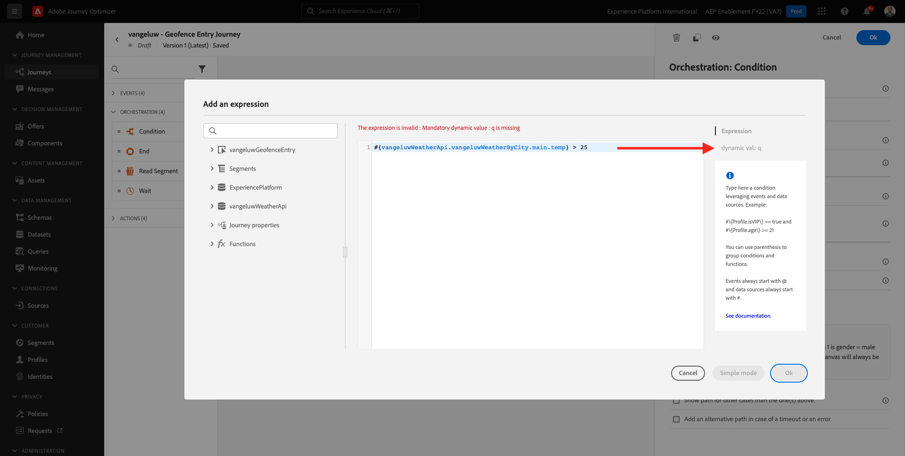
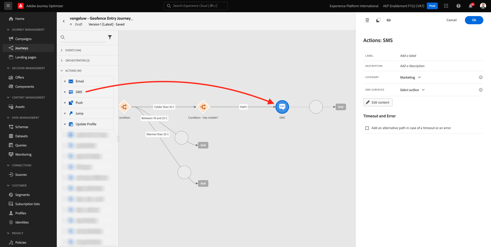
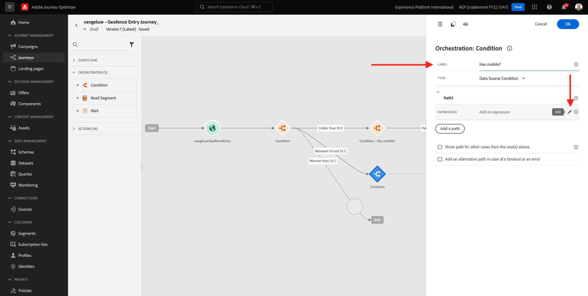
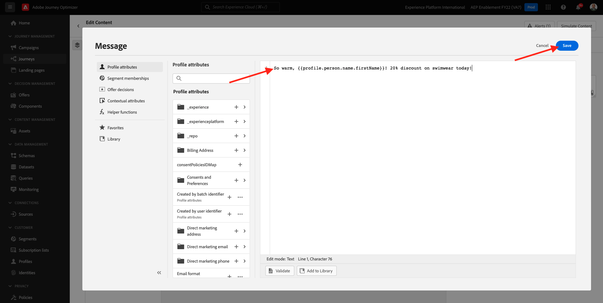

# 8.4 Crear su recorrido y mensajes

En este ejercicio, creará un recorrido y varios mensajes de texto utilizando Adobe Journey Optimizer.

Para este caso de uso, el objetivo es enviar diferentes mensajes SMS en función de las condiciones meteorológicas de la ubicación de su cliente. Se han definido 3 escenarios:

- Más frío que 10° Celsius
- Entre 10° y 25° Celsius
- Más cálido que 25° Celsius

Para estas 3 condiciones, debe definir 3 mensajes SMS en Adobe Journey Optimizer.

## 8.4.1 Crear su recorrido

Inicie sesión en Adobe Journey Optimizer desde [Adobe Experience Cloud](https://experience.adobe.com). Haga clic en **Journey Optimizer**.


Se le redirigirá al **Página principal**  en Journey Optimizer. En primer lugar, asegúrese de que está utilizando el simulador para pruebas correcto. El entorno limitado que se va a usar se denomina `--aepSandboxId--`. Para cambiar de un simulador de pruebas a otro, haga clic en **PRODUCCIÓN (VA7)** y seleccione el simulador de pruebas de la lista. En este ejemplo, el simulador de pruebas recibe el nombre **Habilitación de AEP para el año fiscal 22**. Entonces estará en el **Página principal** vista del entorno limitado `--aepSandboxId--`.


En el menú de la izquierda, vaya a **Recorridos** y haga clic en **Crear Recorrido** para empezar a crear su Recorrido.


Deberías nombrar a tu recorrido.

Como nombre del recorrido, utilice `--demoProfileLdap-- - Geofence Entry Journey`. En este ejemplo, el nombre del recorrido es `vangeluw - Geofence Entry Journey`. En este momento no se debe establecer ningún otro valor. Haga clic en **Aceptar**.


A la izquierda de la pantalla, eche un vistazo a **Eventos**. Debería ver el evento creado anteriormente en esa lista. Selecciónela y luego arrástrela y suéltela en el lienzo del recorrido. Tu recorrido se ve así. Haga clic en **Ok**.



A continuación, haga clic en **Organización**. Ahora puede ver las **Organización** capacidades. Select **Condición** y, a continuación, arrástrela y colóquela en el lienzo del Recorrido.


Ahora tiene que definir tres condiciones:

- Es más frío que 10° Celsius
- Está entre 10° y 25° Celsius
- Es más cálido que 25° Celsius

Definamos la primera condición.

### Condición 1: Más frío que 10° Celsius

Haga clic en el **Condición**.  Haga clic en **Ruta 1** y editar el nombre de la ruta a **Más de 10 C**. Haga clic en el **Editar** para la expresión de Path1.


Verá un vacío **Editor sencillo** en el Navegador. Su consulta será un poco más avanzada, por lo que necesitará la variable **Modo avanzado**. Haga clic en **Modo avanzado**.


Verá el **Editor avanzado** que permite la entrada de código.


Seleccione el código siguiente y péguelo en el **Editor avanzado**.

`#{--demoProfileLdap--WeatherApi.--demoProfileLdap--WeatherByCity.main.temp} <= 10`

Entonces verás esto.


Para recuperar la temperatura como parte de esta condición, debe proporcionar la ciudad en la que se encuentra el cliente.
La variable **Ciudad** debe estar vinculado al parámetro dinámico `q`, tal como vimos anteriormente en la documentación de API de Tiempo abierto .

Haga clic en el campo . **val dinámico: q** como se indica en la captura de pantalla.


A continuación, debe buscar el campo que contiene la ciudad actual del cliente en una de las fuentes de datos disponibles.



Para encontrar el campo, vaya a `--demoProfileLdap--GeofenceEntry.placeContext.geo.city`.

Al hacer clic en ese campo, se añade como valor dinámico para el parámetro `q`. Este campo se rellenará con, por ejemplo, el servicio de geolocalización que ha implementado en su aplicación móvil. En nuestro caso, simularemos esto con la consola de administración del sitio web de demostración. Haga clic en **Aceptar**.


### Condición 2: Entre 10° y 25° Celsius

Después de agregar la primera condición, verá esta pantalla. Haga clic en **Agregar ruta**.


Haga doble clic en **Ruta 1** y edite el nombre de la ruta a **Entre 10 y 25 C**. Haga clic en el **Editar** para la expresión esta ruta.


Verá un vacío **Editor sencillo** en el Navegador. Su consulta será un poco más avanzada, por lo que necesitará la variable **Modo avanzado**. Haga clic en **Modo avanzado**.


Verá el **Editor avanzado** que permite la entrada de código.


Seleccione el código siguiente y péguelo en el **Editor avanzado**.

`#{--demoProfileLdap--WeatherApi.--demoProfileLdap--WeatherByCity.main.temp} > 10 and #{--demoProfileLdap--WeatherApi.--demoProfileLdap--WeatherByCity.main.temp} <= 25`

Entonces verás esto.


Para recuperar la temperatura como parte de esta condición, debe proporcionar la ciudad en la que se encuentra el cliente.
La variable **Ciudad** debe estar vinculado al parámetro dinámico **q**, tal como vimos anteriormente en la documentación de API de Tiempo abierto .

Haga clic en el campo . **val dinámico: q** como se indica en la captura de pantalla.


A continuación, debe buscar el campo que contiene la ciudad actual del cliente en una de las fuentes de datos disponibles.


Para encontrar el campo, vaya a `--demoProfileLdap--GeofenceEntry.placeContext.geo.city`. Al hacer clic en ese campo, se añade como valor dinámico para el parámetro **q**. Este campo se rellenará con, por ejemplo, el servicio de geolocalización que ha implementado en su aplicación móvil. En nuestro caso, simularemos esto con la consola de administración del sitio web de demostración. Haga clic en **Aceptar**.


A continuación, agregará la tercera condición.

### Condición 3: Más cálido que 25° Celsius

Después de agregar la segunda condición, verá esta pantalla. Haga clic en **Agregar ruta**.


Haga doble clic en Ruta1 para cambiar el nombre a **Más caliente que 25 C**.
A continuación, haga clic en el **Editar** para la expresión esta ruta.


Verá un vacío **Editor sencillo** en el Navegador. Su consulta será un poco más avanzada, por lo que necesitará la variable **Modo avanzado**. Haga clic en **Modo avanzado**.


Verá el **Editor avanzado** que permite la entrada de código.


Seleccione el código siguiente y péguelo en el **Editor avanzado**.

`#{--demoProfileLdap--WeatherApi.--demoProfileLdap--WeatherByCity.main.temp} > 25`

Entonces verás esto.


Para recuperar la temperatura como parte de esta condición, debe proporcionar la ciudad en la que se encuentra el cliente.
La variable **Ciudad** debe estar vinculado al parámetro dinámico **q**, tal como vimos anteriormente en la documentación de API de Tiempo abierto .

Haga clic en el campo . **val dinámico: q** como se indica en la captura de pantalla.



A continuación, debe buscar el campo que contiene la ciudad actual del cliente en una de las fuentes de datos disponibles.


Para encontrar el campo, vaya a ```--demoProfileLdap--GeofenceEntry.placeContext.geo.city```. Al hacer clic en ese campo, se añade como valor dinámico para el parámetro **q**. Este campo se rellenará con, por ejemplo, el servicio de geolocalización que ha implementado en su aplicación móvil. En nuestro caso, simularemos esto con la consola de administración del sitio web de demostración. Haga clic en **Aceptar**.


Ahora tiene tres rutas configuradas. Haga clic en **Ok**.


Como este es un recorrido para fines de aprendizaje, ahora configuraremos un par de acciones para mostrar la variedad de opciones que los comerciantes ahora tienen para enviar mensajes.

## 8.4.2 Enviar mensajes para la ruta: Más frío que 10° Celsius

Para cada contexto de temperatura, intentaremos enviar un mensaje de texto a nuestro cliente. Solo podemos enviar un mensaje de texto si tenemos un número de móvil disponible para un cliente, por lo que primero tendremos que verificar que lo hacemos.

Centrémonos en **Más de 10 C**.


Tomemos otro **Condición** y arrástrelo como se indica en la captura de pantalla siguiente. Comprobaremos si para este cliente tenemos un número de móvil disponible.


Como este es solo un ejemplo, solo estamos configurando la opción donde el cliente tiene un número de móvil disponible. Añadir una etiqueta de **¿Tiene móvil?**.

Haga clic en el **Editar** para la expresión **Ruta 1** ruta.


En las fuentes de datos que aparecen a la izquierda, vaya a **ExperiencePlatform.ProfileFieldGroup.profile.mobilePhone.number**. Ahora está leyendo el número de teléfono móvil directamente desde Adobe Experience Platform Real-time Customer Profile.


Seleccione el campo **Número** y, a continuación, arrástrela al lienzo de la condición.

Seleccione el operador **no está vacío**. Haga clic en **Ok**.


Entonces verás esto. Haga clic en **OK** de nuevo.


Tu recorrido se verá así. Haga clic en **Acciones** como se indica en la captura de pantalla.


Seleccione la acción **SMS**, luego arrástrela y suéltela después de la condición que acaba de añadir.



Configure las variables **Categoría** a **Marketing** y seleccione una superficie de SMS que le permita enviar SMS. En este caso, la superficie de correo electrónico que se va a seleccionar es **SMS**.


El siguiente paso es crear el mensaje. Para ello, haga clic en **Editar contenido**.


Ahora puede ver el panel de mensajes, donde puede configurar el texto del SMS. Haga clic en el **Componer mensaje** para crear el mensaje.


Escriba el siguiente texto: `Brrrr... {{profile.person.name.firstName}}, it's freezing. 20% discount on jackets today!`. Haga clic en **Guardar**.


Entonces verás esto. Haga clic en la flecha situada en la esquina superior izquierda para volver al recorrido.


Volverás aquí. Haga clic en **Ok**.


En el menú de la izquierda, vuelva a **Acciones**, seleccione la acción `--demoProfileLdap--TextSlack`y, a continuación, arrástrela y colóquela después de **Mensaje** acción.


Vaya a **Parámetros de acción** y haga clic en el botón **Editar** para el parámetro `TEXTTOSLACK`.


En la ventana emergente, haga clic en **Modo avanzado**.


Seleccione el código siguiente, cópielo y péguelo en el **Editor de modo avanzado**. Haga clic en **Ok**.

`"Brrrr..." + #{ExperiencePlatform.ProfileFieldGroup.profile.person.name.firstName} + " It's freezing. 20% discount on Jackets today!"`


Verá la acción completada. Haga clic en **Ok**.


Esta ruta del recorrido ya está lista.

## 8.4.3 Enviar mensajes para la ruta: Entre 10° y 25° Celsius

Para cada contexto de temperatura, intentaremos enviar un mensaje de texto a nuestro cliente. Solo podemos enviar un mensaje de texto si tenemos un número de móvil disponible para un cliente, por lo que primero tendremos que verificar que lo hacemos.

Centrémonos en **Entre 10 y 25 C** ruta.


Tomemos otro **Condición** y arrástrelo como se indica en la captura de pantalla siguiente. Comprobaremos si para este cliente tenemos un número de móvil disponible.


Como este es solo un ejemplo, solo estamos configurando la opción donde el cliente tiene un número de móvil disponible. Añadir una etiqueta de **¿Tiene móvil?**.

Haga clic en el **Editar** para la expresión **Ruta 1** ruta.



En las fuentes de datos que aparecen a la izquierda, vaya a **ExperiencePlatform.ProfileFieldGroup.profile.mobilePhone.number**. Ahora está leyendo el número de teléfono móvil directamente desde Adobe Experience Platform Real-time Customer Profile.


Seleccione el campo **Número** y, a continuación, arrástrela al lienzo de la condición.

Seleccione el operador **no está vacío**. Haga clic en **Ok**.


Entonces verás esto. Haga clic en **Ok**.


Tu recorrido se verá así. Haga clic en **Acciones** como se indica en la captura de pantalla.


Seleccione la acción **SMS**, luego arrástrela y suéltela después de la condición que acaba de añadir.


Configure las variables **Categoría** a **Marketing** y seleccione una superficie de SMS que le permita enviar SMS. En este caso, la superficie de correo electrónico que se va a seleccionar es **SMS**.


El siguiente paso es crear el mensaje. Para ello, haga clic en **Editar contenido**.


Ahora puede ver el panel de mensajes, donde puede configurar el texto del SMS. Haga clic en el **Componer mensaje** para crear el mensaje.


Escriba el siguiente texto: `What a nice weather for the time of year, {{profile.person.name.firstName}} - 20% discount on Sweaters today!`. Haga clic en **Guardar**.


Entonces verás esto. Haga clic en la flecha situada en la esquina superior izquierda para volver al recorrido.


Ahora verá la acción completada. Haga clic en **Ok**.


En el menú de la izquierda, vuelva a **Acciones**, seleccione la acción `--demoProfileLdap--TextSlack`y, a continuación, arrástrela y colóquela después de **Mensaje** acción.


Vaya a **Parámetros de acción** y haga clic en el botón **Editar** para el parámetro `TEXTTOSLACK`.


En la ventana emergente, haga clic en **Modo avanzado**.


Seleccione el código siguiente, cópielo y péguelo en el **Editor de modo avanzado**. Haga clic en **Ok**.

`"What nice weather for the time of year, " + #{ExperiencePlatform.ProfileFieldGroup.profile.person.name.firstName} + " 20% discount on Sweaters today!"`


Verá la acción completada. Haga clic en **Ok**.


Esta ruta del recorrido ya está lista.

## 8.4.4 Enviar mensajes para la ruta: Más cálido que 25° Celsius

Para cada contexto de temperatura, intentaremos enviar un mensaje de texto a nuestro cliente. Solo podemos enviar un mensaje de texto si tenemos un número de móvil disponible para un cliente, por lo que primero tendremos que verificar que lo hacemos.

Centrémonos en **Más caliente que 25 C** ruta.


Tomemos otro **Condición** y arrástrelo como se indica en la captura de pantalla siguiente. Comprobará si para este cliente dispone de un número de móvil.


Como este es solo un ejemplo, solo estamos configurando la opción donde el cliente tiene un número de móvil disponible. Añadir una etiqueta de **¿Tiene móvil?**.

Haga clic en el **Editar** para la expresión **Ruta 1** ruta.


En las fuentes de datos que aparecen a la izquierda, vaya a **ExperiencePlatform.ProfileFieldGroup.profile.mobilePhone.number**. Ahora está leyendo el número de teléfono móvil directamente desde Adobe Experience Platform Real-time Customer Profile.


Seleccione el campo **Número** y, a continuación, arrástrela al lienzo de la condición.

Seleccione el operador **no está vacío**. Haga clic en **Ok**.


Entonces verás esto. Haga clic en **Aceptar**.


Tu recorrido se verá así. Haga clic en **Acciones** como se indica en la captura de pantalla.


Seleccione la acción **SMS**, luego arrástrela y suéltela después de la condición que acaba de añadir.


Configure las variables **Categoría** a **Marketing** y seleccione una superficie de SMS que le permita enviar SMS. En este caso, la superficie de correo electrónico que se va a seleccionar es **SMS**.


El siguiente paso es crear el mensaje. Para ello, haga clic en **Editar contenido**.


Ahora puede ver el panel de mensajes, donde puede configurar el texto del SMS. Haga clic en el **Componer mensaje** para crear el mensaje.


Escriba el siguiente texto: `So warm, {{profile.person.name.firstName}}! 20% discount on swimwear today!`. Haga clic en **Guardar**.



Entonces verás esto. Haga clic en la flecha situada en la esquina superior izquierda para volver al recorrido.


Ahora verá la acción completada. Haga clic en **Ok**.


En el menú de la izquierda, vuelva a **Acciones**, seleccione la acción `--demoProfileLdap--TextSlack`y, a continuación, arrástrela y colóquela después de **Mensajes** acción.


Vaya a **Parámetros de acción** y haga clic en el botón **Editar** para el parámetro `TEXTTOSLACK`.


En la ventana emergente, haga clic en **Modo avanzado**.


Seleccione el código siguiente, cópielo y péguelo en el **Editor de modo avanzado**. Haga clic en **Ok**.

`"So warm, " + #{ExperiencePlatform.ProfileFieldGroup.profile.person.name.firstName} + "! 20% discount on swimwear today!"`


Verá la acción completada. Haga clic en **Ok**.


Esta ruta del recorrido ya está lista.

## 8.4.5 Publicar el recorrido

El recorrido ya está totalmente configurado. Haga clic en **Publicación**.


Haga clic en **Publicación** de nuevo.


El recorrido ya está publicado.


Paso siguiente: [8.5 Déclencheur de su recorrido](./ex5.md)

[Volver al módulo 8](journey-orchestration-external-weather-api-sms.md)

[Volver a todos los módulos](../../overview.md)
