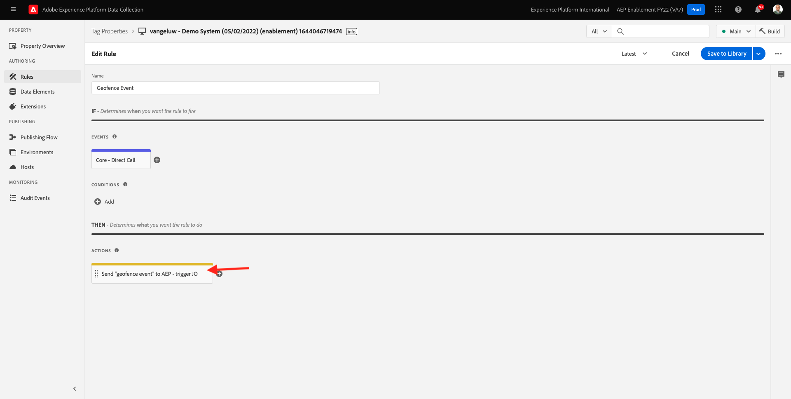
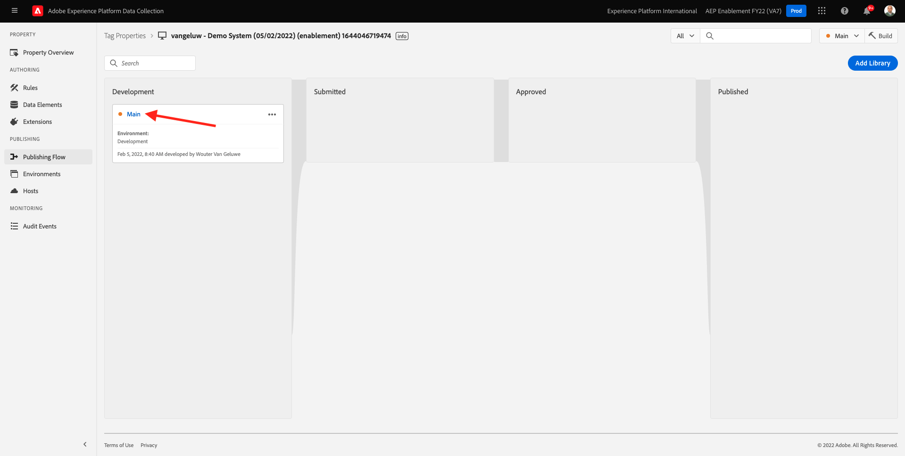

# 8.5 Déclencheur de su recorrido

En este ejercicio, probará y almacenará en déclencheur el recorrido que configuró en este módulo.

## 8.5.1 Actualizar la configuración de eventos de geovalla

Vaya a [Recopilación de datos de Adobe Experience Platform](https://experience.adobe.com/launch/) y seleccione **Etiquetas**.

Esta es la página Propiedades de la recopilación de datos de Adobe Experience Platform que vio anteriormente.

En el módulo 0, Sistema de demostración creó dos propiedades de cliente para usted: uno para el sitio web y otro para la aplicación móvil. Para encontrarlos, busque `--demoProfileLdap--` en el **[!UICONTROL Buscar]** en la ventana Haga clic en para abrir el **Web** propiedad.

Entonces verás esto.

En el menú de la izquierda, vaya a **Reglas** y buscar la regla **Evento de geovalla**. Haga clic en la regla **Evento de geovalla** para abrirlo.

A continuación, verá los detalles de esta regla. Haga clic en para abrir la acción **Enviar &quot;evento de geovalla&quot; a AEP: déclencheur JO**.

A continuación, verá que, cuando se active esta acción, se utiliza un elemento de datos específico para definir la estructura de datos XDM. Debe actualizar ese elemento de datos y definir la variable **ID de evento** del evento que configuró en [Ejercicio 8.1](./ex1.md).

Ahora necesita actualizar el elemento de datos **XDM: evento de geovalencia**. Para ello, vaya a **Elementos de datos**. Buscar **XDM: evento de geovalencia** y haga clic en para abrir ese elemento de datos.

Verá esto:

Navegar al campo `_experience.campaign.orchestration.eventID`. Elimine el valor actual y pegue su eventID allí.

Como recordatorio, el ID de evento se puede encontrar en Adobe Journey Optimizer en **Configuraciones > Eventos** y encontrará el ID de evento en la carga útil de ejemplo de su evento, que tiene este aspecto: `"eventID": "fa42ab7982ba55f039eacec24c1e32e5c51b310c67f0fa559ab49b89b63f4934"`.

A continuación, debe definir la ciudad en este elemento de datos. Vaya a **placeContext > geográfica > ciudad** y entrar en la ciudad elegida. A continuación, haga clic en **Guardar** o **Guardar en biblioteca**.

Finalmente, debe publicar los cambios. Vaya a **Flujo de publicación** en el menú de la izquierda.

Haga clic en **Agregar todos los recursos modificados** y haga clic en **Guardar y crear en desarrollo**.

## 8.5.2 Déclencheur de su recorrido

Vaya a [https://builder.adobedemo.com/projects](https://builder.adobedemo.com/projects). Después de iniciar sesión en Adobe ID, verá esto. Haga clic en el proyecto del sitio web para abrirlo.

En el **Pantallas** página, haga clic en **Ejecutar**.

Verá que su sitio web de demostración se abre. Seleccione la dirección URL y cópiela en el portapapeles.

Abra una nueva ventana del explorador incógnito.

Pegue la dirección URL del sitio web de la demostración, que copió en el paso anterior. A continuación, se le pedirá que inicie sesión con su Adobe ID.

Seleccione su tipo de cuenta y complete el proceso de inicio de sesión.

Verá su sitio web cargado en una ventana del navegador incógnito. Para cada demostración, tendrá que usar una ventana nueva del explorador incógnito para cargar la URL de su sitio web de demostración.

Haga clic en el icono del logotipo de Adobe en la esquina superior izquierda de la pantalla para abrir el Visor de perfiles.

Consulte el panel Visualizador de perfiles y el perfil del cliente en tiempo real con el **ID de Experience Cloud** como identificador principal para este cliente actualmente desconocido.

Vaya a la página Registro/Inicio de sesión . Haga clic en **CREAR UNA CUENTA**.

Complete los detalles y haga clic en **Registro** después de lo cual, se le redirigirá a la página anterior.

Abra el panel Visor de perfiles y vaya a Perfil del cliente en tiempo real. En el panel Visor de perfiles, debería ver todos los datos personales mostrados, como los identificadores de correo electrónico y teléfono recién agregados.

En el panel Visor de perfiles, haga clic en **UTILIDADES**. Entrar `geofenceevent` y haga clic en **Enviar**.

Un par de segundos después, recibirá un SMS de Adobe Journey Optimizer.

Paso siguiente: [Resumen y beneficios](./summary.md)

[Volver al módulo 8](journey-orchestration-external-weather-api-sms.md)

[Volver a todos los módulos](../../overview.md)
