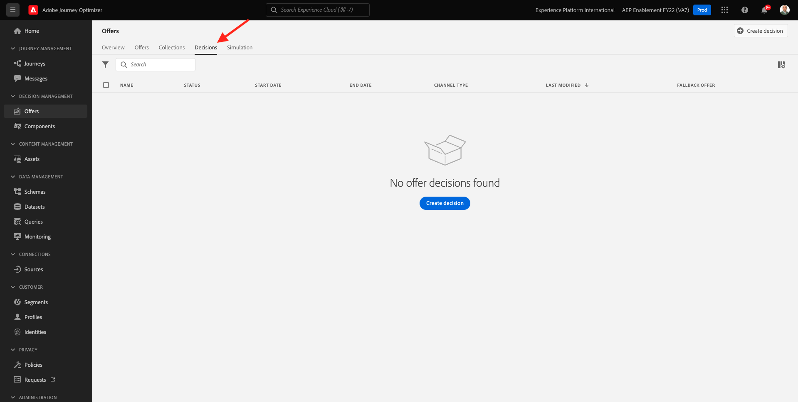

# 9.1 Offer decisioning 101

## 9.1.1 Terminología

Para comprender mejor el Offer decisioning, le recomendamos que lea la [información general](https://experienceleague.adobe.com/docs/journey-optimizer/using/offer-decisioniong/get-started-decision/starting-offer-decisioning.html?lang=en) sobre cómo funciona el servicio de aplicaciones de Offer decisioning con Adobe Experience Platform.

Al trabajar con Offer decisioning, debe comprender los siguientes conceptos:

| Término | Explicación |
| ------------------------- | -------------------------------------------------------------------------------------------------------------------------------------------------------------------------------------------------------------------------------------------------------- |
| **Oferta** | Una oferta es un mensaje de marketing que puede tener reglas asociadas que especifican quién puede ver la oferta. Una oferta tiene un estado: borrador, aprobado o archivado. |
| **Colocación** | Combinación de ubicación (o tipo de canal) y contexto (o tipo de contenido) en el que aparece una oferta para un usuario final. En la práctica, es la combinación de texto, HTML, imagen, JSON en canales móviles, web, sociales, de mensajería instantánea y no digitales. |
| **Regla** | La lógica que define y controla la idoneidad de los usuarios finales para una oferta. |
| **Oferta personalizada** | Un mensaje de marketing personalizable basado en reglas de idoneidad y restricciones. |
| **Oferta de reserva** | La oferta predeterminada que se muestra cuando un usuario final no es apto para ninguna de las ofertas de la colección utilizada. |
| **Restricción** | Se utiliza en una definición de oferta para definir cuántas veces se puede presentar una oferta en total y a un usuario específico. |
| **Prioridad** | Nivel para determinar la clasificación de prioridad de un conjunto de ofertas de resultados. |
| **Colección** | Se utiliza para filtrar un subconjunto de ofertas de la lista de ofertas personalizada para acelerar el proceso de offer decisioning. |
| **Decisión** | Combinación de un conjunto de ofertas, ubicación y perfil para los que el especialista en marketing desea que el motor de decisión proporcione la mejor oferta. |
| **AEM Assets Essentials** | Una experiencia universal y centralizada para almacenar, buscar y seleccionar recursos en soluciones de Adobe Experience Cloud y Adobe Experience Platform. |

{style=&quot;table-layout:auto&quot;}

## 9.1.2 Offer decisioning

Inicie sesión en Adobe Journey Optimizer desde [Adobe Experience Cloud](https://experience.adobe.com). Haga clic en **Journey Optimizer**.

Se le redirigirá al **Página principal**  en Journey Optimizer. En primer lugar, asegúrese de que está utilizando el simulador para pruebas correcto. El entorno limitado que se va a usar se denomina `--aepSandboxId--`. Para cambiar de un simulador de pruebas a otro, haga clic en **PRODUCCIÓN (VA7)** y seleccione el simulador de pruebas de la lista. En este ejemplo, el simulador de pruebas recibe el nombre **Habilitación de AEP para el año fiscal 22**. Entonces estará en el **Página principal** vista del entorno limitado `--aepSandboxId--`.

En el menú de la izquierda, haga clic en **Ofertas**. Ahora verá el menú Ofertas, que contiene elementos como Ofertas, Colecciones y Decisiones.

Haga clic en **Componentes**. Ahora verá el menú Ofertas, que contiene elementos como Ubicaciones, Etiquetas, Reglas y Clasificación.

## 9.1.3 Colocaciones

Vaya a **Ubicaciones**.

En el **Ubicaciones** puede definir las ubicaciones de las ofertas. Cuando define una decisión, la ubicación define dónde aparecerá la oferta resultante (Tipo de canal) y en qué forma o forma (Tipo de contenido).

Si no ve ninguna colocación en la instancia de Adobe Experience Platform, créela tal y como se indica a continuación y en la captura de pantalla.

| Nombre | Tipo de canal | Tipo de contenido |
| ---------------------- | ------------ | ------------ |
| **No digital: texto** | No digital | Texto |
| **Web - JSON** | Web | JSON |
| **Web: HTML** | Web | HTML |
| **Web - Texto** | Web | Texto |
| **Web - Imagen** | Web | Imagen |
| **Correo electrónico: JSON** | Correo electrónico | JSON |
| **Correo electrónico: HTML** | Correo electrónico | HTML |
| **Correo electrónico: texto** | Correo electrónico | Texto |
| **Correo electrónico: imagen** | Correo electrónico | Imagen |

{style=&quot;table-layout:auto&quot;}

**Nota**: No cambie nada a las ubicaciones que ya están disponibles.

Haga clic en cualquier ubicación para visualizar su configuración.

Ahora verá todos los campos de la colocación:

- **Nombre** de la colocación
- **ID de colocación**
- **Tipo de canal** para la colocación
- **Tipo de contenido** de la colocación, que puede ser **Texto**, **HTML**, **Imagen** o **JSON**
- **Descripción** campo que permite agregar una descripción adicional para la colocación

## 9.1.4 Reglas de decisión

Una regla (también denominada regla de idoneidad) es el equivalente de una **Segmento**. Una regla es, de hecho, un propio segmento con la única diferencia de que se puede usar una regla con una oferta para proporcionar la mejor oferta a un perfil en Adobe Experience Platform.

Como ya sabe cómo definir segmentos en función de los módulos de activación anteriores, vamos a revisar rápidamente el entorno de segmentación:

Vaya a **Reglas**. Haga clic en **+ Crear regla**.

A continuación, verá el entorno de segmentación de Adobe Experience Platform.

Ahora puede acceder a todos los campos que forman parte del esquema de unión para el perfil del cliente en tiempo real y crear cualquier regla.

También es interesante saber que simplemente puede reutilizar segmentos ya definidos en Adobe Experience Platform, yendo a **Audiencias** > ``--aepTenantIdSchema--``.

Verá esto:

Si lo desea, ahora puede configurar sus propias reglas. Para este ejercicio, necesita dos reglas:

- todos - Clientes masculinos
- todos - Clientes femeninos

Si estas reglas aún no existen, créelas. Si ya existen, utilice esas reglas y no cree reglas nuevas.

El atributo que se debe usar para crear la regla es **Perfil individual XDM** > **Persona** > **Sexo**.

A modo de ejemplo, esta es la definición de regla para la regla **todos - Clientes masculinos**:

A modo de ejemplo, esta es la definición de regla para la regla **todos - Clientes femeninos**:

## Ofertas 9.1.5

Vaya a **Ofertas** y seleccione **Ofertas**. Haga clic en **+ Crear oferta**.

Verá esta ventana emergente.

No cree ninguna oferta ahora: lo hará en el próximo ejercicio.

Ahora verá que hay dos tipos de ofertas:

- Ofertas personalizadas
- Ofertas de reserva

Una oferta personalizada es contenido específico que debe mostrarse en una situación específica. Una oferta personalizada se crea específicamente para ofrecer una experiencia personal y contextual si se cumplen criterios específicos.

Una oferta de reserva es una oferta que se muestra si no se cumplen los criterios de las ofertas personalizadas.

## 9.1.6 Decisiones

Una Decisión combina ubicaciones, una colección de ofertas personalizadas y una oferta de reserva que el motor de Offer decisioning utilizará finalmente para encontrar la mejor oferta para un perfil específico, en función de cada una de las características de oferta personalizadas individuales como prioridad, restricción de idoneidad y límite total/usuario.

Para configurar el **Decisión**, haga clic en **Decisiones**.

En el siguiente ejercicio, configurará sus propias ofertas y decisiones.

Paso siguiente: [9.2 Configurar las ofertas y la decisión](./ex2.md)

[Volver al módulo 9](./offer-decisioning.md)

[Volver a todos los módulos](./../../overview.md)
