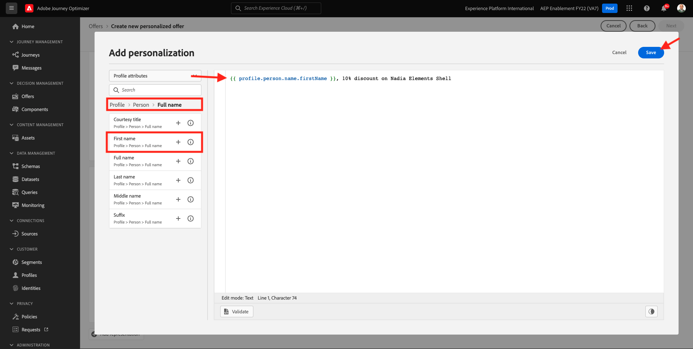
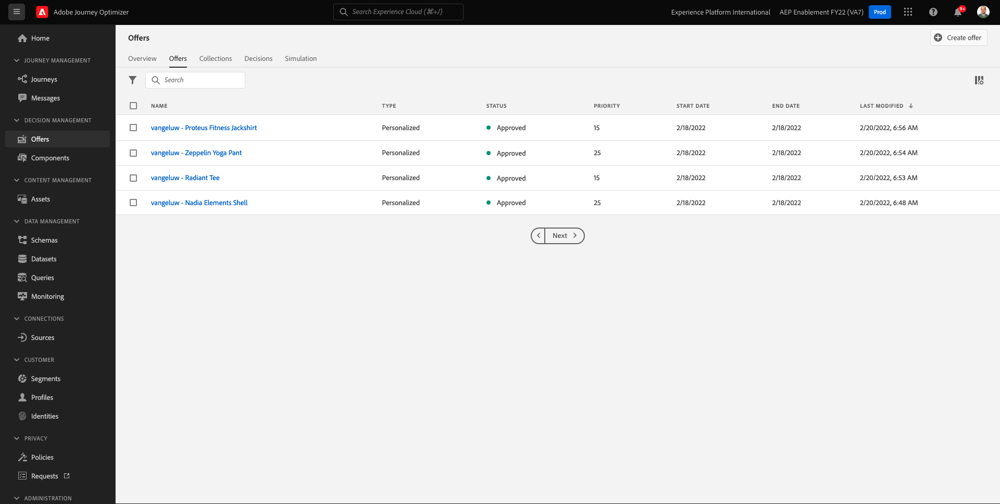
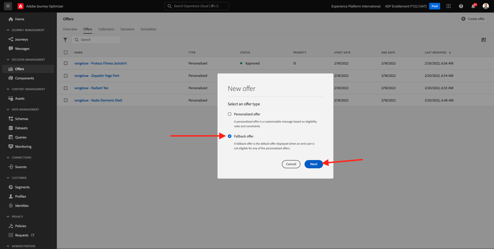
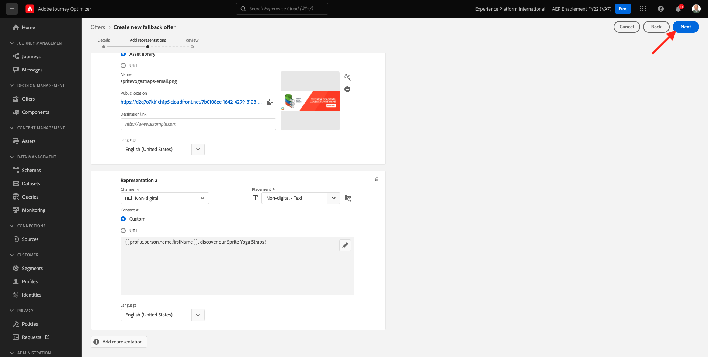

# 9.2 Configurar las ofertas y la decisión

## 9.2.1 Cree sus ofertas personalizadas

En este ejercicio, creará cuatro **Ofertas personalizadas**. Estos son los detalles que se deben tener en cuenta al crear esas ofertas:

| Nombre | Date Range | Vínculo de imagen para correo electrónico | Vínculo de imagen para la web | Texto | Prioridad | Elegibilidad | Idioma |
|-----|------------|----------------------|--------------------|------|:--------:|--------------|:-------:|
| `--demoProfileLdap-- - Nadia Elements Shell` | hoy - 1 mes después | https://bit.ly/3nPiwdZ | https://bit.ly/2INwXjt | `{{ profile.person.name.firstName }}, 10% discount on Nadia Elements Shell` | 25 | todos - Clientes femeninos | Inglés (Estados Unidos) |
| `--demoProfileLdap-- - Radiant Tee` | hoy - 1 mes después | https://bit.ly/2HfA17v | https://bit.ly/3pEIdzn | `{{ profile.person.name.firstName }}, 5% discount on Radiant Tee` | 15 | todos - Clientes femeninos | Inglés (Estados Unidos) |
| `--demoProfileLdap-- - Zeppelin Yoga Pant` | hoy - 1 mes después | https://bit.ly/2IOaItW | https://bit.ly/2INZHZd | `{{ profile.person.name.firstName }}, 10% discount on Zeppelin Yoga Pant` | 25 | todos - Clientes masculinos | Inglés (Estados Unidos) |
| `--demoProfileLdap-- - Proteus Fitness Jackshirt` | hoy - 1 mes después | https://bit.ly/330a43n | https://bit.ly/36USaQW | `{{ profile.person.name.firstName }}, 5% discount on Proteus Fitness Jackshirt` | 15 | todos - Clientes masculinos | Inglés (Estados Unidos) |

{style=&quot;table-layout:auto&quot;}

Inicie sesión en Adobe Journey Optimizer desde [Adobe Experience Cloud](https://experience.adobe.com). Haga clic en **Journey Optimizer**.

Se le redirigirá al **Página principal**  en Journey Optimizer. En primer lugar, asegúrese de que está utilizando el simulador para pruebas correcto. El entorno limitado que se va a usar se denomina `--aepSandboxId--`. Para cambiar de un simulador de pruebas a otro, haga clic en **PRODUCCIÓN (VA7)** y seleccione el simulador de pruebas de la lista. En este ejemplo, el simulador de pruebas recibe el nombre **Habilitación de AEP para el año fiscal 22**. Entonces estará en el **Página principal** vista del entorno limitado `--aepSandboxId--`.

En el menú de la izquierda, haga clic en **Ofertas** y vaya a **Ofertas**. Haga clic en **+ Crear oferta**.

Verá esta ventana emergente. Select **Oferta personalizada** y haga clic en **Siguiente**.

Ahora estás en el **Detalles** vista.

En este caso, debe configurar la oferta `--demoProfileLdap-- - Nadia Elements Shell`. Utilice la información de la tabla anterior para rellenar los campos. En este ejemplo, el nombre de la oferta personalizada es **vangeluw - Nadia Elements Shell**. Además, establezca la variable **Fecha y hora de inicio** a ayer y establezca la variable **Fecha y hora de finalización** a una fecha dentro de un mes.

Una vez hecho esto, deberías tenerlo. Haga clic en **Siguiente**.

Ahora necesita crear **Representaciones**. Las representaciones son una combinación de **Colocación** y un activo real.

Para **Representación 1**, seleccione:

- Canal: Web
- Colocación: Web - Imagen
- Contenido: URL
- Ubicación pública: copiar la URL de la columna **Vínculo de imagen para la web** en la tabla anterior

También puede seleccionar **Biblioteca de activos** para el contenido y, a continuación, haga clic en **Examinar**.

A continuación, verá una ventana emergente de la biblioteca de activos, vaya a la carpeta **enablement-assets** y seleccione el archivo de imagen **nadia-web.png**. A continuación, haga clic en **Select**.

Verá esto:

Haga clic en **+ Agregar representación**.

Para **Representación 2**, seleccione:

- Canal: Correo electrónico
- Colocación: Correo electrónico: imagen
- Contenido: URL
- Ubicación pública: copiar la URL de la columna **Vínculo de imagen para correo electrónico** en la tabla anterior

También puede seleccionar **Biblioteca de activos** para el contenido y, a continuación, haga clic en **Examinar**.

A continuación, verá una ventana emergente de la biblioteca de activos, vaya a la carpeta **enablement-assets** y seleccione el archivo de imagen **nadia-email.png**. A continuación, haga clic en **Select**.

Verá esto:

A continuación, haga clic en **+ Agregar representación**.

Para **Representación 3**, seleccione:

- Canal: No digital
- Colocación: No digital: texto

A continuación, debe añadir contenido. En este caso, significa añadir el texto que se utilizará como llamada a la acción.

Haga clic en **Añadir contenido**.

Verá esta ventana emergente.

Select **Texto personalizado** y rellene estos campos:

Observe el **Texto** de la tabla anterior e introduzca ese texto aquí, en este caso: `{{ profile.person.name.firstName }}, 10% discount on Nadia Elements Shell`.

También notará que puede seleccionar cualquier atributo de perfil e incluirlo como un campo dinámico en el texto de la oferta. En este ejemplo, el campo `{{ profile.person.name.firstName }}` se asegurará de que el nombre del cliente que recibirá esta oferta se incluya en el texto de la oferta.

Entonces verás esto. Haga clic en **Guardar**.

Ahora tienes esto. Haga clic en **Siguiente**.

Verá esto:

Select **Por regla de decisión definida** y haga clic en el botón **+** para añadir la regla **todos - Clientes femeninos**.

Entonces verás esto. Complete el **Prioridad** como se indica en el cuadro anterior. Haga clic en **Siguiente**.

A continuación, verá una descripción general de su nuevo **Oferta personalizada**.

Finalmente, haga clic en **Guardar y aprobar**.

A continuación, verá que su oferta personalizada recién creada está disponible en Información general de ofertas:

Ahora debe repetir los pasos anteriores para crear las otras tres ofertas personalizadas para los productos Radiant Tee, Zeppelin Yoga Pant y Proteus Fitness Jacketis.

Cuando termine, su **Información general de ofertas** para **Ofertas personalizadas** debería mostrar todas las ofertas.

## 9.2.2 Crear su oferta de reserva

Después de crear cuatro ofertas personalizadas, debe configurar una **Oferta de reserva**.

Asegúrese de que está en el **Ofertas** vista:

Haga clic en **+ Crear oferta**.

Verá esta ventana emergente. Select **Oferta de reserva** y haga clic en **Siguiente**.

Verá esto:

Escriba este nombre para la oferta de reserva: `--demoProfileLdap-- - Luma Fallback Offer`. Haga clic en **Siguiente**.

Ahora necesita crear **Representaciones**. Las representaciones son una combinación de **Colocación** y un activo real.

Para **Representación 1**, seleccione:

- Canal: Web
- Colocación: Web - Imagen
- Contenido: URL
- Ubicación pública: `https://bit.ly/3nBOt9h`

También puede seleccionar **Biblioteca de activos** para el contenido y, a continuación, haga clic en **Examinar**.

A continuación, verá una ventana emergente de la biblioteca de activos, vaya a la carpeta **enablement-assets** y seleccione el archivo de imagen **spriteyogastraps-web.png**. A continuación, haga clic en **Select**.

Verá esto:

Para **Representación 2**, seleccione:

- Canal: Correo electrónico
- Colocación: Correo electrónico: imagen
- Contenido: URL
- Ubicación pública: `https://bit.ly/3nF4qvE`

También puede seleccionar **Biblioteca de activos** para el contenido y, a continuación, haga clic en **Examinar**.

A continuación, verá una ventana emergente de la biblioteca de activos, vaya a la carpeta **enablement-assets** y seleccione el archivo de imagen **spriteyogastraps-email.png**. A continuación, haga clic en **Select**.

Verá esto:

A continuación, haga clic en **+ Agregar representación**.

Para **Representación 3**, seleccione:

- Canal: No digital
- Colocación: No digital: texto

A continuación, debe añadir contenido. En este caso, significa añadir el vínculo de imagen.

Haga clic en **Añadir contenido**.

Verá esta ventana emergente.

Select **Texto personalizado** y rellene estos campos:

Escriba el texto `{{ profile.person.name.firstName }}, discover our Sprite Yoga Straps!` y haga clic en **Guardar**.

Entonces verás esto. Haga clic en **Siguiente**.

A continuación, verá una descripción general de su nuevo **Oferta de reserva**. Haga clic en **Finalizar**.

Finalmente, haga clic en **Guardar y aprobar**.

En **Información general de ofertas** , verá lo siguiente:

## 9.2.3 Crear la colección

Una colección se utiliza para **filter** cree un subconjunto de ofertas de la lista de ofertas personalizadas y utilícelo como parte de una Decisión para acelerar el proceso de decisión.

Vaya a **Colecciones**. Haga clic en **+ Crear colección**.

Verá esta ventana emergente. Configure la colección de esta manera. Haga clic en **Siguiente**.

- Nombre de la colección: use `--demoProfileLdap-- - Luma Collection`
- Select **Crear una colección estática**.

En la siguiente pantalla, seleccione las cuatro **Ofertas personalizadas** creado en el ejercicio anterior. Haga clic en **Guardar**.

Ahora verá esto:

## 9.2.4 Cree su decisión

Una Decisión combina ubicaciones, una colección de ofertas personalizadas y una oferta de reserva que el motor de Offer decisioning utilizará en última instancia para encontrar la mejor oferta para un perfil específico, en función de cada una de las características de oferta personalizadas individuales, como prioridad, restricción de idoneidad y límite total/usuario.

Para configurar el **Decisión**, vaya a **Decisiones**. Haga clic en **+ Crear actividad**.

Verá esto:

Rellene los campos de esta manera. Haga clic en **Siguiente**.

- Nombre: `--demoProfileLdap-- - Luma Decision`
- Fecha y hora de inicio: ayer
- Fecha y hora de finalización: hoy + 1 mes

En la siguiente pantalla, debe añadir ubicaciones a los ámbitos de decisión. Deberá crear ámbitos de decisión para las ubicaciones **Web - Imagen**, **Correo electrónico: imagen** y **No digital: texto**.

En primer lugar, cree el ámbito de decisión para **No digital: texto** seleccionando esa ubicación en la lista desplegable. A continuación, haga clic en el **Agregar** para añadir criterios de evaluación.

Seleccionar la colección `--demoProfileLdap-- - Luma Collection` y haga clic en **Agregar**.

Entonces verás esto. Haga clic en el **-** para agregar un nuevo ámbito de decisión.

Seleccione la ubicación **Web - Imagen** y añada su colección `--demoProfileLdap-- - Luma Collection` en los criterios de evaluación. A continuación, haga clic en el **+** para agregar un nuevo ámbito de decisión.

Seleccione la ubicación **Correo electrónico: imagen** y añada su colección `--demoProfileLdap-- - Luma Collection` en los criterios de evaluación. A continuación, haga clic en **Siguiente**.

Ahora necesita seleccionar su **Oferta de reserva**, cuyo nombre es `--demoProfileLdap-- - Luma Fallback Offer`. Haga clic en **Siguiente**.

Revise su decisión. Haga clic en **Finalizar**.

En la ventana emergente, haga clic en **Guardar y activar**.

Y finalmente, ahora verán su decisión en la descripción general:

Ahora ha configurado correctamente su decisión. Su decisión ya está activa y puede utilizarse para ofrecer ofertas optimizadas y personalizadas a sus clientes en tiempo real.

Paso siguiente: [9.3 Prepare su propiedad de cliente de recopilación de datos y la configuración del SDK web para el Offer decisioning](./ex3.md)

[Volver al módulo 9](./offer-decisioning.md)

[Volver a todos los módulos](./../../overview.md)
