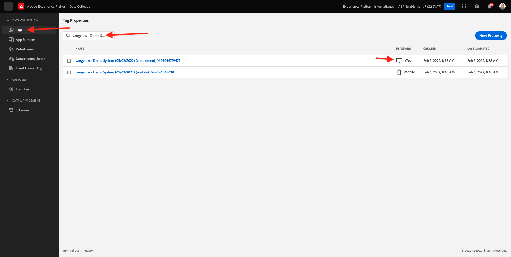
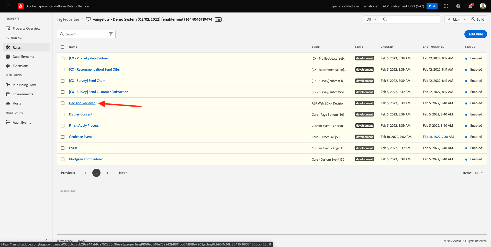

# 9.3 Prepare su propiedad de cliente de recopilación de datos de Adobe Experience Platform y la configuración del SDK web para el Offer decisioning

>[!NOTE]
>
>El uso de Offer decisioning en el SDK web de Adobe Experience Platform está disponible actualmente en acceso anticipado para determinados usuarios. Esta funcionalidad no está disponible para todas las organizaciones de IMS.

## 9.3.1 Actualizar el conjunto de datos

En [Ejercicio 0.2](./../../modules/module0/ex2.md), ha creado su **[!UICONTROL Datastream]**. A continuación, utilizó el nombre `--demoProfileLdap-- - Demo System Datastream`.

En este ejercicio, debe configurar que **[!UICONTROL Datastream]** para trabajar con **[!DNL Offer Decisioning]**.

Para ello, vaya a [https://experience.adobe.com/#/data-collection/](https://experience.adobe.com/#/data-collection/). Entonces verás esto. Haga clic en **[!UICONTROL Datastreams]** o **[!UICONTROL Datastreams (Beta)]**.

En la esquina superior derecha de la pantalla, seleccione el nombre del simulador de pruebas, que debería ser `--aepSandboxId--`.


Busque su **[!UICONTROL Datastream]**, cuyo nombre es `--demoProfileLdap-- - Demo System Datastream`. Haga clic en **[!UICONTROL Datastream]** para abrirlo.


Entonces verás esto. Haga clic en **...** junto a **Adobe Experience Platform** y haga clic en **Editar**.


Para habilitar **[!DNL Offer Decisioning]**, marque la casilla de verificación **[!DNL Offer Decisioning]**. Haga clic en **Guardar**.


Su **[!UICONTROL Datastream]** ya está listo para trabajar con **[!DNL Offer Decisioning]**.


## 9.3.2 Configure la propiedad del cliente de recopilación de datos de Adobe Experience Platform para solicitar ofertas personalizadas

Vaya a [https://experience.adobe.com/#/data-collection/](https://experience.adobe.com/#/data-collection/), a **[!UICONTROL Cliente]**. Busque las propiedades de recopilación de datos con el nombre `--demoProfileLdap-- - Demo System (DD/MM/YYYY)`. Abra la propiedad cliente de recopilación de datos para web.



En la propiedad , vaya a **[!UICONTROL Reglas]** y abrir la regla **[!UICONTROL Vista de página]**.


Haga clic en para abrir el [!UICONTROL Acción] **[!UICONTROL SDK web de AEP: Enviar evento]**.


Entonces verás esto. Verá la opción de menú para **[!UICONTROL Ámbitos de decisión]**.


Para cada solicitud enviada al perímetro y a Adobe Experience Platform, es posible proporcionar una o más **[!UICONTROL Ámbitos de decisión]**. A **[!UICONTROL Ámbito de la decisión]** es una combinación de dos elementos:

- [!UICONTROL ID de decisión]
- [!UICONTROL ID de colocación]

Primero veamos dónde pueden encontrar esos dos elementos.

### 9.3.2.1 Recupere su [!UICONTROL ID de colocación]

La variable [!UICONTROL ID de colocación] identifica la ubicación y el tipo de recurso necesario. Por ejemplo, la imagen a pantalla completa (hero) de la página de inicio del sitio web de Luma corresponde a la variable [!UICONTROL ID de colocación] para [!UICONTROL Web - Imagen].

>[!NOTE]
>
>Como parte del módulo 6, ya ha configurado una actividad de segmentación de experiencias de Adobe Target que cambiará la imagen de la ubicación a pantalla completa en la página principal, como puede ver en la captura de pantalla. Para el ejercicio, ahora hará que sus ofertas aparezcan en la imagen debajo de la imagen a pantalla completa, como se indica en la captura de pantalla.


Para encontrar la variable [!UICONTROL ID de colocación] para [!UICONTROL Web - Imagen] vaya a Adobe Journey Optimizer yendo a [Adobe Experience Cloud](https://experience.adobe.com). Haga clic en **Journey Optimizer**.


Se le redirigirá al **Página principal**  en Journey Optimizer. En primer lugar, asegúrese de que está utilizando el simulador para pruebas correcto. El entorno limitado que se va a usar se denomina `--aepSandboxId--`. Para cambiar de un simulador de pruebas a otro, haga clic en **PRODUCCIÓN (VA7)** y seleccione el simulador de pruebas de la lista. En este ejemplo, el simulador de pruebas recibe el nombre **Habilitación de AEP para el año fiscal 22**. Entonces estará en el **Página principal** vista del entorno limitado `--aepSandboxId--`.


A continuación, vaya a [!UICONTROL Componentes] y luego [!UICONTROL Ubicaciones]. Haga clic en el [!UICONTROL Web - Imagen] para ver sus detalles.


Como puede ver en la imagen anterior, en este ejemplo la variable [!UICONTROL ID de colocación] es `xcore:offer-placement:14bf09dc4190ebba`. Anote el [!UICONTROL ID de colocación] para la colocación de [!UICONTROL Web - Imagen] como lo necesitará en el próximo ejercicio.

### 9.3.2.2 Recupere su [!UICONTROL ID de decisión]

La variable [!UICONTROL ID de decisión] identifica qué combinación de ofertas personalizadas y de ofertas de reserva desea utilizar. En el ejercicio anterior, creó su propio [!UICONTROL Decisión] y lo llamaron `--demoProfileLdap-- - Luma Decision`.

Para encontrar la variable [!UICONTROL ID de decisión] para su `--demoProfileLdap-- - Luma Decision`, vaya a [https://platform.adobe.com](https://platform.adobe.com).

A continuación, vaya a [!UICONTROL Ofertas] y vaya a [!UICONTROL Decisiones]. Haga clic en para seleccionar su [!UICONTROL Decisión], cuyo nombre es `--demoProfileLdap-- - Luma Decision`.


Como puede ver en la imagen anterior, en este ejemplo la variable [!UICONTROL ID de decisión] es `xcore:offer-activity:14c052382e1b6505`. Anote el [!UICONTROL ID de decisión] para su decisión `--demoProfileLdap-- - Luma Decision` como lo necesitará en el próximo ejercicio.

Ahora que ha recuperado los dos elementos, debe crear un **[!UICONTROL Ámbitos de decisión]**, puede continuar con el siguiente paso, que implica codificar el ámbito de decisión.

### 9.3.2.3 Codificación BASE64

La variable **[!UICONTROL Ámbito de la decisión]** debe introducir es una cadena codificada con BASE64. Esta cadena con codificación BASE64 es una combinación de la variable [!UICONTROL ID de colocación] y [!UICONTROL ID de decisión], como puede ver a continuación.

```json
{
  "activityId":"xcore:offer-activity:14c052382e1b6505",
  "placementId":"xcore:offer-placement:14bf09dc4190ebba"
}
```

La variable **[!UICONTROL Ámbito de la decisión]** se puede generar de dos maneras:

- Utilice un servicio público como [https://www.base64encode.org/](https://www.base64encode.org/). Introduzca el código JSON como se ha mencionado anteriormente, haga clic en **[!UICONTROL Encode]** y obtendrá su cadena codificada BASE64 a continuación.

   

- Recupere la cadena codificada BASE64 de Adobe Experience Platform. Vaya a [!UICONTROL Decisiones] y haga clic en para abrir [!UICONTROL Decisión], cuyo nombre es `--demoProfileLdap-- - Luma Decision`.

   

   Después de abrir `--demoProfileLdap-- - Luma Decision`, verán esto. Localice la ubicación [!UICONTROL Web - Imagen] y haga clic en el botón **[!UICONTROL Copiar]** botón. A continuación, haga clic en **[!UICONTROL Ámbito de decisión codificado]**. La variable **[!UICONTROL Ámbito de la decisión]** ahora se copia en el portapapeles.

   

A continuación, vuelva a Launch, a su acción **[!UICONTROL SDK web de AEP: Enviar evento]**.


Pegue el ámbito de decisión codificado en el campo de entrada.


Guarde los cambios en la acción **[!UICONTROL SDK web de AEP: Enviar evento]** haciendo clic en **[!UICONTROL Conservar cambios]**.


A continuación, haga clic en **[!UICONTROL Guardar]** o **[!UICONTROL Guardar en biblioteca]**


En la recopilación de datos de Adobe Experience Platform, vaya a **[!UICONTROL Flujo de publicación]** y abra **[!UICONTROL Biblioteca de desarrollo]** cuyo nombre es **[!UICONTROL Principal]**. Haga clic en **[!UICONTROL + Agregar todos los recursos modificados]** y haga clic en **[!UICONTROL Guardar y generar para desarrollo]**. Los cambios se publicarán ahora en el sitio web de demostración.


Cada vez que carga un **Página General** ahora, como por ejemplo la página de inicio del sitio web de la demostración, Offer decisioning evaluará cuál es la oferta aplicable y devolverá una respuesta al sitio web con los detalles de la oferta a mostrar. La visualización de la oferta en el sitio web requiere una configuración adicional, que se realizará en el siguiente paso.

## 9.3.3 Configure la propiedad del cliente de recopilación de datos de Adobe Experience Platform para recibir y aplicar ofertas personalizadas

Vaya a [https://experience.adobe.com/#/data-collection/](https://experience.adobe.com/#/data-collection/), a **[!UICONTROL Propiedades]**. Busque las propiedades de recopilación de datos con el nombre `--demoProfileLdap-- - Demo System (DD/MM/YYYY)`. Abra la propiedad Recopilación de datos para la web.


En la propiedad , vaya a **[!UICONTROL Reglas]**.


Buscar y abrir la regla **Decisión recibida**.



Entonces verás esto. Abrir la acción **Coloque la oferta en la página**.


Haga clic en **[!UICONTROL Abrir editor]**


Sobrescriba el código pegando el código siguiente en el editor.

```javascript
if(!Array.isArray(event.decisions)) {
  console.log('No decisions returned')
  return;
}
console.log("decision",event.decisions)

event.decisions.forEach(function(payload) {
  payload.items.forEach(function(item){
    console.log("Response from Offer Decisioning ", item.data.content);
   
    var element = document.querySelector("#root > div > div > div.app-content > div > section.feature_part.padding_top > div > div.row.align-items-center.justify-content-between > div.col-lg-7.col-sm-6.\\30  > div");
    if(!element){
      console.log("Offer Placement Area Selector not found")
      return;
    }
    if(!item.data){
      return
    }
    //check if offer already exists
    var offer = document.querySelector("#root > div > div > div.app-content > div > section.feature_part.padding_top > div > div.row.align-items-center.justify-content-between > div.col-lg-7.col-sm-6.\\30  > div");
    if(!offer){ 
      element.insertAdjacentHTML('afterbegin', item.data.content) 
    }
    else { 
      console.log("item.data.deliveryURL: " + item.data.deliveryURL)
      document.querySelector("#root > div > div > div.app-content > div > section.feature_part.padding_top > div > div.row.align-items-center.justify-content-between > div.col-lg-7.col-sm-6.\\30  > div").style.background="url('"+item.data.deliveryURL+"')";
      document.querySelector("#root > div > div > div.app-content > div > section.feature_part.padding_top > div > div.row.align-items-center.justify-content-between > div.col-lg-7.col-sm-6.\\30  > div").style.backgroundRepeat="no-repeat";
      document.querySelector("#root > div > div > div.app-content > div > section.feature_part.padding_top > div > div.row.align-items-center.justify-content-between > div.col-lg-7.col-sm-6.\\30  > div").style.backgroundPosition="center center";
      document.querySelector("#root > div > div > div.app-content > div > section.feature_part.padding_top > div > div.row.align-items-center.justify-content-between > div.col-lg-7.col-sm-6.\\30  > div").style.backgroundSize = "contain";
    }  
  })
});
```

Las líneas 26-27-28-29 aplicarán la imagen que está siendo devuelta por Offer decisioning al sitio web. Haga clic en **[!UICONTROL Guardar]**.


Haga clic en **[!UICONTROL Mantener cambios]**.


A continuación, haga clic en **[!UICONTROL Guardar]** o **[!UICONTROL Guardar en biblioteca]**


En la recopilación de datos de Adobe Experience Platform, vaya a **[!UICONTROL Flujo de publicación]** y abra **[!UICONTROL Biblioteca de desarrollo]** cuyo nombre es **[!UICONTROL Principal]**. Haga clic en **[!UICONTROL + Agregar todos los recursos modificados]** y haga clic en **[!UICONTROL Guardar y generar para desarrollo]**. Los cambios se publicarán ahora en el sitio web de demostración.


Con este cambio, esta regla de la recopilación de datos de Adobe Experience Platform escuchará ahora la respuesta de Offer decisioning que forma parte de la respuesta del SDK web y, cuando se reciba la respuesta, la imagen de la oferta se mostrará en la página principal.

En el sitio web de la demostración, verá que esta imagen será reemplazada ahora:

>[!NOTE]
>
>Como parte del módulo 6, ya ha configurado una actividad de segmentación de experiencias de Adobe Target que cambiará la imagen de la ubicación a pantalla completa en la página principal, como puede ver en la captura de pantalla. Para el ejercicio, ahora hará que sus ofertas aparezcan en la imagen debajo de la imagen a pantalla completa, como se indica en la captura de pantalla.


Y en lugar de las imágenes predeterminadas del sitio web de Luma, ahora verá una oferta como esta. En este caso, se muestra la oferta de reserva.


Ya ha configurado 2 tipos de personalización:

- 1 Actividad de segmentación de experiencias con Adobe Target en el módulo 6
- 1 implementación de Offer decisioning con la propiedad Recopilación de datos

En el siguiente ejercicio, verá cómo puede combinar las ofertas y decisiones que se crearon en Adobe Journey Optimizer con una actividad de segmentación de experiencias de Adobe Target.

Paso siguiente: [9.4 Combinación de Adobe Target y Offer decisioning](./ex4.md)

[Volver al módulo 9](./offer-decisioning.md)

[Volver a todos los módulos](./../../overview.md)
