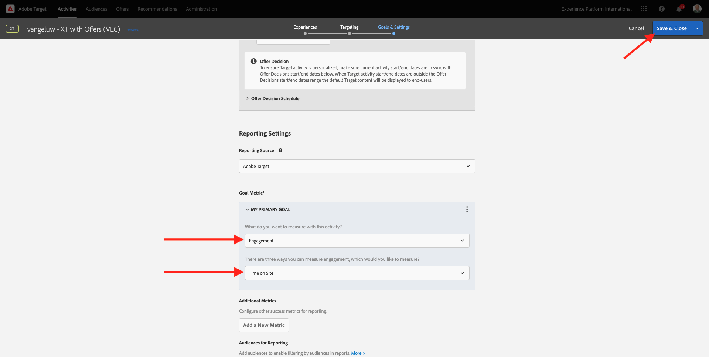

# 9.4 Combinación de Adobe Target y Offer decisioning

## 9.4.1 Recopile el vínculo que se puede compartir de su proyecto de demostración

Para cargar el proyecto del sitio web de demostración en Adobe Target, primero debe recopilar un vínculo especial que permita a Adobe Target cargar el proyecto del sitio web de demostración.

Para ello, vaya a [https://builder.adobedemo.com/projects](https://builder.adobedemo.com/projects). Después de iniciar sesión en Adobe ID, verá esto. Haga clic en el proyecto del sitio web para abrirlo.

Ahora verás esto. Haga clic en **Compartir**.

Haga clic en **Generar vínculo** y, a continuación, copie el vínculo en el portapapeles.

Vaya a [https://bitly.com](https://bitly.com), pegue el vínculo que ha copiado y haga clic en **Abreviar**. Ahora obtendrá un vínculo abreviado, que tiene este aspecto: `https://bit.ly/3JxN7aG`. Necesitará ese vínculo en el próximo ejercicio.

## 9.4.2 Recopilación

Ahora vaya a la página de inicio de Adobe Experience Cloud yendo a [https://experiencecloud.adobe.com/](https://experiencecloud.adobe.com/). Haga clic en **Target**.

En el **Adobe Target** página principal, verá todas las actividades existentes.

Haga clic en **+ Crear actividad** para crear una nueva actividad.

Select **Segmentación de experiencias**.

Ahora seleccione **Visual** y pegue el vínculo abreviado en el campo **Introducir URL de actividad**. Haga clic en **Siguiente**.

A continuación, verá que el proyecto del sitio web de demostración se está cargando en el Compositor de experiencias visuales.

Vaya a **Examinar** modo para hacer clic **Permitir todo** en la ventana emergente de consentimiento de la cookie.

Haga clic en el área que contiene el texto **Categorías destacadas**. Haga clic en **Insertar antes** y, a continuación, seleccione **Decisión de oferta**.

Verá esta ventana emergente. Seleccione el entorno limitado `--aepSandboxId--` y, a continuación, seleccione la colocación **Web - Imagen**.

A continuación, seleccione su decisión `--demoProfileLdap-- - Luma Decision`. Haga clic en **Guardar**.

Entonces verás esto. Asegúrese de agregar una regla de plantilla adicional **URL** **contains** **your-project-name**. Clic **Guardar**.

Entonces verás esto. Haga clic en **Siguiente**.

Escriba un nombre para la oferta, use este nombre: `--demoProfileLdap-- - XT with Offers (VEC)`. Haga clic en **Siguiente**.

Entonces verás esto. Defina su **Métrica de objetivo** como se indica. Haga clic en **Guardar y cerrar**.

La oferta se ha creado y se está publicando.

Una vez publicada la oferta, puede activarla.

Paso siguiente: [9.5 Use su decisión en un mensaje de correo electrónico y SMS](./ex5.md)

[Volver al módulo 9](./offer-decisioning.md)

[Volver a todos los módulos](./../../overview.md)
