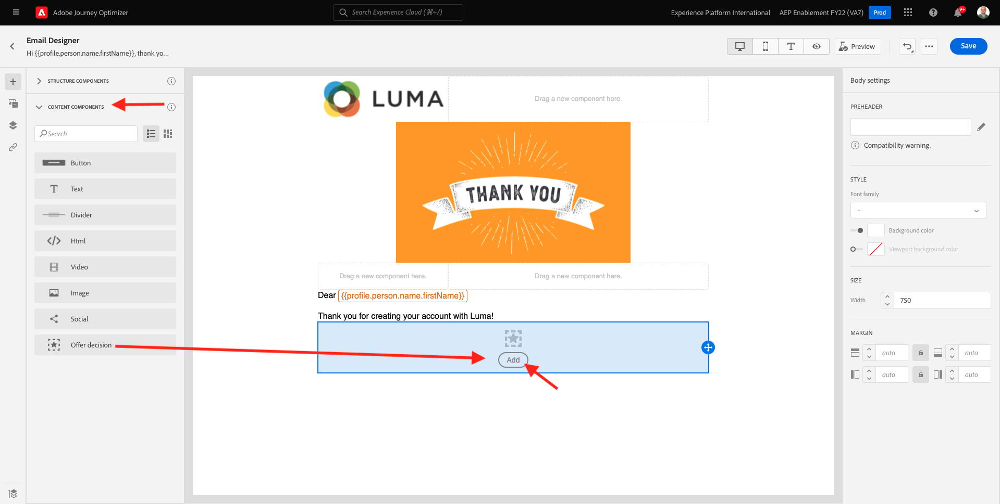

# 9.5 Use su decisión en un mensaje de correo electrónico

En este ejercicio, utilizará su decisión para personalizar el envío de un correo electrónico y un SMS.

Vaya a **Recorridos**. Busque el recorrido que creó en el ejercicio 7.2, que se llama `--demoProfileLdap-- - Account Creation Journey`. Haga clic en el recorrido para abrirlo.

Entonces verás esto. Haga clic en **Crear una nueva versión**.

Haga clic en **Crear una nueva versión**.

Haga clic en el **Correo electrónico** a continuación, haga clic en **Editar contenido**.

A continuación, verá el panel de mensajes. Haga clic en **Diseñador de correo electrónico**.

Entonces verás esto.

Entonces verás esto. Arrastre una nueva **Columna 1:1** estructura del componente en el lienzo.

En el menú , vaya a **Componentes de contenido**. Seleccione el **Decisión de oferta** y arrastre y suelte este componente en el marcador de posición de oferta de contenido del correo electrónico como se indica. A continuación, haga clic en **Agregar**.

Seleccione el tipo de colocación que desea incluir en el correo electrónico. En el **Ubicaciones** menú desplegable seleccionar **Correo electrónico: imagen** y, a continuación, seleccione su decisión `--demoProfileLdap-- - Luma Decision`. Haga clic en **Agregar**.

Ahora ve todas las ofertas personalizadas y la oferta de reserva que se visualizan dentro del diseñador de correo electrónico. Haga clic en  **Simular contenido** para previsualizar el mensaje de correo electrónico con un perfil de cliente real.

Comience por identificar qué perfil desea utilizar para la vista previa. Seleccione el **email** e introduzca la dirección de correo electrónico de un perfil de cliente que ha creado en el sitio web de demostración. A continuación, haga clic en **Vista previa**.

Una vez que se haya mostrado el correo electrónico y la oferta se muestre correctamente, haga clic en el **Cerrar** botón.

Finalmente, haga clic en **Guardar**.

Ahora, haga clic en la flecha para volver a la pantalla anterior.

Entonces verás esto. Haga clic en la flecha situada en la esquina superior izquierda para volver al recorrido.

Haga clic en **Ok** para cerrar el **Correo electrónico** acción.

Haga clic en **Publicación** para publicar el recorrido actualizado.

Confirme haciendo clic en **Publicación** de nuevo.

El mensaje ya está publicado.

Al crear una cuenta nueva en el sitio web de demostración, ahora recibirá este correo electrónico:

Ha terminado este ejercicio.

Paso siguiente: [9.6 Probar su decisión utilizando la API](./ex6.md)

[Volver al módulo 9](./offer-decisioning.md)

[Volver a todos los módulos](./../../overview.md)
